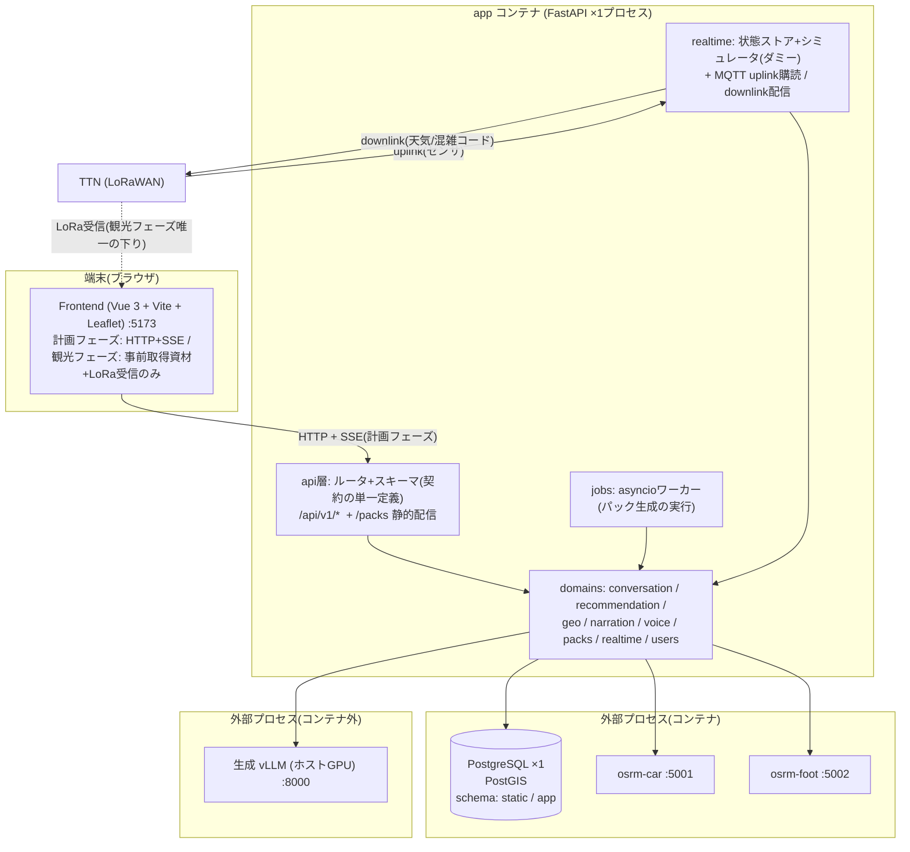

# システムアーキテクチャ(to-be)

- 状態: **提案(レビュー待ち)** — 承認後、これが実装の正となる
- 日付: 2026-07-30(初版 2026-07-29。00_project.md の再定義(粒度粗め・スコープ確認)に追従して改訂)
- 前提文書: [00_project.md](00_project.md)(目的) / [10_requirements.md](10_requirements.md)(要求) / [22_current_issues.md](22_current_issues.md)(現行の問題の根拠)
- 主要決定の記録: [adr/](adr/)

---

## 1. 再設計の方針

現行構成の根本原因([22 §16](22_current_issues.md))に対し、次の対処を取る。

| 根本原因 | 対処 |
| --- | --- |
| プロセス境界の誤設定(分散モノリス) | **モジュラモノリス**: Pythonプロセス1つに統合し、境界は「プロセス」ではなく「パッケージ+型付き契約」で引く ([ADR-0001](adr/0001-modular-monolith.md)) |
| 長時間処理の同期実行 | パック生成を**ジョブ**(DBテーブル+プロセス内ワーカー)に、対話応答を**SSEストリーミング**に ([ADR-0003](adr/0003-pack-generation-jobs.md), [ADR-0004](adr/0004-conversation-pipeline.md)) |
| 状態の多重管理 | **PostgreSQL 1台**(PostGIS)に集約。Chroma・FAISS・プロセス内キャッシュ・フロント運搬を廃止 ([ADR-0002](adr/0002-single-postgres.md)) |
| 契約の不在 | スキーマは**一箇所で定義**し、FastAPIのOpenAPIからフロント型を生成。検証バイパス(`JSONResponse`直返し)禁止 |
| 設定・手順の暗黙知化 | `pydantic-settings`による型付き一元設定+`.env.example`+運用手順の文書化(`50_operations/`) |
| 可観測性の不在 | 構造化ログ(JSON)+request_id+**ターン/ジョブ計測テーブル**(実験データとして取り出せる形) |

### 設計原則

- **P1 プロセスは増やさない。** 別プロセスにするのは「別の技術スタック・別のライフサイクル・別のマシン」のものだけ(vLLM, OSRM, PostgreSQL)
- **P2 境界は型で引く。** ドメイン間・フロント間のやりとりは必ずPydanticスキーマを通す。同じ型を二度定義しない
- **P3 長い処理はジョブ、短い処理は同期、生成はストリーミング**
- **P4 状態のsingle source of truthはDB。** ファイル・メモリキャッシュ・フロント保持はすべて派生物
- **P5 周辺機能の障害で対話を止めない**(センサ・TTS・シミュレータはgraceful degradation)。ただし縮退は必ずログとレスポンスに明示し、**サイレントに握り潰さない**
- **P6 計測ファースト。** 実験で測りたい値(LLM呼び出し回数・所要時間・トークン数)は最初から構造化して記録する
- **P7 2フェーズを一級概念に。** 計画フェーズ(オンライン)と観光フェーズ(オフライン・LoRaWANのみ)を明確に分け、観光フェーズは「事前配布した資材+狭帯域ダウンリンク」だけで成立させる(FR-4)

---

## 2. 全体構成



- **2フェーズ運用が構成の前提**: 計画フェーズはHTTP+SSEで全機能を使い、必要資材を事前取得する。観光フェーズの端末への下りはLoRaWANダウンリンク(狭帯域)のみで、案内は端末内の資材+受信コードで成立する
- コンテナは **db / osrm-car / osrm-foot / app / frontend の5つ**(現行13)。DB初期化コンテナ2つは `app` の管理CLI(`python -m app.cli init-db` 等)に統合する
- ChromaDBコンテナと**別マシンの埋め込みサーバへの依存は廃止**(長期記憶のスコープ外化: [00_project.md](00_project.md))。svc-nav/routing/alongpoi/llm/voice/agent の6プロセスは `app` 内のパッケージになる
- パック(`/packs/*`)は `app` が `StaticFiles` で配信し、リポジトリ外nginxへの暗黙依存をなくす

---

## 3. バックエンド構造

```
backend/
├── pyproject.toml            # パッケージ定義・依存(本体/dev分離)・pytest/ruff設定
├── alembic/                  # DBマイグレーション
├── app/
│   ├── main.py               # FastAPI組み立て(ルータ登録・lifespan: MQTT/ジョブワーカー起動)
│   ├── cli.py                # 管理コマンド(init-db / seed / validate-knowledge / export-metrics)
│   ├── core/
│   │   ├── config.py         # Settings (pydantic-settings)。環境変数を読むのはここだけ
│   │   ├── db.py             # async engine / セッション管理(単一)
│   │   ├── llm.py            # 生成クライアント(OpenAI互換, async, リトライ, モデル依存後処理の一元化)
│   │   └── logging.py        # 構造化ログ + request_id
│   ├── api/
│   │   ├── schemas/          # ★ 契約の単一定義(フロントとの境界。ここ以外で外部向け型を定義しない)
│   │   └── routers/          # chat / users / routes / packs / jobs / realtime / health
│   ├── domains/
│   │   ├── users/            # ユーザー・スレッド管理
│   │   ├── conversation/     # ターンパイプライン・plan検証/実行・ガードレール・プロンプト・文脈構築
│   │   ├── recommendation/   # POI推薦(戦略は差し替え可能に)・名寄せ(別名/序数)辞書
│   │   ├── itinerary/        # 旅程の構成: ILSソルバー・述語ペナルティレジストリ・編集操作(ADR-0005)
│   │   ├── geo/              # OSRM経路探索 + 沿道POI(PostGIS)+ route永続化
│   │   ├── narration/        # 知識ベース検索 + ナレーション生成プロンプト
│   │   ├── voice/            # TTSポート(gTTS実装。将来XTTS差し替え可)
│   │   ├── packs/            # パック生成ジョブのオーケストレーション・manifest
│   │   └── realtime/         # 状態ストア・シミュレータ(ダミー)・downlink配信・uplink ingest
│   └── jobs/                 # ジョブランナー(ポーリングループ・並列度制御・再開)
├── tests/
│   ├── unit/  contract/  integration/  smoke/
└── data/
    ├── knowledge/            # 多言語知識MD(現行を移設)
    ├── seeds/                # POI.json / facilities.json / access_points.geojson(投入元の単一ソース)
    ├── processed/            # 学習成果物(persona_model.pkl 等)+ 再現手順README
    └── map/                  # OSRMデータ(gitignore。取得手順は 50_operations)
```

**依存ルール**(import方向。逆流禁止):

```
api/routers → api/schemas → domains → core
jobs → domains → core
domains間: conversation → recommendation/itinerary/narration/realtime、itinerary → geo、packs → geo/narration/voice のように一方向のみ許可。循環禁止
  ※ conversation は「道具を呼ぶ側」。recommendation/itinerary は conversation を知らない(ADR-0008)
```

- パッケージは `pip install -e .` で導入し、`PYTHONPATH`ハックと2種類のimportルート規約(22 §1-6)を廃止する
- 現行 `backend/api/` と `backend/worker/` は移行完了後に削除(§10)

---

## 4. 対話ターンの設計(conversation)

**LangGraphは廃止**し、型付きのプレーン非同期パイプラインにする([ADR-0004](adr/0004-conversation-pipeline.md))。`act` の内側は**一括プラン方式(Plan-then-Execute)**([ADR-0008](adr/0008-plan-then-execute.md))。

> **詳細設計は [30_design/agent_planning_phase.md](30_design/agent_planning_phase.md) にある。**本節は全体構成の中での位置づけを示すだけで、道具カタログ・出力スキーマ・ガードレール・SSE契約・コンテキスト予算・縮退設計はそちらが正。

```
POST /api/v1/chat (SSE)
  ├─ 1. load_context      : ユーザー+スレッド+直近履歴を1クエリ群で取得(現行の同一ユーザー4回SELECTを1回に)
  ├─ 2. understand        : LLM 1回(JSONモード) — intent + **plan(道具の列, 最大3手)**
  │                         + プロファイル差分 + 制約(述語) + スコア補正 + unmodeled + 照応解決
  │                         (現行の「プロファイル抽出」「意図解析」の2呼び出しを統合)
  ├─ 3. act               : planを検証(P1〜P8)→ state:plan を先出し → 道具を順に実行
  │                         道具は5つ: recommend / plan_itinerary / edit_itinerary / answer_qa / ask_user
  │                         手の間の受け渡しは**ステップ参照 `$N`** をコードが解決(LLM呼び出しなし)
  │                         推薦: 決定的候補 → provisional送出 → LLMリランク → final
  │                         旅程: ソルバー(TOPTW/ILS) → provisional送出 → 解の選択 → final
  │                         **追加LLM呼び出しはplan全体で1回まで**
  ├─ 4. respond           : LLM 1回 — 応答生成を SSE でトークンストリーミング
  └─ 5. persist           : プロファイル・旅程・会話を**1トランザクション**でコミット
```

- **LLM呼び出しは1ターン2〜3回**(現行はLLM 3〜8回+埋め込み2回+Chroma 2回の直列)。**道具を何個使っても増えない**のが一括プラン方式を採った理由([ADR-0008](adr/0008-plan-then-execute.md))。推薦リランクまたは旅程の解選択が走るターンだけ3回になる。**カードと地図は provisional 送出で先に描画されるため体感レイテンシへの影響は小さい**([30_design/recommendation_planning.md](30_design/recommendation_planning.md) §3.4)。`ask_user` ターンは2回のまま([ADR-0007](adr/0007-preference-elicitation.md))
- 長期記憶(過去セッション横断のベクトル検索)は**スコープ外**([00_project.md](00_project.md) 2026-07-30 確認)。文脈は直近履歴+永続プロファイルで構築し、埋め込みサーバ・ベクトルストアへの依存はゼロになる。将来再導入する場合はpgvector拡張+背景埋め込みタスクを足せばよい構造にしておく
- 状態は毎ターンDBから再構築する。`MemorySaver`(プロセス内チェックポイント)は廃止し、22 §3-5 のメモリ無限成長・再起動消失を構造的に解消
- スキーマ: `threads(thread_id, user_id, ...)` / `messages(thread_id, role, content, ...)`。**session_id固定バグ(22 §3-2)と履歴のスレッド混入(22 §3-3)をデータモデルで解消**(全ユーザー横断のベクトル検索(22 §3-4)は機能ごと廃止)
- intent解析失敗は「chitchatに偽装」せず、`understand_failed` として計測に記録した上でフォールバック応答する(P5: 縮退の明示)
- 名寄せ辞書(別名・序数)・プロフィール正規化は `recommendation/` と `conversation/` 配下の独立モジュールに分離し、`agent.py` 1397行(22 §3-1)を解体する(多言語スコープ外化により簡繁変換テーブル等は削除)

SSEイベント仕様: `token`(応答本文の断片) / `state`(plan・推薦・旅程・質問・プロファイルの更新) / `done`(turn_id・計測サマリ) / `error`(縮退の明示)。**UIの状態はすべて `state` 由来とし、ストリーム本文のパースで状態を作らない。**ペイロードの定義は [30_design/agent_planning_phase.md §6](30_design/agent_planning_phase.md)。

## 5. ガイダンスパック生成(packs)

パックは観光フェーズ(オフライン)を成立させるための事前配布物である(FR-4.1)。状況variantを事前に全生成するのは、現地でLoRaWANから届く数十バイトのコードだけで端末が案内(音声)を切り替えられるようにするため(FR-4.3/4.4)。つまり「全variant事前生成」は目的ではなく手段であり、生成コストが問題になれば設計で見直してよい。

**同期HTTP(最大50分ブロック)をやめ、ジョブにする**([ADR-0003](adr/0003-pack-generation-jobs.md))。

```
POST /api/v1/packs {route_id, options}          → 202 {job_id, pack_id}
GET  /api/v1/jobs/{job_id}                      → {state, progress: {done, total, failed}, pack_id}
GET  /packs/{pack_id}/manifest.json             → 完成後の成果物(appが静的配信)
```

- **ジョブモデル**: `pack_jobs(id, pack_id, state, params, created_at, ...)` + `pack_assets(pack_id, spot_id, variant, narration_state, audio_state, error, ...)`
  - state: `queued → running → ready | partial | failed`。**アセット単位の部分成功**を第一級で扱う(現行はTTS 1件失敗で全体500+孤児ファイル: 22 §2-6)
  - 冪等性: 同一 `(route_id, langs, options)` の再要求は既存ジョブ/パックを返す(現行のuuid乱発によるディスク積み上げを解消: 22 §2-7)
  - 実行は `app` 内のasyncioワーカー。**Celery/Redisは再導入しない**(研究規模に不要、過去に廃止済み)
- **並列度**: ナレーション生成は `asyncio.gather` + Semaphore(既定8。vLLMの継続バッチングに委ねる)、TTSはSemaphore(既定3)+指数バックオフ。spot単位の失敗クールダウン連鎖(22 §2-6)は廃止
- **variant(状況)の一元化**: `Variant = normal | weather_cloudy | weather_rain | congestion_mid | congestion_high` を `api/schemas` の enum 1箇所で定義。アセットキーは `(spot_id, variant)`(言語は日本語のみ)。「沿道POIはnormalのみ」という現行の暗黙ルールも型で表現する(22 §5-5 の7箇所散在を解消)
- manifestはスリム化(routeの重複埋め込みをやめ `route_id` 参照に。現行400KB中122KBがroute重複: 22 §B-11)。テキスト本文はmanifestに含め、`Asset.text` 欠落(22 §5-2)を解消

## 6. ジオ(geo)

- svc-routing + svc-alongpoi を `domains/geo` に統合。spot取得SQLのコピペ二重実装(22 §5-6)を単一リポジトリクラスへ
- **routeを永続化する**: `POST /api/v1/routes` → `routes(id, params, geojson, legs, waypoints_info)` に保存し `route_id` を返す。パック生成は `route_id` を参照。**フロントが経路データを運搬して詰め直す現行構造(22 §1-4)を廃止**
- OSRM呼び出しは区間ごとに並列化(async httpx)。リトライつき。`logger` 未定義のNameError(22 §6-1)と緯度経度取り違え(22 §12-5)はこの移植で消滅
- アクセスポイントDB障害時の「東へ0.01度」フォールバック(22 §6-3)は廃止し、明示的なエラーを返す
- `car_to_trailhead` / `return_to_origin` は実装するか、スキーマから削除するかを設計時に決める(現行は受けて無視: 22 §6-4)
- waypoints_info の距離計算はSTRtree/ベクトル化で O(spot×全polyline点) の総当たり(22 §D-9)をやめる

## 7. ナレーションと知識ベース(narration)

- 知識MDはGit管理のファイルのまま(研究上、差分管理できる利点が大きい)。ただし**起動時/シード時にインデックスを構築して整合性を検証**する: `spot_id`・`md_slug` の両方から引けるようにし、どこからも参照されない孤児MD(現行60件中17件: 22 §6-5)と、参照先のないslugを `python -m app.cli validate-knowledge` で検出する。ランタイム対象は `ja/` のみ(en/zh のMDはデータとして残すが、検証・生成の対象外)
- プロンプトは状況を**パラメータ化した単一テンプレート**に統合(現行の「言語×状況」6テンプレート全文コピー問題(22 §F-11)は、多言語スコープ外化と合わせて消滅)。状況別プロンプトにも知識コンテキストを渡す(現行は無視: 22 §F-12)
- `<think>`タグ除去などモデル依存の後処理は `core/llm.py` に一元化(現行はプロンプト文言の正規表現コピーが散在: 22 §F-8)
- 生成結果の検証(空文字・拒否応答・長さ逸脱)をTTSに流す前に行う

## 8. リアルタイム(realtime)・音声(voice)

**realtime** — 役割を3つに分離する(FR-4.4/4.5)

- **状態ストア**: spot別の天気・混雑コード(`spot_realtime`)。値の由来(`sensor` / `simulated`)と更新時刻を必ず記録する
- **シミュレータ**: ダミー値の生成を明示的な第一級コンポーネントにする。シナリオ(spot×時系列の値)をCLI/管理APIから投入・制御でき、実験を再現できる(FR-4.5)。現行の「読み出し時に乱数で捏造して保存」(22 §6-2)は廃止し、値がなければ `unknown` を明示する
- **配信**: 観光フェーズの端末へは**LoRaWANダウンリンク**(TTNへのpublish、数十バイトのコード)で届ける。実機LoRaがない実験環境でも、同じペイロード・頻度制約を模した端末側ブリッジ経由で届け、**HTTP直接取得で代替しない**(FR-4.5)。TTNフェアユース(ダウンリンク回数制限)は配信スケジューラで守る(NFR-9)
- 計画フェーズのUI表示用にはHTTP API(`GET /api/v1/realtime/...`、ETag対応でフロント片側実装(22 §12-4)を活かす)も提供する
- MQTTクライアント(uplink購読+downlink publish)は `app` のlifespanで管理(aiomqtt)。単一プロセス化により多重購読・downlink重複(22 §6-8)とプロセス内無期限キャッシュ(22 §6-9)は構造的に消える

**voice**
- `TTSPort` インターフェース(`synthesize(text, lang) -> audio`)を切り、既定実装はgTTS(現行踏襲)。XTTS等のGPU系に差し替える場合もこの境界の内側だけで完結する
- XTTS残骸(torch_patch、参照wav、COQUI設定、無音ダミー)は削除(22 §7)

## 9. データ設計

PostgreSQL 16 ×1台(`postgis/postgis` イメージ)。[ADR-0002](adr/0002-single-postgres.md)

| スキーマ | テーブル(主要) | 備考 |
| --- | --- | --- |
| `static` | spots / facilities / access_points | PostGIS。シードCLIで `data/seeds/` から投入(単一ソース化)。壊れたORM定義(22 §4-5)は捨て、SQLAlchemyモデル+Alembicで管理 |
| `app` | users / threads / messages / profiles / itineraries / routes / pack_jobs / pack_assets / spot_realtime / turn_metrics | 会話系は §4 の設計。プロフィールは正規化して揮発キャッシュとの同居(22 §4-3)をやめる。`spot_realtime` は値の由来(`sensor`/`simulated`)と更新時刻を持つ |

- ChromaDBコンテナ・chromadb/faiss-cpu依存・埋め込みクライアントを削除(長期記憶のスコープ外化により、現行のベクトル次元不一致問題(22 §4-8)も消滅)。スポット埋め込み(未使用ロードの704KB: 22 §3-7)もruntimeから外す。ベクトル検索が将来必要になったら、同一DBにpgvector拡張を追加する
- DBアクセスは async SQLAlchemy に統一し、セッションはFastAPIの `Depends` / ジョブワーカーのコンテキストマネージャで管理(open放置リーク: 22 §4-1 を解消)。**1ターン=1トランザクション**(22 §4-2)
- マイグレーションはAlembic。initスクリプト3本+`Dockerfile.init` は `app.cli` に統合

## 10. API契約とフロントエンド

**契約**
- 全エンドポイントを `/api/v1/*` に統一(現行の `/api/route` と `/api/v1/chat` の混在を解消)。命名はsnake_case
- `api/schemas/` が唯一の定義場所。`JSONResponse` 直返しによる検証バイパス(22 §12-1)を禁止し、レスポンスは必ずスキーマを通す
- CIで `openapi.json` をエクスポートし、`openapi-typescript` でフロントの型(`frontend/src/api/types.d.ts`)を自動生成。JSDoc手書きtypedefの乖離(22 §12-11)を解消
- エンドポイント一覧(案):

| Method/Path | 内容 |
| --- | --- |
| `POST /api/v1/users`, `POST /api/v1/login`, `GET /api/v1/users/{name}/session` | 現行踏襲(研究用簡易認証) |
| `POST /api/v1/chat` | SSE(§4) |
| `POST /api/v1/routes`, `GET /api/v1/routes/{id}` | 経路探索+永続化(§6) |
| `POST /api/v1/packs`, `GET /api/v1/jobs/{id}` | パック生成ジョブ(§5) |
| `GET /api/v1/realtime/spots/{spot_id}` | ETag対応(§8) |
| `GET /healthz` | 依存先(DB/vLLM/OSRM)の実チェック |
| `GET /packs/{pack_id}/...` | 静的配信(app内蔵) |

**フロントエンド**(スタックはVue 3 + Pinia + Leaflet を維持)
- chatのSSE対応、ジョブ進捗UI(生成待ちの間もアプリが使える)、`AbortController` によるタイムアウト/キャンセル
- `marked` 出力にDOMPurifyを導入(XSS面: 22 §13-4)、Pinia二重初期化バグ(22 §13-2)修正
- UI文言は日本語に統一(多言語スコープ外化。現行の英語ラベル・日本語トースト混在(22 §13-7)も解消)。設定は `import.meta.env` へ
- **観光フェーズのオフライン動作を一級要件にする**: パック・地図タイルの事前取得(現行の死んでいるSWタイルキャッシュ(22 §13-5)は削除ではなく作り直し)、端末内の現在地判定+variant選択、LoRa受信ブリッジ(実機/エミュレーション切替)。設計は `30_design/offline_field_mode.md` に書く
- `NavView.vue`(2,119行)の分割は上記オフライン設計と合わせて着手
- `POI.json` 等のフロント側コピー(22 §15-1)は廃止し、APIから取得

## 11. 設定・秘密・再現性

- `app/core/config.py` の `Settings`(pydantic-settings)に全設定を集約。**環境変数名はここに書かれたものだけが正**(大文字小文字ゆれの同義キー: 22 §8-2 は廃止)
- `.env.example` を追跡し、全キーに説明を付ける。`.env` は追跡外のまま
- composeからホスト固有値を排除: `/var/www/packs` と `mkdir -p /home/junta_takahashi/...`(22 §8-4)は named volume `packs_data` に置き換え
- タイムアウトは「外側 ≥ 内側」を`Settings`内の導出で保証(現行のGateway 180s < LLM 600s 矛盾: 22 §2-2)
- OSRMデータの取得・前処理手順を `50_operations/osrm.md` に文書化し、スクリプト化(クリーンcloneから起動可能に: 22 §8-6)
- Dockerfileは本体/初期化を統合しマルチステージ化。依存は `pyproject.toml` で本体/dev分離(22 §14-4)

## 12. 可観測性・実験計測

- 構造化ログ(JSON, stdout)。request_id をミドルウェアで採番しドメイン層まで伝播。`print` と `basicConfig` 副作用(22 §9)を全廃
- デバイスUUID別ログファイル(FDリーク+パス注入: 22 §6-6)は廃止。リクエストログはサイズ制限つきの要約のみ
- **`turn_metrics`**: ターンごとに LLM呼び出し回数・各呼び出しの所要時間/トークン数・ノード別レイテンシ・縮退発生の有無を記録。**`pack_jobs/pack_assets`**: 生成ジョブの所要時間・失敗内訳。`python -m app.cli export-metrics` でCSV/JSONに出力(NFR-7)
- `/healthz` は依存先の実チェック(現行の静的okや嘘をつくhealth: 22 §6-11 を解消)

## 13. テスト・CI

- 現行テストは**移植しない**(死コードを検証・全滅状態: 22 §10)。契約から作り直す
- `pyproject.toml` にpytest設定(sys.pathハック廃止)。層構成:
  - `unit/`: ドメインロジック(名寄せ・variant・ジョブ状態遷移・プロンプト構築)。外部依存なし
  - `contract/`: APIスキーマとルータ(httpx AsyncClient + respxでvLLM/OSRMをモック)
  - `integration/`: DBを伴うリポジトリ層(compose のdbを利用)
  - `smoke/`: compose一式に対するE2E 1本(`run_nav_test.sh` の置き換え。ジョブポーリング対応)
- CI(GitHub Actions): ruff(lint+format) + unit + contract を必須化。フロントは `npm run build` の成功を最低線に

## 14. 移行計画

**ビッグバンでは移行しない。** フェーズごとに「30_design/ に詳細設計 → 承認 → 実装 → 旧コード削除」を繰り返す(CLAUDE.mdのルールに従う)。各フェーズ完了時点でシステム全体は動作する状態を保つ。

FR-1(推薦)・FR-2(プランニング)の手段は**現行方式を仮移植せず**、選択肢の調査・比較とユーザーとの議論を経て決めてから実装する(CLAUDE.md「手段の決め方」)。

| Phase | 内容 | 完了条件 | 事前に書く設計文書 |
| --- | --- | --- | --- |
| 0 | 本文書+ADRのレビュー・承認。`.env.example` 整備、死コード削除などの無リスク掃除 | 文書承認 | (本文書) |
| 1 | `backend/app/` 骨格(core/config/db/llm・ログ・healthz)+ users + **conversation**(§4)。フロントのchatをSSEへ | 新チャットが旧svc-agentなしで動作。svc-agent・chromadb・埋め込みサーバ依存を削除 | `30_design/recommendation_planning.md`(**決定稿 2026-07-30。ADR-0005/0006/0007**), `30_design/agent_planning_phase.md`(**草案 2026-07-31。ADR-0008**) |
| 2 | **geo + narration + voice + packs**(§5-8)。ジョブAPI+フロントの進捗UI | パック生成がジョブとして動作。svc-nav/routing/alongpoi/llm/voice を削除 | `30_design/packs_pipeline.md`, `30_design/geo.md` |
| 3 | **DB統合**(§9): 単一Postgres+Alembic+シードCLI。realtime移植(§8: シミュレータ+LoRa配信) | app-db/static-dbをdb 1台に統合。移行スクリプトで既存データ引き継ぎ | `30_design/data_model.md`, `30_design/realtime_lora.md` |
| 4 | 掃除と仕上げ: `worker/`削除、リポジトリ衛生(22 §15)、テスト整備+CI、README/50_operations 書き直し、**観光フェーズのオフライン動作完成**(SW作り直し・LoRaブリッジ・NavView分割) | 22の全項目に対応済みor明示的に見送り判断 | `30_design/offline_field_mode.md`, `30_design/frontend_nav.md` ほか |

**リスクと対応**
- 会話履歴・ユーザーデータは Phase 3 で移行スクリプトを書く(スキーマが変わるため)。実験データとして残す必要があるものを事前に確認する
- 長期記憶のスコープ外化により、既存Chromaのベクトルデータは移行しない(必要になれば会話ログ(SQL)から将来再構築できる)
- 各Phaseで旧・新が一時併存する期間はcomposeに両方を残し、フロントの向き先で切り替える

## 15. 採用しなかった選択肢(要約)

| 選択肢 | 不採用の理由 |
| --- | --- |
| マイクロサービス構成を維持して修繕 | 独立デプロイ・独立スケールの要求が存在しない(NFR-8)。1人開発では境界維持コストが変更容易性(NFR-1)を直接損なう。詳細: ADR-0001 |
| Celery/Redis再導入(ジョブ基盤) | 研究規模にオーバーキル。過去に一度廃止済み。DBジョブテーブル+asyncioで要件を満たす。詳細: ADR-0003 |
| LangGraph継続(薄く保つ) | 現行グラフは実質線形+分岐1つで、フレームワークの利得よりチェックポインタ誤用等の事故面が大きい。実験でグラフ構造が本当に必要になったら再導入を妨げない設計にする。詳細: ADR-0004 |
| ChromaDB継続 | 会話長期記憶1コレクションのためだけの追加コンテナ+依存。長期記憶自体をスコープ外とした(00_project)ため機能ごと廃止。再導入時も同一DBへのpgvector拡張で足りる。詳細: ADR-0002 |
| 別言語/別フレームワークへの全面書き換え | FastAPI/Vueは要求を満たしており、ドメインロジック(推薦・名寄せ・プロンプト)は資産として移植する。書き換えの利得がない |
