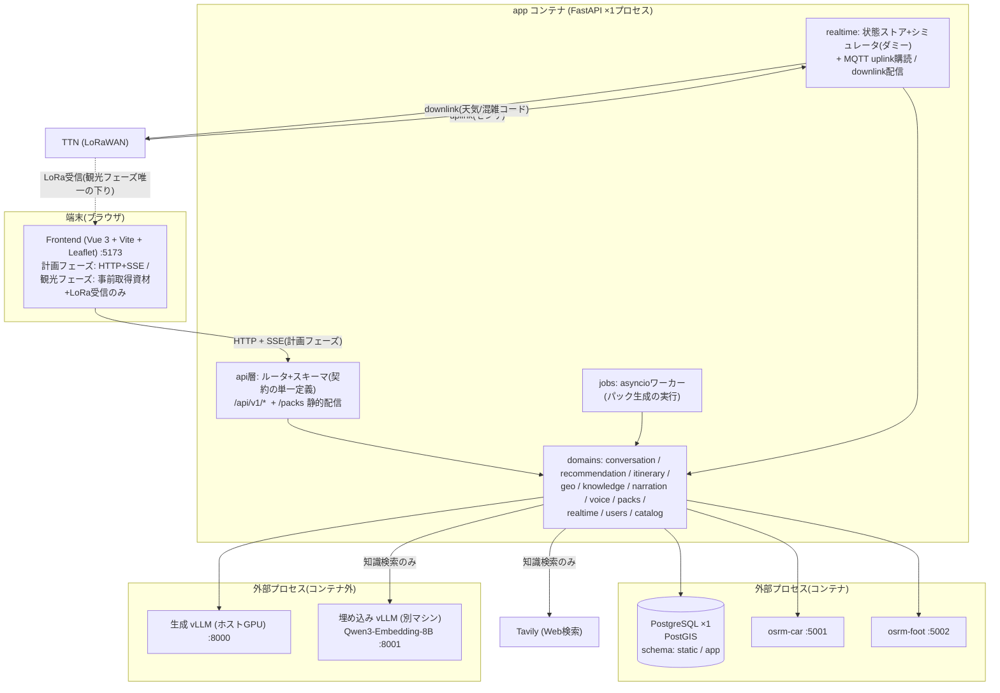

# システムアーキテクチャ(to-be)

- 状態: **承認(2026-07-31、ユーザー判断)** — これが実装の正となる
- 日付: 2026-07-30(初版 2026-07-29。00_project.md の再定義(粒度粗め・スコープ確認)に追従して改訂)/ 承認 2026-07-31
- **改訂 2026-08-01(Phase 2 の設計確定を反映)**: §5(パックのアセットと成果物)/ §6(経路をレッグ単位・door-to-door に。保留だった `car_to_trailhead` を決着)/ §7(パック用ナレーションの素材)/ §8(voice の ffmpeg 依存を落とす)/ §9(`static` に 2 テーブル追加)/ §14(Phase 2 の設計文書が決定稿)。根拠は [ADR-0013](adr/0013-leg-route-door-to-door.md) / [ADR-0014](adr/0014-osrm-area-extract.md) / [ADR-0015](adr/0015-pack-asset-composition.md)
- **改訂 2026-08-01(Phase 3・4 の設計確定を反映)**: §8(LoRa は端末駆動・1 通で全スポット。[ADR-0016](adr/0016-lora-terminal-driven-batch.md))/ **§10(フロントエンドは差分改修に限る。`NavView` 分割と SW 作り直しを撤回。[ADR-0017](adr/0017-frontend-incremental-change.md)、ユーザー指示)** / §14(Phase 3・4 の完了条件)。**これで全 Phase の設計文書が揃った**
- **改訂 2026-08-04(対話エージェントの作り替えを反映)**: §4(一括プラン方式 → **ReAct メインエージェント + サブエージェント構成**。[ADR-0019](adr/0019-react-main-agent-subagents.md)、ユーザー指示。詳細は [30_design/agent_react_architecture.md](30_design/agent_react_architecture.md))
- 前提文書: [00_project.md](00_project.md)(目的) / [10_requirements.md](10_requirements.md)(要求) / [22_current_issues.md](22_current_issues.md)(現行の問題の根拠)
- 主要決定の記録: [adr/](adr/)

---

## 1. 再設計の方針

現行構成の根本原因([22 §16](22_current_issues.md))に対し、次の対処を取る。

| 根本原因 | 対処 |
| --- | --- |
| プロセス境界の誤設定(分散モノリス) | **モジュラモノリス**: Pythonプロセス1つに統合し、境界は「プロセス」ではなく「パッケージ+型付き契約」で引く ([ADR-0001](adr/0001-modular-monolith.md)) |
| 長時間処理の同期実行 | パック生成を**ジョブ**(DBテーブル+プロセス内ワーカー)に、対話応答を**SSEストリーミング**に ([ADR-0003](adr/0003-pack-generation-jobs.md), [ADR-0004](adr/0004-conversation-pipeline.md)) |
| 状態の多重管理 | **PostgreSQL 1台**(PostGIS)に集約。Chroma・FAISS・プロセス内キャッシュ・フロント運搬を廃止 ([ADR-0002](adr/0002-single-postgres.md)) |
| 契約の不在 | スキーマは**一箇所で定義**し、FastAPIのOpenAPIからフロント型を生成。検証バイパス(`JSONResponse`直返し)禁止 |
| 設定・手順の暗黙知化 | `pydantic-settings`による型付き一元設定+`.env.example`+運用手順の文書化(`50_operations/`) |
| 可観測性の不在 | 構造化ログ(JSON)+request_id。**縮退・失敗をサイレントに握り潰さない**(計測テーブルは持たない。2026-08-01、NFR-7 削除) |

### 設計原則

- **P1 プロセスは増やさない。** 別プロセスにするのは「別の技術スタック・別のライフサイクル・別のマシン」のものだけ(vLLM, OSRM, PostgreSQL)
- **P2 境界は型で引く。** ドメイン間・フロント間のやりとりは必ずPydanticスキーマを通す。同じ型を二度定義しない
- **P3 長い処理はジョブ、短い処理は同期、生成はストリーミング**
- **P4 状態のsingle source of truthはDB。** ファイル・メモリキャッシュ・フロント保持はすべて派生物
- **P5 周辺機能の障害で対話を止めない**(センサ・TTS・シミュレータはgraceful degradation)。ただし縮退は必ずログとレスポンスに明示し、**サイレントに握り潰さない**
- **P6 失敗は必ず見えるところに出す。** 縮退・タイムアウト・手の破棄は構造化ログに出し、握り潰さない(**2026-08-01 改訂**: 旧「計測ファースト」。NFR-7 の削除に伴い、DB への計測記録ではなくログへの明示に置き換えた)
- **P7 2フェーズを一級概念に。** 計画フェーズ(オンライン)と観光フェーズ(オフライン・LoRaWANのみ)を明確に分け、観光フェーズは「事前配布した資材+狭帯域ダウンリンク」だけで成立させる(FR-4)

---

## 2. 全体構成



- **2フェーズ運用が構成の前提**: 計画フェーズはHTTP+SSEで全機能を使い、必要資材を事前取得する。観光フェーズの端末への下りはLoRaWANダウンリンク(狭帯域)のみで、案内は端末内の資材+受信コードで成立する
- コンテナは **db / osrm-car / osrm-foot / app / frontend の5つ**(現行13)。DB初期化コンテナ2つは `app` の管理CLI(`python -m app.cli init-db` 等)に統合する
- **ChromaDBコンテナは廃止**(長期記憶のスコープ外化: [00_project.md](00_project.md))。**ただし別マシンの埋め込みサーバは知識検索で使う**(2026-08-01、[ADR-0012](adr/0012-knowledge-retrieval-pgvector.md))— ベクトルは同一 Postgres に pgvector で持つので**データストアは増えない**。svc-nav/routing/alongpoi/llm/voice/agent の6プロセスは `app` 内のパッケージになる
- **埋め込みサーバと Tavily は周辺機能**である。落ちても対話は止まらず、知識検索が縮退するだけ(NFR-5。[30_design/narration_qa.md §10](30_design/narration_qa.md))
- パック(`/packs/*`)は `app` が `StaticFiles` で配信し、リポジトリ外nginxへの暗黙依存をなくす

---

## 3. バックエンド構造

```
backend/
├── pyproject.toml            # パッケージ定義・依存(本体/dev分離)・pytest/ruff設定
├── alembic/                  # DBマイグレーション
├── app/
│   ├── main.py               # FastAPI組み立て(ルータ登録・lifespan: MQTT/ジョブワーカー起動)
│   ├── cli.py                # 管理コマンド 18 種(init-db / seed / build-geo / build-travel-times /
│   │                         #   index-knowledge / export-openapi / rt-* / gc-packs ほか)
│   ├── core/
│   │   ├── config.py         # Settings (pydantic-settings)。環境変数を読むのはここだけ
│   │   ├── db.py             # async engine / セッション管理(単一)
│   │   ├── llm.py            # 生成クライアント(OpenAI互換, async, リトライ, モデル依存後処理の一元化)
│   │   └── logging.py        # 構造化ログ + request_id
│   ├── api/
│   │   ├── auth.py           # Bearer トークンの検証(依存性注入)
│   │   ├── sse.py            # SSE の組み立てとバッファリング
│   │   ├── schemas/          # ★ 契約の単一定義(フロントとの境界。ここ以外で外部向け型を定義しない)
│   │   └── routers/          # health / users / chat / itinerary / spots / routes / packs / realtime
│   │                         #   ※ jobs は独立ルータではなく packs.py が持つ
│   ├── db_models/            # SQLAlchemy モデル(base.py / models.py)
│   ├── domains/
│   │   ├── catalog/          # spots(POI+施設 43 件)の読み出し
│   │   ├── users/            # ユーザー・スレッド管理
│   │   ├── conversation/     # ターンパイプライン・plan検証/実行・ガードレール・プロンプト・文脈構築
│   │   ├── recommendation/   # POI推薦(決定的スコアラ + LLMリランク)
│   │   ├── itinerary/        # 旅程の構成: ILSソルバー・述語ペナルティレジストリ・編集操作(ADR-0005)
│   │   ├── geo/              # OSRM経路探索 + 沿道POI(PostGIS)+ 移動時間行列 + route永続化
│   │   ├── knowledge/        # 知識ドキュメントの索引化と埋め込み(pgvector)
│   │   ├── narration/        # 知識検索サブエージェント(search/)+ パック原稿生成(pack_text)
│   │   ├── voice/            # TTSポート(gTTS実装。将来XTTS差し替え可)
│   │   ├── packs/            # パック生成ジョブのオーケストレーション・manifest
│   │   └── realtime/         # 状態ストア・シミュレータ(ダミー)・downlink配信・uplink ingest
│   └── jobs/                 # ジョブランナー(worker.py。ポーリングループ・stale 復帰)
├── tests/
│   ├── unit/  contract/  integration/  smoke/
└── data/
    ├── knowledge/            # 多言語知識MD
    ├── seeds/                # POI.json / facilities.json / access_points.geojson(投入元の単一ソース)
    ├── scenarios/            # 対話シナリオ台本(テスト用)
    └── map/                  # OSRMデータ(gitignore。取得手順は 50_operations)
                              # ※ processed/ は作られていない(学習成果物を持たないため)
```

**依存ルール**(import方向。逆流禁止):

```
api/routers → api/schemas → domains → core
jobs → domains → core
domains間は一方向のみ許可。循環禁止。**実装の実測(2026-08-03)**:
  conversation → geo / itinerary / narration / recommendation
  packs        → geo / itinerary / narration / voice
  narration    → knowledge
  realtime     → packs
  catalog / users / itinerary / recommendation / geo / knowledge / voice は他ドメインに依存しない(葉)
  ※ conversation は「道具を呼ぶ側」。recommendation/itinerary は conversation を知らない(ADR-0008)
```

- パッケージは `pip install -e .` で導入し、`PYTHONPATH`ハックと2種類のimportルート規約(22 §1-6)を廃止する
- 現行 `backend/api/` と `backend/worker/` は移行完了後に削除(§10)

---

## 4. 対話ターンの設計(conversation)

**LangGraphは廃止**し、型付きのプレーン非同期パイプラインにする([ADR-0004](adr/0004-conversation-pipeline.md))。エージェントの制御構造は **ReAct メインエージェント + 役割別サブエージェント**([ADR-0019](adr/0019-react-main-agent-subagents.md)。**2026-08-04 改訂**: 旧・一括プラン方式 = ADR-0008 は廃止)。

> **詳細設計は [30_design/agent_react_architecture.md](30_design/agent_react_architecture.md) にある。**本節は全体構成の中での位置づけを示すだけで、Tool カタログ・出力スキーマ・ガードレール・SSE契約・コンテキスト予算・縮退設計はそちらが正。

```
POST /api/v1/chat (SSE)
  ├─ 1. load_context     : ユーザー+スレッド+履歴(LLM要約+直近2ターン生)をDBから再構築
  ├─ 2. update_profile   : LLM 1回 — プロフィール差分+スコア補正。差分がなければ何も書かない
  ├─ 3. main_agent       : ReActループ — LLMが毎周 thought+一手(手数上限8+コンテキスト予算70/85%)
  │                        Toolは6つ: recommend / plan_itinerary / edit_itinerary / search_knowledge / ask_user / done
  │                          recommend        → レコメンドSA(自然言語指示 → filter翻訳 → 既存の二段推薦)
  │                          plan/edit        → 旅程計画SA(完全ワークフロー: 名寄せ → ILS×3 → 解選択 → OSRM → 整形)
  │                          search_knowledge → 知識検索SA(自身の予算で反復。ADR-0011)
  │                          ask_user         → UI経由で質問し回答を待つ(HITL)。回答は同一ターン内で
  │                                             呼び出し元エージェントのactにツール結果として返る
  │                        メインは spot_id を扱わない(POIは名前空間。id解決はSAのコードが名寄せで行う)
  ├─ 4. respond          : LLM 1回 — done の後、ユーザー向け日本語を SSE でトークンストリーミング
  └─ 5. persist          : プロファイル・旅程・会話を**1トランザクション**でコミット+履歴要約の更新(done送出後)
```

- **LLM呼び出しは1ターン可変**(単純な推薦で6回前後。[agent_react_architecture.md §9](30_design/agent_react_architecture.md))。回数固定を捨てて「結果を見て次を決める」を買った([ADR-0019](adr/0019-react-main-agent-subagents.md)。**ターン所要時間の増加は受容済み** — 2026-08-04 ユーザー判断)。体感は `state:step` の実況と provisional 先出し(推薦・旅程)、`respond` のストリーミングで保つ
- **長期記憶(過去セッション横断のベクトル検索)は引き続きスコープ外**([00_project.md](00_project.md) 2026-07-30 確認)。会話の文脈は「LLM要約+直近2ターン生」+永続プロファイルで構築する([agent_react_architecture.md §8](30_design/agent_react_architecture.md))。**知識ベース検索でベクトルを使うのは別の話**であり(2026-08-01、[ADR-0012](adr/0012-knowledge-retrieval-pgvector.md))、会話履歴は埋め込まない
- 状態は毎ターンDBから再構築する。`MemorySaver`(プロセス内チェックポイント)は廃止し、22 §3-5 のメモリ無限成長・再起動消失を構造的に解消。**プロセス内に持つのはターン内の状態だけ**(`ask_user` の回答待ちを含む — ターンをまたがない)
- スキーマ: `threads(thread_id, user_id, ...)` / `messages(thread_id, role, content, ...)`。**session_id固定バグ(22 §3-2)と履歴のスレッド混入(22 §3-3)をデータモデルで解消**(全ユーザー横断のベクトル検索(22 §3-4)は機能ごと廃止)
- 名寄せ辞書(別名・序数)・プロフィール正規化は `recommendation/` と `conversation/` 配下の独立モジュールに分離し、`agent.py` 1397行(22 §3-1)を解体する(多言語スコープ外化により簡繁変換テーブル等は削除)

SSEイベント仕様: `token`(応答本文の断片) / `state`(step・推薦・旅程・質問・プロファイルの更新) / `done`(turn_id・縮退の有無) / `error`(縮退の明示)。**UIの状態はすべて `state` 由来とし、ストリーム本文のパースで状態を作らない。**ペイロードの定義は [40_api/chat_sse.md](40_api/chat_sse.md)。

## 5. ガイダンスパック生成(packs)

> **詳細設計は [30_design/packs_pipeline.md](30_design/packs_pipeline.md)(決定稿 2026-08-01)にある。**本節は全体構成の中での位置づけを示す。

パックは観光フェーズ(オフライン)を成立させるための事前配布物である(FR-4.1)。状況variantを事前に全生成するのは、現地でLoRaWANから届く数十バイトのコードだけで端末が案内(音声)を切り替えられるようにするため(FR-4.3/4.4)。つまり「全variant事前生成」は目的ではなく手段であり、生成コストが問題になれば設計で見直してよい。

**同期HTTP(最大50分ブロック)をやめ、ジョブにする**([ADR-0003](adr/0003-pack-generation-jobs.md))。

```
POST /api/v1/packs {route_id, options}          → 202 {job_id, pack_id}
GET  /api/v1/jobs/{job_id}                      → {state, progress: {done, total, failed}, pack_id}
GET  /packs/{pack_id}/manifest.json             → 完成後の成果物(appが静的配信)
```

- **ジョブモデル**: `pack_jobs(id, pack_id, state, params, created_at, ...)` + `pack_assets(pack_id, spot_id, variant, narration_state, audio_state, error, ...)`
  - state: `queued → running → ready | partial | failed`。**アセット単位の部分成功**を第一級で扱う(現行はTTS 1件失敗で全体500+孤児ファイル: 22 §2-6)
  - 冪等性: 同一 `(route_id, langs, options)` の再要求は既存ジョブ/パックを返す(現行のuuid乱発によるディスク積み上げを解消: 22 §2-7)
  - 実行は `app` 内のasyncioワーカー。**Celery/Redisは再導入しない**(この規模に不要、過去に廃止済み)
- **並列度**: ナレーション生成は `asyncio.gather` + Semaphore(既定8。vLLMの継続バッチングに委ねる)、TTSはSemaphore(既定3)+指数バックオフ。spot単位の失敗クールダウン連鎖(22 §2-6)は廃止。**両者はパイプラインで回す**(原稿が全部できるのを待たない)
- **variant(状況)の一元化**(**2026-08-01 改訂: [ADR-0015](adr/0015-pack-asset-composition.md)**): `Variant = base | weather_cloudy | weather_rain | congestion_mid | congestion_high` を `api/schemas` の enum 1箇所で定義。アセットキーは `(spot_id, variant)`(言語は日本語のみ)。**排他ではなく base + overlay の合成**とし、天気と混雑を独立した軸として重ねられるようにする。「沿道POIは本編のみ」という現行の暗黙ルールは **`pack_assets.role`(visit / pass_by)**で表現する(22 §5-5 の7箇所散在を解消)
- **成果物は `manifest.json` + `route.geojson` + `audio/*.mp3`**(**2026-08-01 具体化**)。テキスト本文はmanifestに含め、`Asset.text` 欠落(22 §5-2)を解消する。**経路は manifest に埋め込まず別ファイルにする** —— 現行は400KB中122KBがrouteの重複(22 §B-11)だったが、`route_id` 参照だけにすると**観光フェーズで引けない**ため、パック内のファイルとして持つ。**再生規則(`playback_rules`)と近接判定の半径も manifest に載せ**、フロントとサーバーが別々の定数を持たないようにする(22 §12-7)

## 6. ジオ(geo)

> **詳細設計は [30_design/geo.md](30_design/geo.md)(決定稿 2026-08-01)にある。**地図データの作り方は [50_operations/osrm.md](50_operations/osrm.md)。

- svc-routing + svc-alongpoi を `domains/geo` に統合。spot取得SQLのコピペ二重実装(22 §5-6)を単一リポジトリクラスへ
- **routeを永続化する**: `POST /api/v1/routes` → `routes` に保存し `route_id` を返す。**単位は「1レッグ(起点→終点)」**であり、旅程全体でも1日でもない(**2026-08-01、[ADR-0013](adr/0013-leg-route-door-to-door.md)**)。版が変わっても同じレッグを再利用できる。**フロントが経路データを運搬して詰め直す現行構造(22 §1-4)を廃止**
- **移動時間と経路を分離する**: 旅程の時刻計算は `static.travel_times`(DB)だけを使い、OSRMを叩かない。OSRMが落ちても旅程は作れ、失われるのは地図に描く線だけになる
- OSRM呼び出しは区間ごとに並列化(async httpx)。リトライつき。`logger` 未定義のNameError(22 §6-1)と緯度経度取り違え(22 §12-5)はこの移植で消滅
- アクセスポイントDB障害時の「東へ0.01度」フォールバック(22 §6-3)は廃止し、明示的なエラーを返す。**OSRM断のときに直線距離で経路を捏造することもしない**
- **`car_to_trailhead` / `return_to_origin` は削除する**(**2026-08-01 決着**)。前者は「車でどこまで入れるか」を `static.spot_approach`(43行)として事前に解くことで**データから決まる挙動**になり、後者は `ItineraryDay.destination` が明示的に持つ。**受けて無視するフラグ(22 §6-4)を残さない**
- 沿道POIの距離計算はPostGIS 1クエリ(`ST_DWithin` + `ST_LineLocatePoint`)にし、O(spot×全polyline点) の総当たり(22 §D-9)をやめる。polylineの点番号(`nearest_idx`)は **`route_position`(0〜1)** に置き換える

## 7. ナレーションと知識ベース(narration)

> **検索方式は決定した(2026-08-01)**: 知識検索は**独立したサブエージェント**(`search_knowledge`。[ADR-0011](adr/0011-knowledge-search-subagent.md))が担い、**pgvector + Qwen3-Embedding-8B(4096 次元)の意味検索・字句一致検索・全文取得・Tavily Web 検索の 4 Tool**を持つ([ADR-0012](adr/0012-knowledge-retrieval-pgvector.md))。設計は [30_design/narration_qa.md](30_design/narration_qa.md)。
>
> **これに伴い [ADR-0002](adr/0002-single-postgres.md) の影響節を改訂した** — 埋め込みサーバ(`.env` の `Embedding_server`)は使う。ただし**ベクトルは同一 Postgres に pgvector で持つ**ので、**データストアは増えない**(ChromaDB の削除は維持)。

**`domains/narration` は 2 つの役割を持つ。**混同しないこと。

| 役割 | 誰が呼ぶか | LLM | 知識の引き方 |
| --- | --- | --- | --- |
| **知識検索サブエージェント**(`search_knowledge`) | 計画フェーズの `act` | **自分で反復する**(予算で停止) | 4 Tool で検索([30_design/narration_qa.md](30_design/narration_qa.md)) |
| **ナレーション生成**(パック用の案内文) | パック生成ジョブ(§5) | **1 アセット 1 回** | **`spot_id` で直接引く**(検索しない。2026-08-01 決定。[30_design/packs_pipeline.md §5](30_design/packs_pipeline.md)) |

**パック用ナレーションは知識検索サブエージェントを使わない。**`faci_spot/spot_NNN.md` が 43 件すべてと 1:1 で対応しているので検索が要らず、1 パック 25〜80 アセットのバッチに反復検索は載らない。安全・季節の事実は `spots` の enrichment 列からコードが組み立てて渡す。

- 知識MDはGit管理のファイルのまま(差分管理できる利点が大きい)。ただし**起動時/シード時にインデックスを構築して整合性を検証**する: **`spot_id` から引ける**ようにし(`knowledge_documents.spot_id`。**旧 `md_slug` は死んでいるので使わない** — [30_design/data_model.md §1.2](30_design/data_model.md))、どこからも参照されない孤児MD(現行60件中17件: 22 §6-5)を `python -m app.cli validate-knowledge` で報告する。ランタイム対象は `ja/` のみ(en/zh のMDはデータとして残すが、検証・生成の対象外)
- プロンプトは状況を**パラメータ化した単一テンプレート**に統合(現行の「言語×状況」6テンプレート全文コピー問題(22 §F-11)は、多言語スコープ外化と合わせて消滅)。状況別プロンプトにも知識コンテキストを渡す(現行は無視: 22 §F-12)
- `<think>`タグ除去などモデル依存の後処理は `core/llm.py` に一元化(現行はプロンプト文言の正規表現コピーが散在: 22 §F-8)
- 生成結果の検証(空文字・拒否応答・長さ逸脱)をTTSに流す前に行う

## 8. リアルタイム(realtime)・音声(voice)

**realtime** — 役割を3つに分離する(FR-4.4/4.5)

> **詳細設計は [30_design/realtime_lora.md](30_design/realtime_lora.md)(決定稿 2026-08-01)にある。**

- **状態ストア**: spot別の天気・混雑コード(`spot_realtime`)。値の由来(`sensor` / `simulated`)と更新時刻を必ず記録する
- **シミュレータ**: ダミー値の生成を明示的な第一級コンポーネントにする。シナリオ(spot×時系列の値)をCLI/管理APIから投入・制御でき、実験を再現できる(FR-4.5)。現行の「読み出し時に乱数で捏造して保存」(22 §6-2)は廃止し、値がなければ `unknown` を明示する
- **配信**: 観光フェーズの端末へは**LoRaWANダウンリンク**で届ける。**LoRaWAN Class A ではダウンリンクが uplink 直後の受信ウィンドウにしか届かないため、サーバー push は作れない** —— **端末が要求し、サーバーが 1 通でパック全スポットのコードを返す**(**2026-08-01、[ADR-0016](adr/0016-lora-terminal-driven-batch.md)**)。ペイロードは **2 + N バイト**(1 スポット 1 バイト = 天気 4 bit + 混雑 4 bit)。**HTTP直接取得で代替しない**(FR-4.5)。TTNフェアユース(**下り 10 通/日**)は配信スケジューラが守り、上限は **DB に数える**(NFR-9)
- 計画フェーズのUI表示用にはHTTP API(`GET /api/v1/realtime/...`、ETag対応)も提供する。**観光フェーズでは使わない**
- MQTTクライアント(uplink購読+downlink publish)は `app` のlifespanで管理(aiomqtt)。単一プロセス化により多重購読・downlink重複(22 §6-8)とプロセス内無期限キャッシュ(22 §6-9)は構造的に消える

**voice**
- `TTSPort` インターフェース(`synthesize(text, lang) -> Audio{bytes, mime, duration_s}`)を切り、既定実装はgTTS(現行踏襲)。XTTS等のGPU系に差し替える場合もこの境界の内側だけで完結する
- **ffmpeg依存を落とす**(2026-08-01)。gTTSはmp3を直接返すので変換が要らず、長さは `mutagen` でヘッダから読む
- **失敗は1アセットに閉じる。**現行は1件失敗でパック全体が500になり、書き込み済みMP3が孤児として残っていた(22 §2-6)
- XTTS残骸(torch_patch、参照wav 3本、COQUI設定、無音ダミー)は削除(22 §7 / §15-2)

## 9. データ設計

PostgreSQL 16 ×1台(`postgis/postgis` イメージ)。[ADR-0002](adr/0002-single-postgres.md)

| スキーマ | テーブル(主要) | 備考 |
| --- | --- | --- |
| `static` | spots(POI と施設を統合)/ access_points / **spot_approach** / travel_times / preference_keys / tag_vocabulary / **knowledge_documents / knowledge_chunks**(pgvector) | PostGIS。シードCLIで `data/seeds/` から投入(単一ソース化)。壊れたORM定義(22 §4-5)は捨て、SQLAlchemyモデル+Alembicで管理。**`spot_approach` と `travel_times` はシードではなくOSRMから生成する**(`build-geo` / `build-travel-times`) |
| `app` | users / threads / messages / profiles / itineraries / routes / pack_jobs / pack_assets / spot_realtime | 会話系は §4 の設計。プロフィールは正規化して揮発キャッシュとの同居(22 §4-3)をやめる。`spot_realtime` は値の由来(`sensor`/`simulated`)と更新時刻を持つ。**計測テーブル(`turn_metrics` / `unmodeled_log`)は持たない**(2026-08-01、NFR-7 削除) |

- ChromaDBコンテナ・chromadb/faiss-cpu依存・埋め込みクライアントを削除(長期記憶のスコープ外化により、現行のベクトル次元不一致問題(22 §4-8)も消滅)。スポット埋め込み(未使用ロードの704KB: 22 §3-7)もruntimeから外す。ベクトル検索が将来必要になったら、同一DBにpgvector拡張を追加する
- DBアクセスは async SQLAlchemy に統一し、セッションはFastAPIの `Depends` / ジョブワーカーのコンテキストマネージャで管理(open放置リーク: 22 §4-1 を解消)。**1ターン=1トランザクション**(22 §4-2)
- マイグレーションはAlembic。initスクリプト3本+`Dockerfile.init` は `app.cli` に統合

## 10. API契約とフロントエンド

**契約**
- 全エンドポイントを `/api/v1/*` に統一(現行の `/api/route` と `/api/v1/chat` の混在を解消)。命名はsnake_case
- `api/schemas/` が唯一の定義場所。`JSONResponse` 直返しによる検証バイパス(22 §12-1)を禁止し、レスポンスは必ずスキーマを通す
- CIで `openapi.json` をエクスポートし、`openapi-typescript` でフロントの型(`frontend/src/api/types.d.ts`)を自動生成。JSDoc手書きtypedefの乖離(22 §12-11)を解消
- エンドポイント一覧(案):

| Method/Path | 内容 |
| --- | --- |
| `POST /api/v1/users`, `POST /api/v1/login`, `GET /api/v1/users/{name}/session` | 現行踏襲(簡易認証) |
| `POST /api/v1/chat` | SSE(§4) |
| `POST /api/v1/routes`, `GET /api/v1/routes/{id}` | 経路探索+永続化(§6) |
| `POST /api/v1/packs`, `GET /api/v1/jobs/{id}` | パック生成ジョブ(§5) |
| `GET /api/v1/realtime/spots/{spot_id}` | ETag対応(§8) |
| `GET /healthz` | 依存先(DB/vLLM/OSRM)の実チェック |
| `GET /packs/{pack_id}/...` | 静的配信(app内蔵) |

**フロントエンド**(スタックはVue 3 + Pinia + Leaflet を維持)

> **2026-08-01 改訂([ADR-0017](adr/0017-frontend-incremental-change.md)、ユーザー指示)**: **フロントエンドは差分改修に限る。**「変更しなくてよい部分は変更しない」。**`NavView.vue` の分割と Service Worker の作り直しは撤回**した。変更の一覧は [30_design/frontend_nav.md](30_design/frontend_nav.md)、観光フェーズの動作は [30_design/offline_field_mode.md](30_design/offline_field_mode.md)(いずれも決定稿 2026-08-01)。

- **変えるもの(接続の差分)**: chatのSSE対応(`AbortController` で停止可)、**`ask_user` / `clarify` のチップUI(新規)**、旅程カードと undo ボタン、パック生成の進捗UI(生成待ちの間もアプリが使える)、Bearer認証、`POI.json` 等のフロント側コピー(22 §15-1)を廃止して `GET /spots` から取得、LoRaペイロードの decode
- **変えるもの(実害のあるバグ)**: Pinia二重初期化(22 §13-2)、`marked` 出力にDOMPurify(22 §13-4)、SWのタイルホスト不一致(22 §13-5。**URL判定の修正にとどめ、作り直さない**)、閾値の二重定義(22 §12-7)、供給源のないデッドUI(22 §12-4)の除去
- **変えないもの**: `NavView.vue` の構造、`NavMap` / `audioManager` / `usePosition` / `geoutils` / `loraBridge`(AT コマンド部)/ `useNavWindow`、未使用の残骸(22 §13-10。**消してよいが優先しない**)
- **観光フェーズのオフライン動作は一級要件のまま**: パック・地図タイルの事前取得、端末内の現在地判定 + **base + overlay の合成再生**([ADR-0015](adr/0015-pack-asset-composition.md))、LoRa受信。**既存の資産(Cache Storage・再生キュー・測位)をそのまま使う**
- 設定は `import.meta.env`(`VITE_API_BASE`)へ

## 11. 設定・秘密・再現性

- `app/core/config.py` の `Settings`(pydantic-settings)に全設定を集約。**環境変数名はここに書かれたものだけが正**(大文字小文字ゆれの同義キー: 22 §8-2 は廃止)
- `.env.example` を追跡し、全キーに説明を付ける。`.env` は追跡外のまま。**現状の `.gitignore` は `.env*` で `.env.example` も無視してしまうので `!.env.example` を足す**(2026-08-01 発見)

**設定を 3 層に分ける**(**2026-08-03 決定**、公開を前提とした整理)。`.env` に全設定を並べると、公開時に「秘密かどうか」と「環境依存かどうか」が判別できなくなる。置き場所を役割で決める:

| 層 | 何を置くか | 例 |
| --- | --- | --- |
| **`.env`**(追跡外) | **秘密**と**人によって値が変わるもの**だけ | `POSTGRES_PASSWORD` / `TAVILY_API_KEY` / `RT_MQTT_PASS` / IP を含む URL(`INFERENCE_SERVER` / `EMBEDDING_SERVER`)/ `INFERENCE_MODEL` |
| **`docker-compose.yml`** の `environment:` | **接続先のトポロジ**(どのコンテナがどこに居るか。compose の構成が決めるので人によらない)と**プロジェクトの定数** | `POSTGRES_HOST` / `POSTGRES_PORT` / `POSTGRES_DB` / `POSTGRES_USER` / `OSRM_CAR_URL` / `OSRM_FOOT_URL` / `PACKS_ROOT` |
| **`Settings` の既定値** | **チューニング値**(全員同じでよく、変えたい人だけ `.env` で上書きする) | `OSRM_*` の並列度・タイムアウト・再試行、`GEO_*` の閾値、`CHAT_SSE_HEARTBEAT_SEC`、`RECOMMENDATION_RERANK_ENABLED` |

- **`.env.example` と `Settings` の 1 対 1 対応は要求しない**(この整理で撤回)。`.env.example` は「必須」「任意」の 2 節に絞り、既定値で足りるキーはコメントで存在だけ示す。**キー名の正が `Settings` である点は変わらない**
- **`POSTGRES_DB` / `POSTGRES_USER` は `.env` で扱わず、`guidance` に固定する**(**2026-08-03 決定**)。秘密でも環境依存でもないうえ、**initdb 時にボリュームへ焼き付いて後から変えられない**ため、`.env` で上書きできること自体が罠になる(値を変えると DB 側は変わらず接続だけ失う)。compose と `Settings` の既定値の両方に同じ `guidance` を書き、上書き経路を持たせない
  - この開発機のボリュームは旧名 `static_db` で初期化されていたので、**2026-08-03 に `ALTER DATABASE` / `ALTER ROLE` でリネームして `guidance` に揃えた**。パスワードは SCRAM-SHA-256 のため名前変更の影響を受けない(md5 だと消去される)
- `POSTGRES_PASSWORD` は compose で `${POSTGRES_PASSWORD:?...}` にし、**未設定なら起動前にエラーで止める**(空パスワードで postgres が黙って初期化失敗するのを避ける)
- `db` サービスに `env_file` を渡さない。**DB コンテナが Tavily キーや MQTT 資格情報を持つ理由がない**
- composeからホスト固有値を排除: `/var/www/packs` と `mkdir -p /home/junta_takahashi/...`(22 §8-4)は named volume `packs_data` に置き換え
- タイムアウトは「外側 ≥ 内側」を`Settings`内の導出で保証(現行のGateway 180s < LLM 600s 矛盾: 22 §2-2)
- **OSRMデータは鳥海山エリアのbboxに切り出し、生成を `scripts/build_osrm.sh` にする**(**2026-08-01、[ADR-0014](adr/0014-osrm-area-extract.md)**)。現状は全国版32GBで取得手順も未文書(22 §8-6)。切り出すと1GB未満・生成10分になり、NFR-2が実際に満たせる。手順は [50_operations/osrm.md](50_operations/osrm.md)
- Dockerfileは本体/初期化を統合しマルチステージ化。依存は `pyproject.toml` で本体/dev分離(22 §14-4)
- **compose ではコードをイメージに焼かずマウントする**(**2026-08-03 決定**)。`app` は `./backend:/app/backend`、`frontend` は `./frontend:/app/frontend`。**イメージが持つのは依存関係だけ**になり、再ビルドが要るのは `pyproject.toml` / `package.json` を変えたときに限られる
  - `app` は `--reload --reload-dir /app/backend/app` で起動する。ホスト側の編集がそのまま反映される(2026-08-03 実測: WatchFiles が bind mount 越しの変更を検知)
  - マウントが `pip install .` 済みの `app` パッケージを覆うよう、`PYTHONPATH=/app/backend` を明示する
  - `Dockerfile.app` のコード `COPY` は残す(compose を介さず単体で動かせる状態を保つため)。compose 起動時はマウントが常に優先される

## 12. 可観測性

> **2026-08-01 改訂: 実験計測をスコープから外した。**NFR-7(計測可能性)を要求から削除し、`turn_metrics` / `unmodeled_log` テーブルと `export-metrics` CLI を廃止した。**計測データを DB に貯めて取り出す機能は作らない。**

- 構造化ログ(JSON, stdout)。request_id をミドルウェアで採番しドメイン層まで伝播。`print` と `basicConfig` 副作用(22 §9)を全廃
- デバイスUUID別ログファイル(FDリーク+パス注入: 22 §6-6)は廃止。リクエストログはサイズ制限つきの要約のみ
- **縮退・失敗はログに出す**(DB には貯めない)。対象は「LLM がタイムアウトした」「手を破棄した」「ソルバーが解なしで返した」など、**動いているように見えて実は縮退している状態**。これは NFR-5(縮退は必ず明示する)が要求するもので、NFR-7 の削除では消えない
- **`pack_jobs` / `pack_assets`** はジョブの進捗取得(NFR-4)のために状態を持つ。これは計測ではなく機能である
- `/healthz` は依存先の実チェック(現行の静的okや嘘をつくhealth: 22 §6-11 を解消)

## 13. テスト・CI

- 現行テストは**移植しない**(死コードを検証・全滅状態: 22 §10)。契約から作り直す
- `pyproject.toml` にpytest設定(sys.pathハック廃止)。層構成:
  - `unit/`: ドメインロジック(名寄せ・variant・ジョブ状態遷移・プロンプト構築)。外部依存なし
  - `contract/`: APIスキーマとルータ(httpx AsyncClient + respxでvLLM/OSRMをモック)
  - `integration/`: DBを伴うリポジトリ層(compose のdbを利用)
  - `smoke/`: compose一式に対するE2E 1本(`run_nav_test.sh` の置き換え。ジョブポーリング対応)
- CI(GitHub Actions): ruff(lint+format) + unit + contract を必須化。フロントは `npm run build` の成功を最低線に

## 14. 移行計画

**ビッグバンでは移行しない。** フェーズごとに「30_design/ に詳細設計 → 承認 → 実装 → 旧コード削除」を繰り返す(CLAUDE.mdのルールに従う)。各フェーズ完了時点でシステム全体は動作する状態を保つ。

FR-1(推薦)・FR-2(プランニング)の手段は**現行方式を仮移植せず**、選択肢の調査・比較とユーザーとの議論を経て決めてから実装する(CLAUDE.md「手段の決め方」)。

| Phase | 内容 | 完了条件 | 事前に書く設計文書 |
| --- | --- | --- | --- |
| 0 | 本文書+ADRのレビュー・承認。`.env.example` 整備、死コード削除などの無リスク掃除 | 文書承認 | (本文書) |
| 1 | `backend/app/` 骨格(core/config/db/llm・ログ・healthz)+ users + **conversation**(§4)。フロントのchatをSSEへ | 新チャットが旧svc-agentなしで動作。svc-agent・chromadb・埋め込みサーバ依存を削除 | `30_design/recommendation_planning.md`(**決定稿 2026-07-30。ADR-0005/0006/0007**), `30_design/agent_planning_phase.md`(**承認 2026-07-31。ADR-0008**), `30_design/understand_node.md`(同文書の N2 解説), `30_design/agent_patterns_survey.md`(エージェント設計の外部知見と改善候補), `30_design/data_model.md`(**決定稿 2026-08-01**), `40_api/chat_sse.md`(**決定稿 2026-08-01**), `30_design/narration_qa.md`(**決定稿 2026-08-01。ADR-0011/0012**) |
| 2 | **geo + narration(パック用) + voice + packs**(§5-8)。ジョブAPI+フロントの進捗UI | パック生成がジョブとして動作。svc-nav/routing/alongpoi/llm/voice を削除 | `30_design/geo.md`(**決定稿 2026-08-01。ADR-0013**), `30_design/packs_pipeline.md`(**決定稿 2026-08-01。ADR-0015**), `50_operations/osrm.md`(**決定稿 2026-08-01。ADR-0014**) |
| 3 | **DB統合**(§9): 単一Postgres+Alembic+シードCLI。realtime移植(§8: シミュレータ+LoRa配信) | app-db/static-dbをdb 1台に統合。移行スクリプトで既存データ引き継ぎ。**シミュレータのシナリオでコードが端末まで届く** | `30_design/realtime_lora.md`(**決定稿 2026-08-01。ADR-0016**)(`data_model.md` は Phase 1 で執筆済み) |
| 4 | 掃除と仕上げ: `worker/`削除、リポジトリ衛生(22 §15)、テスト整備+CI、README/50_operations 書き直し、**観光フェーズのオフライン動作完成**(パック取り込み・LoRa反映・タイル) | **機内モードで通しで動く。**22の全項目に対応済みor明示的に見送り判断(**フロントの一部は[ADR-0017](adr/0017-frontend-incremental-change.md)により見送り**) | `30_design/offline_field_mode.md`(**決定稿 2026-08-01**), `30_design/frontend_nav.md`(**決定稿 2026-08-01。ADR-0017**) |

**設計文書の割り当てについて(2026-07-31 修正)**

- **`data_model.md` を Phase 3 から Phase 1 の前提に移した。**Phase 1 の conversation は `users`/`threads`/`messages`/`profiles`/`itineraries` を必要とするため、スキーマを Phase 3 まで未定にはできない。Phase 3 は「2 つの DB を 1 台に統合する移行作業」であって、スキーマを設計する場所ではない
- **`40_api/chat_sse.md` と `30_design/narration_qa.md` を追加した。**前者は [30_design/agent_planning_phase.md §6](30_design/agent_planning_phase.md) の SSE イベントと undo 用 REST を正式契約に昇格させるもの、後者は同 §13 論点 3 の決定(知識検索を道具に含める)から派生した「知識ベースの検索方式」を決めるもの。**2026-08-01 に決定稿となった** — 埋め込みサーバが利用可能であることが判明し、[ADR-0011](adr/0011-knowledge-search-subagent.md)(サブエージェント化)と [ADR-0012](adr/0012-knowledge-retrieval-pgvector.md)(pgvector)を起こした

**Phase 順序についての注意(2026-08-01 追加)**

- **Phase 2 の一部は Phase 1 の前提である。**Phase 1 の ILS ソルバーは `static.travel_times` を必要とし、その生成には OSRM の再ビルド([50_operations/osrm.md](50_operations/osrm.md))と `build-geo` / `build-travel-times`([30_design/geo.md](30_design/geo.md))が要る。**この 3 つだけは Phase 1 の着手前に済ませる**([90_backlog.md §C-0](90_backlog.md))
- `POST /api/v1/routes` の呼び出し(旅程確定時のレッグ経路取得)は Phase 2 で入る。**Phase 1 の間は `leg_from_prev.route_id` が常に `null` でよい** —— 時刻は行列由来なので旅程は完成する

**リスクと対応**
- 会話履歴・ユーザーデータは Phase 3 で移行スクリプトを書く(スキーマが変わるため)。実験データとして残す必要があるものを事前に確認する
- 長期記憶のスコープ外化により、既存Chromaのベクトルデータは移行しない(必要になれば会話ログ(SQL)から将来再構築できる)
- 各Phaseで旧・新が一時併存する期間はcomposeに両方を残し、フロントの向き先で切り替える

## 15. 採用しなかった選択肢(要約)

| 選択肢 | 不採用の理由 |
| --- | --- |
| マイクロサービス構成を維持して修繕 | 独立デプロイ・独立スケールの要求が存在しない(NFR-8)。1人開発では境界維持コストが変更容易性(NFR-1)を直接損なう。詳細: ADR-0001 |
| Celery/Redis再導入(ジョブ基盤) | この規模にオーバーキル。過去に一度廃止済み。DBジョブテーブル+asyncioで要件を満たす。詳細: ADR-0003 |
| LangGraph継続(薄く保つ) | 現行グラフは実質線形+分岐1つで、フレームワークの利得よりチェックポインタ誤用等の事故面が大きい。実験でグラフ構造が本当に必要になったら再導入を妨げない設計にする。詳細: ADR-0004 |
| ChromaDB継続 | 会話長期記憶1コレクションのためだけの追加コンテナ+依存。長期記憶自体をスコープ外とした(00_project)ため機能ごと廃止。再導入時も同一DBへのpgvector拡張で足りる。詳細: ADR-0002 |
| 別言語/別フレームワークへの全面書き換え | FastAPI/Vueは要求を満たしており、ドメインロジック(推薦・名寄せ・プロンプト)は資産として移植する。書き換えの利得がない |
