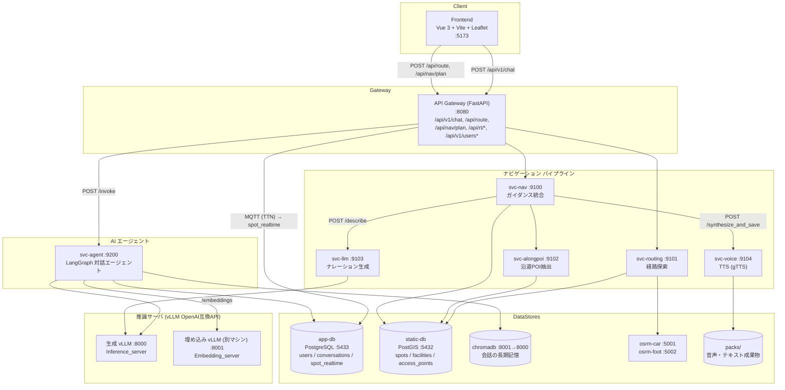
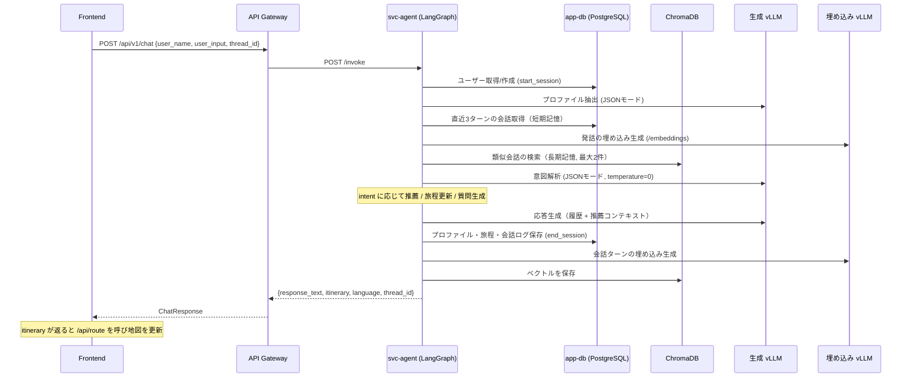
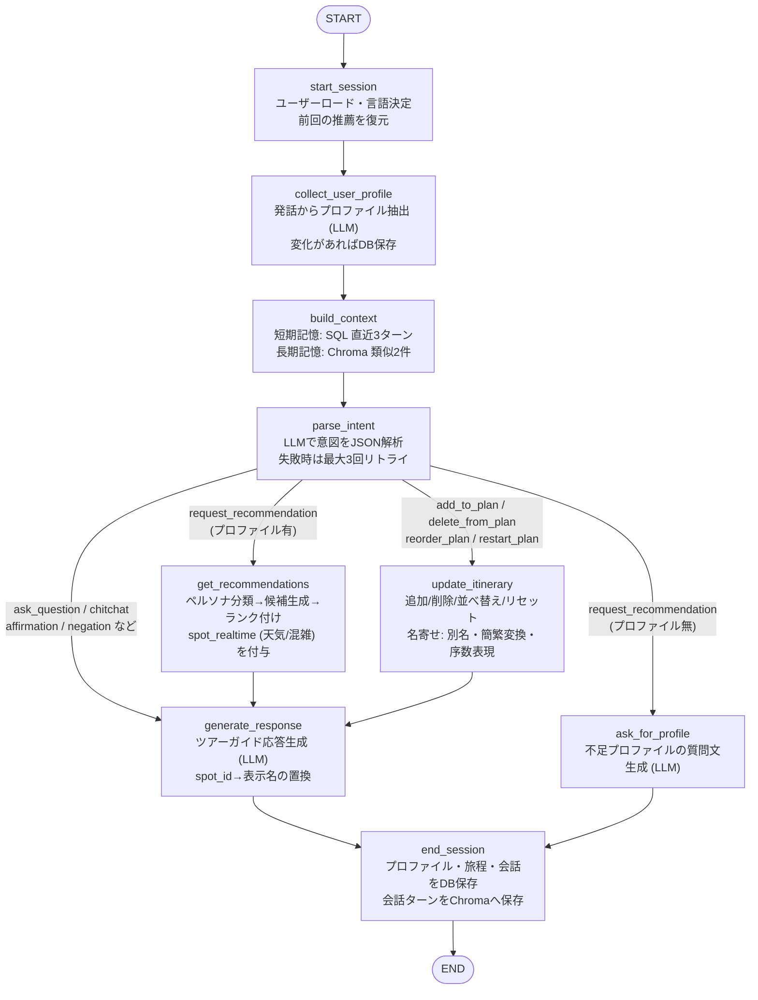
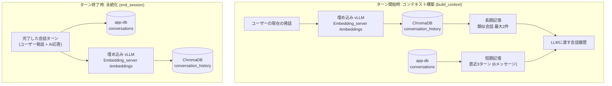
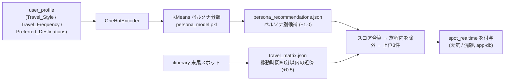
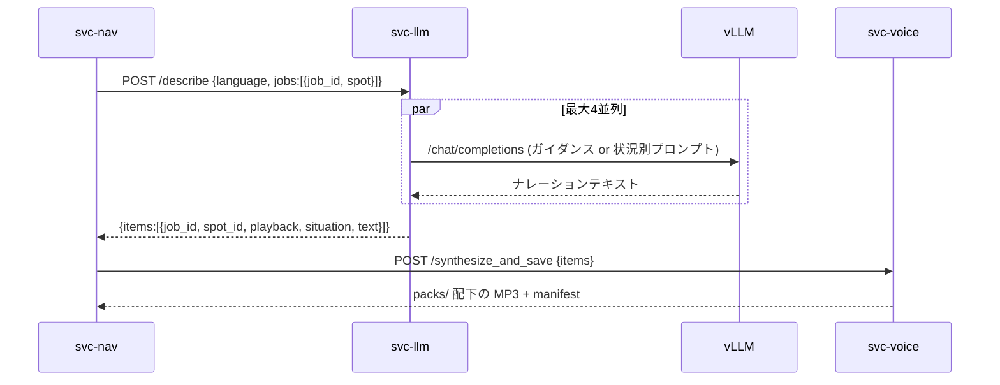

# [as-is 記録] 旧アーキテクチャ

> **この文書は凍結された現行(旧)構成の記録である。** 目指す姿は [20_architecture.md](20_architecture.md) を参照。移行完了後、本文書は参照用としてのみ残る。

最終更新: 2026-07-28（Ollama/Celery を廃止し、vLLM 直接呼び出しへ移行後の構成）

本ドキュメントは guidanceLLM2 の現行アーキテクチャ、特に AI エージェント（`svc-agent`）の内部構造を記述する。

---

## 1. システム全体像

テキスト生成・埋め込み生成はすべて、**vLLM（OpenAI互換API）** への直接HTTPリクエストで行う。

| 用途 | .env キー | 例 | 備考 |
| --- | --- | --- | --- |
| テキスト生成 | `Inference_server` | `http://127.0.0.1:8000/v1` | コンテナ内からは `http://host.docker.internal:8000/v1` に上書き（compose の `environment`） |
| 埋め込み | `Embedding_server` | `http://<LAN の別マシン>:8001/v1` | 別マシンのvLLM。LAN IPのためコンテナからもそのまま到達可能（実アドレスは `.env` のみに置く） |

モデル名は `INFERENCE_MODEL` / `EMBEDDING_MODEL` 未指定時、各サーバの `GET /v1/models` から自動検出する。



### LLM 呼び出しの一元化

全サービスの生成呼び出しは共通クライアント **`backend/worker/llm_client.py`** を経由する。

| 呼び出し元 | 関数 | 用途 | パラメータ |
| --- | --- | --- | --- |
| `agent_app/agent.py` `parse_intent` | `generate_text` | 意図解析 | `temperature=0.0`, `json_mode=True` |
| `agent_app/agent.py` `_extract_profile_from_text` | `generate_text` | プロファイル抽出 | `temperature=0.0`, `json_mode=True` |
| `agent_app/agent.py` `_generate_profile_question` | `generate_text` | プロファイル質問文生成 | デフォルト |
| `agent_app/agent.py` `generate_response` | `generate_text` | 応答生成（履歴つき） | デフォルト |
| `services/llm/generator.py` | `chat` | ナレーション生成 | デフォルト |
| `agent_app/vector_store_client.py` | `embed` | 長期記憶の埋め込み生成 | `Embedding_server` へ送信 |

- `json_mode=True` は vLLM の `response_format={"type": "json_object"}`（guided decoding）に対応。
- 会話履歴中の `system` ロールのメッセージ（長期記憶の要約）は、チャットテンプレート互換性のため
  先頭の system プロンプトへ統合される（`llm_client.generate_text` 内）。
- `embed` は `{Embedding_server}/embeddings` を呼び、入力順のベクトルを返す。

---

## 2. 対話フロー（1ターンのシーケンス）



---

## 3. LangGraph ステートグラフ（`agent_app/agent.py`）

### 3.1 状態 (AgentState)

| フィールド | 内容 |
| --- | --- |
| `user_name` / `language` | ユーザー識別・言語 (ja / en / zh) |
| `user_profile` | 年齢・旅行スタイル・頻度・興味など（JSONB永続化） |
| `itinerary` | 周遊計画（spot_id のリスト） |
| `chat_history` | 短期記憶 + 長期記憶を結合した会話履歴 |
| `user_input` / `parsed_intent` | 最新発話と意図解析結果 |
| `recommendations` | 推薦エンジンの出力（リアルタイム情報つき） |
| `response_text` | 最終応答テキスト |
| `awaiting_profile_fields` | 質問中のプロファイル項目 |

### 3.2 ノードと遷移



意図の種類: `request_recommendation` / `add_to_plan` / `delete_from_plan` / `reorder_plan` / `restart_plan` / `ask_question` / `affirmation` / `negation` / `chitchat`

### 3.3 記憶アーキテクチャ



- 埋め込み生成は `.env` の `Embedding_server` が指す vLLM（OpenAI互換 `/embeddings`）への
  直接HTTPリクエストで行う（`llm_client.embed`）。モデル名は `/v1/models` から自動検出
  （`EMBEDDING_MODEL` で上書き可）。
- ChromaDB または埋め込みサーバに接続できない場合は長期記憶を自動的に無効化し、
  エージェントは短期記憶のみで動作を継続する（`vector_store_client.py` の遅延初期化 + try/except）。

### 3.4 推薦エンジン（`agent_app/recommender.py`）



学習成果物は `agent_app/processed/` に配置（`spot_info.json`, `travel_matrix.json`,
`persona_recommendations.json`, `persona_model.pkl`, `spot_embeddings.faiss`, `spot_id_map.json`）。

---

## 4. ナビゲーション時のナレーション生成（svc-llm）

`svc-nav /plan` はスポットごとに「通常ガイド + 状況別（曇り/雨/やや混雑/混雑）」のナレーション生成ジョブを
`svc-llm /describe` に送る。svc-llm はジョブを **ThreadPoolExecutor（既定4並列, `LLM_DESCRIBE_CONCURRENCY`）**
で vLLM に投げ、結果をまとめて返す。vLLM 側は継続バッチングで並行リクエストを処理する。



- RAGコンテキストは `KNOWLEDGE_DIR`（`knowledge/{lang}/faci_spot/{spot_id}.md`）からのファイル取得。
- `(spot_id, situation)` が nav 側での結合キーとなるため、レスポンスで必ず保持する。

---

## 5. モジュール構成（リファクタ後）

```
backend/
├── api/                      # API Gateway (FastAPI)
│   ├── main.py               # ルータ集約 + ロギングミドルウェア
│   ├── agent_router.py       # /api/v1/chat → svc-agent /invoke
│   ├── user_router.py        # ユーザー作成 / ログイン / セッション復元
│   ├── nav_router.py         # /api/nav/plan → svc-nav
│   ├── routing_router.py     # /api/route → svc-routing
│   └── realtime_router.py    # MQTT (TTN LoRaWAN) → spot_realtime, /api/rt/*
└── worker/
    ├── llm_client.py         # ★ vLLM (OpenAI互換) 共通クライアント（生成 + 埋め込み）
    ├── app_db_models.py      # users / conversations / spot_realtime (SQLAlchemy)
    ├── agent_app/            # ★ AIエージェント (svc-agent)
    │   ├── api.py            # FastAPI /invoke
    │   ├── agent.py          # LangGraph 定義（状態・ノード・エッジ）
    │   ├── prompts.py        # 意図解析 / プロファイル / 応答生成プロンプト (ja/en/zh)
    │   ├── recommender.py    # ペルソナ推薦エンジン
    │   ├── profile_taxonomy.py # プロファイル正規化辞書
    │   ├── db_client.py      # app-db アクセス
    │   ├── vector_store_client.py # ChromaDB 長期記憶（Embedding_server で埋め込み）
    │   └── processed/        # 学習済みモデル・データ
    └── app/services/
        ├── nav/              # ガイダンス統合 (svc-nav)
        ├── routing/          # OSRM 経路探索 (svc-routing)
        ├── alongpoi/         # 沿道POI (svc-alongpoi)
        ├── voice/            # gTTS 音声合成 (svc-voice)
        └── llm/              # ナレーション生成 (svc-llm)
            ├── main.py       # /describe（並列で vLLM 呼び出し）
            ├── describe.py   # 1ジョブの生成処理
            ├── schemas.py    # /describe の入出力スキーマ
            ├── generator.py  # llm_client への薄いラッパ
            ├── retriever.py  # knowledge MD の取得
            └── prompt.py     # ガイダンス / 状況別プロンプト
```

### 旧構成からの変更点（2026-07 リファクタ）

| 旧 | 新 |
| --- | --- |
| Ollama (qwen3:14b / embeddinggemma:300m) ×2コンテナ | vLLM 2台（生成: `Inference_server` / 埋め込み: `Embedding_server`） |
| Celery + Redis 経由の生成/埋め込みキュー | `llm_client.py` による直接HTTP呼び出し |
| `agent_app/llm_tasks.py`（Celeryタスク） | 削除（`llm_client.generate_text` / `llm_client.embed` に置換） |
| `services/llm/ollama.py` / `tasks.py` / `celery_app.py` | 削除 |
| 埋め込み: Ollama embeddinggemma → Celery embedding キュー | `Embedding_server` の vLLM `/embeddings` へ直接リクエスト |
| `docker-compose.worker.yml`（Ollama + Celeryワーカー） | 削除 |
| Redis サービス | 削除（利用箇所なし） |
| ChromaDB ホスト公開ポート 8000 | 8001（ホスト8000は vLLM が使用） |

> **注意**: 埋め込みモデルを切り替えた場合（旧Ollama embeddinggemma: 768次元 → 現行 Qwen3-Embedding-8B: 4096次元 など）、
> 作成済みの `conversation_history` コレクションとベクトル次元が一致せず検索がエラーになる。
> その場合は ChromaDB のボリュームを初期化するかコレクションを削除すること
> （エラー時も長期記憶が無効化されるだけでエージェントは動作する）。
