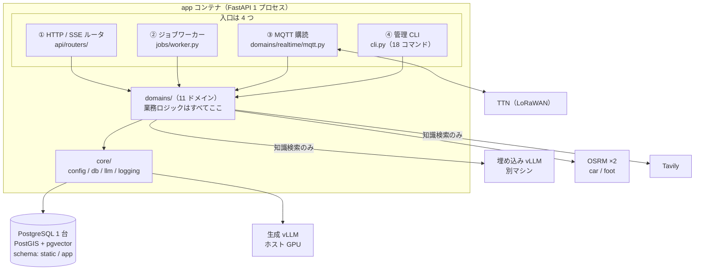
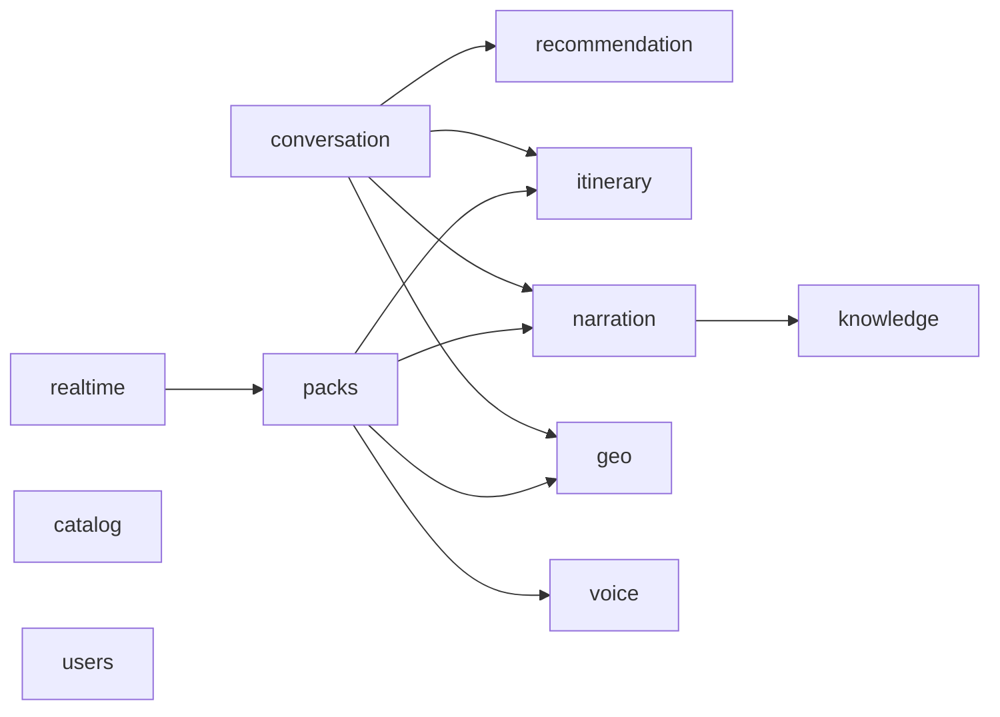
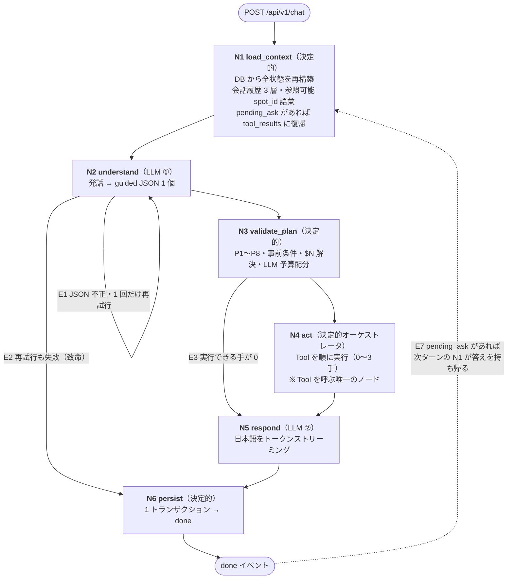
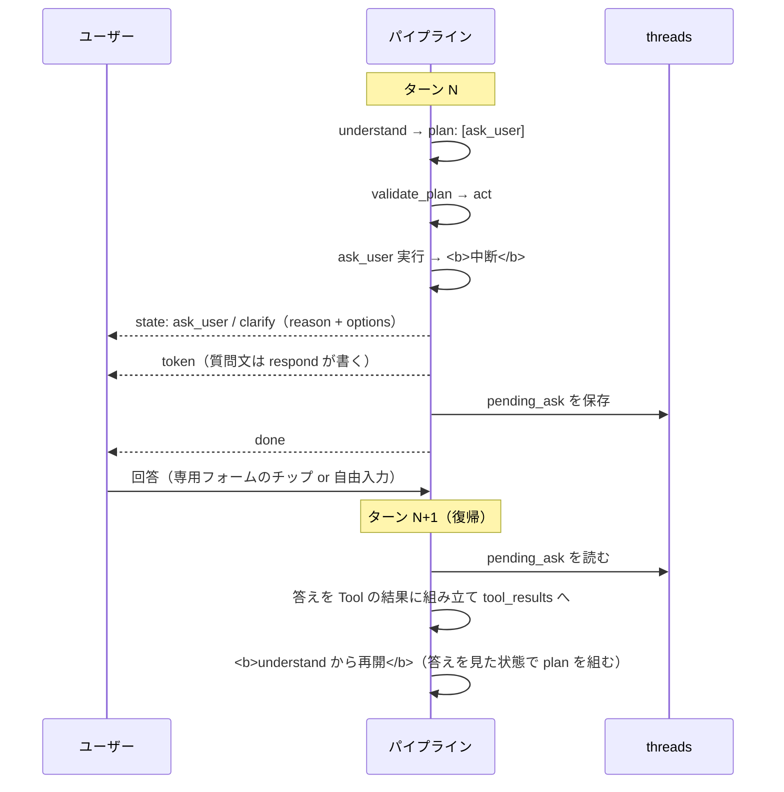
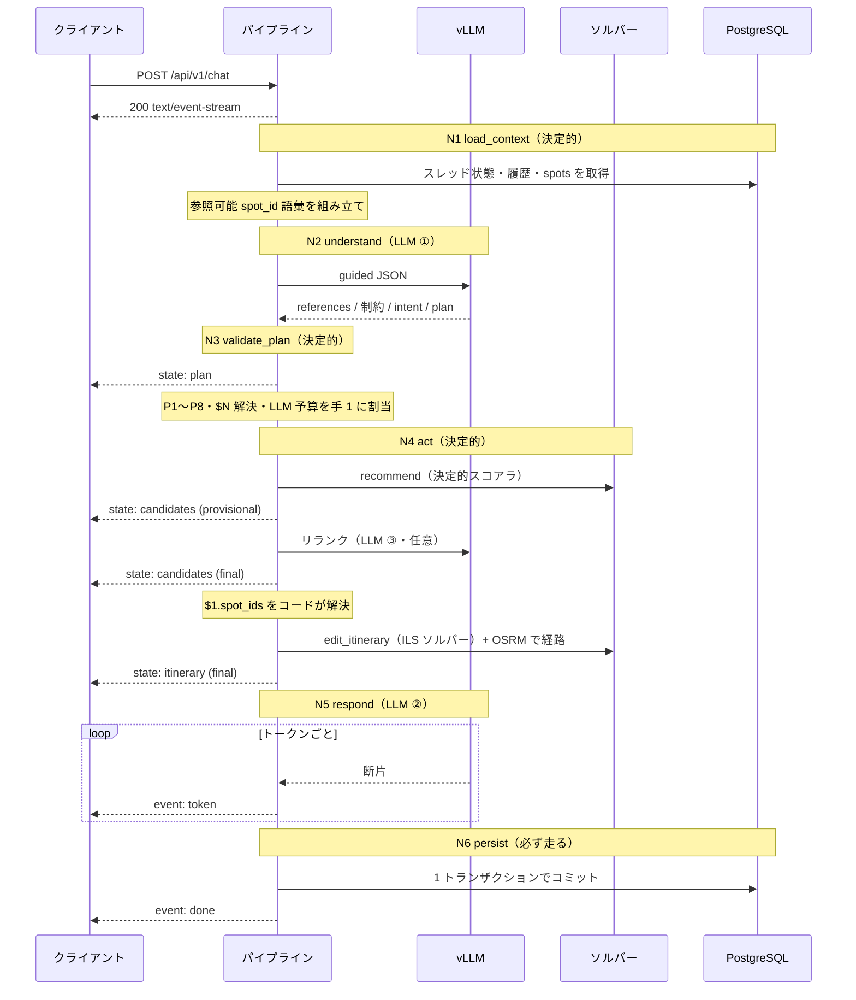
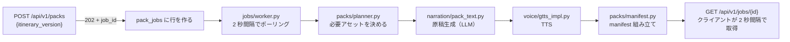

# 実装されたアーキテクチャ — バックエンドと旅程計画エージェント

- 状態: **実装との照合済み (2026-08-03)** / **注記 2026-08-04: §3(対話エージェント)は [ADR-0019](adr/0019-react-main-agent-subagents.md) により ReAct 構成への作り替えが決定した。本書は作り替え前の実装の記録として凍結し、再実装後に書き直す**(新設計は [30_design/agent_react_architecture.md](30_design/agent_react_architecture.md))
- 対象コミット: ブランチ `feat/rebuild-implementation`(`025c5c5` + [ADR-0018](adr/0018-ask-user-resumable-tool.md) 以降の変更)
- 位置づけ: **「実装が実際にどうなっているか」を読んで分かるように書いた文書である。**
  - **決定の正は各設計文書にある** — 全体構成は [20_architecture.md](20_architecture.md)、エージェントは [30_design/agent_planning_phase.md](30_design/agent_planning_phase.md)、API 契約は [40_api/chat_sse.md](40_api/chat_sse.md)、DB は [30_design/data_model.md](30_design/data_model.md)
  - 本書は**それらを実装と突き合わせて確認した結果**であり、決定を新たに行うものではない
- 照合で見つかった**文書と実装の食い違いは §7 にまとめ、`20_architecture.md` 側は修正済み**である

---

## 1. 全体像 — 1 プロセスの中に何があるか

**バックエンドは FastAPI の 1 プロセスである**([ADR-0001](adr/0001-modular-monolith.md) モジュラモノリス)。旧構成の 7 サービスはすべてこの中のパッケージになった。



**入口が 4 つあることが構成の理解の鍵である。**HTTP だけを見ていると、パック生成と LoRa 配信が「いつ動くのか」が分からなくなる。

| # | 入口 | 何をするか | 寿命 |
| --- | --- | --- | --- |
| ① | **HTTP / SSE ルータ** | フロントからの全リクエスト。対話は `POST /api/v1/chat` が `text/event-stream` を直接返す | リクエスト単位 |
| ② | **ジョブワーカー**(`PackJobWorker`) | `pack_jobs` テーブルを **2 秒間隔でポーリング**し、パック生成を実行。**10 分 stale でクラッシュ復帰**する | プロセスと同じ(`lifespan` で起動・停止) |
| ③ | **MQTT 購読**(`RealtimeMQTTService`) | TTN からの uplink 取り込みと、天気/混雑コードの downlink 配信 | 同上 |
| ④ | **管理 CLI**(`python -m app.cli`) | `init-db` / `seed` / `build-geo` / `build-travel-times` / `index-knowledge` / `export-openapi` / `rt-*` / `gc-packs` ほか **18 コマンド** | 都度実行 |

> ②③ は `main.py` の `lifespan` で起動される。**別コンテナを立てない**のは [ADR-0001](adr/0001-modular-monolith.md) の帰結である。

### 1.1 外部依存と、落ちたときの挙動

| 依存 | 用途 | 落ちたら |
| --- | --- | --- |
| **生成 vLLM** | `understand` / `respond` / リランク / 解の選択 / 知識検索の判断 | **対話が止まる**(致命) |
| **PostgreSQL** | 全状態。`static`(マスタ)と `app`(ユーザーデータ)の 2 スキーマ | **致命** |
| **OSRM ×2** | 経路・移動時間 | 旅程の経路が引けない |
| **埋め込み vLLM** | 知識検索の意味検索のみ | **縮退**。字句検索に落ちて対話は続く |
| **Tavily** | 知識検索の Web 補完のみ | **縮退**。Web なしで続く |
| **TTN** | 観光フェーズの LoRa 配信 | 計画フェーズに影響なし |

**埋め込みと Tavily は周辺機能である。**落ちても対話は止まらない(NFR-5)。

---

## 2. レイヤと依存の方向

```
api/routers  →  api/schemas  →  domains  →  core
jobs         →                   domains  →  core
```

**逆流は禁止**である。`domains` は `api` を知らず、`core` は誰も知らない。

### 2.1 ドメイン間の依存(2026-08-03 実測)

**`grep` で実際の import を数えた結果**である。文書の記述と食い違っていた点は §7-2 に記録した。



| ドメイン | 依存先 |
| --- | --- |
| `conversation` | `geo` / `itinerary` / `narration` / `recommendation` |
| `packs` | `geo` / `itinerary` / `narration` / `voice` |
| `narration` | `knowledge` |
| `realtime` | `packs` |
| `catalog` / `users` / `itinerary` / `recommendation` / `geo` / `knowledge` / `voice` | **なし(葉)** |

**この向きが守っている性質**:

- **`recommendation` と `itinerary` は `conversation` を知らない。**エージェントの都合が推薦やソルバーに漏れない([ADR-0008](adr/0008-plan-then-execute.md))。単体でテストでき、CLI(`solve-demo`)からも直接叩ける
- **`conversation` は「道具を呼ぶ側」**に徹する。業務ロジックを持たず、`tool_adapters.py` が既存ドメインを 5 つの Tool 契約に合わせるだけ
- **循環はゼロ**

### 2.2 ドメインの役割

| ドメイン | 行数 | 役割 |
| --- | --- | --- |
| **`conversation`** | 4,929 | **旅程計画エージェント本体。**§3 で詳述 |
| **`itinerary`** | 3,157 | 旅程の構成。**ILS ソルバー**(`solver.py` 1,112 行)・**述語ペナルティ 17 種**(`predicates.py`)・編集操作(`ops.py`)([ADR-0005](adr/0005-itinerary-solver.md)) |
| **`packs`** | 1,604 | パック生成ジョブ。原稿→TTS→manifest の組み立てと進捗管理([ADR-0003](adr/0003-pack-generation-jobs.md)) |
| **`geo`** | 1,395 | OSRM 経路探索・接近点・**移動時間行列**・沿道 POI(PostGIS)・route 永続化 |
| **`recommendation`** | 1,035 | POI 推薦。**決定的スコアラ + LLM リランク**の二段([ADR-0006](adr/0006-recommendation-hybrid.md)) |
| **`realtime`** | 960 | 状態ストア・シミュレータ・LoRa codec・MQTT・配信スケジューラ |
| **`knowledge`** | 690 | 知識ドキュメントの索引化と埋め込み(pgvector)([ADR-0012](adr/0012-knowledge-retrieval-pgvector.md)) |
| **`narration`** | 630 | **知識検索サブエージェント**(`search/`)+ パック原稿生成(`pack_text.py`)([ADR-0011](adr/0011-knowledge-search-subagent.md)) |
| **`users`** | 315 | ユーザー・スレッド管理 |
| **`voice`** | 133 | TTS ポート(gTTS 実装。将来 XTTS に差し替え可) |
| **`catalog`** | 80 | spots(POI 30 + 施設 13 = **43 件**)の読み出し |

### 2.3 API の実際の形

`api/routers/` は **8 本**。`api/schemas/` が外部向け型の**唯一の定義場所**である。

| ルータ | 主なエンドポイント |
| --- | --- |
| `health` | `GET /healthz` |
| `users` | `POST /api/v1/users` / `POST /api/v1/login` / `GET /api/v1/me` / **`GET /api/v1/thread`** |
| `chat` | **`POST /api/v1/chat`(SSE)** |
| `itinerary` | `GET /api/v1/itinerary` / `POST /api/v1/itinerary/undo` ほか |
| `spots` | `GET /api/v1/spots` |
| `routes` | `POST /api/v1/routes` / **`GET /api/v1/routes/{route_id}`** |
| `packs` | `POST /api/v1/packs` / **`GET /api/v1/jobs/{job_id}`** / `GET /api/v1/packs/{pack_id}` |
| `realtime` | `GET|POST /spots/{spot_id}` / `POST /simulator/{action}` |

- **認証は `api/auth.py` の 1 か所。**`Authorization: Bearer` を検証する FastAPI 依存で、全ルータが同じものを使う
- **SSE の組み立ては `api/sse.py`。**イベントのバッファリングと `done` の保証を持つ
- **パック成果物は `app` が `StaticFiles`(`ImmutablePackStaticFiles`)で配信**する。外部 nginx に依存しない
- **`jobs` は独立ルータではなく `packs.py` の中にある**(§7-1)

---

## 3. 旅程計画フェーズの AI エージェント

**`domains/conversation` が「1 ターンの対話」を担当する。**LangGraph は使わず、**型付きのプレーン非同期パイプライン**である([ADR-0004](adr/0004-conversation-pipeline.md))。

### 3.1 いちばん大事な 3 つの性質

| # | 性質 | なぜそうしたか |
| --- | --- | --- |
| **1** | **ノードの順序はコードが固定する。**LLM がグラフの流れを決める余地がない | レイテンシが読める(NFR-3)。何が起きたかを後から追える |
| **2** | **LLM が「次に何をするか」を決めるのは 1 ターンに 1 回だけ**(`understand`)。以降はコードが実行する | **一括プラン方式**([ADR-0008](adr/0008-plan-then-execute.md))。ReAct のような多段自律ループを採らない |
| **3** | **状態は毎ターン DB から再構築する。**プロセス内にターンをまたぐ状態を持たない | [ADR-0004](adr/0004-conversation-pipeline.md)。旧実装の `MemorySaver` によるメモリ無限成長・再起動消失を構造的に解消 |

### 3.2 6 ノードの固定パイプライン



| ノード | 実装 | LLM | 失敗したら |
| --- | --- | --- | --- |
| N1 `load_context` | `context.py` (217) | — | 致命(DB 障害) |
| N2 `understand` | `understand.py` (331) | **1 回** | JSON 不正なら **1 回だけ再試行** → 致命 |
| N3 `validate_plan` | `planner.py` (786) | — | 全手が落ちたら P8(Tool なし)で N5 へ |
| N4 `act` | `executor.py` (353) | (0〜1) | 手を中止し、ここまでの結果は保持 |
| N5 `respond` | `respond.py` (251) | **1 回** | ストリーム済みの分だけ保存 |
| N6 `persist` | `persist.py` (30) | — | ロールバックし error を送出 |

**`N6 persist` には必ず到達する。**致命的失敗の経路(E2)も通る。「ユーザーが見た旅程は保存されている」を不変条件にするためである。

### 3.3 LLM を呼ぶのは何回か

**1 ターンの LLM 呼び出しは 2〜3 回**である。呼び出し箇所はコード上 **4 か所しかない**。

| # | 場所 | 実装 | 回数 |
| --- | --- | --- | --- |
| ① | **`understand`** | `understand.py:87` | **必ず 1 回**(不正時のみ +1) |
| ② | **`respond`** | `respond.py:143,150` | **必ず 1 回**(ストリーミング) |
| ③ | 推薦のリランク | `recommendation/rerank.py:62` | **①②以外で 1 回まで** |
| ④ | 旅程 A/B/C の選択 | `conversation/itinerary_selector.py:75` | 同上(③と排他) |

**③と④を合わせて「plan 全体で 1 回まで」**という制約が **P7** である。どちらに割り当てるかは `validate_plan` が**実行前に**決める(参照されている手を優先)。

> **例外は知識検索が走るターン。**`search_knowledge` は**サブエージェント**なので、自身のコンテキスト予算の中で反復し、呼び出し回数が可変になる([ADR-0011](adr/0011-knowledge-search-subagent.md))。

### 3.4 `understand` — 発話を JSON 1 個に翻訳する

**このノードは何も実行しない。**「何をするか」を書くだけである。詳細解説は [understand_node.md](30_design/understand_node.md)。

出力は **1 個の guided JSON** で、**フィールドの並び順に意味がある**(guided decoding はスキーマ順に生成させるので、並びがそのまま推論順になる)。

```jsonc
{
  // ① まず参照を解く（結論を書く前に）
  "references":         [{"surface": "2番目のやつ", "spot_id": "spot_012"}],

  // ② 選好・制約を 4 経路のどれかに必ず振り分ける（handling 必須）
  "profile_delta":      {"party": "family_kids"},
  "constraints":        [{"pred": "lunch_break", "handling": "dsl", ...}],
  "constraints_remove": [],
  "score_adjustments":  [{"spot_id": "spot_017", "delta": 0.4, "handling": "weight"}],
  "selection_hints":    [{"text": "のんびりした感じで", "handling": "selection"}],
  "unmodeled":          [{"text": "屋台が出てたら寄りたい", "handling": "unmodeled"}],

  // ③ 最後に「何をするか」を決める
  "intent": "edit",
  "plan":   [{"id": 1, "tool": "recommend", "args": {...}}]   // 最大 3 手
}
```

**7 つのフィールドは行き先が違う。**ここが最も誤解されやすい。

| フィールド | 誰が消費するか |
| --- | --- |
| `intent` | **構造化ログのみ**(分岐には使わない) |
| `plan` | `validate_plan` → `act`。**最も影響が大きい** |
| `profile_delta` | `profiles` テーブル(**ユーザー永続**) |
| `constraints` | ソルバーのペナルティ(**旅程の version ごとに永続**) |
| `score_adjustments` | 推薦スコアラの補正 |
| `selection_hints` | 旅程 A/B/C の選択 |
| `unmodeled` | **`respond` が必ず言及**(保存はしない) |
| `references` | **コードが DB と照合してから使う** |

**「反映できなかった」と言えることが設計の要である。**選好・制約は `dsl` / `weight` / `selection` / `unmodeled` の **4 経路のどれかに必ず入り**、`抽出数 == 4 経路の合計` を検査する。これが[ADR-0005](adr/0005-itinerary-solver.md) の「無言破棄の禁止」を成立させる([recommendation_planning.md §4.4](30_design/recommendation_planning.md))。

**guided decoding が保証するのは「形」だけで、「中身」はコードが検証する。**

| | guided decoding | コードの後検証 |
| --- | --- | --- |
| JSON として妥当 / フィールドが揃う / `tool` が既知 | **保証する** | — |
| **`spot_id` が語彙に含まれる** | **保証する**(§3.5) | — |
| **`ask_user` の `options` が 2〜4 個**(2026-08-03 追加) | **保証する**(§3.6.1) | — |
| `spot_id` が**文脈的に**正しい | しない | **DB と `last_candidates` に照合** |
| 述語の引数が実在する | しない | 語彙と照合、なければ `unmodeled` へ |
| `plan` が実行可能 | しない | **`validate_plan` の P1〜P8** |

### 3.5 ハルシネーションを「起きにくく」ではなく「不可能」にする

**`understand` のプロンプトには、コードが検証する語彙を必ず載せる。**これが設計の中心的な考え方である。

| 語彙 | 何のため |
| --- | --- |
| **参照可能な `spot_id` だけの enum** | 43 件全部ではなく、**現在の旅程 + 直近候補 + 履歴で言及 + 発話中の固有名(名寄せ)** に絞る。**文脈上あり得ない POI を構造的に指せなくする** |
| **選好キー 12 語**(`PreferenceKey`) | `profile.interests` のキー |
| **生タグ 80 語**(`static.tag_vocabulary`) | `recommend.filter.tags` と述語の引数 |
| **`recommend.filter.mobility` の 3 値** | `avoid_walk` / `short_walk_ok` / `hike_ok`(**歩行耐性**であって移動手段ではない) |

> **2026-08-03 の教訓**: 生タグ 80 語と `mobility` の enum は、**コードが実在検証するのにプロンプトに載っていなかった。**その結果 LLM は見たことのない語彙を当てにいき、外すと `validate_plan` が**手を丸ごと破棄**して推薦が 0 件になっていた。「滝と湧水が好きです。車で回ります。おすすめを教えて」という平易な発話で再現する([23_ux_issues.md §0.3](23_ux_issues.md))。**検証する語彙は必ず見せる。**

### 3.6 道具は 5 つ

**`act` だけが Tool を呼ぶ。**他のノードから Tool を呼ぶ経路は作らない。

| Tool | 返すもの | 内部で LLM | ターンを |
| --- | --- | --- | --- |
| `recommend` | `spot_ids` + 根拠素材 | **あり**(リランク・任意) | 続ける |
| `plan_itinerary` | `itinerary` ×3 + 譲歩の内訳 | **あり**(解の選択・任意) | 続ける |
| `edit_itinerary` | `itinerary` + `diff` + 譲歩 | 同上 | 続ける |
| `search_knowledge` | `{answer_ja, sources, coverage}` | **サブエージェント**(§3.8) | 続ける |
| **`ask_user`** | **ユーザーの答え** | なし | **中断する**(§3.7) |

- **手の間の受け渡しは `$N` 参照**をコードが解決する(LLM 呼び出しなし)。例: `edit_itinerary(add targets="$1.spot_ids")`
- **推薦と旅程は `provisional` → `final` の 2 段送出。**カードと地図は provisional の時点で描画されるので、リランクや解選択の待ち時間が体感に出にくい([ADR-0006](adr/0006-recommendation-hybrid.md))
- **経路取得までが旅程 Tool の責務。**「旅程はあるが経路がない」中間状態を作らない([ADR-0013](adr/0013-leg-route-door-to-door.md))

#### 3.6.1 `plan[].args` は 1 か所だけ guided decoding で縛る

**原則は「落として検出するより、出せなくする」**である(§3.5 の `spot_id` と同じ)。ただし全 Tool の引数をスキーマ化すると `understand` のスキーマが肥大するので、**実害が出た 1 か所だけを縛る。**

```jsonc
"plan": { "items": { "anyOf": [
  // 枝 1: 通常 4 Tool。args は無制約（従来どおり validate_plan が検証する）
  { "properties": { "tool": {"enum": ["recommend","plan_itinerary","edit_itinerary","search_knowledge"]},
                    "args": {"type":"object","additionalProperties": true} } },
  // 枝 2: ask_user だけ args を厳密に規定
  { "properties": { "tool": {"enum": ["ask_user"]},
                    "args": { "properties": {
                      "kind":    {"enum": ["preference","clarify"]},
                      "reason":  {"type":"string","minLength":1},
                      "options": {"type":"array","minItems":2,"maxItems":4, "items": {...}} } } } }
]}, "maxItems": 3 }
```

**枝 1 の `tool` enum から `ask_user` を除いていることが要点である。**除かないと `{"tool":"ask_user","args":{"options":[]}}` が枝 1 に適合してしまい、`anyOf` は 1 つでも適合すれば通るので**制約が一切効かない。**

> **これは実際に踏んだ**(2026-08-03)。除外前は 3/3 で `options: []` が生成され、G5 が手ごと破棄していた。除外後は 4/4 で選択肢つきの質問が出る。
>
> **xgrammar 0.1.29 で `anyOf` / `enum` / `minLength` / `minItems` / `maxItems` はすべて受理された。**ただし **`uniqueItems` は未実装で 400 になる**ので使わない([90_backlog.md](90_backlog.md))。

### 3.7 `ask_user` — 唯一「ターンをまたぐ」Tool

**2026-08-03 に統合した**([ADR-0018](adr/0018-ask-user-resumable-tool.md))。選好の聞き取りも、発話の聞き返しも、**1 つの Tool の `kind` 引数**で表す。



**押さえるべき点**:

- **「中断」であって「終了」ではない。**`respond` も `persist` も通り、`done` が出る。中断とは**Tool の実行が答え待ちで止まる**ことである
- **保存するのは `pending_ask` だけ。**中断した plan や中間結果は保存しない([ADR-0004](adr/0004-conversation-pipeline.md) を崩さないため)
- **復帰点は常に `understand`。**`ask_user` は **P5 により plan の末尾の 1 手**なので、`act` を途中から再開する必要が構造的に生じない
- **`pending_ask` は 1 ターンで失効する。**古い問いに答えたことにしない
- **答えは `tool_results` としてコンテキストに戻る。**「何を聞いて、何と答えられたか」を見た状態で `understand` が走るので、質問を発した文脈が失われない
- フロントは **`ask_user` 専用の入力フォーム**で受ける([frontend_nav.md §2.3](30_design/frontend_nav.md))

### 3.8 `search_knowledge` だけは道具の顔をしたサブエージェント

他の 4 つは「呼ばれて、決まった処理をして、返す」だけだが、**`search_knowledge` は自分のコンテキストと 5 つの Tool を持ち、自分で反復する独立したエージェント**である([ADR-0011](adr/0011-knowledge-search-subagent.md)、設計は [narration_qa.md](30_design/narration_qa.md))。

| | |
| --- | --- |
| なぜ切り出したか | 見出しの重複により **1 回引いて終わりにできない**。その反復の中間状態は **16K のメインコンテキストに置けない** |
| 内側の Tool | `semantic_search` / `lexical_search` / `get_document` / `web_search`(Tavily) / `answer` |
| 停止条件 | **回数上限ではなくコンテキスト予算**(soft 70% / hard 85%)。固定回数は「難しい質問だけを体系的に失敗させる」ため採らない |
| 返すもの | **検索結果ではなく回答**(`answer_ja` + `sources` + `coverage`) |
| 重要な制約 | **`answer_ja` は `respond` の素材であって、そのまま画面に流さない。**流すと話者が 2 人になる |

### 3.9 ガードレール — コードが強制する規則

**LLM の裁量に任せない部分がここに集まっている。**

**P1〜P8(plan の検証。`planner.py`)**

| # | 規則 |
| --- | --- |
| P1 | 手は最大 3 つ |
| P2 | 道具名は既知の enum のみ |
| P3 | 引数がスキーマに適合する |
| P4 | **`$N` の健全性**(前方参照・解決可能・型整合・戻り値の種類・循環なし) |
| **P5** | **`ask_user` は末尾のみ・plan 全体で 1 手まで** |
| P6 | 同一ターンで旅程を書き換える手は 1 つまで |
| P7 | **追加 LLM 呼び出しは plan 全体で 1 回まで**(`search_knowledge` は対象外) |
| P8 | 全手が破棄されたら `respond` だけ実行 |

**G1〜G9(`ask_user` の抑制。`guards.py`)** — 2026-08-03 に 1 組へ統合

| # | 規則 | 効く `kind` |
| --- | --- | --- |
| G1 | 1 ターン 1 問 | 両方 |
| G2 | 同じスロットを 2 回聞かない | preference |
| G3 | 連続する `ask_user` は 2 ターンまで | 両方 |
| G4 | **推薦要求に質問だけを返さない** | preference |
| G5 | 選択肢は 2〜4 個 + 自由入力も受ける | 両方 |
| G6 | 選択肢を具体値に解決できないなら聞かない | 主に clarify |
| G7 | 同じ曖昧さを 2 回聞かない | clarify |
| G9 | **妥当な plan を出せるなら聞かない** | 両方 |

**破棄した手は握り潰さない。**`rejected_steps` として `respond` と構造化ログの両方に渡る(FR-3.3)。

### 3.10 状態はどこにあるか

**2 種類あり、混同しやすい。**

| | **`TurnState`** | **スレッド状態** |
| --- | --- | --- |
| 寿命 | **1 ターンの中だけ** | **ターンをまたぐ** |
| 置き場所 | メモリ(`state.py`) | **DB のみ**(`app.threads` ほか) |
| 役割 | ノード間の受け渡し | 次のターンの入力 |

**スレッド状態の主なもの**:

| 状態 | 寿命 | 用途 |
| --- | --- | --- |
| `profile` | **ユーザー永続** | 選好 |
| `itinerary`(version 付き) | ユーザー永続 | 旅程・undo |
| `presented_spot_ids` | スレッド | 反復推薦の防止 |
| `last_candidates` | スレッド | **コードが `spot_id` を検証する語彙** |
| `asked_slots` / `ask_streak` | スレッド | G2 / G3 |
| **`pending_ask`** | **1 ターン限り** | 中断した問い(§3.7) |
| `resolved_ambiguities` | スレッド | G7 |
| `constraints` | **旅程の version ごと** | ソルバーのペナルティ。undo で制約も戻る |

> **会話履歴と `last_candidates` は別物として両方持つ。**履歴は **LLM が読む文脈**、`last_candidates` は**コードが検証に使う語彙**である。片方を消すともう片方の役割が穴になる。

### 3.11 SSE — UI の状態はすべて `state` 由来

```
event: state   { kind: plan | candidates | itinerary | ask_user | clarify | profile | searching }
event: token   { text }          # 応答本文の断片
event: error   { stage, code, degraded, message }
event: done    { turn_id, message_id, degraded }   # 必ず 1 回、最後に
```

- **`token` の本文をパースして状態を作ってはいけない。**`token` は表示のためだけにある
- **`done` は必ず送る。**エラーで終わる場合も `error` の後に送る(クライアントが「終わったのか切れたのか」を判別できないとスピナーが回り続ける)
- `error` の `degraded: true` は「動いたが品質が落ちた」、`false` は「失敗した」
- 契約の正は [chat_sse.md](40_api/chat_sse.md)

---

## 4. 1 ターンを通しで追う

「滝を 2 つ入れて、宿の近くで昼を取れるようにして」を例に、**どこで LLM が動き、どこでコードが動くか**を追う。



**LLM は 3 回**(understand / リランク / respond)。**Tool を 2 つ使っても増えない**のが一括プラン方式を採った理由である。

---

## 5. 対話以外の主要な流れ

### 5.1 パック生成(観光フェーズへの橋渡し)



- **非同期ジョブにしたのは、同期 HTTP で 50 分待たせていた旧構成の反省**である([ADR-0003](adr/0003-pack-generation-jobs.md))
- **`partial` を「完了」と表示しない。**作れなかった案内は件数と内訳を返す(FR-3.3)
- ワーカーは**プロセス内 asyncio**。別コンテナを立てない

### 5.2 リアルタイム(観光フェーズ)

- **観光フェーズの端末への下りは LoRaWAN ダウンリンクのみ。**案内は端末内の資材 + 受信した状況コードで成立する
- `realtime/codec.py` が**1 通でパック全スポット分の天気/混雑コードを詰める**([ADR-0016](adr/0016-lora-terminal-driven-batch.md))
- 実機が無い間は `realtime/simulator.py` がダミー値を供給する(`rt-*` CLI で操作)

---

## 6. この設計が意図的に「持たない」もの

**何を作らなかったかを明示しておく。**後から「なぜ無いのか」を探さずに済むように。

| 持たないもの | 理由 |
| --- | --- |
| **ターン内の自律ループ(ReAct)** | レイテンシが読めない。31B の多段自律判断が失敗域([ADR-0008](adr/0008-plan-then-execute.md)) |
| **プロセス内のターンまたぎ状態** | 旧 `MemorySaver` のメモリ無限成長・再起動消失([ADR-0004](adr/0004-conversation-pipeline.md)) |
| **長期記憶(過去セッション横断のベクトル検索)** | スコープ外。文脈は直近履歴 + 永続プロファイルで作る |
| **サブエージェント(知識検索を除く)** | 逐次計画タスクで単一エージェント比 −70.0% の実証([ADR-0009](adr/0009-no-subagents.md)) |
| **手の並列実行** | 最大 3 手で独立な組み合わせが乏しい。executor の失敗処理が複雑になる代償が大きい |
| **計測テーブル** | NFR-7 を削除。**残るのは構造化ログ(stdout)だけ** |
| **SSE の再接続による途中再開** | 1 ターンは非冪等で DB に書く。途中再開は「状態は毎ターン DB から再構築」と衝突する |
| **検証失敗時の自動再計画** | 対話システムでは**次の発話が事実上の再計画**になる |

---

## 7. 文書と実装の食い違い(2026-08-03 の照合結果)

**照合して見つかったものをすべて記録する。`20_architecture.md` 側は修正済みである。**

### 7-1. `20_architecture.md §3` のディレクトリ構成(**修正済み**)

| # | 文書の記述 | 実装 |
| --- | --- | --- |
| 1 | `domains/` は **9 個** | **11 個**。**`catalog/` と `knowledge/` が抜けていた** |
| 2 | ルータは `chat / users / routes / packs / jobs / realtime / health` | **`itinerary` と `spots` が抜けていた。**逆に **`jobs` は独立ルータではなく `packs.py` の中**にある |
| 3 | `api/` の記載が `schemas/` と `routers/` のみ | **`auth.py`(認証依存)と `sse.py`(SSE 組み立て)が抜けていた** |
| 4 | `db_models/` の記載なし | 存在する |
| 5 | `cli.py` は「init-db / seed / validate-knowledge」 | **実際は 18 コマンド** |
| 6 | `data/processed/`(persona_model.pkl 等) | **存在しない**(学習成果物を持たないため)。代わりに **`data/scenarios/`** がある |

### 7-2. `20_architecture.md §3` の依存ルール(**修正済み**)

**`grep` で実測した結果、3 か所が事実と違っていた。**

| # | 文書の記述 | 実測 |
| --- | --- | --- |
| 1 | `conversation → realtime` | **そのような import は無い** |
| 2 | `itinerary → geo` | **`itinerary` は他ドメインに依存しない(葉)** |
| 3 | `conversation` の依存先に `geo` の記載なし | **`conversation → geo` は存在する**(`tool_adapters.py` が `OSRMClient` / `GeoRepository` / `RouteService` を使う) |
| 4 | `packs → geo/narration/voice` | **`itinerary` も加わる** |
| 5 | `narration → knowledge` / `realtime → packs` の記載なし | どちらも存在する |

> **依存の向き自体は健全**である(循環ゼロ、`recommendation`/`itinerary` は `conversation` を知らない)。記述が実装に追いついていなかっただけである。

### 7-3. `20_architecture.md §4` のパイプライン記述(**未修正・軽微**)

同節は対話ターンを **5 ステップ**(`load_context` / `understand` / `act` / `respond` / `persist`)として書き、**`validate_plan` を `act` に含めている。**実装と [agent_planning_phase.md §15.4](30_design/agent_planning_phase.md) は **6 ノード**で、`validate_plan` は独立したノードである(`planner.py` 786 行)。

**同節は「全体構成の中での位置づけを示すだけ」と明記しており、詳細は `agent_planning_phase.md` が正**と断っているので、**誤りではなく要約である。**ただし読者が 5 ノードだと誤解しうるため、**本書 §3.2 を参照先として示すのが望ましい。**

### 7-4. 設計文書側の不整合(**すでに修正済み**)

照合の過程で、**実装ではなく設計文書どうしが矛盾していた**箇所が 2 件見つかった。いずれも修正済みである。

| # | 内容 | 対応 |
| --- | --- | --- |
| 1 | **`ask_user` が 2 系統**あり、どちらも返り値を持たなかった | [ADR-0018](adr/0018-ask-user-resumable-tool.md) で 1 つの Tool に統合(ADR-0010 を廃止) |
| 2 | **`agent_planning_phase.md §7` が「生タグ 80 語は載せない」**と決めていた一方、同文書は LLM に生タグの使用を許し、`validate_plan` は実在検証で**手を丸ごと破棄**していた | §7 を改訂し、**語彙を載せる**ことにした。[23_ux_issues.md §0.3](23_ux_issues.md) |

---

## 8. 読む順序(この文書からの案内)

| 知りたいこと | 読む文書 |
| --- | --- |
| **なぜこの構成なのか** | [20_architecture.md](20_architecture.md) → [adr/](adr/) |
| **エージェントの決定の詳細** | [30_design/agent_planning_phase.md](30_design/agent_planning_phase.md)(**§18.2 が型と enum の正**) |
| **`understand` を深く** | [30_design/understand_node.md](30_design/understand_node.md) |
| **推薦とソルバーの方式** | [30_design/recommendation_planning.md](30_design/recommendation_planning.md)(**§4.4 が述語 17 種の正**) |
| **知識検索サブエージェント** | [30_design/narration_qa.md](30_design/narration_qa.md) |
| **API の形** | [40_api/chat_sse.md](40_api/chat_sse.md) |
| **テーブル定義** | [30_design/data_model.md](30_design/data_model.md) |
| **いま何が壊れているか** | [23_ux_issues.md](23_ux_issues.md) |
| **残タスク** | [90_backlog.md](90_backlog.md) |
