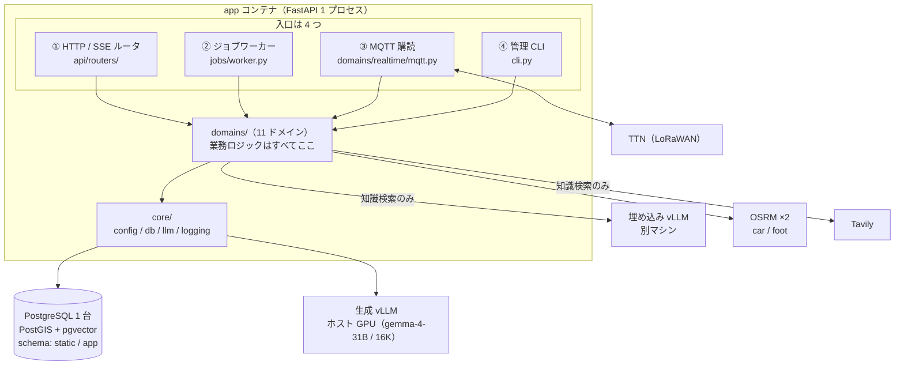
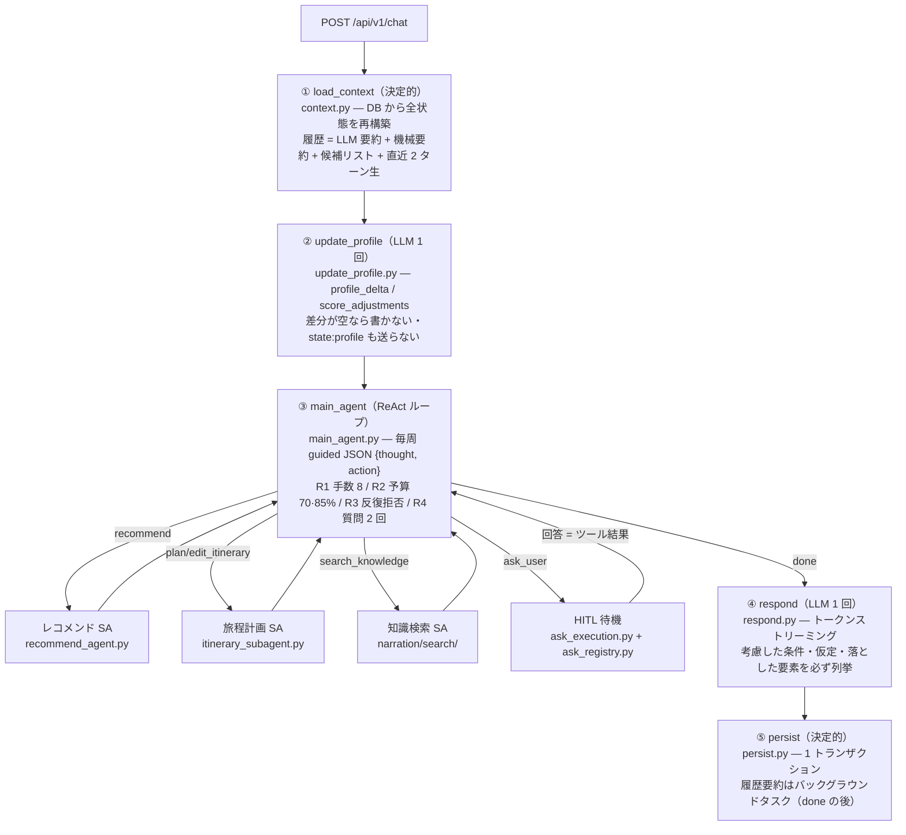
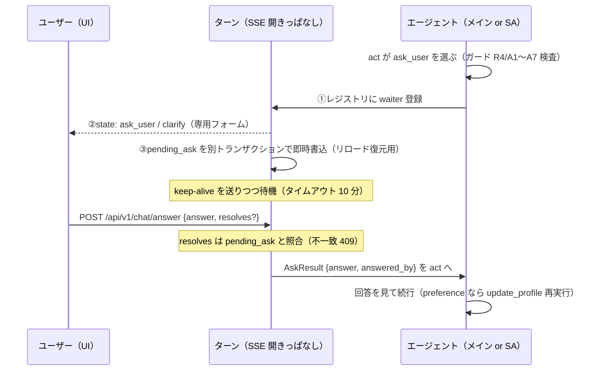

# 実装されたアーキテクチャ — バックエンドと旅程計画エージェント(ReAct 構成)

- 状態: **実装との照合済み (2026-08-04)**
- 対象コミット: ブランチ `feat/rebuild-implementation`(`d66d1e6` 時点。ReAct 再構築 = `0fc5fe7`〜`d66d1e6` の 8 コミットを含む)
- 位置づけ: **「実装が実際にどうなっているか」を読んで分かるように書いた文書である。**
  - **決定の正は各設計文書にある** — 全体構成は [20_architecture.md](20_architecture.md)、エージェントは [30_design/agent_react_architecture.md](30_design/agent_react_architecture.md)([ADR-0019](adr/0019-react-main-agent-subagents.md))、API 契約は [40_api/chat_sse.md](40_api/chat_sse.md)、DB は [30_design/data_model.md](30_design/data_model.md)
  - 本書は**それらを実装と突き合わせて確認した結果**であり、決定を新たに行うものではない
- 照合で見つかった**文書と実装の食い違いは §7** にまとめた(いずれも軽微)
- **現時点で残っている問題の一覧は [25_known_issues.md](25_known_issues.md) が正**(本書は構造の解説に徹する)
- 旧版(一括プラン方式時代の as-built)は git 履歴(`40b59c0` 以前)にある

---

## 1. 全体像 — 1 プロセスの中に何があるか

**バックエンドは FastAPI の 1 プロセスである**([ADR-0001](adr/0001-modular-monolith.md) モジュラモノリス)。この構造は ReAct 再構築でも変わっていない。



| # | 入口 | 何をするか | 寿命 |
| --- | --- | --- | --- |
| ① | **HTTP / SSE ルータ** | フロントからの全リクエスト。対話は `POST /api/v1/chat` が `text/event-stream` を直接返す。**`POST /api/v1/chat/answer`(2026-08-04 新設)が質問への回答を実行中ターンへ届ける** | リクエスト単位 |
| ② | **ジョブワーカー** | `pack_jobs` を 2 秒間隔でポーリングしパック生成 | プロセスと同じ |
| ③ | **MQTT 購読** | TTN の uplink 取り込みと downlink 配信 | 同上 |
| ④ | **管理 CLI** | `init-db` / `seed` / `build-geo` / `index-knowledge` ほか | 都度実行 |

**外部依存と落ちたときの挙動**(変更なし): 生成 vLLM と PostgreSQL は致命。埋め込み vLLM・Tavily は知識検索のみの周辺機能で、落ちても縮退して対話は続く(NFR-5)。alembic は `0004_react_history_profile` が head。

---

## 2. レイヤと依存の方向(2026-08-04 実測)

```
api/routers  →  api/schemas  →  domains  →  core
jobs         →                   domains  →  core
```

`grep` による import 実測。**ReAct 再構築の前後で向きは変わっていない。循環はゼロ。**

| ドメイン | 行数 | 依存先 | 役割 |
| --- | --- | --- | --- |
| **`conversation`** | **7,359** | `geo` / `itinerary` / `narration` / `recommendation` | **ReAct エージェント本体**(§3) |
| `itinerary` | 3,183 | なし(葉) | ILS ソルバー・述語 17 種・編集 op。**2026-08-04: `Plan/EditItineraryResult` に `constraints` を追加**(後方互換な追加のみ) |
| `narration` | 2,654 | `knowledge` | 知識検索サブエージェント + パック原稿。**2026-08-04: decide の Tool に `ask_user` を追加**(ask コールバックは conversation 側から port 注入 — 逆依存なし) |
| `packs` | 1,604 | `geo` / `itinerary` / `narration` / `voice` | パック生成ジョブ(**変更なし**) |
| `geo` | 1,395 | なし(葉) | OSRM・移動時間行列・沿道 POI(**変更なし**) |
| `recommendation` | 1,035 | なし(葉) | 決定的スコアラ + LLM リランクの二段(**内部は変更なし**。呼び出し方が SA 経由に変わっただけ) |
| `realtime` | 960 | `packs` | LoRa・シミュレータ(**変更なし**) |
| `knowledge` | 690 | なし(葉) | 知識索引(**変更なし**) |
| `users` | 327 | なし(葉) | ユーザー・スレッド。`GET /thread` に pending 生存確認が加わった |
| `voice` / `catalog` | 133 / 80 | なし(葉) | 変更なし |

- **`recommendation` と `itinerary` は `conversation` を知らない**(不変)。エージェントの都合がソルバー・推薦に漏れない
- **`narration` → `conversation` の逆依存も無い。**知識検索がユーザーに質問できるのは、conversation 側のアダプタが**ask コールバック(port)を引数で渡す**からで、port が None なら従来どおり動く

---

## 3. 旅程計画フェーズの AI エージェント(ReAct 構成)

**`domains/conversation` が「1 ターンの対話」を担当する。**LangGraph は使わない型付きプレーン非同期処理([ADR-0004](adr/0004-conversation-pipeline.md))のまま、内側が一括プラン方式から **ReAct メインエージェント + サブエージェント**([ADR-0019](adr/0019-react-main-agent-subagents.md))に置き換わった。

### 3.1 いちばん大事な 3 つの性質

| # | 性質 | 実装 |
| --- | --- | --- |
| **1** | **LLM が決めるのは「次の一手」だけ。**ループ・待機・永続化・停止条件はすべてコードが制御する | `main_agent.py` のループ、`guards.py` の R/A 系、`ask_registry.py` の待機 |
| **2** | **状態は毎ターン DB から再構築する。**プロセス内に**ターンをまたぐ**状態を持たない(`ask_user` の回答待ちは**ターン内**のプロセス状態であり、原則に反しない) | `context.py` / `ask_registry.py` |
| **3** | **メインエージェントは `spot_id` を見ない・書かない。**POI は常にスポット名で扱い、名前 → id の解決(名寄せ)と実在照合はコードが行う | `name_resolution.py`(スコア付きマッチ + 序数解決)/ `itinerary_digest.py` |

### 3.2 1 ターン = 5 ステップ(③だけが LLM の自律反復)



- **Understand ノードは存在しない。**発話の解釈は②(プロフィールに写る部分)と③(何をするかの判断。毎周・文脈込み)に分かれる
- **⑤には必ず到達する。**ユーザーが `state` イベントで見たものは保存されている
- 履歴要約(`history_summary.py`)は done 送出・ActiveTurn 解放の**後**に独立セッションで走り、失敗しても対話は止まらない(押し出されたターンは機械要約として履歴に残り続ける)

### 3.3 LLM 呼び出しは 1 ターン可変

呼び出し回数固定(旧 2〜3 回)を捨てて「結果を見て次を決める」を買った(ADR-0019。レイテンシ増は受容済み)。実測(2026-08-04 の通し確認、gemma-4-31B):

| ターン | 呼び出し | 実測 |
| --- | --- | --- |
| 単純な推薦(質問つき) | ② 1 + メイン 2 周 + SA 判定 1(+ 回答後再判定 1)+ リランク 1 + ④ 1 | `main_agent_ms` 69 秒(HITL 待ち含む) |
| 旅程作成 | ② 1 + メイン 2 周 + 解選択 1 + ④ 1 | 約 23 秒 |
| 編集 / undo | 同上(undo はソルバー・解選択なし) | 15〜40 秒 |
| QA | ② 1 + メイン 2 周 + 知識検索 SA(可変)+ ④ 1 | 約 21 秒 |

構造化ログ `conversation_turn`(stdout)に `update_profile_ms` / `main_agent_ms` / `main_agent_turns` / `executed_tools` / `degraded` がターン 1 行で出る。

### 3.4 メインループの中身(`main_agent.py`)

- **毎周のコンテキスト**(順序固定): ①システムプロンプト + Tool 定義 + スキーマ(byte 同一 = prefix caching)②プロフィール ③現在の旅程ダイジェスト + 有効な制約(id つき)④会話履歴 ⑤このターンの軌跡 ⑥最新のユーザー発話(末尾)
- **毎周の出力**は guided decoding の `{"thought", "action": {"tool", "args"}}`。`args` は **Tool ごとの anyOf 分岐で厳密スキーマ・分岐の tool enum は排他**(`prompts.py` の `main_agent_guided_schema`)。JSON 不正時は 1 回だけ再試行
- 停止条件は §3.2 図の R1〜R4。R1/R2 到達で「まとめに入って」+ 縮小スキーマ(`done` のみ)、R4 到達で `ask_user` がスキーマから消える
- Tool の失敗は `ToolError` として軌跡に差し戻され、**メインが次の一手で対処する**(recoverable: false のみ打ち切り)

### 3.5 Tool は 6 つ(メインエージェントから見た契約)

| Tool | 引数(名前空間) | 実体 | ターン内 LLM |
| --- | --- | --- | --- |
| `recommend` | `instruction`(自然言語) | レコメンド SA(§3.6)。k=5 はコード固定 | 判定 1(+再判定 1)+ リランク 1 |
| `plan_itinerary` | `days` / `must_visit` / `constraints{add,remove}` / `notes` | 旅程 SA(§3.7) | 解選択 1 |
| `edit_itinerary` | `ops` / `constraints` / `notes` | 同上(revert 特例あり) | 同上(revert 時 0) |
| `search_knowledge` | `request` / `spot_name?` | 知識検索 SA(§3.8) | 可変(自身の予算) |
| `ask_user` | `kind` / `slot?`・`surface?` / `reason` / `options`(2〜4) | HITL 待機(§3.9) | 0(待つだけ) |
| `done` | なし | ④ respond へ遷移 | — |

### 3.6 レコメンド SA(`recommend_agent.py`)

`instruction` + プロフィール + **語彙(生タグ 80 語・mobility enum — この SA のプロンプトにだけ載る)** → guided 判定 1 回で `done{filter, assumptions}` または `ask_user`。質問した場合は回答で `update_profile` を回し、**質問文 + 回答を含めて再判定**(質問は 1 回まで = A7)。`done` 後は**既存の推薦処理そのまま**(ハードフィルタ → スコアリング → provisional → リランク → final)。filter の不正要素は**要素単位で落として報告**し、全滅しても filter なしで実行する(0 件破棄が起きない)。

### 3.7 旅程計画 SA(`itinerary_subagent.py` — 完全ワークフロー)

| フロー | 実装 |
| --- | --- |
| 1 受付 | メインの名前空間引数をそのまま受ける |
| 2 構築 | **名寄せ**(優先順: 現在の旅程 > last_candidates > DB 完全一致 > かな折りたたみ + 別名。スコア同点は曖昧として候補つきで落とす。序数「2 番目」は rank から解決)/ `ops.after` も解決 / 既存制約(version 継承)と add/remove のマージ |
| 3 実行 | revert 特例(ソルバー不実行・混在 op は落として報告)→ ops 適用 → ILS×3 → 解選択 LLM(ヒント = `notes`)→ 譲歩 → OSRM leg → `state:itinerary` provisional/final |
| 4 整形 | `itinerary_digest.py` が日別の時刻・スポット名・移動・譲歩・diff・落とした/曖昧だった要素を日本語ダイジェスト化(spot_id なし)。**コンテキスト③と同じ整形器** |

Service が確定した制約(再採番・must_visit / op 由来の暗黙制約・revert 先)は `Result.constraints` で返り、同一ターン内の次の edit も正しい制約 id を見る。1 ターン複数回の書き換え可(version は書き換えごとに +1)。

### 3.8 知識検索 SA(`narration/search/` — 変更は 2 点だけ)

現行設計([narration_qa.md](30_design/narration_qa.md))のまま、(1) decide の Tool に `ask_user` が加わった(conversation から ask port が注入されたときだけ現れる。soft 予算以降は選ばせない)、(2) 実況が `state:step {tool:"search_knowledge", status:"progress"}` に統合された。**ask 待機時間は SA のウォールクロック予算から除外**される(待機中に外側タイムアウトで死なない)。

### 3.9 `ask_user` — Human in the Loop(`ask_execution.py` / `ask_registry.py`)



- **ターンは中断しない。**回答は待っている呼び出し元(コルーチン)にそのまま返る。①→②→③の順序が競合窓を塞ぐ(waiter 登録前に回答が来ることがない)
- レジストリのキーは `user_id`(1 ユーザー 1 スレッドの不変条件により設計の「スレッド id」と等価)
- タイムアウト時は `answered_by:"timeout"`: user 行を書かず、`resolved_ambiguities` にも登録せず、「未回答・仮定して進めよ」が observation になる
- 回答は `messages` に user 行(`meta.answer_to` で質問とペア)として残り、履歴の生層に Q&A が読める(`group_turns` は turn_id ベース)
- `GET /thread` の `pending` は**生きた待機があるときだけ**返る(死んだ pending は掃除)

### 3.10 ガードレール(コードが強制。`guards.py` ほか)

| 系 | 規則 | 実装 |
| --- | --- | --- |
| R1〜R4 | 手数 8(実行手のみ数える)/ 予算 70·85% / 同一手反復拒否 / 質問 2 回・超過でスキーマから除外 | `main_agent.py` |
| A1〜A7 | 同一スロット・同一曖昧さの再質問禁止 / 連続質問ターン 2 まで / options 2〜4(guided + 検査)/ 具体値に解決できない質問は落とす / **A6: clarify は surface が一意に解決できるなら聞かない・preference は既知スロットを聞かない**(コード判定)/ 推薦 SA は質問 1 回まで | `guards.py` の `evaluate_ask_user` |
| C 系 | クローズドワールド(名寄せ照合・respond の未提示 POI 検査 — 軌跡テキストに出た名前は許可)/ Web を spot 供給源にしない / 地理計算はコード / 部分不正は要素単位で落として必ず報告 / ToolError は結果で差し戻す | `name_resolution.py` / `respond.py` / 各 SA |

### 3.11 状態はどこにあるか

| | **`TurnState`** | **スレッド状態(`app.threads` ほか)** |
| --- | --- | --- |
| 寿命 | 1 ターンの中だけ(HITL 待機を含む) | ターンをまたぐ。**DB のみ** |

スレッド状態の実列(models.py 照合済み): `presented_spot_ids` / `last_candidates` / `asked_slots` / `ask_streak` / `pending_ask`(表示中の質問のみ)/ `resolved_ambiguities` / `pending_constraints`(旅程なし edit 失敗時の退避)/ **`history_summary`** / **`summarized_until_message_id`**(migration 0004)。`pending_turn` という列は**存在しない**(HITL 化で不要)。

### 3.12 SSE(api/schemas/chat.py 照合済み)

`state` の kind は **`step` / `candidates` / `itinerary` / `ask_user` / `clarify` / `profile`** の 6 つ(`plan` と `searching` は存在しない)。`token` / `error`(stage は新語彙)/ `done`(必達)。質問はターン途中に出て、同じストリームが回答後の続きを流す。契約の正は [chat_sse.md](40_api/chat_sse.md)。

---

## 4. 1 ターンを通しで追う(2026-08-04 の実機ターンそのまま)

新規ユーザーの「おすすめのスポットを教えてください」(プロフィール空):

1. ①②: 履歴 0、プロフィール差分なし
2. ③ 1 周目: `recommend{instruction:"..."}` → **レコメンド SA が「プロフィールが薄すぎる」と判定し `ask_user`** → `state:ask_user`(選択肢 4 個)→ **フォーム表示・ストリームは開いたまま待機**
3. ユーザーがチップ「自然や絶景を楽しみたい」→ `POST /chat/answer` → 回答が SA に返る → `update_profile` 再実行(interests に反映)→ SA 再判定 → `done{filter}` → 既存推薦 → provisional → リランク → final(候補 5 件)
4. ③ 2 周目: 結果ダイジェストを見て `done`
5. ④ respond: 候補 5 件 + **「考慮した条件・仮定」を列挙**(歩行耐性不明のため幅広く 等)をストリーミング
6. ⑤ persist(1 トランザクション)→ `done` イベント → 履歴要約はバックグラウンド

`conversation_turn` ログ実測: `main_agent_turns: 2`、`executed_tools: ["recommend"]`、`update_profile_ms: 2260`。

---

## 5. 対話以外の主要な流れ(変更なし)

パック生成(②ワーカー、[ADR-0003](adr/0003-pack-generation-jobs.md))とリアルタイム/LoRa(③、[ADR-0016](adr/0016-lora-terminal-driven-batch.md))は **ReAct 再構築で一切変更していない**。詳細は旧版 as-built(git 履歴)と各設計文書([packs_pipeline.md](30_design/packs_pipeline.md) / [realtime_lora.md](30_design/realtime_lora.md))を参照。

---

## 6. この設計が意図的に「持たない」もの

| 持たないもの | 理由 |
| --- | --- |
| **一括プラン(`$N` ステップ参照・plan 検証 P1〜P8)** | ADR-0019 で廃止。前の手の結果は軌跡として LLM が直接読む |
| **Understand ノード(発話の一括 JSON 翻訳)** | 同上。②と③に分解された |
| **ターンをまたぐプロセス内状態** | ADR-0004。HITL 待機はターン内 |
| **ターン中断・復帰機構(`pending_turn`)** | HITL 化で不要になった(回答は待っている呼び出し元に返る) |
| **長期記憶(セッション横断ベクトル検索)** | スコープ外。文脈は「LLM 要約 + 直近 2 ターン生」+ 永続プロフィール |
| **計測テーブル** | NFR-7 削除。構造化ログ(stdout)のみ |
| **SSE の再接続による途中再開** | 切れたら `GET /thread` で取り直す(質問待ちだけは待機が続く) |
| **手の並列実行** | 逐次で十分。失敗処理の複雑さを買わない |

> 旧版の「ターン内の自律ループ(ReAct)を持たない」は**逆転した**ことに注意。ADR-0008 は廃止済み。

---

## 7. 文書と実装の食い違い(2026-08-04 の照合結果)

いずれも軽微で、実害があるものはない。設計文書側への footnote 追記は任意。

| # | 内容 | 評価 |
| --- | --- | --- |
| 1 | **`update_profile` は guided decoding 失敗時に非 guided テキスト指示へフォールバックする**(設計 §2 は guided のみを想定)。原因は vLLM/xgrammar の既知不具合(**配列要素内の number フィールド直後に空白トークンを無限出力**。実機再現済み) | 実装が正。設計へ footnote 推奨。関連の監視項目は [25_known_issues.md](25_known_issues.md) |
| 2 | ask レジストリのキーが `user_id`(設計 §7 は「スレッド id」) | 1 ユーザー 1 スレッドの UNIQUE 制約により等価。許容 |
| 3 | レコメンド SA の質問後は「回答つき再判定 1 回」で、汎用の act 反復ループではない | 設計 §4 の図(質問 1 回まで)の最小実装。許容 |
| 4 | `messages.meta` に `presented` と並んで旧互換フィールド(`candidate_spot_ids` 等)が残る | 契約([data_model.md §4.4](30_design/data_model.md))は `presented` が正。互換値は同期して書かれる。許容 |
| 5 | `pending_constraints` への保存経路は「旅程なしで `edit_itinerary` が失敗したときの退避」のみ | ReAct 化で制約は常に Tool 引数として来るため、これが到達可能な唯一の経路。設計 §5 の「一時保持」の実装形として許容 |

---

## 8. 読む順序(この文書からの案内)

| 知りたいこと | 読む文書 |
| --- | --- |
| **なぜこの構成なのか** | [20_architecture.md](20_architecture.md) → [adr/](adr/)(特に [ADR-0019](adr/0019-react-main-agent-subagents.md)) |
| **エージェントの設計の正** | [30_design/agent_react_architecture.md](30_design/agent_react_architecture.md)(**§14 が型と enum の正**) |
| **推薦とソルバーの方式** | [30_design/recommendation_planning.md](30_design/recommendation_planning.md)(**§4.4 が述語 17 種の正**) |
| **知識検索サブエージェント** | [30_design/narration_qa.md](30_design/narration_qa.md) |
| **API の形** | [40_api/chat_sse.md](40_api/chat_sse.md) |
| **テーブル定義** | [30_design/data_model.md](30_design/data_model.md) |
| **いま何が残っているか** | **[25_known_issues.md](25_known_issues.md)** |
| **残タスク・引き継ぎ** | [90_backlog.md](90_backlog.md) |
