# 旅程計画フェーズ — AI エージェントの設計

- 状態: **Part I(§1〜13)= 承認 + 2026-07-31 改訂 / Part II(§14〜24)= 決定稿(§23 で 17 論点が決着)**
- 日付: 2026-07-31(改訂 2026-07-31。改訂内容と理由は **§24**)
- 前提文書: [00_project.md](../00_project.md)(2 フェーズの定義) / [10_requirements.md](../10_requirements.md)(FR-1〜FR-3) / [20_architecture.md](../20_architecture.md) §3〜§4
- 前提となる決定: [ADR-0004](../adr/0004-conversation-pipeline.md)(パイプライン) / [ADR-0005](../adr/0005-itinerary-solver.md)(ソルバー) / [ADR-0006](../adr/0006-recommendation-hybrid.md)(推薦) / [ADR-0007](../adr/0007-preference-elicitation.md)(選好の引き出し) / [ADR-0008](../adr/0008-plan-then-execute.md)(制御構造)
- 方式の根拠: [30_design/recommendation_planning.md](recommendation_planning.md)(調査と方式比較)

> **この文書の位置づけ**
> [recommendation_planning.md](recommendation_planning.md) が「**推薦と旅程プランニングを何で解くか**」を決めたのに対し、本文書は「**それらを対話の中でどう動かすか**」を定める。つまりエージェント本体の設計であり、実装の直接の入力になる。
> 対象は**旅程計画フェーズのみ**。観光フェーズ(オフライン案内)は別文書で扱う(§11 に接続点だけ書く)。
>
> **2 部構成である。**
> **Part I(§1〜13)= 方式と決定**。なぜこの制御構造・この道具立てなのかの記録。承認済みで、動かさない。
> **Part II(§14〜23)= アーキテクチャ定義(実装粒度)**。Part I を**図と契約**に落としたもの。「これを読めば実装できる」粒度を目指す。[20_architecture.md](../20_architecture.md) がシステム全体の構造を定めるのに対し、本 Part は**その中の対話エージェント 1 個の内部構造**を定める。

---

## 0. この文書の範囲 — 2 つのフェーズの境界

[00_project.md](../00_project.md) が定める 2 フェーズは、**アーキテクチャとして別物**である。同じ「AI」でも動き方が違う。

| | **計画フェーズ(本文書)** | **観光フェーズ(別文書)** |
| --- | --- | --- |
| いつ | 出発前 | 現地 |
| ネットワーク | インターネットあり | なし(LoRaWAN ダウンリンクのみ) |
| 駆動するもの | **ユーザーの発話** | **現在地(と受信したリアルタイム値)** |
| LLM | **対話のたびに呼ぶ** | **呼ばない**(計画フェーズで事前生成済み) |
| 出力 | プロファイル・旅程・パック生成の指示 | 音声案内の再生 |
| 主な設計課題 | 意図の理解・制約の抽出・解の構成・説明 | 狭帯域配送・事前生成の網羅性・オフライン動作 |

**つまり「エージェント」と呼べるのは計画フェーズだけ**である。観光フェーズは事前生成済み資材を位置で引くだけの決定的な仕組みにする(FR-4.1〜4.4)。この非対称性は意図的で、オフラインで LLM を動かせない制約から必然的に導かれる。

境界にある唯一の接続点は「**確定した旅程 → パック生成ジョブ**」で、§11 に書く。

---

## 1. エージェントの制御構造 — 一括プラン方式(Plan-then-Execute)

### 1.1 決定と、比較した 3 案

**決定(2026-07-31、ユーザー判断): 一括プラン方式を採る。**`understand` が「使う道具の列」を 1 回の JSON 出力で決め、コードがそれを順に実行する。詳細な理由は [ADR-0008](../adr/0008-plan-then-execute.md)。

| 案 | 構造 | 1 ターンの LLM 呼び出し | 複合要求 | 評価 |
| --- | --- | --- | --- | --- |
| A. 固定パイプライン | 1 ターン 1 道具 | 2〜3 回(固定) | **2 ターンに分かれる** | 最も単純だが、「滝を 2 つ入れて」のような**推薦と旅程編集をまたぐ要求が 1 ターンで通らない** |
| **B. 一括プラン【決定】** | `understand` が道具の列を出し、コードが順に実行 | **2〜3 回(固定)** | **1 ターンで通る** | 呼び出し数を増やさずに複合要求を捌ける。代償は「道具の結果を見て次を決められない」こと(§1.2 で補う) |
| C. 有界 ReAct ループ | `act` が最大 N 周、毎周 LLM が次の道具を判断 | 3〜6 回(可変) | 結果を見ながら詰められる | 最も柔軟だが**レイテンシが読めず**(NFR-3)、31B の多段自律判断は TravelPlanner 系で 0.6% 台の失敗域(§2.2)。**失敗したときに何が起きたのかも追いにくい**(軌跡が可変長になる) |

**案 B の弱点を正しく認識しておく。**道具の結果を見て次の道具を選べないので、「推薦結果を眺めてから、良さそうなものを旅程に入れる」という**適応的な段取りができない**。これを埋めるのが次の §1.2 である。

### 1.2 プランの表現 — ステップ参照 `$N` がこの方式の必須要素

道具の結果を**値として**見られなくても、**参照として**繋ぐことはできる。「手 1 が返したものを手 2 に渡す」と書けさえすれば、複合要求のほとんどは通る。

```jsonc
// 「明日は滝を2つ入れて、宿の近くで昼を取れるようにして」
"plan": [
  {"id": 1, "tool": "recommend",
   "args": {"filter": {"tags": ["滝"], "day": 2}, "k": 2}},
  {"id": 2, "tool": "edit_itinerary",
   "args": {"ops": [{"op": "add", "targets": "$1.spot_ids", "day": 2}],
            "constraints": [{"pred": "lunch_break", "args": {"from": "11:30", "to": "13:30", "min": 60}},
                            {"pred": "max_leg_min", "args": {"n": 20}, "scope": "lunch"}]}}
]
```

`$1.spot_ids` は**コードが解決する**(LLM 呼び出しは発生しない)。参照の語彙は述語と同様に**閉じた集合**にし、それ以外の記法は受け付けない:

| 参照 | 意味 | 出せる道具 |
| --- | --- | --- |
| `$N.spot_ids` | 手 N が返した spot_id の列(推薦なら最終候補、旅程なら訪問順) | `recommend` / `plan_itinerary` / `edit_itinerary` |
| `$N.spot_ids[:k]` | 上位 k 件 | 同上 |
| `$N.itinerary` | 手 N が作った旅程 | `plan_itinerary` / `edit_itinerary` |

**制約**: 前方参照のみ(`$N` は自分より前の手だけを指せる)。解決できない参照はその手をスキップし、**何ができなかったかを `respond` に渡す**(無言で落とさない。FR-3.3)。

### 1.3 プランの検証 — コードで縛る

LLM が出した `plan` は、実行前に**コードで検証する**。ここは LLM の裁量に任せない。

| # | 規則 | 違反時の扱い |
| --- | --- | --- |
| P1 | **手は最大 3 つ** | 4 手目以降を破棄 |
| P2 | 道具名は既知の enum のみ | 不明な道具の手を破棄 |
| P3 | 引数がスキーマに適合する | 不適合の手を破棄 |
| P4 | **`$N` の健全性**(2026-07-31 拡張): ①前方参照のみ ②解決可能 ③**参照先の型が引数の型と合う** ④**参照先の Tool がその値を返す種類か** ⑤**循環がない** | その手をスキップし、**どの検査で落ちたかを `rejected_steps` に残す** |
| P5 | **`ask_user` は末尾にしか置けない** | 末尾以外の `ask_user` を破棄(質問したらターンは終わる) |
| P6 | **同一ターンで旅程を書き換える手は 1 つまで** | 2 つ目以降を破棄(§4.2 のバージョン管理を単純に保つ) |
| P7 | **専門呼び出し(Tool 内側の単発 LLM)は plan 全体で 1 回まで。**ただし **`search_knowledge` はこの予算の外**(2026-08-01 改訂) | §1.5 の優先順位で 1 手だけに割り当てる。`search_knowledge` は**自身のコンテキスト予算で回る**(§2.1) |
| P8 | 全手が破棄されたら「道具なし」として `respond` だけ実行 | ユーザーには「理解できなかった」旨を返す |

破棄した手は**握り潰さず**構造化ログに出し、`respond` にも渡す(§9)。

### 1.4 実行と、途中で失敗したとき

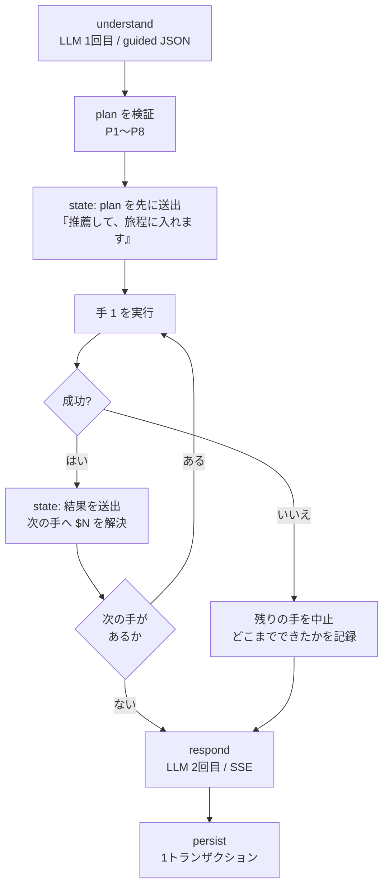

- **`state: plan` を最初に送出する**のは一括プラン方式ならではの利点である。「今から何をするか」を LLM の応答生成を待たずに提示できる(ChatGPT の検索表示に相当)。UX 上の価値が大きく、実装コストはほぼゼロ
- **手 k が失敗したら残りは実行しない。**部分的に矛盾した状態を作らないため。ただし**そこまでの結果は捨てない**(推薦だけ成功して旅程編集が失敗したら、推薦は見せる)
- **DB への書き込みは全手の完了後に 1 トランザクション**(`persist`)。途中失敗なら旅程は前の version のまま残る。`state` イベントで provisional を送っていても DB は書かない

### 1.5 追加 LLM 呼び出しの割り当て

`recommend`(リランク)と `plan_itinerary`/`edit_itinerary`(3 解からの選択)は、どちらも LLM 補助を使いうる。**1 ターンの追加呼び出しは 1 回まで**(P7)なので割り当て規則を決めておく:

1. **他の手から `$N` で参照されている手を優先する** — その出力が下流に影響するため
2. 参照されている手が複数あれば、**最も早い手**
3. 参照が一つもなければ、**最後の手**

LLM 補助を得られなかった手は**決定的な結果をそのまま使う**(推薦ならスコア順 = ADR-0006 の案 B に縮退、旅程なら目的関数最良の解 A)。品質は落ちるが動作は壊れない。

---

## 2. 道具カタログ

`act` が実行できる道具は 5 つ。**これ以外を追加するときは本文書を先に更新する**(Docs 駆動開発)。

| 道具 | 引数 | 返すもの | LLM 補助 | 主な担当 |
| --- | --- | --- | --- | --- |
| `recommend` | `filter`(tags / mobility / weather_fit / area / `day?`)、`k`、`exclude` | `spot_ids` + 根拠素材 | あり(リランク) | FR-1.2 |
| `plan_itinerary` | `days`(日付・開始終了時刻・起終点)、`constraints`、`must_visit` | `itinerary` × 3 + 譲歩の内訳 | あり(解の選択) | FR-2.1 |
| `edit_itinerary` | `ops`(add/remove/move/replace/lock/set_stay/set_time/**revert**)、`constraints` | `itinerary` + `diff` + 譲歩の内訳 | あり(解の選択) | FR-2.1 |
| **`search_knowledge`** | `request`(自然文)、`spot_id?` | **`{answer_ja, sources, coverage}`** | **サブエージェント**(§2.1) | FR-3 |
| `ask_user` | `slot`、`options` | — (ターンを終える) | なし | FR-1.1 |

**設計の要点**

- **経路の取得は独立した道具にしない。**`plan_itinerary` / `edit_itinerary` が旅程を確定させた後、OSRM で leg 経路を引くところまでを 1 つの道具の責務にする。「旅程はあるが経路がない」中間状態を作らないため(FR-2.2)
- **知識検索は道具に含める**(決定 2026-07-31、§13 論点 3)。含めなければ「鶴間池ってどんな所?」が `respond` の無根拠生成になり、クローズドワールド原則([ADR-0006](../adr/0006-recommendation-hybrid.md))が対話の半分で破れる
- **`search_knowledge` は道具の顔をしたサブエージェントである**(§2.1)。**道具の数は 5 のまま**で、旧 `answer_qa` を置き換えた
- **返ってくる `answer_ja` は `respond` のための素材であり、そのまま画面に流さない。**ユーザーに見える日本語を書くのは `respond` だけである(§8)
- **`revert` は他の op と混ぜない特殊な op**(§4.2)。ソルバーを回さず version を戻すだけなので、`revert` を含む `ops` に他の op があればそちらを破棄する
- **`recommend` は旅程に依存しない**(決定 2026-07-31、§13 論点 5 / §4.3)。`filter.day` は旅程が存在するときだけ有効な任意引数で、旅程がなければ無視する
- **`ask_user` だけは副作用が「ターンを終わらせる」**という特殊な道具である。したがって P5(末尾のみ)と ADR-0007 の G1〜G5 が二重にかかる
- **この `ask_user` は「選好の聞き取り」専用である**(「どなたと行かれますか」)。**発話が理解できないときの「聞き返し」は、Tool ではなく `understand` ノード自身が行う**(2026-07-31 追加。§3.4 / [ADR-0010](../adr/0010-understand-bounded-agent.md))。両者は動機も、かかるガードレールも、置かれる層も違う
- 道具はいずれも**クローズドワールド**を守る: 入出力の POI はすべて `spot_id`。表示名・座標・写真は DB から引く(ADR-0006)

### 2.1 `search_knowledge` だけは道具の顔をしたサブエージェントである(2026-08-01 追加)

他の 4 つは「呼ばれて、決まった処理をして、返す」だけだが、**`search_knowledge` は自分のコンテキストと 4 つの Tool を持ち、自分で反復する独立したエージェント**である([ADR-0011](../adr/0011-knowledge-search-subagent.md)、設計は [narration_qa.md](narration_qa.md))。

| | |
| --- | --- |
| なぜ切り出したか | 見出しの重複(`## 概要` が **115 ファイル**、`## アクセス` が **58 ファイル**)により **1 回引いて終わりにできない**。その反復の中間状態は **16K のメインに置けない** |
| 内側の Tool | `semantic_search` / `lexical_search` / `get_document` / `web_search`(Tavily)/ `answer` |
| 停止条件 | **回数ではなくコンテキスト予算**(soft 70% / hard 85%)+ 同一アクション反復ガード + 再帰上限 |
| メインとの境界 | **メインの状態を書き換えない・メインのコンテキストを共有しない・第二の話者にならない** |

**これが [ADR-0009](../adr/0009-no-subagents.md)(サブエージェントを持たない)の唯一の例外である。**同 ADR が自ら定めた「覆す条件」3 つすべてに該当したため、適用範囲を「メインの 1 ターンの逐次連鎖を分割しない」に限定した。**`understand` → `act` → `respond` を分けない方針は変わらない。**

**代償: QA ターンの LLM 呼び出しは 2〜3 回固定ではなくなる**(§9・[narration_qa.md §9](narration_qa.md))。QA でないターンは影響を受けない。

**Web 検索の結果は `spot_id` の供給源にしない。**Tavily はクローズドワールドの外にあり、ADR-0006 の実在性保証が効かない。Web 由来の情報は**説明にのみ使い、旅程・推薦の対象として提案しない**([narration_qa.md §6.1](narration_qa.md))。

---

## 3. `understand` の出力スキーマ

> 📘 **`understand` が何をしているのかの詳細解説は [understand_node.md](understand_node.md) にある。**7 つのフィールドがそれぞれどこに届くのか、`handling` の 4 経路をどう判定するのか、発話 1 つが実際にどう JSON になるのか(4 例)を、本節より丁寧に説明している。**このスキーマが分かりにくいと感じたらそちらを先に読む。**
> 🖥 **図解ページ: https://claude.ai/code/artifact/6e1206ab-9219-47ee-89fd-6256096f8118**(発話 ⇄ JSON の対応を光らせて見られる)

エージェントの挙動はほぼこのスキーマで決まる。**guided decoding で構造を強制し、値も可能な限り enum で縛る。**

### 3.1 スキーマ(全体)

> **2026-07-31 改訂。**フィールドの並び順を入れ替え、`selection_hints` と `constraints_remove` を追加した。理由は §3.1.1(順序)と §24(改訂履歴)。

```jsonc
{
  // ══ ① 根拠を先に書かせる（順序に意味がある。§3.1.1）════════════════
  "references": [                          // 照応の解決（§3.3）。plan より前に確定させる
    {"surface": "2番目のやつ", "spot_id": "spot_012"}
  ],

  "profile_delta": {                       // 差分のみ。null 可。ユーザーに永続する
    "interests": {"water": 0.6},           // キーは PreferenceKey（12 語）の enum。生タグではない
    "party": "family_kids",
    "mobility": "short_walk_ok",
    "pace": "relaxed",
    "avoid": ["長時間歩行"],
    "notes": "午後は温泉に入りたい"          // 1〜2 文
  },

  "constraints": [                         // 経路 1。述語 DSL は recommendation_planning.md §4.4
    {"pred": "not_consecutive", "args": {"target": "神社"},
     "weight": 0.6, "source": "似た所が続くと子どもが飽きる", "handling": "dsl"}
  ],
  "constraints_remove": ["c_014"],         // 既存の制約の取り消し（§4.4）。有効な制約 id の enum

  "score_adjustments": [                   // 経路 2。候補集合の中だけに効く。|delta| <= 0.5
    {"spot_id": "spot_017", "delta": 0.4, "why": "静かで人が少ない", "handling": "weight"}
  ],

  "selection_hints": [                     // 経路 3。解 A/B/C の選択に回す自由文
    {"text": "もうちょっとのんびりした感じで", "handling": "selection"}
  ],

  "unmodeled": [                           // 経路 4。どれにも写らなかったもの
    {"text": "屋台が出てたら寄りたい", "handling": "unmodeled"}
  ],

  // ══ ② 抽出できたものを踏まえ、進むか聞き返すかを決める（§3.4）═════
  "action": "done | ask_user",             // understand が選べる 2 つの Tool

  // ── action == "done" のとき（通常）──────────────────────────────
  "intent": "recommend | plan | edit | qa | profile_only | chitchat | unclear",
  "plan": [                                // 最大 3 手。空でもよい
    {"id": 1, "tool": "recommend", "args": { /* Tool ごとのスキーマ = §18 */ }}
  ],

  // ── action == "ask_user" のとき（聞き返し。plan は出さない）───────
  "clarify": {
    "surface": "2番目のやつ",               // 曖昧だった表層形
    "why": "候補が鶴間池と元滝の 2 つある",   // respond が日本語に言い換える
    "options": [                            // 2〜4 個。具体値に解決できること（G6）
      {"label": "鶴間池",     "resolves_to": {"kind": "spot_id", "value": "spot_012"}},
      {"label": "元滝伏流水", "resolves_to": {"kind": "spot_id", "value": "spot_007"}}
    ]
  }
}
```

**`action` が抽出フィールドより後ろにあるのは意図的である。**「進めるか聞き返すか」は**抽出をやってみて初めて分かる**ので、先に判断させない(§3.1.1 と同じ理由)。

**`handling` は全要望に必須**(enum: `dsl` / `weight` / `selection` / `unmodeled`)。これが [ADR-0005](../adr/0005-itinerary-solver.md) の「無言破棄の禁止」不変条件を成立させる鍵で、**LLM に「これは表現できません」と自己申告させる**ためのフィールドである。
**4 つの `handling` にはそれぞれ対応する配列があり、`抽出数 == constraints + score_adjustments + selection_hints + unmodeled` で数え上げられる。**(改訂前は `selection` に対応する配列がなく、この不変条件が機械的に検査できなかった。)

### 3.1.1 順序に意味がある — 結論を先に書かせない

**guided decoding はスキーマに書いた順にトークンを生成させる。**したがってフィールドの並びは、そのまま**モデルが何を先に決めるか**になる。

> *"Let Me Speak Freely?"* (EMNLP 2024 Industry Track) §4.1 の実測。**一次資料で確認済み**(2026-07-31):
> "Upon inspection, we found that **100% of GPT 3.5 Turbo JSON-mode responses placed the 'answer' key before the 'reason' key, resulting in zero-shot direct answering instead of zero-shot chain-of-thought reasoning.**"
> GSM8K / gpt-4o-mini は自然言語 94.57 に対し JSON-Schema 91.71。GPT-3.5-Turbo では Text 75.99 → JSON+schema 49.25。

**改訂前のスキーマは `intent` と `plan`(= 結論)が先頭にあり、まさにこの並びだった。**特に問題だったのが `references` の位置で、**「2 番目のやつを外して」の `plan` を、どれが「2 番目のやつ」かを決める前に書かせていた。**

改訂後の順序はそのまま推論の順序になっている:

| 順 | フィールド | このステップでモデルがやること |
| --- | --- | --- |
| 1 | `references` | **まず「どれのことか」を確定する** |
| 2 | `profile_delta` | 発話から読み取れた人物像 |
| 3 | `constraints` / `constraints_remove` | 述語に写せる要望を書き出す |
| 4 | `score_adjustments` | POI 単位の good/bad |
| 5 | `selection_hints` | 全体の「感じ」 |
| 6 | `unmodeled` | **3〜5 に入らなかった残りを掃き出す** |
| 7 | **`action`** | **ここまで書いてみて、進めるか聞き返すかを決める**(§3.4) |
| 8 | `intent` | ここまでを踏まえた分類 |
| 9 | `plan` / `clarify` | **確定した参照と制約の上で Tool の列を決める**、または聞き返す |

**自由記述の「考える欄」は置かない。**抽出フィールド自体が構造化された思考の場になっており、自由文を足すと出力トークンとレイテンシが増えるうえ、どこにも接地しないフィールドが 1 つ増える。**計測して不足なら足す**(§24)。

### 3.1.2 フィールドには説明文を付ける

スキーマを**人間向けのデータ契約のまま LLM に渡さない。**各フィールドに用途・境界・相互排他を書き、必要なら正例と境界例を添える。

> PARSE (EMNLP 2025 Industry Track)。**一次資料で確認済み**: 説明の追加・構造の平坦化・フィールド間関係の明示により、**SWDE で最大 64.7% の抽出精度改善**、**初回リトライで抽出エラー 92% 減**。

ただし**同論文の reflection(自己反省ループ)は採らない** — 1 ターンの LLM 呼び出し予算を壊すため(§17)。採るのは**スキーマ側の作り込みだけ**である。

### 3.2 enum で強制するもの

| 項目 | 語彙 | 効果 |
| --- | --- | --- |
| `tool` | 5 種類(§2) | 存在しない道具を呼べない |
| `pred` | **17 種類**(`PredEnum`。§18.2 が正) | 未知の述語が生まれない |
| `interests` のキー | **`PreferenceKey` 12 語**([data_model.md §2](data_model.md)) | 自由語の増殖を防ぐ。**生タグ 80 語ではない** — 80 語中 48 語が 1 地点にしか付かず選好として機能しないため |
| `party` / `mobility` / `pace` | 定義済みの値 | プロファイルの型が壊れない |
| **`spot_id`** | **その文脈で参照可能な id のみ**(§3.3) | **POI のハルシネーションが構造的に不可能になる** |

`spot_id` の enum は 43 件全部ではなく、**「現在の旅程 + 直近の候補 + 直近の会話で言及された POI」に絞る**。文脈上あり得ない POI を指せなくなり、同時にプロンプトも短くなる。

> **制約付きデコーディングと精度の関係(2026-07-31 改訂)。**この点は文献が割れているので、正確に書く。
> - **JSONSchemaBench (arXiv:2501.10868)** は、制約付きデコーディングが精度を落とさないと報告している(よく言われる「10〜15% 劣化」の否定)
> - 一方 ***"Let Me Speak Freely?"* (EMNLP 2024 Industry Track)** は逆に "a significant decline in LLMs' reasoning abilities under format restrictions" を報告している。**一次資料で確認済み**
>
> **両者は矛盾していないと読む。**後者が突き止めた劣化の原因は「制約を課したこと」ではなく「**課したスキーマの形**」(キーの順序が生成順を強制し、推論の余地を奪うこと)である。
> **したがって対処は「guided decoding をやめる」ではなく「スキーマを直す」**であり、それが §3.1.1 と §3.1.2 の改訂にあたる。
> なお vLLM はどちらの評価対象にも含まれていないため、**実装後に guided decoding の有無で `understand` の抽出品質を一度測る**(§9・§24)。詳細は [agent_patterns_survey.md §2.2](agent_patterns_survey.md)。

### 3.3 照応の解決 — 「2 番目のやつ」を誰が spot_id にするか

対話では POI が名前で呼ばれない。「**2 番目のやつ**」「**さっきの滝**」「**それ**」が普通に来る。これを解けないと道具が呼べない。

**方式: `understand` が解決し、コードが検証する。**

1. プロンプトに `last_candidates`(直近に提示した候補、序数つき)と現在の旅程を載せる
2. LLM は `references` に「表層 → spot_id」の対応を出す
3. **コードが spot_id を DB と `last_candidates` に照合**する。照合できなければ、その参照を使う手を破棄し「どれのことか分かりませんでした」を `respond` に渡す

序数・別名の辞書(`鶴間池` / `つるまいけ` / `2 番目`)は**推薦ドメインの名寄せ辞書**として持ち、LLM の解決を補助する。LLM だけに任せない理由は、序数の取り違えが**静かに間違った POI を旅程に入れる**という気づきにくい失敗を生むためである。

**それでも解けないときは聞き返す**(§3.4)。

## 3.4 `understand` は 2 つの Tool を持つ有界エージェント(2026-07-31 追加)

**決定([ADR-0010](../adr/0010-understand-bounded-agent.md)): `understand` に `ask_user` と `done` の 2 つだけを与え、どちらかを選ばせる。**

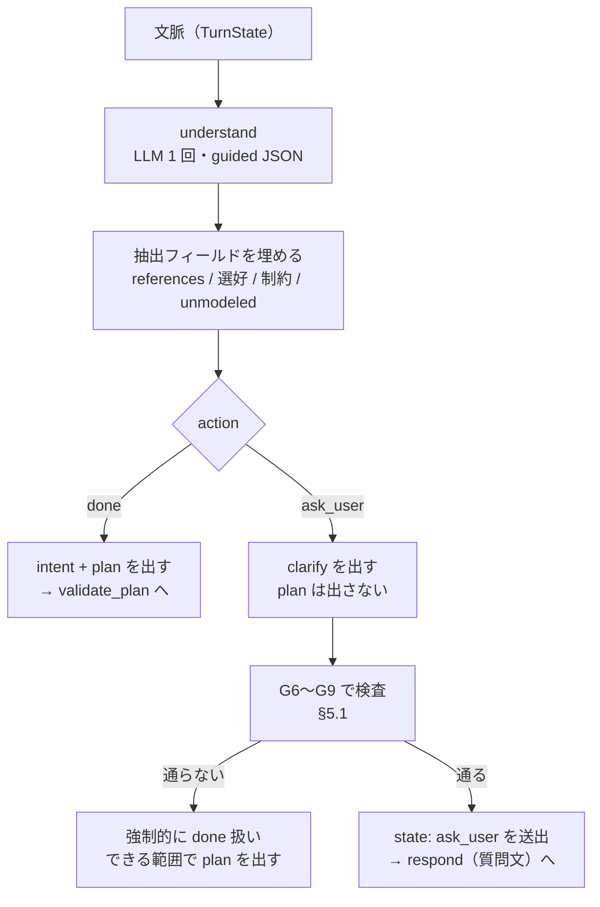

### 3.4.1 なぜ Tool ではなくノードの分岐にするのか

聞き返しを `act` の Tool として plan に置く案(`[recommend, ask_user(clarify)]`)も検討したが、**採らなかった。**

**「2 番目のやつ」が解決できないとき、そもそも妥当な plan を書けない。**参照が解けていないまま前段の手を組み立てさせ、最後に「ところで、どれのことですか」と付ける形は筋が通らない。**理解できていないなら、理解できていないと言うのが先**である。

| | Tool として plan に置く案 | **ノードの分岐【採用】** |
| --- | --- | --- |
| 参照が解けないときの plan | **解けていない参照を含む plan を書かせる**(矛盾) | **plan を出さない** |
| P5・P6 との関係 | 聞き返しも「手」なので検証規則が増える | **plan がないので無関係** |
| `ask_user` Tool の意味 | 2 つの用途が混ざる | **「選好の聞き取り」1 つに保てる** |
| 判断する場所 | `act`(何が曖昧だったかを知らない) | **`understand`(自分が解けなかったことを知っている)** |

### 3.4.2 ADR-0008(ReAct を採らない)と矛盾しないか

しない。**[ADR-0008](../adr/0008-plan-then-execute.md) が退けたのは「毎周 LLM が次の手を判断する多段の自律ループ」**であり、その理由はレイテンシが読めないこと(NFR-3)と、31B の多段自律判断が失敗域にあることだった。本件はどちらにも当たらない。

| ADR-0008 が懸念したこと | この設計では |
| --- | --- |
| 1 ターンの LLM 呼び出しが 3〜6 回と可変 | **どちらの分岐でも `understand` の呼び出しは 1 回。**総数も 2〜3 回のまま変わらない |
| レイテンシが読めない | **ターン内にループがない。**次の観測(ユーザーの答え)はターンを終えないと得られないので、**1 ターン 1 ステップで構造的に確定する** |
| 多段の自律判断が壊れる | **判断は 2 択 1 回だけ。**多段推論を要求していない |
| 何が起きたのか追いにくくなる | `action` は 2 値なので、**ログの 1 列を見れば「聞き返したターンか」が分かる**(§10)。ReAct の可変長軌跡より追いやすい |

つまりこれは**「有界」の中でも最も浅い形**で、ループに見えるのはターンをまたいだときだけである。§15.6 のグラフでも巡回は増えない — **増えるのは `understand` から `respond` への近道の辺 1 本だけ**である。

### 3.4.3 得られるもの

- **静かな取り違えが減る。**§3.3 が警戒していた「序数の取り違えで違う POI が旅程に入る」に、**破棄して謝る以外の対処**ができる
- **ユーザーの手間が減る。**「どれのことか分かりませんでした」と言われて全文を打ち直すより、チップを 1 タップするほうが速い(JR 東日本が実証を経てチャットから選択式に転換した知見と同じ。[recommendation_planning.md §2.3(c)](recommendation_planning.md))
- **LLM 呼び出しは増えない。**聞き返すターンは `understand` 1 + `respond` 1 の**計 2 回**で、これは `ask_user` ターンの現行コストと同じ

**代償は「聞きすぎ」のリスク**である。これは §5.1 の G6〜G9 で縛る。加えて **§7 の会話履歴が第一防衛線として効く** — 曖昧さの多くは直近 3 ターンの生テキストがあれば消えるので、`ask_user` まで到達しない。

---

## 4. 状態の設計

### 4.1 何をどこに置くか

| 状態 | 置き場所 | 寿命 | 用途 |
| --- | --- | --- | --- |
| `profile` | `profiles` テーブル(JSONB) | **ユーザー永続** | FR-1.1 / FR-2.3 |
| `itinerary` | `itineraries`(version 付き) | **ユーザー永続** | FR-2.3・undo |
| `messages` | `messages` | スレッド永続 | 文脈構築 |
| `presented_spot_ids` | スレッド行 | スレッド | 反復推薦の防止(ADR-0006) |
| `last_candidates` | スレッド行 | スレッド | **照応解決(§3.3)** |
| `asked_slots` | スレッド行 | スレッド | ガードレール G2 |
| `ask_streak` | スレッド行 | スレッド | ガードレール G3 |
| **`pending_clarification`** | スレッド行 | **1 ターン限り**(必ずクリア) | **聞き返しの答えを元の要求に結びつける**(§5.1) |
| **`resolved_ambiguities`** | スレッド行 | スレッド | ガードレール G7(同じ曖昧さを 2 回聞かない) |
| **`clarify_streak`** | スレッド行 | スレッド | ガードレール G8 |
| **`constraints`** | **`itineraries` 行**(version ごと) | **旅程の寿命**(§4.4) | ソルバーのペナルティ |
| `unmodeled`(反映できなかった要望) | **どこにも保存しない** | そのターン限り | `respond` が「これは反映できませんでした」と伝えるためだけに使う([recommendation_planning.md §4.4](recommendation_planning.md) 経路 4) |

> **2026-08-01 改訂**: NFR-7(計測可能性)の削除に伴い、`turn_metrics` テーブルと `unmodeled_log` テーブルを廃止した。**研究データを DB に貯めて取り出す仕組みは作らない。**縮退・破棄・失敗は構造化ログ(stdout)に出す([20_architecture.md §12](../20_architecture.md))。

**プロセス内キャッシュは持たない。**状態は毎ターン DB から再構築する([ADR-0004](../adr/0004-conversation-pipeline.md))。旧実装の `MemorySaver` が起こした「session_id が全ユーザー共通になる」型の事故を構造的に不可能にするため。

**スキーマは [data_model.md](data_model.md) で確定した(2026-08-01)。**上表の「スレッド行」は `app.threads` の列である。**1 ユーザー = 1 スレッド = 1 旅程**に決めたので(同 §4.2・§4.5)、「ユーザー永続」と「スレッド」の寿命の差は実質的に無くなり、`presented_spot_ids` が新しいスレッドでリセットされる問題も起きない。

### 4.2 旅程のバージョンと undo

- 旅程は**変更のたびに `version + 1` で新しい行を書く**(上書きしない)
- `state: itinerary` には `diff`(追加・削除・移動した項目)を付ける
- **undo は「1 つ前の version を現在にする」だけ**。ソルバーを再実行しない(再実行すると別の解が出てしまい undo にならない)
- 保持する version 数の上限は実装時に決める(当面は全保持でよい規模)

**undo の入口は 2 つ**(決定 2026-07-31、§13 論点 4)。**どちらも同じ「version を戻す」処理に落ちる**が、経路が違う。

| 入口 | 経路 | LLM | 理由 |
| --- | --- | --- | --- |
| **差分カードの [元に戻す] ボタン** | 専用 REST(`40_api/chat_sse.md` で定義)→ version を戻す | **通さない** | undo は確実性が要る操作。意図の解釈を挟まない |
| **自然言語**(「さっきのに戻して」) | `understand` → `edit_itinerary` の `revert` op → version を戻す | `understand` のみ | FR-3.2(自然言語で完結できる)を満たす |

- **道具は 5 つのまま増やさない。**undo 専用の道具を足すのではなく `edit_itinerary` の op として表現するのは、P6(旅程を書き換える手は 1 ターン 1 つまで)がそのまま効くようにするため
- `revert` は**ソルバーを回さない**。回すと別解が出て undo にならない(上記のとおり)
- ボタン経由の undo も `state: itinerary` を送出し、UI の状態はイベント由来という原則(§6)を崩さない

### 4.3 旅程と推薦の関係 — 推薦は旅程を必要としない

**決定(2026-07-31、§13 論点 5): 旅程を持たない状態での推薦を認める。**FR-1 は [00_project.md](../00_project.md) でも独立した「やりたいこと」であり、Tripadvisor が保存率 2 倍を得た「ブラウズ → 選択 → 後から日程化」の二段階 UX([recommendation_planning.md](recommendation_planning.md) §2.3(a)(e))もこの形である。

データモデルへの含意(`30_design/data_model.md` はこれを前提に書く):

- **推薦は旅程を外部キー参照しない。**推薦の状態(`presented_spot_ids` / `last_candidates`)はスレッドに属する
- **旅程行は `plan_itinerary` が初めて呼ばれたときに生成する**(遅延生成)。空の旅程を先回りで作らない
- `recommend` の `filter.day` は旅程があるときだけ有効(§2)
- 逆向きの依存は残る: `edit_itinerary` は旅程がなければ実行できない。旅程なしで編集要求が来たら、その手を破棄して「まだ旅程がありません」を `respond` に渡す(§1.4 の失敗時の扱いと同じ)

### 4.4 制約の寿命 — 旅程に紐づけて持つ(2026-07-31 追加)

**問題**: §4.1 の状態一覧に `constraints` がなかった。ターン限りだとすると、**3 ターン目に言った「元滝には必ず行きたい」が 5 ターン目の再ソルブで消える。**ソルバーは渡された制約しか守らないので、これは静かに起きる。

**決定**: **制約は旅程行に紐づけて永続化する。**

| 抽出したもの | 置き場所 | 寿命 |
| --- | --- | --- |
| `profile_delta`(選好・人物像) | `profiles` | **ユーザー永続**(セッションを越える) |
| **`constraints`(述語)** | **`itineraries` 行**(version ごとにコピー) | **その旅程が生きている間** |
| 旅程がまだ無いターンの `constraints` | スレッド行に一時保持 | `plan_itinerary` が初めて呼ばれたときに旅程へ移す |
| `score_adjustments` / `selection_hints` | どこにも保存しない | **そのターン限り**(「今回の推薦」への注文だから) |

- **version ごとにコピーするのは意図的である。**undo すると制約も一緒に戻る。「昼休憩を入れて」で組み替えた後に undo したら、昼休憩の制約も消えるのが自然な挙動
- **`score_adjustments` を永続化しないのはなぜか。**「静かな所がいい」はその場の注文であり、恒久的な選好なら `profile_delta.interests` 側に写るべきである。両方に永続化すると二重に効く

**制約は取り消せなければならない。**永続化する以上、溜まり続けて互いに矛盾する。だから:

1. `understand` のプロンプトに**現在有効な制約を id つきで載せる**(§7、約 200 トークン)
2. `understand` は `constraints_remove: [id]` で取り消しを表現できる(§3.1)
3. `respond` は毎ターン「今回考慮した条件」を列挙する(§8)ので、**ユーザーは何が効いているかを見て「もう昼休憩はいらない」と言える**

つまり **1〜3 が揃って初めて制約の永続化が成立する。**どれか 1 つでも欠けると、ユーザーが自分で外せない制約が旅程に張り付く。

---

## 5. ガードレール層 — LLM の裁量に任せないもの一覧

本設計で**コードが強制する**規則を一箇所に集める。実装時はこれが 1 つのモジュール(`domains/conversation/guards.py` 相当)になる。

| 由来 | 規則 |
| --- | --- |
| §1.3 | P1〜P8(プランの検証) |
| §1.5 | 追加 LLM 呼び出しは 1 ターン 1 回 |
| ADR-0007 | G1 1 ターン 1 問 / G2 同じスロットを 2 回聞かない / G3 連続 `ask_user` は 2 ターンまで / G4 推薦要求に質問だけを返さない / G5 選択肢 2〜4 個 + 自由入力 |
| ADR-0006 | クローズドワールド(`spot_id` の DB 照合、不一致は破棄) |
| ADR-0006 | 地理計算を LLM にさせない(距離・所要時間は PostGIS/OSRM で計算して自然文で注入) |
| ADR-0005 | 述語の検証(未知の述語・実在しない引数は `unmodeled` に落とす。例外にしない) |
| ADR-0005 | 要望の分類網羅性(`抽出数 == dsl + weight + selection + unmodeled`) |
| §3.3 | 照応の照合(解決できない参照を使う手は破棄) |
| §4.2 | `revert` は他の op と混ぜない(混在時は他の op を破棄)。`revert` はソルバーを回さない |
| §4.3 | 旅程がない状態の `edit_itinerary` はその手を破棄し、理由を `respond` に渡す(推薦は旅程なしでも実行できる) |
| §3.4 | G6 選択肢を 2〜4 個列挙できない曖昧さでは聞き返さない / G7 同じ曖昧さを 2 回聞かない / G8 連続する聞き返しは 1 ターンまで / G9 plan を出せるなら聞き返さない |

### 5.1 聞き返すか、仮定して見せるか(2026-07-31 追加)

`understand` ノードは、発話が理解できないとき **plan を出す代わりに聞き返せる**(§3.4 / [ADR-0010](../adr/0010-understand-bounded-agent.md))。ただし「分からなければ聞く」にすると対話が確認だらけになるので、**いつ聞くか**をコードで縛る。

**判断基準は「間違いが静かに起きるか」である。**

| 状況 | 扱い | なぜ |
| --- | --- | --- |
| **照応が複数の POI に解け得る**(「2 番目のやつ」「さっきの滝」) | **聞き返す** | 取り違えると**気づかないまま違う POI が旅程に入る**(§3.3)。ユーザーは間違いを目視できない |
| **同名・類似名の POI がある** | **聞き返す** | 同上 |
| **要求の解釈が 2 通りに割れる**(「滝を外して」= 全部か 1 つか) | **聞き返す** | 破壊的操作を取り違えると損失が大きい |
| 日付・時間枠が不明 | **仮定して見せる**(§20.2) | 仮定は画面に出るので**間違いが目に見える**。1 ターンで直せる |
| 選好が薄い状態での推薦 | **仮定して見せる**(G4) | 同上。手ぶらで返さない |
| 要望が述語に写らない | **聞き返さない** | 選択肢を出せない。`unmodeled` に落として `respond` が伝える(経路 4) |
| Tool の実行が失敗した | **聞き返さない** | ユーザーに選ばせても解決しない |

**ガードレール(コードで強制する)**

| # | 規則 | 実装 |
| --- | --- | --- |
| **G6** | **選択肢を 2〜4 個「具体的に」列挙できないなら聞き返さない** | `options` の各要素が `spot_id` か既定の解釈 enum に解決できることを検査。できなければ**強制的に `done` 扱い**にし、従来どおり該当の手を破棄して `respond` に伝える |
| **G7** | **同じ曖昧さを 2 回聞かない** | `resolved_ambiguities` をスレッド状態に持ち、既出の表層形での聞き返しを破棄 |
| **G8** | **連続する聞き返しは 1 ターンまで** | 2 ターン続いたら聞き返しを無効化し、**最も確からしい解釈を採って仮定を明示する**(`elicit` 側の G3 より厳しい。**聞き返しが続くのは「通じていない」ことの表れ**なので早く打ち切る) |
| **G9** | **妥当な plan を出せるなら聞き返さない** | 曖昧さが**実際に plan の生成を妨げている**ときだけ許す。「念のため確認」を禁止する |

**`elicit` 用の G1〜G5 は聞き返しには適用しない。**特に **G4「推薦要求に質問だけを返さない」は効かせない** — 何を指しているか分からない状態で推薦を返すほうが有害だからである。**質問だけで返してよいのは聞き返しのときだけ。**

**聞き返したあと、元の要求が復元されなければ意味がない。**「鶴間池です」に対して「で、それをどうしますか?」と返すなら、聞かないほうがましである。そこで:

- 聞き返したターンは、**曖昧だった表層形・提示した選択肢・元の発話をスレッド状態 `pending_clarification` に残す**(§4.1)
- 次のターンの `understand` のプロンプトに `pending_clarification` を載せる
- LLM は解決済みの参照を使って**同じ plan を組み直す**。**pending な plan を保存して再開する仕組みは作らない** — 状態は毎ターン DB から再構築するという原則(§4.1)を崩さないため。**曖昧さが消えているので、2 回目の導出は 1 回目より易しい**
- `pending_clarification` は**次のターンで必ずクリアする**(ユーザーが別の話を始めた場合も含む)

**過剰に聞くリスクは実在する。**LLM の棄権能力は問題種別に依存し、強い指示を与えると**答えられる問いまで棄権する**方向に振れることが報告されている(COLING 2025。[agent_patterns_survey.md §2.5](agent_patterns_survey.md))。G6〜G9 はその抑制である。**計測テーブルを持たない(NFR-7 削除)ので、聞きすぎているかどうかは実際に使ってみて判断する**ことになる。聞き返しが多いと感じたら G9 の判定を厳しくする。

**なお §7 の会話履歴(直近 3 ターンを生テキストで渡す)は、この聞き返しに対する第一防衛線でもある。**「2 番目のやつ」の多くは履歴だけで一意に決まるので、`ask_user` まで到達する頻度が下がる。**履歴と聞き返しは競合せず、履歴が先、聞き返しが最後の砦**という関係にある。

**この表が層 1 自動テストの仕様書でもある**(§9)。

---

## 6. SSE イベント契約

UI の状態は**すべて `state` イベント由来**とし、ストリーム本文のパースで状態を作らない(ADR-0006)。

```
event: state   {"kind":"plan","steps":[{"id":1,"tool":"recommend"},{"id":2,"tool":"edit_itinerary"}]}
event: state   {"kind":"candidates","phase":"provisional","items":[{"spot_id":"...","reason_materials":{...}}]}
event: state   {"kind":"candidates","phase":"final","items":[...]}
event: state   {"kind":"itinerary","phase":"provisional","itinerary":{...}}
event: state   {"kind":"itinerary","phase":"final","itinerary":{...},"diff":{...},"concessions":[...]}
event: state   {"kind":"ask_user","slot":"mobility","options":["あまり歩きたくない","30分程度なら","登山もしたい"]}
event: state   {"kind":"clarify","surface":"2番目のやつ","options":[{"label":"鶴間池","value":"spot_012"}]}
event: state   {"kind":"profile","profile":{...}}
event: state   {"kind":"searching","text":"鶴間池の資料を読んでいます"}   // 知識検索の実況（0 回以上・可変）
event: token   {"text":"..."}
event: error   {"stage":"act","code":"solver_timeout","degraded":true,"message":"最適化を打ち切りました"}
event: done    {"turn_id":"...","degraded":false}
```

- `phase: provisional` → `final` の 2 段送出が[ADR-0006](../adr/0006-recommendation-hybrid.md) 形-2 の中身。**カードと地図は provisional で先に描画される**
- `error` は**縮退したことを明示する**ためのイベントであり、握り潰さない(FR-3.3)。`degraded: true` は「動いたが品質が落ちた」、`false` は「失敗した」
- `done` が運ぶのは `turn_id` と**縮退の有無**だけである(**2026-08-01 改訂**: 旧 `metrics`。NFR-7 の削除に伴い計測値の送出をやめた)
- **`kind:"clarify"` は 2026-08-01 に追加した。**[ADR-0010](../adr/0010-understand-bounded-agent.md) で `understand` に聞き返しを持たせた際、SSE 側への反映が漏れていた。`ask_user`(選好のスロットを埋める)とは UI の扱いが違うので別 kind にする

**正式な契約は [40_api/chat_sse.md](../40_api/chat_sse.md) が持つ。**本節は設計上の意図を示すもので、ペイロードの厳密な定義・エラーの扱い・再接続とキャンセルの意味論は同文書を正とする。

## 7. コンテキスト予算(`max_model_len` 16,384)

16K は「履歴 + プロファイル + カタログ + リアルタイム」を全部載せると足りない。**呼び出しごとに予算を決める。**

| `understand`(入力) | 目安 | 備考 |
| --- | --- | --- |
| システムプロンプト + 出力スキーマ | 1,200 | guided decoding のスキーマ込み |
| プロファイル | 200 | 構造化 + notes |
| 現在の旅程(要約形) | 400 | 時刻は落として訪問順と日付だけ |
| **会話履歴** | **4,000** | **§7.2 の 3 層構成。上限で切る** |
| 参照可能な `spot_id` の語彙(enum) | 300 | §3.2 で絞ったもの |
| 選好キー語彙(12 語) | 80 | `PreferenceKey`。生タグ 80 語は載せない |
| ユーザー発話 | 200 | |
| **合計** | **約 6,500** | 出力 800 前後。**十分な余裕がある** |

| `respond`(入力) | 目安 | 備考 |
| --- | --- | --- |
| システムプロンプト | 600 | 必須事項 2 つを含む(§8) |
| 確定した候補 + 根拠素材 | 1,500 | 3〜5 件 |
| 旅程 + 譲歩の内訳 | 1,200 | |
| `unmodeled` + 破棄した手 | 200 | |
| **会話履歴** | **4,000** | **`understand` と同じものを渡す**(§7.2) |
| `search_knowledge` の戻り(`answer_ja` + 出典) | **600** | **サブエージェント側で圧縮済み**(§2.1)。抜粋そのものは載らない |
| **合計** | **約 9,500** | 出力はストリーミング |

**43 件のカタログ全件をプロンプトに載せる設計にはしない。**推薦は候補 8〜12 件に絞った後で LLM に渡す(ADR-0006)ので、カタログ全体を載せる必要がそもそも生じない。

`understand` には **現在有効な制約の一覧(id つき、約 200 トークン)** も載せる。`constraints_remove` を出させるために必要で、これがないとユーザーは一度言った制約を取り消せない(§4.5)。

### 7.1 プロンプトの並び順(2026-07-31 追加)

予算の内訳だけでなく**並び順も決める。**同じ並びが 2 つの別々の効果を持つ。

```
① システムプロンプト + 出力スキーマ + Tool 説明   ← 毎ターン byte 単位で同一
② 選好キー語彙（12 語）                            ← ほぼ不変
─────────── ここまでが固定プレフィックス ───────────
③ プロファイル / 現在の旅程 / 有効な制約           ← ターンごとに変わる
④ 参照可能な spot_id の語彙
⑤ 会話履歴                                        ← 毎ターン伸びる（§7.2）
⑥ ユーザーの発話                                  ← 必ず末尾
```

- **①②を byte 単位で同一に保つと vLLM の automatic prefix caching が効く。**APC が短縮するのは prefill だけだが、`understand` は入力が長く出力が短いので、ちょうど効きやすい形をしている
- **⑥を末尾に置くのは "lost in the middle" 対策。**重要情報を文脈の中間に埋めない
- **⑤を末尾寄りに置くのは、伸びる部分を後ろに寄せてキャッシュ無効化の範囲を小さくするため**(2026-08-01: 履歴を厚くしたのに伴い、③④⑤の順を入れ替えた)
- **これらは同じ並びで同時に満たせる。**実装コストはほぼゼロなので、最初からこの順で作る

### 7.2 会話履歴の構築(2026-08-01 決定)

**チャット形式である以上、指示語は必ず使われる。**「これ」「それ」「さっきの」は直前のユーザー発話だけでなく、**アシスタントが言った内容**も指す。

```
a: 「元滝伏流水は 9 月の連休は混みやすいです。朝早い時間なら……」
u: 「そこ、混むって言ってたよね？やっぱり別のにする」
u: 「その理由をもう少し詳しく」
```

**この 2 つは構造化状態では解けない。**`profile` にも `constraints` にも `last_candidates` にも、アシスタントが「何を言ったか」は入っていないからである(入っているのは「何を提示したか」だけ)。したがって**アシスタントの生テキストを履歴に含める。**

#### 近いほど詳しい 3 層にする

| 層 | 範囲 | 内容 | 概算 |
| --- | --- | --- | --- |
| **生** | **直近 3 ターン** | **user も assistant も生テキスト** | 約 1,400 |
| **圧縮** | それ以前 | user 発話は生、assistant は**イベント要約 1 行** | 約 80 / ターン |
| 破棄 | 予算(4,000)超過分 | 古い方から落とす | — |

```
u1: 家族で行きたい、あまり歩けない
a1: [推薦3件: 鶴間池 / 元滝伏流水 / 奈曽の白滝]          ← 圧縮層
u2: 2番目のやつ詳しく
a2: [QA回答: 元滝伏流水]                                  ← 圧縮層
─────────────── ここから生層(直近 3 ターン) ───────────────
u3: 1日目に入れて
a3: 「元滝伏流水を1日目の10時台に入れました。鶴間池からは車で20分ほどで……」
u4: 昼休憩も入れたい
a4: 「12時台に道の駅象潟での昼休憩を入れて組み直しました。午後は……」
u5: そこの温泉って何時からやってる？                      ← 「そこ」= a4 の道の駅
```

**イベント要約は LLM を呼ばない。**`messages.meta`(提示した `spot_id` の順序つきリスト / 使った Tool / 旅程の版)から**コードが機械的に組み立てる**。要約 LLM を置かないのは、(i) 呼び出しが 1 回増えて NFR-3 に反する (ii) 要約が削り落とすのは**まだ構造化されていない情報** — つまり残したい `unmodeled` の部分 (iii) 要約のドリフトは静かな失敗になる、の 3 点による。

**副産物として、序数照応が過去に遡れる。**`last_candidates` は直近 1 回分しか持たないが、`[推薦3件: 鶴間池 / 元滝伏流水 / 奈曽の白滝]` が履歴に残るので、3 ターン前のリストを指す「あのとき 2 番目に出てたやつ」も解ける。

#### `understand` と `respond` に同じ履歴を渡す

**当初は非対称にする案だったが、やめた。**生テキストを両方に渡す以上、差は数百トークンしかなく、**履歴ビルダーを 2 つ持つ複雑さのほうが高くつく**(NFR-1)。ビルダーは 1 つ、出力も 1 つである。

#### 会話履歴と `last_candidates` は別物として両方持つ

混同しやすいので明記する。**片方を消すともう片方の役割が穴になる。**

| | 誰が読むか | 何のためか |
| --- | --- | --- |
| **会話履歴** | **LLM** | 指示語・文脈の解決 |
| **`last_candidates`** | **コード** | LLM が出した `spot_id` が実在する参照先かを**検証する**(§3.3 のクローズドワールド) |

LLM が `spot_099` と書いたときに弾くのは履歴の仕事ではない。

#### 予算を超えたとき

古いユーザー発話から落とす。**落として安全なのは、その内容がすでに `profile` と `constraints` に書き出されているからである** — **`understand` の抽出そのものが要約器として働いている**ので、要約 LLM を別に持つ必要がない。裏返すと、**抽出が漏れていると履歴を落とした瞬間に情報が消える。**ここが `understand` の抽出品質が効く 2 つ目の場所である(1 つ目は §3)。

30 ターン程度では到達しない(生層 1,400 + 圧縮層 27 × 80 = 約 3,600)。**要約の導入を検討するのは、1 スレッドが常時 50 ターンを超えるようになったとき**である。

#### この設計が聞き返し(ADR-0010)に効く

**「2 番目のやつ」の多くは履歴だけで一意に決まる。**残るのは、複数のリストが宙に浮いている場合(推薦の 2 番目か旅程の 2 番目か)のように、**文脈が増えても一意に決まらないケース**だけである。つまり **`ask_user` の発火率が下がる。**履歴が第一防衛線、聞き返しが最後の砦という関係になる。

## 8. `respond` の責務と制約

`respond` は**唯一ユーザーに見える日本語を書く場所**である。したがって制約もここに集まる。

**必ず守らせること(プロンプトで必須化 + 一部はコードで検査)**

1. **与えられた `spot_id` と事実だけを引用する**(クローズドワールド)
2. **「今回考慮した条件」を列挙する** — 抽出結果の可視化。ユーザーが取りこぼしを検知できる
3. **`unmodeled` を必ず言及する** — 「屋台については行程に組み込めていません」。反映できなかったことを隠さない
4. **破棄した手・失敗した手があれば伝える** — 「〇〇は分からなかったので飛ばしました」(FR-3.3)
5. **譲歩の内訳を日本語にする** — 「元滝は営業時間の都合で入りませんでした」

**やらせないこと**

- 数値の生成(距離・所要時間・時刻)。すべて与えられた値を引用するだけ
- POI 名の生成。`spot_id` から DB 引きした表示名だけを使う
- 旅程の再構成。`respond` は確定済みの結果を説明するだけで、内容を変えない

## 9. エラーと縮退

FR-3.3(無言の握り潰しをしない)と NFR-5(障害の局所化)に対応する。**どこが壊れると何が起きるか**を先に決めておく。

| 障害 | 縮退 | ユーザーへの表示 |
| --- | --- | --- |
| `understand` がタイムアウト | なし(致命) | 「うまく理解できませんでした」+ 再入力の促し |
| `understand` の JSON が不正 | **1 回だけ再試行** → 失敗なら致命 | 同上 |
| **LLM が反復ループに入る**(2026-07-31 追加) | **`max_tokens` を出力想定の 1.5 倍で頭打ち + ウォールクロックのタイムアウト + 同一 n-gram の反復検知で打ち切り。**打ち切った呼び出しは失敗として扱う | `understand` なら上行に合流。`respond` なら「応答の生成に失敗しました」 |
| plan の全手が破棄された | 道具なしで `respond` | 「何をすればよいか分かりませんでした」 |
| リランク LLM が失敗/遅い | **provisional を final に昇格**(ADR-0006 案 B に縮退) | 表示不要(品質低下のみ)。**ログには出す** |
| 解の選択 LLM が失敗 | **解 A(目的関数最良)を採用** | 同上 |
| ソルバーがタイムアウト | **貪欲解(改善なし)を返す** | `error{degraded:true}`「最適化を打ち切りました」 |
| ソルバーが解なし | **起こらない設計**(ソフト制約のみ。ADR-0005) | — |
| OSRM が落ちた | **直線距離 × 係数**で代用 | `error{degraded:true}`「移動時間は概算です」 |
| DB 書き込み失敗 | ロールバック | 「保存に失敗しました」。`state` で見せた内容は無効と明示 |
| `respond` がタイムアウト | `state` は既に届いている | 「応答の生成に失敗しました。旅程は保存されています」 |

**縮退は必ず構造化ログに `degraded` として出す。**「動いているように見えて実は縮退し続けている」状態に気づけるようにするため(NFR-5)。**DB には貯めない**(2026-08-01、NFR-7 削除)。

## 10. ログ(計測テーブルは持たない)

> **2026-08-01 全面改訂。**旧 §10 は `turn_metrics` テーブルの列定義だった。**NFR-7(計測可能性)を要求から削除した**ため、計測テーブル・`unmodeled_log`・`export-metrics` CLI をすべて廃止する。**研究データを DB に貯めて取り出す仕組みは作らない。**

残るのは**動かないときに原因を見るための構造化ログ**(JSON, stdout)だけである。これは NFR-5(縮退は必ず明示する)と FR-3.3(障害を握り潰さない)が引き続き要求するもので、NFR-7 の削除では消えない。

**1 ターンにつき 1 行、`request_id` つきで出す:**

| 出す内容 | なぜ |
| --- | --- |
| `intent` / 実行した道具の列 | 「何をしたターンか」が分からないとログとして役に立たない |
| **破棄した手とその理由**(P1〜P8 のどれで落ちたか) | プロンプトを直すときの主シグナル |
| **`degraded`**(縮退の種類。§9 の表のどれか) | **動いているように見えて縮退し続けている状態に気づくため**(NFR-5) |
| 各 LLM 呼び出しの所要時間・ソルバー時間 | 遅いときにどこが遅いかを切り分ける(NFR-3) |
| `understand_action`(`done` / `ask_user`) | 聞きすぎていないかを目で見て判断する材料 |

**集計も保存もしない。**遅い・聞きすぎる・おかしいと感じたときに `docker compose logs` を見る、という運用である。

実装後に一度だけ確かめるもの: **guided decoding の有無による抽出品質の差**(§3.2)、**ILS と厳密解の最適性ギャップ**(ADR-0005)。これは開発時の確認であって、動かし続ける機能ではない。

## 11. パッケージ構成へのマッピング

[20_architecture.md §3](../20_architecture.md) の構造に本設計を割り当てる。

```
app/domains/conversation/
├── pipeline.py       # load_context → understand → act → respond → persist
├── understand.py     # プロンプト + 出力スキーマ(§3)
├── planner.py        # plan の検証(P1〜P8)と $N の解決(§1.2〜1.3)
├── executor.py       # 道具のディスパッチと失敗時の中止(§1.4)
├── guards.py         # ガードレール層(§5)
├── respond.py        # プロンプト + 必須事項(§8)
├── context.py        # コンテキスト予算の管理(§7)
└── state.py          # スレッド状態の読み書き(§4)

app/domains/recommendation/    # 道具 recommend の中身(ADR-0006)
app/domains/itinerary/         # 道具 plan_itinerary / edit_itinerary + ソルバー(ADR-0005)
│   ├── solver.py              #   ILS 本体
│   ├── penalties.py           #   述語レジストリ(§4.4 経路 1)
│   └── ops.py                 #   編集操作の適用
app/domains/narration/         # 道具 search_knowledge の中身（サブエージェント。narration_qa.md）
```

**新規に必要なのは `itinerary` ドメイン**である([20_architecture.md §3](../20_architecture.md) の構成には存在しないので、同文書の更新が要る)。

## 12. 観光フェーズとの接続点

計画フェーズが観光フェーズに渡すものは **1 つだけ**: 確定した旅程。

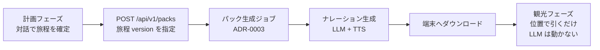

- パック生成は**旅程の version を指定して起動する**。旅程が変わったら再生成が必要になるので、「どの version のパックを持っているか」を端末側が持つ。**冪等キーは `(user_id, itinerary_version, options)`**([packs_pipeline.md §3.2](packs_pipeline.md))
- **雨天代替行程の事前計算**([recommendation_planning.md](recommendation_planning.md) §4.2)は **2026-08-01 に「行わない」と決定した**([packs_pipeline.md §2](packs_pipeline.md))。代わりに雨の overlay が「近くの雨に強い場所」を 1 件だけ挙げる
- 詳細は別文書 —— **生成側は [`30_design/packs_pipeline.md`](packs_pipeline.md)(決定稿 2026-08-01)**、端末側は `30_design/offline_field_mode.md`(Phase 4・未執筆)。[20_architecture.md §14](../20_architecture.md) の Phase 表を正とする

## 13. 論点の決着(2026-07-31)

5 論点すべてにユーザーが回答し、本文書は承認された。決定内容は各節に統合済みで、以下は記録である。

| # | 論点 | 決定 | 反映先 |
| --- | --- | --- | --- |
| 1 | `plan` の最大手数 | **3 のまま**。実際の複合要求は 2 手(`recommend`+`edit_itinerary`、または G4 の「仮定明示 + 確認質問」)で足りる。**足りなければ P1 違反の破棄がログに出るので、それを見てから増やす**(後方互換な変更) | §1.3 P1(変更なし) |
| 2 | ステップ参照の語彙 | **3 つのまま**。`search_knowledge` の出力は `respond` 行きで下流に繋がないため、現状で閉じている。追加は語彙を足すだけの後方互換な変更 | §1.2(変更なし) |
| 3 | 知識検索を含めるか | **含める。**方式は 2026-08-01 に決定 — **pgvector + Qwen3-Embedding-8B を持つサブエージェント**([ADR-0011](../adr/0011-knowledge-search-subagent.md) / [ADR-0012](../adr/0012-knowledge-retrieval-pgvector.md) / [narration_qa.md](narration_qa.md)) | §2.1 |
| 4 | undo の UI | **両方。**ボタンは LLM を通さない専用 REST、自然言語は `edit_itinerary` の `revert` op。道具は 5 つのまま | §2 / **§4.2** |
| 5 | 旅程なしの推薦 | **認める。**推薦は旅程を外部キー参照せず、旅程は `plan_itinerary` で遅延生成する | **§4.3** |

**この文書から派生した未決事項**(それぞれ別文書で決める):

- 知識検索の方式 → [`30_design/narration_qa.md`](narration_qa.md)(**決定稿 2026-08-01**)
- SSE イベント(§6)の正式契約化、undo 用 REST の形 → `40_api/chat_sse.md`
- §4.1 の状態・§4.2 の version・§4.3 の遅延生成を反映したスキーマ → `30_design/data_model.md`

---

# Part II. アーキテクチャ定義(実装粒度)

## 14. この Part の読み方

Part I は「なぜこの方式か」を、本 Part は「**何を作るか**」を持つ。実装者(Codex)に渡す指示書はこちら側である。

| 節 | 定義するもの |
| --- | --- |
| §15 | **メインエージェントの定義** — ノード / Tool / 部品の区別、ワークフロー全体図、TurnState |
| §16 | **ノードの内部設計** — 中身が複雑な 4 ノードを 1 つずつ開く |
| §17 | **サブエージェントを切り出すか**(案の比較 → 提案) |
| §18 | **Tool の I/O 契約**(Pydantic スキーマの元になる) |
| §19 | **Tool の内部設計** — 中身が複雑な Tool を開く |
| §20 | スレッドの派生状態と、Tool の事前条件 |
| §21 | 代表シナリオのシーケンス |
| §22 | モジュール構成と依存の向き |
| §23 | レビューで確認したいこと |

**用語**: 本 Part では Part I の「道具」を **Tool** と表記する(ノードと対比する語として区別するため)。指すものは同じで、§2 の 5 つである。

> 📘 **関連文書**: ノード **N2 `understand`** は中身が特に込み入っているため、**[understand_node.md](understand_node.md) に専用の解説ページ**を分けた。発話が JSON になる過程を例つきで説明している。

> **Part I からの変更点が 3 つある。**いずれも図に落とす過程で解像度が足りないと分かった箇所で、意図的な精緻化である。承認されたら Part I 側も直す。
> **(a) §18.1** 制約(述語)を Tool の引数からターン全体の値に移す ← §1.2 の例と異なる
> **(b) §16.6** `persist` は `respond` の成否に関わらず必ず走る ← §1.4 の図と §9 の記述の不整合を解消
> **(c) §17** LLM 呼び出しの呼び方を「サブエージェント」ではなく「**専門呼び出し**」と定義し直す

## 15. メインエージェントの定義 — ノードと Tool の区別

### 15.1 エージェントはこのシステムに 1 個しかない

**旅程計画エージェント**(planning agent)。以下がその全体である。

| | |
| --- | --- |
| 起動 | `POST /api/v1/chat` の 1 リクエスト = **1 ターン** |
| 責務 | 発話を理解し、プロファイル・推薦候補・旅程を更新し、日本語で応答する |
| 終了 | `done` イベント。**ターンをまたぐ自律ループを持たない**(状態は毎ターン DB から再構築する。§4.1) |
| 下位エージェント | **なし**(理由と比較は §17) |
| 観光フェーズ | **エージェントは存在しない**(位置で事前生成物を引くだけ。§0) |

以降「エージェント」と書けばこの 1 個を指す。

### 15.2 ノード / Tool / 部品 — 3 つを区別する

エージェントアーキテクチャで最初に決めるべきは「**何がグラフの頂点で、何がグラフに現れないか**」である。

| 分類 | 定義 | 数 | **実行するかを誰が決めるか** | TurnState |
| --- | --- | --- | --- | --- |
| **ノード** | ワークフローグラフの頂点。**並ぶ順序はコードが固定する**(条件で飛ばすことはあるが、順番は入れ替わらない) | **6** | **コード**(グラフ定義) | 読み書きする |
| **Tool** | `act` ノードだけが呼ぶ関数。引数を受け取り結果を返す | **5** | **LLM**(`understand` が出す `plan`) | **直接触らない** |
| **部品** | ノードや Tool の内側で使うライブラリ。**グラフには現れない** | — | 呼び出し元 | 触らない |

部品の例: `guards`(ガードレール判定)/ `solver`(ILS)/ `scorer`(効用スコア)/ `geo`(OSRM・PostGIS)/ `retrieval`(知識検索)/ `core/llm`(OpenAI 互換クライアント)。**これらはノードでも Tool でもない。**たとえば「`guards` は独立したノードか?」への答えは**否**で、`validate_plan` と `act` の両方から呼ばれる純粋関数の集まりである(グラフに置くと同じものが 2 か所に現れてしまう)。

> **この区別が本設計の要である。**
> **「何をするか」は LLM が決める** — どの Tool をどの順で使うか(= `plan`)。
> **「処理がどう流れるか」はコードが決める** — ノードの並び・失敗時の打ち切り・トランザクション境界。
> [ADR-0008](../adr/0008-plan-then-execute.md) の一括プラン方式とは、**この 2 つを分離すること**の別名である。有界 ReAct(§1.1 案 C)を採らなかったのは、それが後者まで LLM に渡す構造だからである。

### 15.3 ワークフロー全体図

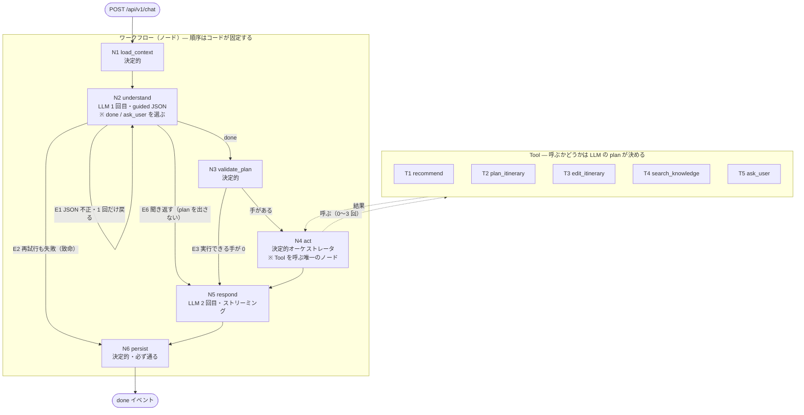

**この図の読み方**

- **実線がノード間の遷移(グラフの辺)、点線が Tool 呼び出し。**Tool はグラフの頂点ではないので、`N4` から出て `N4` に戻る
- **Tool を呼ぶノードは `N4 act` だけ。**他のノードから Tool を呼ぶ経路を作らない(作ると「LLM が決める範囲」が曖昧になる)
- **`N6 persist` には必ず到達する。**致命的失敗の経路(E2)も persist を通る(§16.6)

### 15.4 ノード一覧

| # | ノード | 種別 | LLM | やること | 失敗したら |
| --- | --- | --- | --- | --- | --- |
| N1 | `load_context` | 決定的 | — | ユーザー・スレッド・履歴・プロファイル・旅程・`last_candidates`・リアルタイム値を取得し、§7 の予算に収める | 致命(DB 障害) |
| N2 | `understand` | **LLM** | **1 回** | 意図 / `plan` / 選好・制約の抽出 / 照応解決を 1 回の guided JSON で出す。**`done` と `ask_user` の 2 択を持つ**(§3.4)(**詳細: [understand_node.md](understand_node.md)**) | 1 回だけ再試行 → 致命 |
| N3 | `validate_plan` | 決定的 | — | P1〜P8 の検証、`$N` の解決可能性、事前条件、専門呼び出しの割り当て、`state: plan` の送出 | 全手が落ちたら P8(Tool なし) |
| N4 | `act` | 決定的 | (0〜1) | **Tool を順に実行**。`provisional` → `final` を送出。失敗時に打ち切る | 手を中止し、ここまでの結果を保持 |
| N5 | `respond` | **LLM** | **1 回** | 日本語の応答をトークンストリーミング。3 つのモードを持つ(§16.5) | ストリーム済みの分だけ保存 |
| N6 | `persist` | 決定的 | — | 1 トランザクションでコミットし `done` を送出 | ロールバックし error を送出 |

**LLM 呼び出しは N2 と N5 で必ず 1 回ずつ、N4 の中で 0〜1 回。**合計 2〜3 回という Part I の予算(§1.1)は、このノード構成から機械的に決まる。

### 15.5 Tool 一覧(契約は §18、内部は §19)

| # | Tool | いつ呼ばれるか | 副作用 | ターンを終えるか | 内部で LLM を使うか |
| --- | --- | --- | --- | --- | --- |
| T1 | `recommend` | `plan` に含まれたとき | `last_candidates` / `presented_spot_ids` を更新 | いいえ | **あり**(リランク・任意) |
| T2 | `plan_itinerary` | 同上 | 旅程を新規作成(version 1) | いいえ | **あり**(解の選択・任意) |
| T3 | `edit_itinerary` | 同上 | 旅程を更新(version+1) | いいえ | **あり**(解の選択・任意) |
| T4 | `search_knowledge` | 同上 | なし(読み取りのみ) | いいえ | **あり**(サブエージェント。§2.1) |
| T5 | `ask_user` | 同上(P5 により末尾のみ) | `asked_slots` / `ask_streak` を更新 | **はい** | なし |

**`ask_user` だけがグラフの制御に影響する Tool** である。実行されると TurnState の `should_end_turn` が立ち、`act` は以降の手を実行しない。ただし**ノードの並びは変わらない** — `respond` は通り、そこで質問文の日本語が書かれる([ADR-0007](../adr/0007-preference-elicitation.md))。つまり「ターンを終える」とは**Tool の実行を止める**という意味であって、グラフを途中で抜けることではない。

### 15.6 条件分岐エッジ

| # | 条件 | 行き先 | 備考 |
| --- | --- | --- | --- |
| E1 | `understand` の JSON が不正、かつ再試行が未実施 | `understand`(1 回だけ戻る) | **グラフ上で唯一の巡回**。上限 1 回 |
| E2 | 再試行しても不正 | `persist`(致命) | ユーザーには「うまく理解できませんでした」 |
| E3 | 検証後に実行できる手が 0 | `respond`(Tool なしモード) | P8 |
| E4 | Tool が失敗 | `act` 内で残りを中止 → `respond` | ノード間の遷移ではなく `act` 内部の分岐 |
| E5 | `should_end_turn` が立った | `act` 内で残りを実行せず → `respond`(質問モード) | 同上 |
| **E6** | **`understand` が `ask_user` を選んだ**(発話が理解できず聞き返す。§3.4) | **`respond`(聞き返しモード)。`validate_plan` と `act` を飛ばす** | **巡回ではなく近道の辺。**ターン内にループを作らない |

**グラフの巡回は E1 だけで、しかも上限 1 回。**「LLM が自分で反復する」構造をどこにも持たないことが、この表で確認できる。**E6 を足してもこの性質は変わらない** — 聞き返しは `respond` へ抜ける片道の辺であり、次の観測(ユーザーの答え)は**ターンを終えないと得られない**からである(§3.4.2)。

### 15.7 グラフを流れる状態 — `TurnState`

ノードは共有の状態オブジェクトを読み書きして受け渡す。**`TurnState` はターン内だけ生きる**(永続状態は DB。§4.1)。

```jsonc
TurnState = {
  // --- N1 load_context が埋める（読み取り専用として扱う） ---
  turn_id, thread_id, user_id, utterance,
  profile, itinerary /* null 可 */, history,
  last_candidates, presented_spot_ids, asked_slots, ask_streak,
  realtime,                       // spot_id → {weather, congestion}
  spot_id_vocab,                  // §3.2 で絞った参照可能 id の enum

  // --- N2 understand が埋める ---
  intent, plan, profile_delta, constraints, score_adjustments, unmodeled, references,

  // --- N3 validate_plan が埋める ---
  accepted_steps,                 // 実行する手（最大 3）
  rejected_steps,                 // 破棄した手と理由 → respond とログへ
  llm_budget_step,                // 専門呼び出しを割り当てた手の id（null 可）

  // --- N4 act が埋める ---
  step_results,                   // step_id → ToolResult
  skipped_steps, aborted_at,
  should_end_turn,                // ask_user が立てる
  degraded,                       // 縮退の種類のリスト（§9）

  // --- N5 respond が埋める ---
  assistant_text, respond_status,

  // --- 全ノードが追記する ---
  log_fields                      // ターン 1 行の構造化ログの材料（§10）。DB には入らない
}
```

**設計上の約束**

1. **ノードは前のノードが埋めた欄しか読まない。**後戻りして書き換えない(E1 の再試行だけが例外で、`understand` の欄を上書きする)
2. **Tool は `TurnState` を受け取らない。**必要な値は `act` が引数に詰めて渡す。これにより Tool は単体でテストでき、`conversation` に依存しない([20_architecture.md §3](../20_architecture.md) の依存規則)
3. **`rejected_steps` と `degraded` は握り潰さない。**両方とも `respond` と構造化ログの入力になる(FR-3.3)

### 15.8 補助図 — LLM とコードの境界

§15.3 がグラフの形を示すのに対し、こちらは**同じものを「どこまでを LLM に任せるか」の軸で切った図**である。研究上の根拠([recommendation_planning.md](recommendation_planning.md) §2.2)がすべて「LLM に何をさせないか」に関するものだったので、この軸の図も併記しておく。

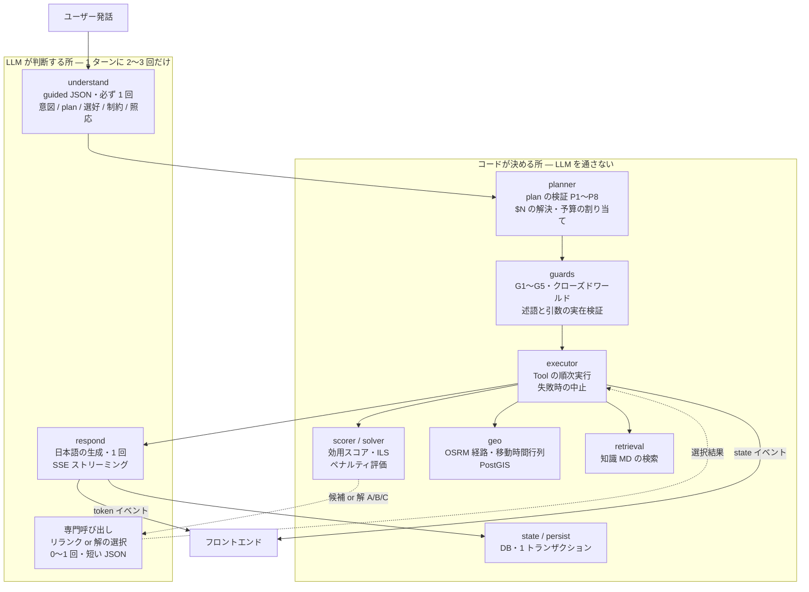

**読み取ってほしいこと**

1. **LLM は 3 か所にしか出てこない。**Tool の中で LLM が動くのは「リランク」と「解の選択」だけで、それも**ターンに 1 回まで**(P7)
2. **数値を作る所はすべてコード側にある。**移動時間(OSRM)・スコア(scorer)・時刻の割付(solver)・距離(PostGIS)。LLM は与えられた数値を引用するだけ(§8)
3. **LLM の出力は必ず検証層(planner / guards)を通ってから実行される。**LLM の出力が直接 DB や UI に届く経路は 1 本もない
4. **`respond` は下流に何も渡さない。**説明を書くだけで、システムの状態を変えない

## 16. ノードの内部設計

§15 でグラフの形が決まったので、ここでは**中身が複雑なノードを 1 つずつ開く**。複雑さの内訳は次のとおりで、`load_context` は単純、`respond` は制約が多いだけで処理は単純である。

| ノード | 複雑さの理由 |
| --- | --- |
| N1 `load_context` | **単純。**1 クエリ群 + 予算内への切り詰め |
| **N2 `understand`** | **1 回の呼び出しで 3 つの異なる仕事をしている**(§16.2) |
| **N3 `validate_plan`** | **検証の順序に意味がある**(§16.3) |
| **N4 `act`** | **Tool 呼び出し・2 種類の失敗・1 回きりの LLM 予算**の 3 つが絡む(§16.4) |
| N5 `respond` | 処理は単純だが**3 つのモード**と守るべき制約がある(§16.5) |
| N6 `persist` | **必ず走る**ことと、何をコミットするかの線引き(§16.6) |

### 16.1 N1 `load_context`(単純)

1 ターンに必要な文脈を**まとめて 1 回**取る(現行実装の「同一ユーザーに 4 回 SELECT」を解消)。取るものは §15.7 の「N1 が埋める」欄。

- **プロセス内キャッシュを持たない**(§4.1)。毎ターン DB から作り直す
- 取得後、§7 のコンテキスト予算に収める。溢れるのは実質**会話履歴だけ**なので、切り詰めは「古いターンから落とす」だけでよい
- ここで **`spot_id_vocab`**(§3.2 で絞った参照可能 id の enum)も作る。これが `understand` の guided decoding に渡り、**POI のハルシネーションを構造的に不可能にする**

### 16.2 N2 `understand`(最も複雑)

> 📘 **専用の解説ページがある: [understand_node.md](understand_node.md)。**本節はノードの構造だけを示す。**「結局このノードは何をしているのか」を知りたい場合はそちらを読む** — 出力 7 フィールドの行き先、`handling` 4 経路の判定、発話が JSON になる例が 4 つ載っている。
> 🖥 **図解ページ: https://claude.ai/code/artifact/6e1206ab-9219-47ee-89fd-6256096f8118**

**何が複雑か**: このノードは **1 回の LLM 呼び出しで 3 つの独立した仕事**をしている。

1. **意図と手順の決定** — `intent` と `plan`(どの Tool をどの順で使うか)
2. **選好と制約の抽出** — `profile_delta` / `constraints` / `score_adjustments` / `unmodeled`
3. **照応の解決** — 「2 番目のやつ」→ `spot_id`(§3.3)

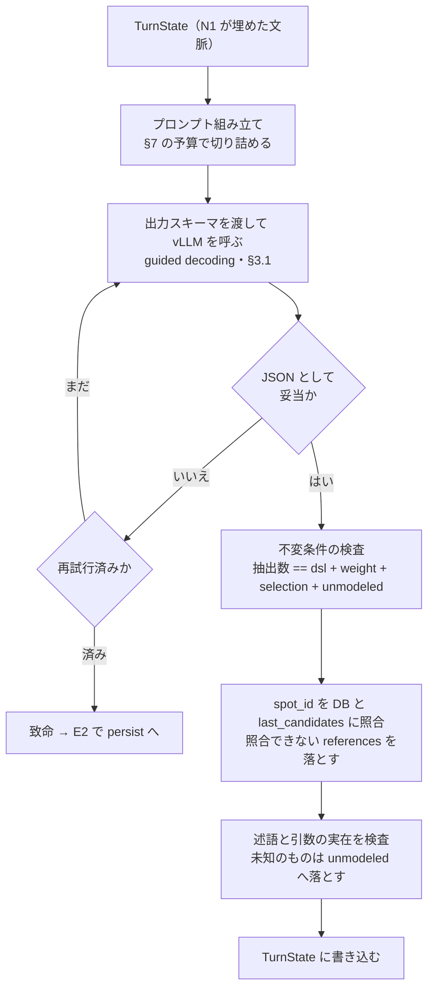

**なぜ 3 つを 1 回にまとめるのか。**分ければ 1 ターンの LLM 呼び出しが増え、NFR-3 に反する(§17 案 2)。[recommendation_planning.md](recommendation_planning.md) §3.1 が「PURE 型の分業を素直に実装すると 1 ターン 3 呼び出しになるので `understand` に相乗りさせる」と既に判断している。**分けるとしたら並列化とセットにする**(§17 案 1)。

**なぜ出力後に検査が要るのか。**guided decoding が保証するのは**構造**であって**中身**ではない。存在しない `spot_id`、実在しないタグ、`handling` の付け忘れ、未知の述語はスキーマを通ってしまう。ここで落とさないと、**静かに間違った POI が旅程に入る**という気づきにくい失敗になる(§3.3)。

**検査で落としたものは捨てない** — `unmodeled` か `rejected_steps` に回して `respond` に伝える(FR-3.3)。

### 16.3 N3 `validate_plan`(複雑 — 検証の順序に意味がある)

**何が複雑か**: P1〜P8 は独立した規則の集合ではなく、**適用順が結果を変える**。

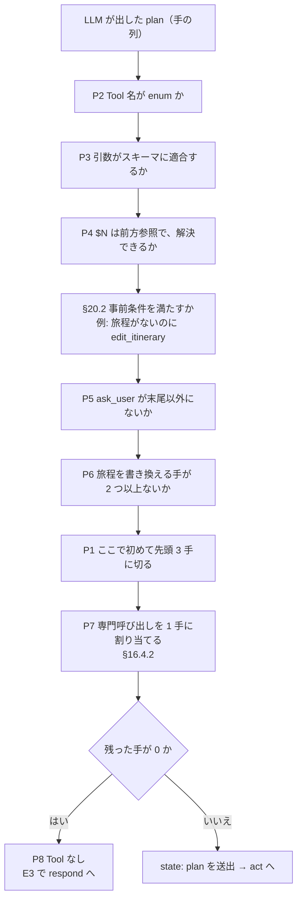

**順序の理由**

- **「無効な手を落としてから 3 手に切る」(P2〜P6 → P1)。**逆にすると、先頭に無効な手が並んだときに**有効な手が枠から溢れて捨てられる**。ユーザーから見ると「言ったことの一部が理由もなく無視された」に見える
- **P7(予算配分)は最後。**どの手が生き残ったかが確定しないと、「他の手から参照されている手」を判定できない(§16.4.2)
- **P8 は判定であって規則ではない。**上流で全部落ちた結果を受けるだけ

**破棄した手は `rejected_steps` に理由つきで残す。**これが `respond` の「〇〇は分からなかったので飛ばしました」の材料であり、同時に**プロンプト改善の主シグナル**になる(§10)。

**`state: plan` の送出はこのノードの最後**。`respond` の生成を待たずに「推薦して、旅程に入れます」を先に出せるのが一括プラン方式の利点(§1.4)。

### 16.4 N4 `act`(複雑 —Tool を呼ぶ唯一のノード)

**何が複雑か**: 3 つが絡む。**(1)** 呼ぶ Tool の数が 0〜3 と可変 **(2)** 失敗の扱いが 2 種類ある(スキップ / 中止) **(3)** 1 ターン 1 回きりの専門呼び出し予算をここで使う。

#### 16.4.1 実行ループ

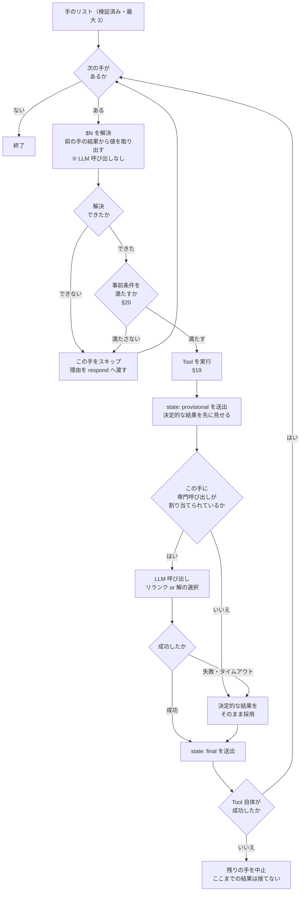

**失敗の扱いは 3 段階に分かれる。**ここを混ぜると「一部だけ壊れた旅程」が保存される。

| 事象 | 扱い | 理由 |
| --- | --- | --- |
| `$N` が解決できない | **スキップ**(次の手へ) | 他の手は独立に成立しうる。何ができなかったかは `respond` に渡す |
| 事前条件を満たさない(§20.2) | **スキップ** | 同上。例: 旅程がないのに `edit_itinerary` |
| **Tool の実行が例外・タイムアウト** | **中止**(残りの手を実行しない) | **部分的に矛盾した状態を作らないため。**ただしそこまでの結果は捨てない |
| 専門呼び出しが失敗・遅い | **縮退**(決定的な結果を採用して続行) | 品質は落ちるが結果は正しい。ユーザーには見せず `degraded` としてログに出す(§9) |

- **`provisional` → `final` の 2 段送出**が [ADR-0006](../adr/0006-recommendation-hybrid.md) 形-2 の実体。カードと地図は provisional の時点で描画される
- **`ask_user` が実行された場合もループを抜けるだけ**で、`respond` は通る(§15.5)

#### 16.4.2 専門呼び出しの割り当ては実行前に決める

P7(追加 LLM 呼び出しはターン 1 回)を満たすため、**どの手に 1 回を割り当てるかは executor が走り出す前に planner が決める。**実行しながら決めると「後の手により価値があった」場合に取り返せない。

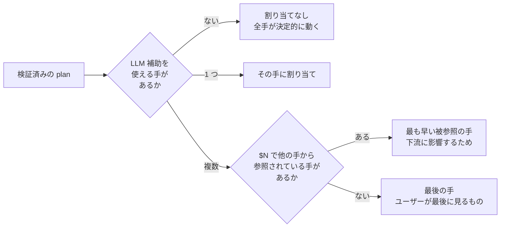

### 16.5 N5 `respond`(3 つのモードを持つ)

**何が複雑か**: 処理そのものは「LLM を 1 回呼んでトークンを流す」だけだが、**入力の形が 3 通りある**。プロンプトを 3 本持つのではなく、**1 本のテンプレートにモードを渡す**(現行実装の「状況ごとにプロンプト全文コピー」を繰り返さないため。[20_architecture.md §7](../20_architecture.md))。

| モード | 条件 | 書くもの |
| --- | --- | --- |
| **説明** | Tool が結果を返した | 候補・旅程・**譲歩の内訳**・`unmodeled`・**今回考慮した条件** |
| **質問** | `should_end_turn`(`ask_user` Tool が実行された) | 質問文 1 つと、選択肢の自然な言い換え |
| **聞き返し** | **E6(`understand` が `ask_user` を選んだ。§3.4)** | **何が曖昧だったか**(`clarify.why` を日本語に)+ 選択肢の言い換え。**推測で先に進んだふりをしない** |
| **不成立** | 手が 0(P8)/ 全手が失敗 / `understand` 致命 | 何が分からなかったか + 次の一手の促し |

**どのモードでも §8 の制約は同じ**である: 与えられた `spot_id` と事実だけを引用する / 数値を作らない / POI 名を作らない / 旅程を作り直さない。**`respond` は下流に何も渡さない**(§15.3)ので、ここで何を書いてもシステムの状態は変わらない — 逆に言えば、**ここでの誤りは検出されずユーザーに届く**。だから制約はプロンプトだけでなく、DB の表示名との文字列照合でコードでも検査する(§17 案 4)。

### 16.6 N6 `persist` は必ず走る【Part I からの変更点 (b)】

§1.4 は「全手の完了後に 1 トランザクション」と書き、§9 は「`respond` がタイムアウトしても旅程は保存されています」と書いている。**図にすると両立しない**ので、ここで確定させる。

- **トランザクションは 1 つ**(§1.4 のとおり)。ただし**発火は `respond` の成否に関わらず**(`finally` 相当)
- **コミットするもの**: ユーザー発話 / Tool の結果(旅程 `version+1`・プロファイル・`presented_spot_ids`・`last_candidates`・`asked_slots`・`ask_streak`)/ アシスタント発話(**ストリーム済みの分だけ。空でも行は作り `status` を持つ**)
- **`understand` が致命失敗したときは Tool が動いていない**ので、コミットされるのはユーザー発話だけになる
- **ログの出力はトランザクションの外**(DB に入るものが 1 つ減った。2026-08-01、NFR-7 削除)
- **Tool が途中で失敗したターンでも、成功した手の結果はコミットする**(§1.4 の「そこまでの結果は捨てない」をデータ側でも守る)

理由: `state` イベントで見せたものと DB の内容が食い違う状態を作らないため。**ユーザーが見た旅程は保存されている**、を不変条件にする。

### 16.7 SSE イベントの発火順

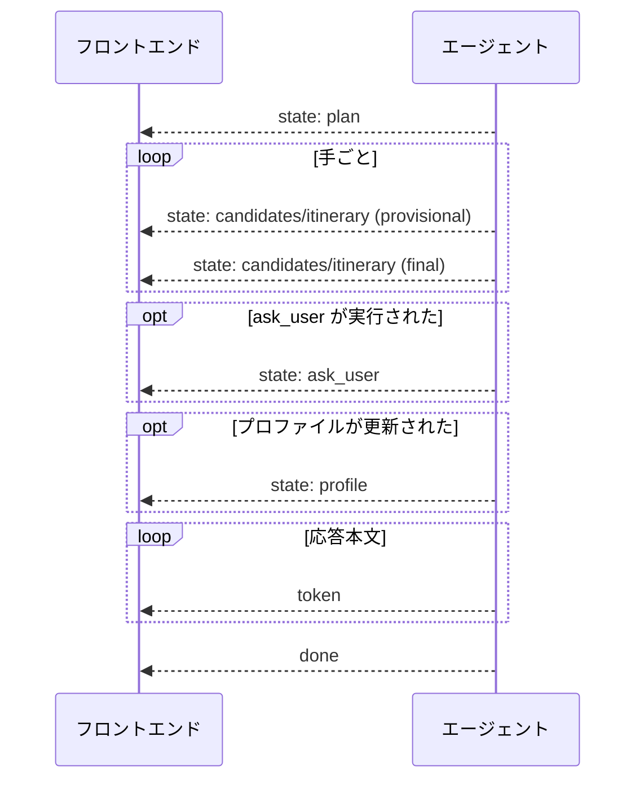

- `error` は**どの位置でも発火しうる**(縮退の明示)。`done` の前に届くことも、`done` と同時に終わることもある
- **UI の状態はすべて `state` 由来**。`token` の本文をパースして状態を作らない(§6)

## 17. サブエージェントを切り出すか【Part I からの変更点 (c)】

> ✅ **決着済み。本節の結論は [ADR-0009](../adr/0009-no-subagents.md) として記録した**(2026-07-31)。以下は検討の記録である。
> 外部証拠は [agent_patterns_survey.md §2.3](agent_patterns_survey.md)。
> Anthropic は「共有コンテキストとエージェント間の依存が多い領域はマルチエージェントに向かない」と明記しており、arXiv:2512.08296 は**逐次計画タスクで単一エージェント比 −70.0%** を報告している。**本件の 1 ターンは典型的な逐次計画である。**切り出さない判断は、推測ではなく実証に裏打ちされた。

### 17.1 用語を先に決める

§15.2 が **ノード / Tool / 部品** を定義した。ここで足りないのは「**LLM 呼び出しのうち、どれをエージェントと呼ぶか**」である。曖昧なまま議論すると判断を誤るので定義する。

| 用語 | 定義 | 本システムでの例 |
| --- | --- | --- |
| **エージェント** | 自分のコンテキストと Tool を持ち、**自分で反復して**目標に向かう LLM ループ | 旅程計画エージェント 1 個(§15.1) |
| **専門呼び出し** | Tool を持たず反復もしない、**1 回きりの構造化出力**。役割が 1 つに固定されている | `understand`(N2)/ リランク / 解の選択 / `respond`(N5) |

**この定義に照らすと、現設計の LLM 呼び出しは 4 つとも「専門呼び出し」であって、サブエージェントは 1 つも存在しない。**Part I が「有界 ReAct ループ」を退けた(§1.1 案 C)時点で、自律的に反復する下位主体は設計から消えている。§15.6 が示すとおり、**グラフの巡回は `understand` の再試行 1 か所だけで、しかも上限 1 回**である。

したがって本節の問いは正確には「**サブエージェントを足すか**」ではなく「**LLM を使うノードを分割するか**」である。以下はその比較として読む。

### 17.2 切り出しの候補と比較

それでもなお切り出す価値があるかを、4 つの候補で検討する。

| 案 | 切り出すもの | 1 ターンの LLM 呼び出し | 体感レイテンシへの影響 | 評価 |
| --- | --- | --- | --- | --- |
| **0. 切り出さない【提案】** | — | 2〜3 | — | 現設計。計測が最も素直で、壊れる箇所が少ない |
| 1. **N2 `understand` を 2 ノードに分割**(**並列**) | 「意図・plan・照応」と「選好・制約の抽出」を別プロンプトにして**同時に**投げる | 3〜4 | ほぼ増えない(並列のため)。ただし GPU 共有下では互いに遅くなる | **抽出品質が上がる可能性がある。**制約抽出は本方式の誤差のボトルネック(ChinaTravel で F1 0.61〜0.71)。§17.3 の条件つきで将来の選択肢に残す |
| 2. 理解 / 計画 / 説明の直列分業(PURE 型) | 3 つの専門エージェントを順に走らせる | 4〜5 | **直列に増える** | **却下。**NFR-3 に正面から反する。[recommendation_planning.md](recommendation_planning.md) §3.1 が「PURE を素直に実装すると 1 ターン 3 呼び出しになるので understand に相乗りさせる」と既に判断している |
| 3. ターン外の非同期エージェント | プロファイルの整理・`unmodeled` の分析を応答後に走らせる | +0(応答後) | ゼロ | **却下(エージェントとしては)。**やること自体は必要だが、**CLI コマンド**(`python -m app.cli analyze-unmodeled`)で足りる。バックグラウンドで勝手に状態が変わる仕組みは、再現性(NFR-2)と 1 人開発の把握しやすさ(NFR-1)を損なう |
| 4. 出力検証サブエージェント | `respond` の出力がクローズドワールドを守っているか LLM に検査させる | +1 | 増える | **却下。**検査対象は「出していない `spot_id` の表示名が本文に出ていないか」であり、**DB の表示名との文字列照合でコードが検査できる**。LLM を使う理由がない |

### 17.3 提案

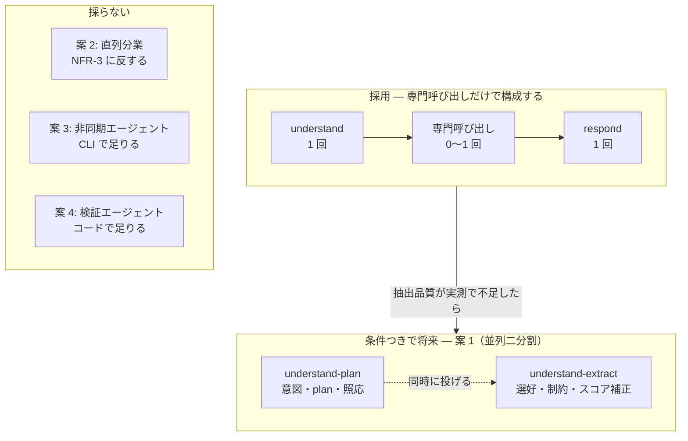

**採用: 案 0。ただし案 1 へ移れるようにインターフェースを準備しておく。**

移行を安く保つ鍵が **§18.1 の「制約はターン全体の値」**である。制約を Tool の引数の中に埋めると、抽出を別呼び出しに切り出したとき plan の構造ごと作り直しになる。ターン全体の値にしておけば、**案 1 への移行は「プロンプトを 2 つに割って `asyncio.gather` で投げる」だけ**で、planner・executor・Tool は一切変わらない。

**切り替えの判断材料**(常時計測ではなく、実装後に一度測る。§10): `understand` の抽出取りこぼし率。`unmodeled` に落ちるべきでないものが落ちている、あるいは `respond` の「今回考慮した条件」に発話内容が現れない頻度が高ければ、案 1 を試す。

## 18. Tool の契約

### 18.1 制約はターン全体の値にする【Part I からの変更点 (a)】

§1.2 の例は `constraints` を `edit_itinerary` の引数の中に置いている。**これを、`understand` 出力の直下(ターン全体の値)に移す。**

| | 引数に埋める(§1.2 の例) | **ターン全体の値【提案】** |
| --- | --- | --- |
| 同じ制約を 2 つの手が使うとき | 二重に書かせることになる | 1 か所 |
| P6(旅程を書く手は 1 つ)との関係 | どのみち 1 手にしか付かない | 素直 |
| 案 1(抽出の切り出し)への移行 | plan の構造ごと作り直し | **プロンプトを割るだけ** |
| LLM の負荷 | plan の中に入れ子で長い JSON | plan が短くなる |

- 制約は `understand` 出力の `constraints` に置き、**executor が旅程系の Tool に渡すときにコードが注入する**
- **Tool の引数に残すのは「その手に固有のもの」だけ**: `recommend` の `filter`、`plan_itinerary` の `days` / `must_visit`、`edit_itinerary` の `ops`

### 18.2 共通型

> **この節が enum の正である。**実装は必ずここを見ること。**永続化の形は [data_model.md](data_model.md) が正**で、両者は 2026-08-01 に突き合わせ済み。

```jsonc
// すべての Tool に共通する型。api/schemas ではなく domains 側の内部契約
SpotId        = "spot_001"                      // enum: 文脈上参照可能な id のみ（§3.2）
Mode          = "car" | "foot"
Slot          = "onboarding" | "party" | "mobility" | "pace" | "interests" | "dates" | "origin"
Mobility      = "avoid_walk" | "short_walk_ok" | "hike_ok"
Party         = "family_kids" | "couple" | "solo" | "senior" | "group"
Pace          = "packed" | "relaxed"

// ── 語彙は 2 層である（data_model.md §2）────────────────────────────
PreferenceKey = "nature" | "mountain" | "water" | "lodging" | "shrine_temple" | "onsen"
              | "park" | "coast" | "history" | "food" | "rest_stop" | "family"   // 12 語
Tag           = "滝" | "自然" | ...             // 生タグ 80 語（DB 実在）

//   profile.interests のキーは PreferenceKey だけ。Tag は使わない
//   understand の guided decoding の enum に載せるのも PreferenceKey（12 語）
//   Tag は recommend の filter と、respond の説明文の素材にだけ使う

// ── 制約 DSL（述語は 17 種。data_model.md §4.5.3 の永続形と同じ）─────
PredEnum = "weight" | "require" | "exclude"
         | "count_at_most" | "count_at_least"
         | "first" | "last" | "before"
         | "not_consecutive"
         | "same_day" | "different_day"
         | "time_window" | "stay_at_least"
         | "day_part_load"
         | "max_leg_min" | "mode_pref"
         | "lunch_break"                        // 計 17。定義は recommendation_planning.md §4.4 経路 1

Constraint  = {id: string,                      // 'c_014'。旅程内で採番し、version コピー時に維持する
               pred: PredEnum, args: object, weight: float,
               source_message_id: int, source_text: string,
               created_at_version: int,
               handling: "dsl"}                 // constraints に入る時点で必ず "dsl"
Concession  = {constraint_id: string, pred: PredEnum, args: object,
               violation: number, message_ja: string}

ReasonMaterials = {                             // respond に渡す「事実」。LLM はここから外れて書けない
  matched_keys: [PreferenceKey],                //   プロファイルと一致した選好キー
  matched_tags: [Tag],                          //   説明文に出す生タグ
  travel_time_text: string,                     //   「宿から車で約 15 分」（OSRM 由来・自然文化済み）
  weather_fit_today: "good" | "ok" | "poor" | "unknown",   // ← 今日の天気との相性（動的）
  congestion: "low" | "mid" | "high" | "unknown",
  stay_min: number,
  score_breakdown: object                       //   スコアの内訳（説明の素材であり、そのまま出さない）
}

// ── 旅程。時刻はすべて「その日 00:00 からの分」（整数）────────────────
//    "09:40" 形式の文字列は使わない。日跨ぎが表現できず、ソルバー内部表現と二重になるため
//    （data_model.md §7.2）
ItineraryItem = {seq: int, spot_id: SpotId,
                 arrive_min: int, stay_min: int, depart_min: int,
                 leg_from_prev: {mode: Mode, min: int, route_id: string|null},
                 locked: bool, note: string|null}
ItineraryDay  = {date: "YYYY-MM-DD", start_min: int, end_min: int,
                 origin: {kind: "spot", spot_id: SpotId},
                 destination: {kind: "spot", spot_id: SpotId},
                 items: [ItineraryItem]}
Itinerary     = {days: [ItineraryDay], concessions: [Concession], version: int}
//    ※ constraints は Itinerary の外（itineraries 行の別列）。data_model.md §4.5.1
Diff          = {added: [SpotId], removed: [SpotId], moved: [{spot_id, from, to}], retimed: [SpotId]}

// すべての Tool は成功値かこの型を返す（2026-07-31 追加）
ToolError   = {
  code:          ToolErrorCode,   // enum。executor の分岐はこの値だけで決まる
  message_ja:    string,          // respond に渡す。ユーザーに見せる前提で書く
  recoverable:   bool,            // false なら残りの手を中止（§16.4.1）
  details:       object           // 計測・デバッグ用。respond には渡さない
}
ToolErrorCode =
  | "precondition_unmet"    // 旅程がないのに edit_itinerary 等（recoverable: true → スキップ）
  | "reference_unresolved"  // $N や spot_id が解決できない（recoverable: true → スキップ）
  | "empty_result"          // 候補 0 件・該当 0 件（recoverable: true）
  | "upstream_timeout"      // OSRM / DB / LLM のタイムアウト（recoverable: false）
  | "internal"              // 想定外（recoverable: false）
```

**なぜ Tool のエラーを型にするのか。**executor はスキップと中止を区別する(§16.4.1)が、その判断材料が「例外が飛んだかどうか」だけでは粗い。**`recoverable` を Tool 側が宣言する**ことで、executor の分岐が決定的になり、層 1 テストで検査できるようになる。`message_ja` を Tool が持つのは、**何ができなかったかを最もよく知っているのが Tool 自身**だからである(FR-3.3)。

### 18.3 `recommend`

```jsonc
in  = {
  filter: {tags?: [Tag], mobility?: Mobility, weather_fit?: bool,
           area?: Area, day?: int},            // day は旅程があるときだけ有効（§4.3）
  k: int,                                      // 1..8、既定 5
  exclude?: [SpotId]
}
out = {
  spot_ids: [SpotId],                          // 最終 k 件。$N.spot_ids で参照される
  candidates: [{spot_id, rank, reason_materials: ReasonMaterials}],
  provisional_spot_ids: [SpotId],              // リランク前の 8〜12 件（計測用）
  rerank_used: bool
}
```
事前条件なし。**旅程がなくても動く**(§4.3)。

### 18.4 `plan_itinerary`

```jsonc
in  = {
  days: [{date: "YYYY-MM-DD", start: "HH:MM", end: "HH:MM",
          origin: {kind: "facility"|"spot"|"coord", id?: SpotId},
          destination?: {kind, id?}}],         // 省略時は origin に戻る
  must_visit?: [SpotId]
}                                              // constraints は §18.1 によりコードが注入
out = {
  itinerary: Itinerary,                        // 選ばれた解
  alternatives: [Itinerary],                   // 解 A/B/C のうち採らなかったもの
  concessions: [Concession],                   // 「どの希望をどれだけ譲ったか」
  selection_used: bool,
  spot_ids: [SpotId]                           // 訪問順。$N.spot_ids で参照される
}
```
事前条件: `days` が決まること(不足するなら `ask_user` に振り替え。ただし G4)。**旅程行はこの Tool が初めて呼ばれたときに生成される**(§4.3)。

### 18.5 `edit_itinerary`

```jsonc
in  = {ops: [Op]}                              // constraints は §18.1 によりコードが注入
out = {itinerary, alternatives, concessions, diff: Diff, selection_used, spot_ids}

Op =
  | {op: "add",      targets: [SpotId] | "$N.spot_ids" | "$N.spot_ids[:k]", day?: int, after?: SpotId}
  | {op: "remove",   targets: [SpotId]}
  | {op: "move",     target: SpotId, day?: int, position?: int}
  | {op: "replace",  target: SpotId, with: SpotId | "$N.spot_ids[:1]"}
  | {op: "lock",     targets: [SpotId], locked: bool}
  | {op: "set_stay", target: SpotId, min: int}
  | {op: "set_time", target: SpotId, arrive?: "HH:MM", depart?: "HH:MM"}
  | {op: "revert",   to_version?: int}         // 既定は現在 − 1（§4.2）
```
事前条件: **旅程が存在すること。**なければこの手を破棄し、理由を `respond` に渡す(§4.3)。
`revert` は他の op と混在させない。混在時は他の op を破棄する(§5)。

### 18.6 `search_knowledge`

```jsonc
in  = {request: string, spot_id?: SpotId}
out = {answer_ja: string, sources: [{kind: "knowledge"|"web", ...}], coverage: "full"|"partial"|"none"}
```

**中身はサブエージェントである**(§2.1)。設計は [narration_qa.md](narration_qa.md) を正とする。本文書が要求するのは 3 つだけ:

1. **出典を必ず返す**(`sources`)。クローズドワールド原則([ADR-0006](../adr/0006-recommendation-hybrid.md))を対話側でも保つため
2. **`coverage` を必ず返す。**これが無いと、何も見つからなかったときに `respond` が推測で書いてしまう(FR-3.3)
3. **`answer_ja` は `respond` の素材である。**そのまま画面に流さない。日本語を書くのは `respond` だけ(§8)

**`sources[].kind` が `"web"` のものは `spot_id` の供給源にしない**([narration_qa.md §6.1](narration_qa.md))。

### 18.7 `ask_user`

```jsonc
in  = {slot: Slot, reason: string, options: [string]}   // options は 2〜4 個（G5）
out = —                                                  // ターンを終える。state: ask_user を送出
```

- 事前条件: **G1〜G5**([ADR-0007](../adr/0007-preference-elicitation.md))。P5 により plan の末尾にしか置けない
- **これは「選好の聞き取り」専用である。**発話が理解できないときの**聞き返しは Tool ではない** — `understand` ノード自身の分岐として実装する(§3.4)。混同しないこと
- **質問文の日本語を書くのは `respond`。**この Tool はスロットと選択肢を確定させるだけ

## 19. Tool の内部設計

Tool は「引数を受け取って結果を返す関数」だが(§15.2)、中身の複雑さは大きく違う。**複雑な 3 つを開く。**

| Tool | 複雑さ | 中で何が起きているか |
| --- | --- | --- |
| **T1 `recommend`** | 中 | **決定的な絞り込みと LLM の選択が二段になっている**(§19.1) |
| **T2/T3 旅程系** | **大** | **ソルバーを 3 回回して解を 3 つ作り、LLM に選ばせ、経路まで引く**(§19.2) |
| T4 `search_knowledge` | **大** | **サブエージェント。**自分の Tool 4 つとコンテキスト予算で反復する([narration_qa.md](narration_qa.md)) |
| T5 `ask_user` | 小 | ガードレール判定 → イベント送出(§19.3) |

### 19.1 T1 `recommend`

**何が複雑か**: [ADR-0006](../adr/0006-recommendation-hybrid.md) の「コードが候補集合を作り、LLM が選択と理由を書く」がそのまま二段構造になっている。**どちらか片方でも動く**必要があるのが設計上の要点で、LLM 側が落ちてもスコア順で成立する(縮退経路)。

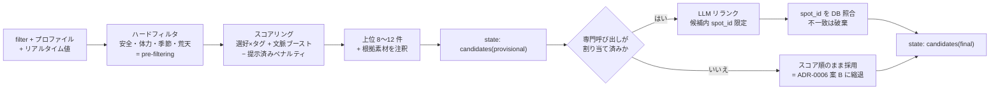

### 19.2 T2 `plan_itinerary` / T3 `edit_itinerary`

**何が複雑か — この Tool が本システムで最も中身の重い部品である。**4 つのことを 1 つの Tool の責務にまとめている。

1. **`ops` の適用**(編集時)。`locked` を固定し、`revert` はソルバーを迂回する
2. **ソルバーを 3 回回す** — 解 A(目的関数最良)/ B(別の POI 集合)/ C(ゆったり版)。43 地点なら 1 回数十〜数百 ms なので 3 回でも誤差([recommendation_planning.md](recommendation_planning.md) §4.3)
3. **譲歩の内訳を作る** — 全述語でペナルティを再評価し、「どの希望をどれだけ譲ったか」を構造化データにする。**`respond` が日本語にする材料**
4. **OSRM で leg 経路を引く** — ここまでを 1 つの Tool に含めるのは「旅程はあるが経路がない」中間状態を作らないため(§2)

**ソルバー本体(ILS)の仕組みは [recommendation_planning.md §4.5](recommendation_planning.md) に図解がある**ので本文書では繰り返さない。ここで押さえるべきは、**この Tool の中で LLM が触るのは「A/B/C のどれを採るか」の 1 点だけ**で、時刻の割り付け・移動時間の加算・制約の評価はすべてコードだという境界である。

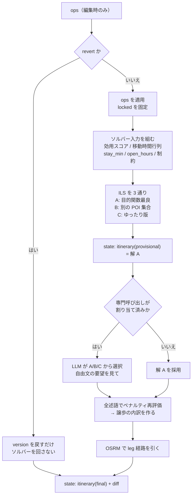

- **経路取得までがこの Tool の責務**(§2)。「旅程はあるが経路がない」中間状態を作らない
- **ハード制約は物理的整合だけ**なので解なしは起こらない([ADR-0005](../adr/0005-itinerary-solver.md))。譲歩は必ず内訳として返る

### 19.3 T4 `search_knowledge` / T5 `ask_user`

`search_knowledge` は**サブエージェントであり、単純ではない**。中身は [narration_qa.md](narration_qa.md) を正とする。ここで押さえるべきは 1 点 —— **返る `answer_ja` は `respond` の素材であって、ユーザーに見せる文章ではない**(そのまま流すと話者が 2 人になる)。`ask_user` は**ガードレールを通してイベントを出すだけ**で、質問文そのものは `respond` が書く。

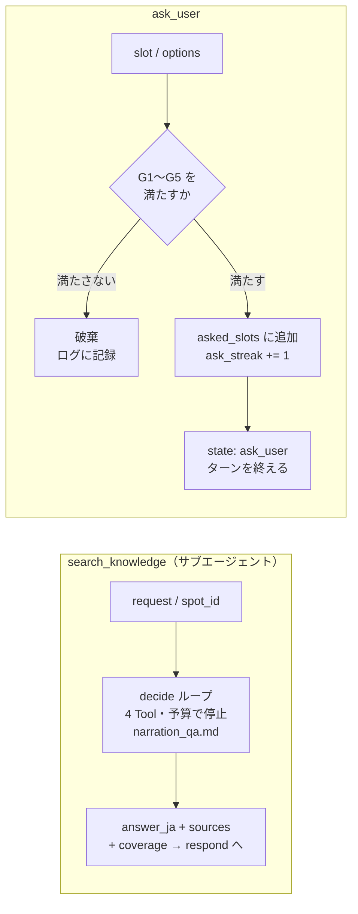

## 20. スレッドの派生状態と Tool の事前条件

> **§15.7 の `TurnState` と混同しないこと。**`TurnState` は**1 ターンの中だけ**生きるグラフの受け渡し用オブジェクト。本節が扱うのは**ターンをまたいで続く**スレッドの状態で、こちらは DB にしか存在しない。

### 20.1 状態は保存しない — 毎ターン DB から導出する

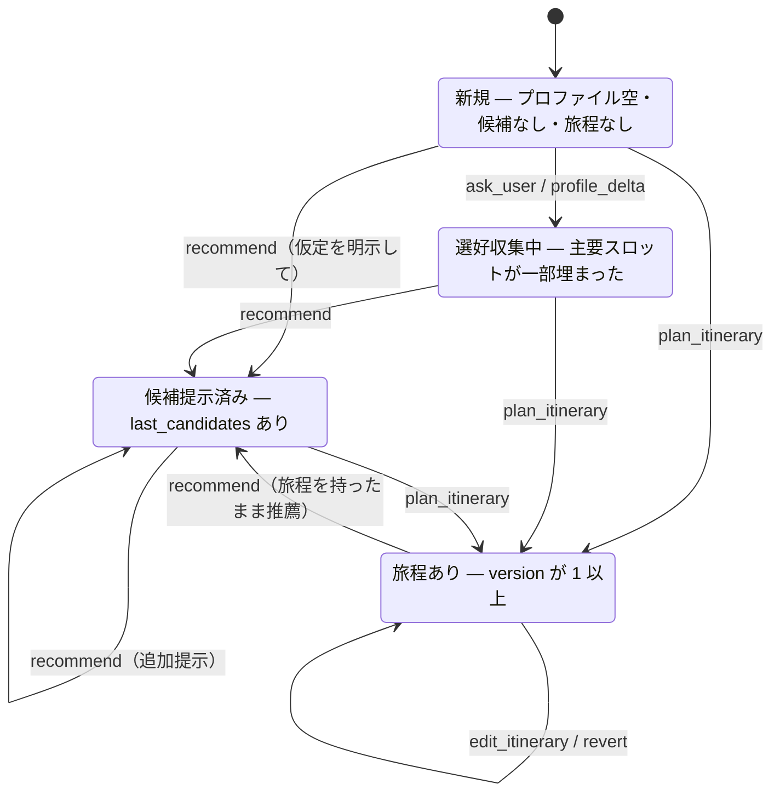

**これは「保存する状態機械」ではない。**プロファイル・`last_candidates`・旅程 version という **DB の事実から毎ターン導出される派生状態**である(§4.1「プロセス内キャッシュは持たない」)。実装上どこかに `state` 列を持つのではなく、`load_context` の結果から計算する。

**S2 → S3 の一方通行がない**ことに注意。旅程を作った後も推薦は使えるし、旅程を持たないまま推薦だけを続ける使い方も正当である(§4.3)。

### 20.2 事前条件の表

| Tool | 事前条件 | 満たさないときの扱い |
| --- | --- | --- |
| `recommend` | なし | — |
| `plan_itinerary` | `days`(日付・時間枠)が決まる | **既定値を仮定して実行し、仮定を明示したうえで末尾に確認の `ask_user` を添える**(2026-07-31 決定。下記) |
| `edit_itinerary` | **旅程が存在する** | その手を破棄し「まだ旅程がありません」を `respond` に渡す |
| `edit_itinerary`(`revert`) | 旅程の version ≥ 2 | 同上(「戻せる変更がありません」) |
| `search_knowledge` | **サブエージェント自身のコンテキスト予算**(§2.1) | 埋め込みサーバ断 → 字句検索へ縮退 / CB 開放 → Web なしで続行 |
| `ask_user` | G1〜G5(選好の聞き取り専用) | 破棄しログに記録 |

**聞き返し(`understand` の分岐)には別の事前条件 G6〜G9 がかかる**(§3.4 / §5.1)。これは Tool ではないので本表には現れない。

**`plan_itinerary` の `days` が足りないときの扱い(2026-07-31 決定)。**質問に振り替えるのではなく、**仮定して作る**。

| 不足しているもの | 既定値 |
| --- | --- |
| 日付 | 翌日 |
| 開始・終了時刻 | 09:00〜17:00 |
| 起点・終点 | 旅程に宿があればそれ、なければエリアの主要アクセス拠点 |

そのうえで **`respond` が仮定を明示し**(「明日 9 時発・17 時戻りで組みました」)、**末尾に確認の `ask_user` を添える**(P5 は末尾を許す)。

理由は [ADR-0007](../adr/0007-preference-elicitation.md) の **G4「推薦要求に対して質問だけを返さない」と同じ**である。旅程要求に対して質問だけを返すのも、同じ意味でユーザーを手ぶらで帰すことになる。**仮定は間違っていてもよい** — 目に見える形で提示されていれば、ユーザーは 1 ターンで直せる。

**この表は §5 のガードレール表と同じ性質のもので、層 1 自動テストの仕様になる。**

## 21. 代表シナリオのシーケンス

### 21.1 初回の聞き取り(LLM 2 回)

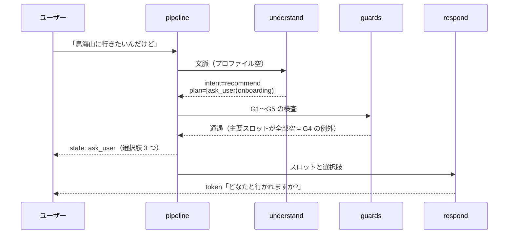

### 21.2 複合要求(LLM 3 回・一括プラン方式の本領)

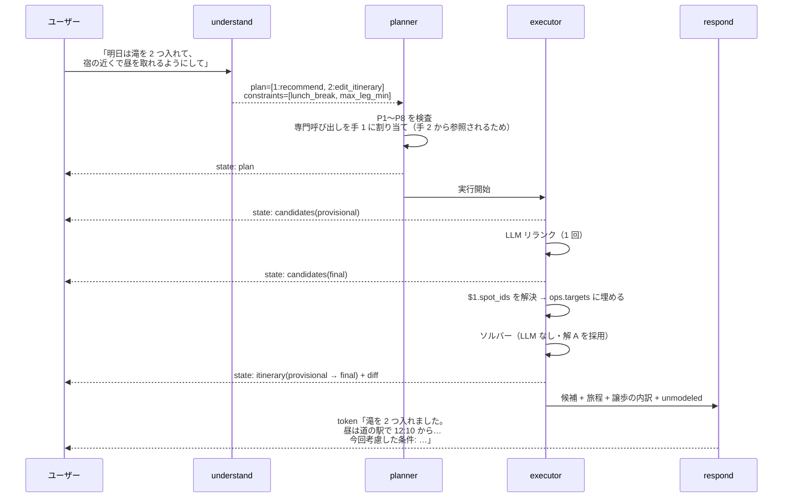

**手 2 は専門呼び出しを得られないので解 A をそのまま使う**(§1.5)。品質は落ちるが動作は壊れない。

### 21.3 自然言語の undo

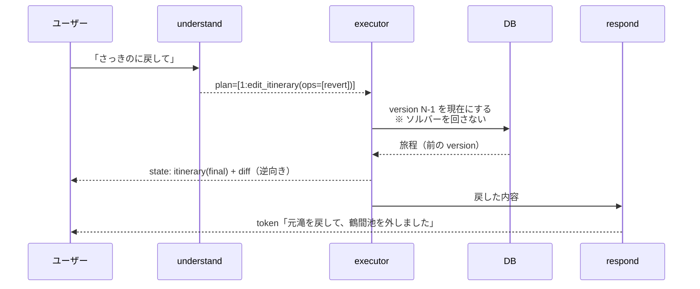

## 22. モジュール構成と依存

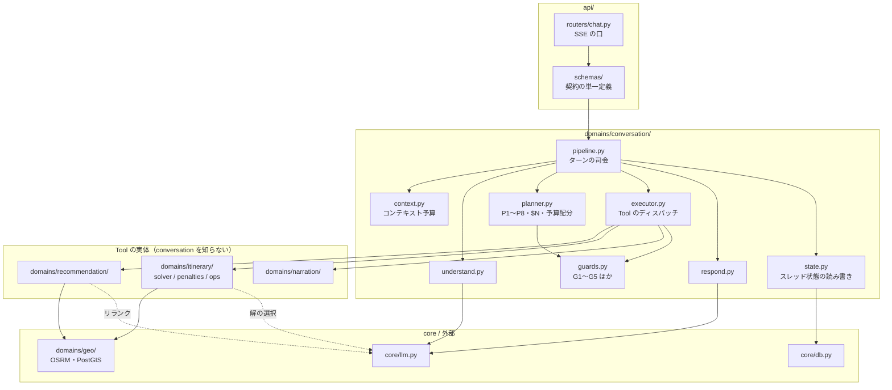

**依存の向きの規則**(逆流禁止。[20_architecture.md §3](../20_architecture.md) の再掲ではなく、エージェント内部の細則):

1. `conversation` は Tool を知るが、**Tool は `conversation` を知らない**([ADR-0008](../adr/0008-plan-then-execute.md))。`recommendation` / `itinerary` / `narration` は単体でテストできる
2. **`guards` はどこからでも呼べるが、何も呼ばない**(純粋関数の集まり)。層 1 自動テストの主対象
3. **`core/llm.py` を経由しない LLM 呼び出しを作らない**。モデル依存の後処理・リトライ・タイムアウト・ログ出力を一元化するため(NFR-1)
4. `state.py` 以外が `threads` テーブルを直接触らない

## 23. 論点の決着(2026-07-31)

Part II の 5 論点、`understand` から派生した 3 件、[agent_patterns_survey.md](agent_patterns_survey.md) の 6 件を**まとめて決着させた**。決定内容は各節に反映済みで、以下は記録である。

| # | 論点 | 決定 | 反映先 |
| --- | --- | --- | --- |
| 1 | 制約をターン全体の値に移す | **採用** | §18.1 |
| 2 | `persist` は `respond` の成否に関わらず走る | **採用** | §16.6 |
| 3 | サブエージェントを切り出すか | **切り出さない。ADR-0009 を起こした** | §17 / [ADR-0009](../adr/0009-no-subagents.md) |
| 4 | Tool 契約の過不足 | **`ToolError` 型を追加**(不足していた) | §18.2 |
| 5 | `plan_itinerary` の `days` 不足時 | **既定値を仮定して実行 + 仮定の明示 + 末尾に確認質問**(質問だけを返さない) | §20.2 |
| 6 | `selection_hints` の追加 | **採用**(これがないと不変条件が数えられない) | §3.1 |
| 7 | `constraints` の永続化 | **旅程行に紐づける。**あわせて **`constraints_remove` を追加**(取り消せないと制約が張り付く) | **§4.4** / §3.1 / §7 |
| 8 | 固有名を名寄せして `spot_id` 語彙に足す | **採用** | §3.2 |
| 9 | `understand` のフィールド順の入れ替え | **採用**(根拠 → 結論) | **§3.1.1** |
| 10 | スキーマに説明文・境界例を付ける | **採用**。ただし PARSE の reflection ループは採らない | §3.1.2 |
| 11 | 制約付きデコーディングに関する §3.2 の記述 | **修正した**(文献が割れているので両論を書き、対処が「スキーマを直す」であることを明示) | §3.2 |
| 12 | `$N` 検証の強化 | **採用**(型整合・戻り値の種類・循環検出を追加) | §1.3 **P4** |
| 13 | 反復ループ対策 | **採用**(我々のモデル系列で報告されている) | §9 |
| 14 | プロンプトの並び順 | **採用**(prefix cache と lost-in-the-middle に同時に効く) | §7.1 |
| 15 | 検証失敗時の再計画 | **採らない**(§24 に理由) | — |
| 16 | Tool I/O の並列化 | **Tool の内側だけ採る。手の並列実行はしない** | §24 |
| 17 | 抽出の評価集合 | **作る。ただしシナリオ台本から派生させ、別途 authoring しない** | §24 |
| **18** | **`understand` に聞き返しをさせるか**(ユーザー提案) | **させる。`ask_user` と `done` の 2 Tool を持つ有界エージェントにする。**Tool として plan に置く案は「参照が解けていないのに plan を書かせる」矛盾があるため採らない | **§3.4** / §5.1 / §15.6(E6)/ [ADR-0010](../adr/0010-understand-bounded-agent.md) |

## 24. 改訂履歴と、採らなかったもの(2026-07-31)

### 24.1 何を変えたか

[agent_patterns_survey.md](agent_patterns_survey.md) の調査(Codex 実施 → Claude が一次資料検証)を受けた改訂。**Part I の §1.3 / §3.1 / §3.2 / §4 / §7 / §9 にも手を入れている**ため、Part I の状態は「承認 + 2026-07-31 改訂」とした。

**設計思想は変えていない。**変えたのは (a) スキーマの形、(b) 検証の細かさ、(c) 状態の寿命 の 3 つで、いずれも「LLM の裁量を増やさずに品質を上げる」方向にある。

### 24.2 採らなかったもの

| 採らないもの | 理由 |
| --- | --- |
| **検証失敗時の再計画** | グラフの巡回が 1 か所(§15.6)という性質は、この設計の分析しやすさの根幹である。加えて **1 ターンごとにユーザーが応答する対話システムでは、次の発話が事実上の再計画になる。**機械的な再計画は人間のループと重複する。`respond` が「〇〇はできませんでした」と伝える現行の縮退で足りる。**中止率が実測で高ければ再検討する** |
| **手(ステップ)の並列実行** | 原典(LLMCompiler)の 3.7× は並列実行によるものだが、本件は最大 3 手で独立な組み合わせが `recommend` + `search_knowledge` 程度しかない。得られる短縮に対し、executor の逐次的な失敗処理(スキップ / 中止)が複雑になる代償が大きい。**Tool の内側の I/O 並列化(OSRM の leg 取得など)は採る** |
| **同一 GPU への LLM 呼び出しの並列化** | 総スループットは上がっても個々の TTFT が悪化しうる。しかも本件の GPU は他プロセスと共有している。**§17 案 1(`understand` の並列二分割)も、この理由で「計測してから」のままにする** |
| **`understand` に自由記述の「考える欄」を置く** | §3.1.1 の並び替えで、抽出フィールド自体が構造化された思考の場になっている。自由文はトークンとレイテンシを増やし、どこにも接地しないフィールドを 1 つ増やす |
| **常時の self-consistency / LLM critic / reflection** | いずれも 1 ターン 2〜3 回という予算を壊す。型・参照・DSL 規則で判定できるものはコードで足りる |
| **span / OpenTelemetry の先行導入** | 単一プロセスの研究プロトタイプには構造化ログ(§10)で足りる。GenAI semantic conventions は status が Development。**実装後に必要になったら足す**(2026-08-01: NFR-7 削除で計測そのものをやめたため、さらに不要になった) |

### 24.3 `understand` の聞き返し(2026-07-31 追加、ユーザー提案)

**この改訂だけは性格が違う。**他が「LLM の間違いを検出して落とす」精度の話だったのに対し、これは**「分からないときに聞ける」という能力の追加**である。§24.1 で「設計思想は変えていない」と書いたが、**ここは 1 つだけ思想が増えた** — 従来は「間違いは検出して事後報告する」だけだったところに、**「進む前に確かめる」**が加わった。

詳細は §3.4 と [ADR-0010](../adr/0010-understand-bounded-agent.md)。要点だけ:

- **LLM 呼び出しは増えない**(どちらの分岐でも `understand` は 1 回、ターン合計 2〜3 回のまま)
- **ターン内にループを作らない**ので [ADR-0008](../adr/0008-plan-then-execute.md) と矛盾しない。グラフに増えるのは片道の辺 1 本(E6)
- **最大のリスクは「聞きすぎ」。**G6〜G9 で縛る。加えて §7 の会話履歴(直近 3 ターンを生テキストで渡す)が第一防衛線として効く。**計測はしない**ので、多いと感じたら G9 を厳しくする

### 24.4 実装時に一度だけ確かめるもの

**計測の仕組みは持たない**(§10。NFR-7 削除)。それでも**開発中に一度は確かめておかないと判断できない**ものがあるので、対象を絞って挙げる。**これは開発時の確認であって、動かし続ける機能ではない。**

| 確かめるもの | なぜ |
| --- | --- |
| **フィールド順の入れ替えの効果** | §3.1.1 は**理屈は通っているが本件での実証がない** |
| guided decoding の有無による抽出品質の差 | §3.2。文献が割れているため |
| ILS と厳密解の最適性ギャップ | [ADR-0005](../adr/0005-itinerary-solver.md) |

**確かめるための入力は、シナリオ台本([recommendation_planning.md §7](recommendation_planning.md) 層 2)から流用する。**台本 5〜10 本 × 各 4〜6 ターンで 30〜50 発話が得られるので、**別途書き起こさない。**これに、照応が紛らわしいものと表現できない要望を 10 件ほど手で足す。

### 24.5 2026-08-01 の改訂

| 変えたもの | 何を |
| --- | --- |
| **§10 を全面改訂** | **NFR-7(計測可能性)を要求から削除。**`turn_metrics` / `unmodeled_log` テーブル、`export-metrics` CLI、SSE `done` の `metrics` をすべて廃止。残るのは構造化ログ(stdout)のみ。縮退の明示は NFR-5 が引き続き要求する |
| **§7.2 を新設** | **会話履歴の構築方式を決定。**近いほど詳しい 3 層(直近 3 ターンは生 / それ以前は user 生 + assistant イベント要約 / 予算 4,000 超過は破棄)。**要約 LLM は呼ばない** |
| §7.1 の並び順 | 履歴を厚くしたのに伴い、`spot_id` 語彙を履歴より前に移した(伸びる部分を末尾寄りに) |
| §4.1 の状態表 | `unmodeled_log` / `turn_metrics` の行を削除 |

**§7.2 で当初案を 1 つ撤回した。**当初は「`understand` には assistant の生テキストを渡さない」という非対称設計にしていたが、**「そこ、混むって言ってたよね」のようなアシスタント応答本文への指示語が解けない**ため誤りだった。チャット形式である以上、アシスタントの発言も会話の一部であり、指示語の参照先になる。
