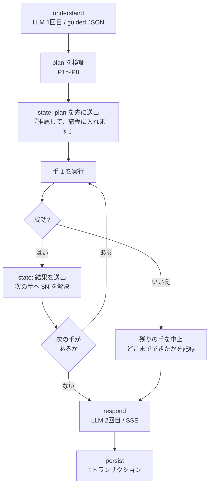
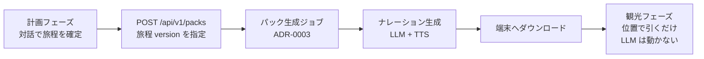

# 旅程計画フェーズ — AI エージェントの設計

- 状態: **草案(ユーザーレビュー待ち)**
- 日付: 2026-07-31
- 前提文書: [00_project.md](../00_project.md)(2 フェーズの定義) / [10_requirements.md](../10_requirements.md)(FR-1〜FR-3) / [20_architecture.md](../20_architecture.md) §3〜§4
- 前提となる決定: [ADR-0004](../adr/0004-conversation-pipeline.md)(パイプライン) / [ADR-0005](../adr/0005-itinerary-solver.md)(ソルバー) / [ADR-0006](../adr/0006-recommendation-hybrid.md)(推薦) / [ADR-0007](../adr/0007-preference-elicitation.md)(選好の引き出し) / [ADR-0008](../adr/0008-plan-then-execute.md)(制御構造)
- 方式の根拠: [30_design/recommendation_planning.md](recommendation_planning.md)(調査と方式比較)

> **この文書の位置づけ**
> [recommendation_planning.md](recommendation_planning.md) が「**推薦と旅程プランニングを何で解くか**」を決めたのに対し、本文書は「**それらを対話の中でどう動かすか**」を定める。つまりエージェント本体の設計であり、実装の直接の入力になる。
> 対象は**旅程計画フェーズのみ**。観光フェーズ(オフライン案内)は別文書で扱う(§11 に接続点だけ書く)。

---

## 0. この文書の範囲 — 2 つのフェーズの境界

[00_project.md](../00_project.md) が定める 2 フェーズは、**アーキテクチャとして別物**である。同じ「AI」でも動き方が違う。

| | **計画フェーズ(本文書)** | **観光フェーズ(別文書)** |
| --- | --- | --- |
| いつ | 出発前 | 現地 |
| ネットワーク | インターネットあり | なし(LoRaWAN ダウンリンクのみ) |
| 駆動するもの | **ユーザーの発話** | **現在地(と受信したリアルタイム値)** |
| LLM | **対話のたびに呼ぶ** | **呼ばない**(計画フェーズで事前生成済み) |
| 出力 | プロファイル・旅程・パック生成の指示 | 音声案内の再生 |
| 主な設計課題 | 意図の理解・制約の抽出・解の構成・説明 | 狭帯域配送・事前生成の網羅性・オフライン動作 |

**つまり「エージェント」と呼べるのは計画フェーズだけ**である。観光フェーズは事前生成済み資材を位置で引くだけの決定的な仕組みにする(FR-4.1〜4.4)。この非対称性は意図的で、オフラインで LLM を動かせない制約から必然的に導かれる。

境界にある唯一の接続点は「**確定した旅程 → パック生成ジョブ**」で、§11 に書く。

---

## 1. エージェントの制御構造 — 一括プラン方式(Plan-then-Execute)

### 1.1 決定と、比較した 3 案

**決定(2026-07-31、ユーザー判断): 一括プラン方式を採る。**`understand` が「使う道具の列」を 1 回の JSON 出力で決め、コードがそれを順に実行する。詳細な理由は [ADR-0008](../adr/0008-plan-then-execute.md)。

| 案 | 構造 | 1 ターンの LLM 呼び出し | 複合要求 | 評価 |
| --- | --- | --- | --- | --- |
| A. 固定パイプライン | 1 ターン 1 道具 | 2〜3 回(固定) | **2 ターンに分かれる** | 最も単純だが、「滝を 2 つ入れて」のような**推薦と旅程編集をまたぐ要求が 1 ターンで通らない** |
| **B. 一括プラン【決定】** | `understand` が道具の列を出し、コードが順に実行 | **2〜3 回(固定)** | **1 ターンで通る** | 呼び出し数を増やさずに複合要求を捌ける。代償は「道具の結果を見て次を決められない」こと(§1.2 で補う) |
| C. 有界 ReAct ループ | `act` が最大 N 周、毎周 LLM が次の道具を判断 | 3〜6 回(可変) | 結果を見ながら詰められる | 最も柔軟だが**レイテンシが読めず**(NFR-3)、31B の多段自律判断は TravelPlanner 系で 0.6% 台の失敗域(§2.2)。研究プロトタイプの計測可能性(NFR-7)も落ちる |

**案 B の弱点を正しく認識しておく。**道具の結果を見て次の道具を選べないので、「推薦結果を眺めてから、良さそうなものを旅程に入れる」という**適応的な段取りができない**。これを埋めるのが次の §1.2 である。

### 1.2 プランの表現 — ステップ参照 `$N` がこの方式の必須要素

道具の結果を**値として**見られなくても、**参照として**繋ぐことはできる。「手 1 が返したものを手 2 に渡す」と書けさえすれば、複合要求のほとんどは通る。

```jsonc
// 「明日は滝を2つ入れて、宿の近くで昼を取れるようにして」
"plan": [
  {"id": 1, "tool": "recommend",
   "args": {"filter": {"tags": ["滝"], "day": 2}, "k": 2}},
  {"id": 2, "tool": "edit_itinerary",
   "args": {"ops": [{"op": "add", "targets": "$1.spot_ids", "day": 2}],
            "constraints": [{"pred": "lunch_break", "args": {"from": "11:30", "to": "13:30", "min": 60}},
                            {"pred": "max_leg_min", "args": {"n": 20}, "scope": "lunch"}]}}
]
```

`$1.spot_ids` は**コードが解決する**(LLM 呼び出しは発生しない)。参照の語彙は述語と同様に**閉じた集合**にし、それ以外の記法は受け付けない:

| 参照 | 意味 | 出せる道具 |
| --- | --- | --- |
| `$N.spot_ids` | 手 N が返した spot_id の列(推薦なら最終候補、旅程なら訪問順) | `recommend` / `plan_itinerary` / `edit_itinerary` |
| `$N.spot_ids[:k]` | 上位 k 件 | 同上 |
| `$N.itinerary` | 手 N が作った旅程 | `plan_itinerary` / `edit_itinerary` |

**制約**: 前方参照のみ(`$N` は自分より前の手だけを指せる)。解決できない参照はその手をスキップし、**何ができなかったかを `respond` に渡す**(無言で落とさない。FR-3.3)。

### 1.3 プランの検証 — コードで縛る

LLM が出した `plan` は、実行前に**コードで検証する**。ここは LLM の裁量に任せない。

| # | 規則 | 違反時の扱い |
| --- | --- | --- |
| P1 | **手は最大 3 つ** | 4 手目以降を破棄 |
| P2 | 道具名は既知の enum のみ | 不明な道具の手を破棄 |
| P3 | 引数がスキーマに適合する | 不適合の手を破棄 |
| P4 | `$N` は前方参照のみ・解決可能 | その手をスキップ |
| P5 | **`ask_user` は末尾にしか置けない** | 末尾以外の `ask_user` を破棄(質問したらターンは終わる) |
| P6 | **同一ターンで旅程を書き換える手は 1 つまで** | 2 つ目以降を破棄(§4.2 のバージョン管理を単純に保つ) |
| P7 | **追加 LLM 呼び出しは plan 全体で 1 回まで** | §1.5 の優先順位で 1 手だけに割り当てる |
| P8 | 全手が破棄されたら「道具なし」として `respond` だけ実行 | ユーザーには「理解できなかった」旨を返す |

破棄した手は**握り潰さず** `turn_metrics` に記録し、`respond` にも渡す。これがプロンプト改善のシグナルになる(§9)。

### 1.4 実行と、途中で失敗したとき



- **`state: plan` を最初に送出する**のは一括プラン方式ならではの利点である。「今から何をするか」を LLM の応答生成を待たずに提示できる(ChatGPT の検索表示に相当)。UX 上の価値が大きく、実装コストはほぼゼロ
- **手 k が失敗したら残りは実行しない。**部分的に矛盾した状態を作らないため。ただし**そこまでの結果は捨てない**(推薦だけ成功して旅程編集が失敗したら、推薦は見せる)
- **DB への書き込みは全手の完了後に 1 トランザクション**(`persist`)。途中失敗なら旅程は前の version のまま残る。`state` イベントで provisional を送っていても DB は書かない

### 1.5 追加 LLM 呼び出しの割り当て

`recommend`(リランク)と `plan_itinerary`/`edit_itinerary`(3 解からの選択)は、どちらも LLM 補助を使いうる。**1 ターンの追加呼び出しは 1 回まで**(P7)なので割り当て規則を決めておく:

1. **他の手から `$N` で参照されている手を優先する** — その出力が下流に影響するため
2. 参照されている手が複数あれば、**最も早い手**
3. 参照が一つもなければ、**最後の手**

LLM 補助を得られなかった手は**決定的な結果をそのまま使う**(推薦ならスコア順 = ADR-0006 の案 B に縮退、旅程なら目的関数最良の解 A)。品質は落ちるが動作は壊れない。

---

## 2. 道具カタログ

`act` が実行できる道具は 5 つ。**これ以外を追加するときは本文書を先に更新する**(Docs 駆動開発)。

| 道具 | 引数 | 返すもの | LLM 補助 | 主な担当 |
| --- | --- | --- | --- | --- |
| `recommend` | `filter`(tags / mobility / weather_fit / area / day)、`k`、`exclude` | `spot_ids` + 根拠素材 | あり(リランク) | FR-1.2 |
| `plan_itinerary` | `days`(日付・開始終了時刻・起終点)、`constraints`、`must_visit` | `itinerary` × 3 + 譲歩の内訳 | あり(解の選択) | FR-2.1 |
| `edit_itinerary` | `ops`(add/remove/move/replace/lock/set_stay/set_time)、`constraints` | `itinerary` + `diff` + 譲歩の内訳 | あり(解の選択) | FR-2.1 |
| `answer_qa` | `query`、`spot_id?` | 知識ベースの抜粋(出典つき) | なし | FR-3 |
| `ask_user` | `slot`、`options` | — (ターンを終える) | なし | FR-1.1 |

**設計の要点**

- **経路の取得は独立した道具にしない。**`plan_itinerary` / `edit_itinerary` が旅程を確定させた後、OSRM で leg 経路を引くところまでを 1 つの道具の責務にする。「旅程はあるが経路がない」中間状態を作らないため(FR-2.2)
- **`answer_qa` は検索して素材を返すだけ**で、文章化は `respond` がやる。道具が日本語を書くと、`respond` と二重に文章生成が走る
- **`ask_user` だけは副作用が「ターンを終わらせる」**という特殊な道具である。したがって P5(末尾のみ)と ADR-0007 の G1〜G5 が二重にかかる
- 道具はいずれも**クローズドワールド**を守る: 入出力の POI はすべて `spot_id`。表示名・座標・写真は DB から引く(ADR-0006)

---

## 3. `understand` の出力スキーマ

エージェントの挙動はほぼこのスキーマで決まる。**guided decoding で構造を強制し、値も可能な限り enum で縛る。**

### 3.1 スキーマ(全体)

```jsonc
{
  "intent": "recommend | plan | edit | qa | profile_only | chitchat | unclear",

  "plan": [                                    // 最大 3 手。空でもよい(chitchat)
    {"id": 1, "tool": "recommend", "args": { /* 道具ごとのスキーマ */ }}
  ],

  "profile_delta": {                           // 差分のみ。null 可
    "interests": {"滝": 0.6},                  // キーは実在タグ語彙の enum
    "party": "family_kids",
    "mobility": "short_walk_ok",
    "pace": "relaxed",
    "avoid": ["長時間歩行"],
    "notes": "午後は温泉に入りたい"
  },

  "constraints": [                             // §4.4 の述語 DSL
    {"pred": "not_consecutive", "args": {"target": "神社"},
     "weight": 0.6, "source": "似た所が続くと子どもが飽きる", "handling": "dsl"}
  ],

  "score_adjustments": [
    {"spot_id": "spot_017", "delta": 0.4, "why": "静かで人が少ない", "handling": "weight"}
  ],

  "unmodeled": [
    {"text": "屋台が出てたら寄りたい", "handling": "unmodeled"}
  ],

  "references": [                              // 照応の解決結果(§3.3)
    {"surface": "2番目のやつ", "spot_id": "spot_012"}
  ]
}
```

**`handling` は全要望に必須**(enum: `dsl` / `weight` / `selection` / `unmodeled`)。これが [ADR-0005](../adr/0005-itinerary-solver.md) の「無言破棄の禁止」不変条件を成立させる鍵で、**LLM に「これは表現できません」と自己申告させる**ためのフィールドである。

### 3.2 enum で強制するもの

| 項目 | 語彙 | 効果 |
| --- | --- | --- |
| `tool` | 5 種類(§2) | 存在しない道具を呼べない |
| `pred` | 11 種類(§4.4) | 未知の述語が生まれない |
| `interests` のキー | DB 実在のタグ語彙 | 自由語の増殖を防ぐ |
| `party` / `mobility` / `pace` | 定義済みの値 | プロファイルの型が壊れない |
| **`spot_id`** | **その文脈で参照可能な id のみ**(§3.3) | **POI のハルシネーションが構造的に不可能になる** |

`spot_id` の enum は 43 件全部ではなく、**「現在の旅程 + 直近の候補 + 直近の会話で言及された POI」に絞る**。文脈上あり得ない POI を指せなくなり、同時にプロンプトも短くなる。

> **JSONSchemaBench (arXiv:2501.10868)** は、制約付きデコーディングが精度を落とさないことを報告している(よく言われる「10〜15% 劣化」を否定)。ただし vLLM は評価対象に含まれていないため、**実装後に guided decoding の有無で `understand` の抽出品質を一度測る**(§9)。

### 3.3 照応の解決 — 「2 番目のやつ」を誰が spot_id にするか

対話では POI が名前で呼ばれない。「**2 番目のやつ**」「**さっきの滝**」「**それ**」が普通に来る。これを解けないと道具が呼べない。

**方式: `understand` が解決し、コードが検証する。**

1. プロンプトに `last_candidates`(直近に提示した候補、序数つき)と現在の旅程を載せる
2. LLM は `references` に「表層 → spot_id」の対応を出す
3. **コードが spot_id を DB と `last_candidates` に照合**する。照合できなければ、その参照を使う手を破棄し「どれのことか分かりませんでした」を `respond` に渡す

序数・別名の辞書(`鶴間池` / `つるまいけ` / `2 番目`)は**推薦ドメインの名寄せ辞書**として持ち、LLM の解決を補助する。LLM だけに任せない理由は、序数の取り違えが**静かに間違った POI を旅程に入れる**という気づきにくい失敗を生むためである。

---

## 4. 状態の設計

### 4.1 何をどこに置くか

| 状態 | 置き場所 | 寿命 | 用途 |
| --- | --- | --- | --- |
| `profile` | `profiles` テーブル(JSONB) | **ユーザー永続** | FR-1.1 / FR-2.3 |
| `itinerary` | `itineraries`(version 付き) | **ユーザー永続** | FR-2.3・undo |
| `messages` | `messages` | スレッド永続 | 文脈構築 |
| `presented_spot_ids` | スレッド行 | スレッド | 反復推薦の防止(ADR-0006) |
| `last_candidates` | スレッド行 | スレッド | **照応解決(§3.3)** |
| `asked_slots` | スレッド行 | スレッド | ガードレール G2 |
| `ask_streak` | スレッド行 | スレッド | ガードレール G3 |
| `unmodeled_log` | `unmodeled_log` | 永続(分析用) | 述語追加のシグナル(§4.4 経路 4) |
| `turn_metrics` | `turn_metrics` | 永続 | NFR-7 |

**プロセス内キャッシュは持たない。**状態は毎ターン DB から再構築する([ADR-0004](../adr/0004-conversation-pipeline.md))。旧実装の `MemorySaver` が起こした「session_id が全ユーザー共通になる」型の事故を構造的に不可能にするため。

### 4.2 旅程のバージョンと undo

- 旅程は**変更のたびに `version + 1` で新しい行を書く**(上書きしない)
- `state: itinerary` には `diff`(追加・削除・移動した項目)を付ける
- **undo は「1 つ前の version を現在にする」だけ**。ソルバーを再実行しない(再実行すると別の解が出てしまい undo にならない)
- 保持する version 数の上限は実装時に決める(当面は全保持でよい規模)

---

## 5. ガードレール層 — LLM の裁量に任せないもの一覧

本設計で**コードが強制する**規則を一箇所に集める。実装時はこれが 1 つのモジュール(`domains/conversation/guards.py` 相当)になる。

| 由来 | 規則 |
| --- | --- |
| §1.3 | P1〜P8(プランの検証) |
| §1.5 | 追加 LLM 呼び出しは 1 ターン 1 回 |
| ADR-0007 | G1 1 ターン 1 問 / G2 同じスロットを 2 回聞かない / G3 連続 `ask_user` は 2 ターンまで / G4 推薦要求に質問だけを返さない / G5 選択肢 2〜4 個 + 自由入力 |
| ADR-0006 | クローズドワールド(`spot_id` の DB 照合、不一致は破棄) |
| ADR-0006 | 地理計算を LLM にさせない(距離・所要時間は PostGIS/OSRM で計算して自然文で注入) |
| ADR-0005 | 述語の検証(未知の述語・実在しない引数は `unmodeled` に落とす。例外にしない) |
| ADR-0005 | 要望の分類網羅性(`抽出数 == dsl + weight + selection + unmodeled`) |
| §3.3 | 照応の照合(解決できない参照を使う手は破棄) |

**この表が層 1 自動テストの仕様書でもある**(§9)。

---

## 6. SSE イベント契約

UI の状態は**すべて `state` イベント由来**とし、ストリーム本文のパースで状態を作らない(ADR-0006)。

```
event: state   {"kind":"plan","steps":[{"id":1,"tool":"recommend"},{"id":2,"tool":"edit_itinerary"}]}
event: state   {"kind":"candidates","phase":"provisional","items":[{"spot_id":"...","reason_materials":{...}}]}
event: state   {"kind":"candidates","phase":"final","items":[...]}
event: state   {"kind":"itinerary","phase":"provisional","itinerary":{...}}
event: state   {"kind":"itinerary","phase":"final","itinerary":{...},"diff":{...},"concessions":[...]}
event: state   {"kind":"ask_user","slot":"mobility","options":["あまり歩きたくない","30分程度なら","登山もしたい"]}
event: state   {"kind":"profile","profile":{...}}
event: token   {"text":"..."}
event: error   {"stage":"act","code":"solver_timeout","degraded":true,"message":"最適化を打ち切りました"}
event: done    {"turn_id":"...","metrics":{...}}
```

- `phase: provisional` → `final` の 2 段送出が[ADR-0006](../adr/0006-recommendation-hybrid.md) 形-2 の中身。**カードと地図は provisional で先に描画される**
- `error` は**縮退したことを明示する**ためのイベントであり、握り潰さない(FR-3.3)。`degraded: true` は「動いたが品質が落ちた」、`false` は「失敗した」
- `done` に `metrics` を載せるのは、フロント側でも計測値を確認できるようにするため(NFR-7)

## 7. コンテキスト予算(`max_model_len` 16,384)

16K は「履歴 + プロファイル + カタログ + リアルタイム」を全部載せると足りない。**呼び出しごとに予算を決める。**

| `understand`(入力) | 目安 | 備考 |
| --- | --- | --- |
| システムプロンプト + 出力スキーマ | 1,200 | guided decoding のスキーマ込み |
| プロファイル | 200 | 構造化 + notes |
| 現在の旅程(要約形) | 400 | 時刻は落として訪問順と日付だけ |
| 直近の会話 | 2,000 | k ターン。溢れたら古い方から落とす |
| 参照可能な `spot_id` の語彙(enum) | 300 | §3.2 で絞ったもの |
| タグ語彙 | 150 | |
| ユーザー発話 | 200 | |
| **合計** | **約 4,500** | 出力 800 前後。**十分な余裕がある** |

| `respond`(入力) | 目安 | 備考 |
| --- | --- | --- |
| システムプロンプト | 600 | 必須事項 2 つを含む(§8) |
| 確定した候補 + 根拠素材 | 1,500 | 3〜5 件 |
| 旅程 + 譲歩の内訳 | 1,200 | |
| `unmodeled` + 破棄した手 | 200 | |
| 直近の会話 | 1,500 | |
| 知識ベースの抜粋(`answer_qa` 時のみ) | 2,000 | |
| **合計** | **約 7,000** | 出力はストリーミング |

**43 件のカタログ全件をプロンプトに載せる設計にはしない。**推薦は候補 8〜12 件に絞った後で LLM に渡す(ADR-0006)ので、カタログ全体を載せる必要がそもそも生じない。

## 8. `respond` の責務と制約

`respond` は**唯一ユーザーに見える日本語を書く場所**である。したがって制約もここに集まる。

**必ず守らせること(プロンプトで必須化 + 一部はコードで検査)**

1. **与えられた `spot_id` と事実だけを引用する**(クローズドワールド)
2. **「今回考慮した条件」を列挙する** — 抽出結果の可視化。ユーザーが取りこぼしを検知できる
3. **`unmodeled` を必ず言及する** — 「屋台については行程に組み込めていません」。反映できなかったことを隠さない
4. **破棄した手・失敗した手があれば伝える** — 「〇〇は分からなかったので飛ばしました」(FR-3.3)
5. **譲歩の内訳を日本語にする** — 「元滝は営業時間の都合で入りませんでした」

**やらせないこと**

- 数値の生成(距離・所要時間・時刻)。すべて与えられた値を引用するだけ
- POI 名の生成。`spot_id` から DB 引きした表示名だけを使う
- 旅程の再構成。`respond` は確定済みの結果を説明するだけで、内容を変えない

## 9. エラーと縮退

FR-3.3(無言の握り潰しをしない)と NFR-5(障害の局所化)に対応する。**どこが壊れると何が起きるか**を先に決めておく。

| 障害 | 縮退 | ユーザーへの表示 |
| --- | --- | --- |
| `understand` がタイムアウト | なし(致命) | 「うまく理解できませんでした」+ 再入力の促し |
| `understand` の JSON が不正 | **1 回だけ再試行** → 失敗なら致命 | 同上 |
| plan の全手が破棄された | 道具なしで `respond` | 「何をすればよいか分かりませんでした」 |
| リランク LLM が失敗/遅い | **provisional を final に昇格**(ADR-0006 案 B に縮退) | 表示不要(品質低下のみ)。`turn_metrics` には記録 |
| 解の選択 LLM が失敗 | **解 A(目的関数最良)を採用** | 同上 |
| ソルバーがタイムアウト | **貪欲解(改善なし)を返す** | `error{degraded:true}`「最適化を打ち切りました」 |
| ソルバーが解なし | **起こらない設計**(ソフト制約のみ。ADR-0005) | — |
| OSRM が落ちた | **直線距離 × 係数**で代用 | `error{degraded:true}`「移動時間は概算です」 |
| DB 書き込み失敗 | ロールバック | 「保存に失敗しました」。`state` で見せた内容は無効と明示 |
| `respond` がタイムアウト | `state` は既に届いている | 「応答の生成に失敗しました。旅程は保存されています」 |

**縮退は必ず `turn_metrics.degraded` に記録する。**「動いているように見えて実は縮退し続けている」状態を検知できるようにするため。

## 10. 計測(`turn_metrics`)

| 列 | 内容 |
| --- | --- |
| `turn_id` / `thread_id` / `user_id` / `created_at` | |
| `intent` / `plan`(実行した道具の列) | 何をしたターンか |
| `plan_rejected`(破棄した手と理由) | **プロンプト改善の主シグナル** |
| `llm_calls` / 各呼び出しの `duration_ms` / `prompt_tokens` / `completion_tokens` | NFR-7 |
| **`ttft_ms`** | NFR-3 の主指標 |
| `solver_ms` / `osrm_ms` / `db_ms` | ボトルネックの切り分け |
| `degraded`(縮退の種類) | §9 |
| `unmodeled_count` / `handling` の内訳 | §4.4 の 4 経路の分布 |
| `ask_user_slot` / `ask_streak` | ADR-0007 のガードレールが効いているか |

実装後に一度だけ測るもの(常時計測しない): **guided decoding の有無による抽出品質の差**(§3.2)、**ILS と厳密解の最適性ギャップ**(ADR-0005)。

## 11. パッケージ構成へのマッピング

[20_architecture.md §3](../20_architecture.md) の構造に本設計を割り当てる。

```
app/domains/conversation/
├── pipeline.py       # load_context → understand → act → respond → persist
├── understand.py     # プロンプト + 出力スキーマ(§3)
├── planner.py        # plan の検証(P1〜P8)と $N の解決(§1.2〜1.3)
├── executor.py       # 道具のディスパッチと失敗時の中止(§1.4)
├── guards.py         # ガードレール層(§5)
├── respond.py        # プロンプト + 必須事項(§8)
├── context.py        # コンテキスト予算の管理(§7)
└── state.py          # スレッド状態の読み書き(§4)

app/domains/recommendation/    # 道具 recommend の中身(ADR-0006)
app/domains/itinerary/         # 道具 plan_itinerary / edit_itinerary + ソルバー(ADR-0005)
│   ├── solver.py              #   ILS 本体
│   ├── penalties.py           #   述語レジストリ(§4.4 経路 1)
│   └── ops.py                 #   編集操作の適用
app/domains/narration/         # 道具 answer_qa の中身
```

**新規に必要なのは `itinerary` ドメイン**である([20_architecture.md §3](../20_architecture.md) の構成には存在しないので、同文書の更新が要る)。

## 12. 観光フェーズとの接続点

計画フェーズが観光フェーズに渡すものは **1 つだけ**: 確定した旅程。



- パック生成は**旅程の version を指定して起動する**。旅程が変わったら再生成が必要になるので、「どの version のパックを持っているか」を端末側が持つ
- **雨天代替行程の事前計算**([recommendation_planning.md](recommendation_planning.md) §4.2)を同梱するかは、観光フェーズの設計文書で決める
- 詳細は別文書(`30_design/guidance_phase.md`、未執筆)

## 13. 残っている論点(この文書のレビューで確認したいこと)

1. **`plan` の最大手数を 3 にしてよいか**(§1.3 P1)。増やすと複雑な要求が通るが、検証と説明が難しくなる
2. **ステップ参照の語彙を 3 つに絞ってよいか**(§1.2)。実際の対話で足りないパターンが出たら追加する運用でよいか
3. **`answer_qa` を道具に含めるか**。含めないなら「鶴間池ってどんな所?」は `respond` が知識なしで答えることになり、ハルシネーションの温床になる。含める前提で書いている
4. **undo の UI**(§4.2)。チャット上のボタンか、自然言語(「さっきのに戻して」)か、両方か
5. **旅程を持たない状態での推薦**をどう扱うか。推薦だけして旅程を作らない使い方(FR-1 単独)を認めるか、常に旅程に紐づけるか
