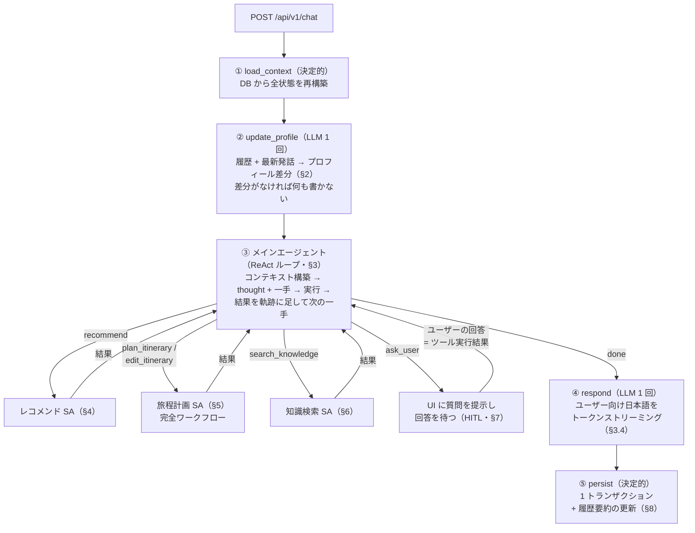
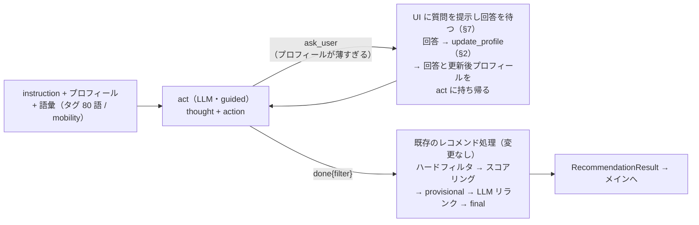
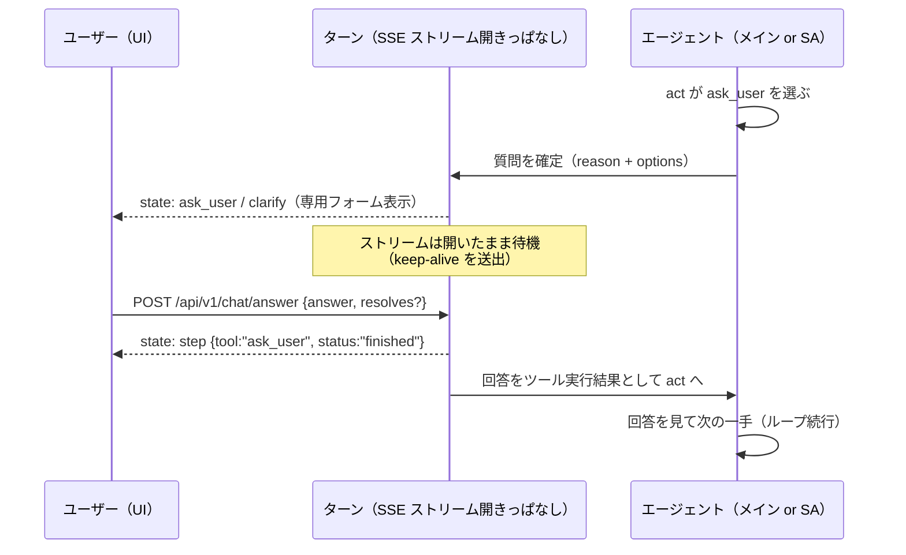

# 旅程計画フェーズ — ReAct メインエージェント + サブエージェント構成

- 状態: **決定稿(2026-08-04 論点決着・ユーザー承認 / 同日改訂: `ask_user` を Human-in-the-Loop の通常ツールに訂正)**
- 日付: 2026-08-03 発案(ユーザー指示)/ 2026-08-04 決定
- 決定の記録: [ADR-0019](../adr/0019-react-main-agent-subagents.md)
- 位置づけ: **本書が旅程計画フェーズのエージェント設計の正である。**これは旧設計の修正ではなく**完全な作り替え**である(ユーザー指示 2026-08-04)。旧 [agent_planning_phase.md](agent_planning_phase.md) と [understand_node.md](understand_node.md) は**廃止**(§15)
- 引き続き正である文書: [recommendation_planning.md](recommendation_planning.md)(推薦方式・ILS ソルバー・**述語 17 種の意味**)/ [narration_qa.md](narration_qa.md)(知識検索の内部)/ [data_model.md](data_model.md)(永続形)/ [chat_sse.md](../40_api/chat_sse.md)(API 契約)/ [20_architecture.md §4](../20_architecture.md) — いずれも本書に合わせて改訂済み(2026-08-04)

> **一言でいうと**: 発話のたびに (1) プロフィールを更新し、(2) **ReAct メインエージェント**が「考えて、一手打って、結果を見て、次を決める」を繰り返し、(3) `done` でユーザーへの応答を書く。道具の実体は**役割別のサブエージェント**(レコメンド / 旅程計画 / 知識検索)で、POI の実在保証・地理計算・ソルバーはこれまでどおり**コードが持つ**。
> **`ask_user` も普通のツールである(Human in the Loop)。**検索ツールが検索結果を持ち帰るのと同じように、UI 経由でユーザーに質問し、**回答をツール実行結果として同じエージェントの act に持ち帰る**。ターンは中断しない(§7)。

---

## 0. なぜこの構成か(記録)

旧設計(一括プラン方式 = LLM が「使う道具の列」を 1 回で決め、コードが順に実行する)を実機で通した結果([23_ux_issues.md](../23_ux_issues.md))、方式の核に起因する限界が確認された:

- **結果を見て直せない。**頼んでいない 6 スポット入りの旅程がそのまま「確定」として出る(§2-1)
- **破棄に対するフォールバックがない。**引数 1 項目の不正で手が丸ごと破棄され推薦 0 件(§7-2)。破棄されると取り返す手が残っていない(§7-3)
- 前提だった「呼び出し 2〜3 回固定」は、知識検索サブエージェントの導入で**すでに崩れていた**

本構成は「結果を見て次を決める」を構造にする。代償(LLM 呼び出し回数とターン所要時間の増加)は**受容する**(決定 2026-08-04、論点 7。§9)。

---

## 1. ターンの全体構造

**1 ターン = 5 ステップ。**LLM が自律的に反復するのは③だけである。



- **Understand ノードは存在しない**(決定 2026-08-04、論点 9)。発話を 1 個の JSON に一括翻訳する段はない。発話の解釈は、②(プロフィールに写る部分)と③(何をするかの判断。毎周・文脈込み)に分かれて行われる
- **`ask_user` は他のツールと同格である**(訂正 2026-08-04、ユーザー指示)。RAG エージェントの検索ツールが結果を act に持ち帰るのと同じで、`ask_user` は**回答を act に持ち帰る**。ターンの中断・復帰という機構はない。1 ターンは `done` まで走り切る
- **⑤ `persist` には必ず到達する。**途中で何が失敗しても、ユーザーが見た状態は保存される
- 基本原則は従来と同じ: **状態は毎ターン DB から再構築**([ADR-0004](../adr/0004-conversation-pipeline.md))/ プロセス内に**ターンをまたぐ**状態を持たない(質問待ちはターン内なので原則に反しない。§7)

---

## 2. プロフィール更新ステップ(`update_profile`)

**入力**: 会話履歴(§8)+ 最新のユーザー発話。
**出力**(guided JSON):

```jsonc
{
  "profile_delta": {                 // 差分のみ。空可。ユーザーに永続
    "interests": {"water": 0.6},     // キーは PreferenceKey 12 語（§14）
    "party": "family_kids", "mobility": "short_walk_ok", "pace": "relaxed",
    "avoid": ["長時間歩行"], "notes": "..."
  },
  "score_adjustments": [             // そのターン限り。レコメンド SA に注入
    {"spot_id": "spot_017", "delta": 0.4, "why": "静かで人が少ない"}
  ]
}
```

- **毎ターン 1 回呼ぶ**(決定 2026-08-04、論点 9: このステップはメインエージェントに統合しない。ユーザー指示の構造どおり**前段の独立ステップ**である)。「更新が要るか」の事前判定は置かない — 判定にも LLM が要り、呼び出しが減らない
- **差分が空なら DB に書かず、`state: profile` も送らない**
- `profile_delta` は `profiles` テーブルへ(ユーザー永続)。`score_adjustments` は永続化しない — 「静かな所がいい」はその場の注文であり、恒久的な選好なら `interests` に写る。両方に永続化すると二重に効く
- `score_adjustments[].spot_id` は**文脈上参照可能な id(現在の旅程 + 直近候補 + 履歴で言及)の enum** で縛る
- メインエージェントのコンテキストには**更新後のプロフィール**を載せる。このステップが先にあるのはそのためである
- **ターンの途中で `ask_user` の回答に選好が含まれることがある**(例: レコメンド SA が「どなたと行かれますか」と聞いた)。その場合は**回答に対して本ステップをターン内でもう 1 回走らせ、更新後プロフィールで続行する**(§4・§7。ユーザー指示のフロー「回答 → プロフィール更新 → サブエージェントに持ち帰る」)

---

## 3. ReAct メインエージェント

### 3.1 コンテキスト

毎周、以下を組み立てて 1 回の LLM 呼び出しを行う:

| 順 | 内容 | 概算トークン | 備考 |
| --- | --- | --- | --- |
| ① | システムプロンプト + Tool 定義 + 出力スキーマ | 1,800 | 毎ターン byte 同一(vLLM の prefix caching が効く形に保つ) |
| ② | プロフィール(更新後) | 200 | |
| ③ | 現在の旅程(**名前空間ダイジェスト** = §5 フロー 4 と同じ整形器) | 500 | 旅程がなければ「まだありません」 |
| ④ | 会話履歴(要約 + 直近 2 ターン生。§8) | 1,700 | |
| ⑤ | **このターンの軌跡**(実行した手と結果の列。`ask_user` の問い + 回答も 1 手として並ぶ) | 400〜800/手 | ReAct の observation |
| ⑥ | 最新のユーザー発話 | 200 | **必ず末尾**(lost in the middle 対策) |

初周で約 4,500 トークン。1 手あたり 400〜800 足され、8 手でも 11K 前後で `max_model_len` 16,384 に収まる(§9)。

### 3.2 1 周の出力スキーマ(guided decoding)

```jsonc
{
  "thought": "...",     // 1〜2 文。結論より先に書かせる（guided decoding はスキーマ順に生成するため、
                        //   thought を先頭に置くことがそのまま「考えてから選ぶ」の強制になる）
  "action": {
    "tool": "recommend" | "plan_itinerary" | "edit_itinerary"
          | "search_knowledge" | "ask_user" | "done",
    "args": { /* tool ごとに anyOf で厳密スキーマ */ }
  }
}
```

- **`args` は Tool ごとの `anyOf` 分岐で厳密に縛る。**分岐ごとに `tool` の enum を排他にする(排他にしないと無制約の枝に適合して制約が効かない — 2026-08-03 に実測済みの罠)
- 毎周が独立した呼び出しなので、全 Tool を厳密化してもスキーマは肥大しない
- xgrammar 0.1.29 で `anyOf` / `enum` / `minItems` / `maxItems` は受理確認済み。**`uniqueItems` は未実装(400 になる)ので使わない**

### 3.3 Tool カタログ

| Tool | 引数(メインエージェントが書く) | 返るもの | 実体 |
| --- | --- | --- | --- |
| `recommend` | `instruction`(自然言語) | 推薦結果のダイジェスト(名前空間) | §4 サブエージェント。`k=5` は**コードが固定**し LLM に書かせない |
| `plan_itinerary` | `days`(日付・開始終了・起終点)・`must_visit`・`constraints`・`notes` — POI は**スポット名**で書く | 旅程ダイジェスト(自然言語) | §5 完全ワークフロー |
| `edit_itinerary` | `ops` + `constraints` + `notes`(スポット名で書く) | 旅程ダイジェスト + diff(自然言語) | §5 完全ワークフロー |
| `search_knowledge` | `request`(自然言語)・`spot_name?` | 回答(自然言語 + 出典) | §6 サブエージェント |
| `ask_user` | `kind`(`preference` / `clarify`)・`slot?` / `surface?`・`reason`・`options`(2〜4) | **ユーザーの答え**(UI 経由で取得し、**同一ターン内で** act に返る) | §7 HITL |
| `done` | なし | —(`respond` へ遷移) | §3.4 |

**設計の要点 3 つ。**

1. **`recommend` への指示は自然言語である**(ユーザー指示)。タグ 80 語・`mobility` enum への翻訳は**サブエージェント側の責務**(§4)。語彙はメインのプロンプトに載せない。語彙の当て外しがメインの手を壊す構造をメインから消す
2. **メインエージェントは `spot_id` を見ない・書かない**(ユーザー指示)。POI は常に**スポット名**で扱う。名前 → id の解決(名寄せ)と DB 照合は各サブエージェントのコードが行う(§5 フロー 2)。クローズドワールドの担保は「enum で書かせる」ではなく「**コードが名前を照合し、解決できなければ結果で差し戻す**」(§10)
3. **`constraints`(述語 DSL 17 種)はメインエージェントが書く**(決定 2026-08-04、論点 2)。述語の enum と引数スキーマは旅程系 Tool の `args` スキーマに含める。述語の意味の正は [recommendation_planning.md §4.4](recommendation_planning.md)

### 3.4 `done` と応答生成

**`done` はループの終了宣言であり、応答文を持たない**(決定 2026-08-04、論点 1)。`done` が選ばれたら **`respond` が別呼び出しで**ユーザー向け日本語を書く(トークンストリーミング)。

- guided JSON の中に応答本文を書かせるとストリーミングできない(NFR-3)
- **ユーザーに見える応答本文を書くのは `respond` だけ**という原則をノード境界で保証する。サブエージェントの返り値はすべて素材であり、そのまま画面に流さない(流すと話者が 2 人になる)。**唯一の例外は `ask_user` の質問フォーム**で、`reason` と `options[].label` は Tool 引数として LLM が書き、専用フォームの定型枠の中にだけ表示される(§7)
- `respond` の必須事項(システムプロンプトで課し、層 1 テストで検査する):
  1. **今回考慮した条件・置いた仮定・譲歩を列挙する**(ユーザーが「もう昼休憩はいらない」と言えるのは、何が効いているかが見えるときだけ)
  2. **反映できなかった要望・落とした要素に必ず言及する**(無言破棄の禁止。§10 C5)
- 入力: このターンの軌跡(手と結果。質問と回答を含む)+ 譲歩・落とした要素 + 会話履歴(§8 と同じもの)

### 3.5 停止条件(決定 2026-08-04、論点 4)

| # | 条件 | 挙動 |
| --- | --- | --- |
| R1 | **手数上限 8**(`done` を除く実行手で数える。`ask_user` も 1 手) | 到達で「まとめに入って」を挿入し、次周は `done` のみ許す縮小スキーマに切り替える |
| R2 | **コンテキスト予算**: soft 70% / hard 85% | soft で R1 と同じ縮小スキーマへ。hard で強制 `done` |
| R3 | **同一 Tool + 同一引数の反復** | 2 回目は実行せず「同じ手を繰り返しています」を observation として差し戻す |
| R4 | **`ask_user` は 1 ターン 2 回まで(メイン・SA 合算)** | 3 回目以降はスキーマから外し、**最も確からしい解釈を採って仮定を明示して進める**(§10 A2) |

---

## 4. レコメンドサブエージェント

**入力**: `instruction`(メインからの自然言語)+ `k=5`(固定)+ プロフィール + `score_adjustments`(②由来)+ `presented_spot_ids`(反復推薦の防止)。
**出力**: `RecommendationResult`(既存型のまま: `spot_ids` / `candidates` / `provisional_spot_ids` / `rerank_used`)。メインの軌跡には**名前空間のダイジェスト**として載せる。`state: candidates` は従来どおりこの中から送出する。



- **LLM の役割は 2 つだけ**: (i) プロフィールと指示で推薦が成立するかの判定(あまりにも足りなければ `ask_user`)、(ii) `instruction` → `filter`(タグ・mobility・area・day 等)への翻訳。**タグ 80 語と `mobility` の enum(`avoid_walk` / `short_walk_ok` / `hike_ok` — 歩行耐性であって移動手段ではない)は、このサブエージェントのプロンプトにだけ載せる**
- **`ask_user` の回答は本サブエージェントの act に返る**(ユーザー指示のフロー: 質問 → 回答 → プロフィール更新 → 持ち帰り)。回答を受けたら②をターン内で 1 回走らせ、**更新後プロフィールで次の周へ**進む
- `done` の後は**既存のレコメンド処理をそのまま通す**(ユーザー指示)。決定的スコアラ + LLM リランクの二段([ADR-0006](../adr/0006-recommendation-hybrid.md))は変更しない
- **`filter` に不正な要素(実在しないタグ等)があれば、その要素だけ落として実行し、落とした事実を結果に含める**(決定 2026-08-04、論点 8。手ごと破棄の廃止)
- **質問できるのは 1 回まで**(§10 A7)。それでも薄ければ**仮定して推薦し、置いた仮定を結果で報告する**(推薦要求に質問だけを返さない)

## 5. 旅程計画サブエージェント(完全ワークフロー)

**内部に自律ループを持たない。**4 つのフローを固定順で流す(`ask_user` も持たない — 入力の不足はメインエージェントが聞くか仮定する)。

| フロー | 中身 | LLM |
| --- | --- | --- |
| **1. 受付** | ソルバー入力のうち **LLM が書く場所**(`days` / `must_visit` / `ops` / `constraints` / `notes`)を**メインエージェントから**受け取る。POI は**スポット名**で来る | なし |
| **2. 構築** | 残りの入力をコード + DB で構築: **名寄せでスポット名 → `spot_id` 解決**(序数・別名辞書 + DB 照合。**解決できない要素はその要素だけ落として記録**)、効用スコア(プロフィール由来)、移動時間行列、営業時間、滞在時間、**現行 version から継承する既存 `constraints` と新規分のマージ** | なし |
| **3. 実行** | `revert` 特例(ソルバーを回さず version を戻すだけ)→ `ops` 適用(`locked` 固定)→ **ILS ×3(解 A / B / C)** → **解の選択(LLM 1 回。**決定 2026-08-04、論点 3。選択ヒントはフロー 1 の `notes`**)** → 全述語でペナルティ再評価 → 譲歩の内訳 → **OSRM で leg 経路**。`state: itinerary` の provisional / final もここから送出 | 解の選択に 1 回 |
| **4. 整形** | **メインエージェントが判断に必要な情報だけ残し、コードで自然言語に整形**して返す: 日ごとの出発時刻・各スポットの**名前**・到着 / 滞在 / 移動手段と移動分・終了時刻、譲歩(`message_ja`)、diff、フロー 2 で落とした要素。**`spot_id` は返さない**(ユーザー指示) | なし |

- **経路取得までがこの Tool の責務。**「旅程はあるが経路がない」中間状態を作らない([ADR-0013](../adr/0013-leg-route-door-to-door.md))
- **制約の寿命**: `constraints` は旅程行に紐づけて永続化し、**version ごとにコピーする**(undo すると制約も一緒に戻る)。旅程がまだ無いターンの制約はスレッド行に一時保持し、最初の `plan_itinerary` で旅程へ移す。取り消しは `edit_itinerary.constraints` の remove 操作として表現し、**現在有効な制約は id つきでメインのコンテキスト③に載せる**(見えない制約はユーザーが外せない)
- **1 ターンに複数回の旅程書き換えを許す**(決定 2026-08-04、論点 6)。書き換えごとに version +1 し、`persist` で一括コミット。undo の粒度は version のまま
- 旅程が無い状態の `edit_itinerary` は `ToolError(precondition_unmet)` を**結果として返す**。メインエージェントは**それを見て `plan_itinerary` に切り替えられる**(破棄で終わらない)
- **undo の入口は 2 つのまま**: 差分カードの [元に戻す] ボタン(LLM を通さない専用 REST)と、自然言語(メイン → `edit_itinerary` の `revert`)。どちらも「version を戻す」に落ち、ソルバーは回さない
- フロー 4 の整形はコードで行う(LLM を挟むと静かな要約ドリフトが入る)。**同じ整形器を §3.1 ③「現在の旅程」の構築にも使う**(実装は 1 つ)

## 6. 知識検索サブエージェント

**現行([narration_qa.md](narration_qa.md) / [ADR-0011](../adr/0011-knowledge-search-subagent.md))をほぼそのまま使う**(ユーザー指示)。変更は 2 点だけ:

1. **内側 Tool に `ask_user` を追加**(意味検索 / 文字列検索 / 元ドキュメント取得 / Web 検索(Tavily) / `ask_user` / `answer`)。**回答は観測として本サブエージェントの act に返り、反復を続ける**(§7)
2. **ループ上限は多めでよい**(ユーザー指示)。停止条件は**コンテキスト予算(soft 70% / hard 85%)**を正とし、soft 到達で「まとめに入って」を挿入する(soft 以降は `ask_user` を選ばせない)。回数上限は安全弁としてのみ残す

出力(`answer_ja` + `sources` + `coverage`)は変えない。`answer_ja` は `respond` の素材であり、そのまま画面に流さない。**Web 検索の結果を `spot_id` の供給源にしない**(実在性保証の外にあるため。説明にのみ使う)。

---

## 7. `ask_user` — Human in the Loop の通常ツール

**`ask_user` は検索ツールと同格の「結果を返すツール」である**(訂正 2026-08-04、ユーザー指示)。エージェント(メイン / レコメンド SA / 知識検索 SA)が `ask_user` を選ぶと、**UI 経由でユーザーに質問を提示し、回答をそのエージェントの act にツール実行結果として持ち帰る**。ターンは中断しない。



**機構(すべてターン内で完結する)**

| 項目 | 決定 |
| --- | --- |
| 待ち方 | ターンの処理(コルーチン)が**回答を待って停止**する。SSE ストリームは開いたまま、keep-alive を送り続ける |
| 回答の経路 | **`POST /api/v1/chat/answer`**(新設。[chat_sse.md §1.4](../40_api/chat_sse.md))。チップは `resolves` 付き、自由入力はそのまま `answer`。**質問表示中は入力欄の送信先がこのエンドポイントに切り替わる**(通常の `POST /chat` は実行中ターンがある間 409 のまま) |
| 回答の行き先 | **聞いたエージェントの act に、そのまま返る。**プロセス内で待っているのは呼び出し元自身なので、ルーティング(scope)は不要 |
| 回答後の処理 | 回答に選好が含まれ得る文脈(レコメンド SA の `preference` 質問)では、**②update_profile をターン内で回してから続行**(§2・§4)。それ以外は回答を観測として次の周へ |
| リロード対応 | 質問の提示内容を `threads.pending_ask` に置き、`GET /thread` の `pending` で返す(**表示の復元用**)。回答受領・ターン終了で必ず NULL。**プロセス再起動等でターンが死んでいたら `pending` は返さない**(生きた待機がないことをサーバーが確認して掃除する) |
| タイムアウト | **10 分**待って回答がなければ、ツール結果を「**未回答**」としてエージェントに返す。エージェントは仮定を明示して進めるか、`done` でまとめる(質問は `respond` が「保留のまま」と言及する) |
| 切断 | 質問待ち中に SSE が切れても**待機は続く**(タイムアウトまで)。リロード後は `GET /thread` の `pending` でフォームが復元され、回答すればターンが続きから動く。結果は §13 の不変条件どおり保存される |
| 記録 | 回答は `messages` に user 行として追記する(`meta` で質問とペア)。履歴(§8)の生層に Q&A が残る |

**廃止したもの**(旧案 2026-08-04 午前・ユーザー指摘で訂正): 「`ask_user` = ターン中断 → `pending_ask`/`pending_turn` を保存 → 次ターンで scope 別に復帰(SA は再実行)」という機構は**全部不要になった**。回答は待っている呼び出し元にそのまま返るので、軌跡の直列化も SA の再実行も要らない。[ADR-0018](../adr/0018-ask-user-resumable-tool.md)(中断・復帰方式)はこれをもって**廃止**(superseded by ADR-0019)。引き継ぐのは「`ask_user` は結果を返す 1 つの Tool で、`kind`(`preference`/`clarify`)が 2 用途を担う」という核だけである。

**ADR-0004(状態は毎ターン DB から再構築)との整合**: 待機はターンの実行中の状態であり、**ターンをまたぐプロセス内状態ではない**。ターン内の状態がメモリにあるのは従来(TurnState)と同じで、ターンが長くなっただけである。プロセスが死ねばそのターンは失われる — これも従来と同じで、`persist` 済みの結果だけが残る。

## 8. 会話履歴 — 直近 2 ターン生 + LLM 要約

**構成**(ユーザー指示): `会話履歴 = LLM 要約(直近 2 ターンより古い部分) + 直近 2 ターンの生テキスト(user / assistant とも)`。

| 項目 | 決定 |
| --- | --- |
| 保存場所 | `threads.history_summary`(text)+ `summarized_until_message_id` |
| 生成タイミング | **⑤ `persist` 内、`done` イベント送出後**(決定 2026-08-04、論点 5)。生層から押し出されたターンを既存要約に畳み込む(1 呼び出し)。**応答のクリティカルパスに載せない** |
| 要約への指示 | 決まった事実(選んだ POI・確定した日程・約束・有効な条件)を落とさない / 上限 ~600 トークン / 日本語 |
| 失敗時 | 前回の要約を使い続け、押し出されたターンは**コード生成のイベント要約 1 行**(提示 POI の順序つきリスト・使った Tool・旅程の版)で補う。要約失敗で対話は止めない(NFR-5) |
| 消費者 | **②・③・④に同じものを渡す**(履歴ビルダーは 1 つ) |

- 直近 2 ターンを常に生で持つのは、指示語(「そこ」「さっきの」)が**アシスタントの発話**も指すため。生テキストがないと解けない
- ターン内の `ask_user` の質問と回答も `messages` に残る(§7)ので、生層には Q&A が含まれる
- **候補提示イベントの機械要約(POI 名の順序つきリスト)は LLM 要約とは別に必ず残す。**「あのとき 2 番目に出てたやつ」という過去リストへの序数照応はこれで解く

## 9. コンテキスト予算と呼び出し回数(`max_model_len` 16,384)

| 呼び出し | 入力概算 | 備考 |
| --- | --- | --- |
| ② `update_profile` | 約 3,000 | システム + スキーマ + プロフィール + 履歴 + 発話 |
| ③ メイン(1 周目) | 約 4,500 | §3.1 |
| ③ メイン(k 周目) | +400〜800/手 | 8 手で約 11K。R2 が 70% / 85% で縛る |
| レコメンド SA(判定) | 約 2,000 | 語彙はここに載る |
| 旅程 SA(解選択) | 約 2,500 | 現行と同じ |
| 知識検索 SA | 現行どおり | 自身の予算で反復 |
| ④ `respond` | 約 6,000〜9,000 | 軌跡 + 譲歩 + 履歴 |

**1 ターンの LLM 呼び出し回数**(目安):

| ターン | 回数 | 内訳 |
| --- | --- | --- |
| 単純な推薦 | **6** | ② 1 + メイン 2 周 + SA 判定 1 + リランク 1 + ④ 1(+ 要約 1、パス外) |
| 推薦 → 旅程の複合 | **8〜9** | 上記 + 旅程手 1 周 + 解選択 1 |
| QA | 可変 +2 | 知識検索 SA は自身の予算で回る |
| 質問を挟むターン | +1〜2 | `ask_user` 自体は LLM を呼ばない(待つだけ)。回答後の ② 再実行と追加の周回分 |

**旧方式(2〜3 回固定)より確実に増える。ターン所要時間の増加は受容する**(決定 2026-08-04、論点 7 / [ADR-0019](../adr/0019-react-main-agent-subagents.md))。加えて質問を挟むターンは**人間の応答時間ぶん壁時計時間が伸びる**が、これは HITL の本質であり問題にしない。緩和は (i) 全呼び出しのプロンプトを「固定プレフィックス + 可変部は後ろ」に統一して prefix caching を効かせる、(ii) `state: step` の実況(§11)で体感を補う、(iii) `respond` のストリーミング維持(NFR-3 の「最初のトークンまで」はここで守る)。

---

## 10. ガードレール — コードが強制する規則

LLM の裁量に任せない部分の一覧。実装では 1 つのモジュールに集める。

**ループの規律(メインエージェント)**

| # | 規則 |
| --- | --- |
| R1 | 手数上限 8。到達で縮小スキーマ(`done` のみ)へ |
| R2 | コンテキスト予算 soft 70% / hard 85% |
| R3 | 同一 Tool + 同一引数の反復は実行しない |
| R4 | **`ask_user` は 1 ターン 2 回まで(メイン・SA 合算)。**超えたらスキーマから外す |

**`ask_user` の抑制(メイン・SA 共通。カウンタは合算)**

| # | 規則 | 実装 |
| --- | --- | --- |
| A1 | 同じスロットを 2 回聞かない | `asked_slots`(スレッド状態) |
| A2 | 質問ばかり続けない: 1 ターン 2 回まで(R4)+ **質問を含むターンの連続は 2 ターンまで**。以後は最も確からしい解釈を採り、仮定を明示して進める | R4 + `ask_streak` |
| A3 | 選択肢は 2〜4 個 + 自由入力も受ける | guided decoding の `minItems:2 / maxItems:4`(構造的に保証) |
| A4 | 選択肢を具体値に解決できない曖昧さでは聞かない | `options[].value` の検査 |
| A5 | 同じ曖昧さを 2 回聞かない | `resolved_ambiguities` |
| A6 | 進められるなら聞かない(「念のため確認」の禁止) | プロンプト + 判定 |
| A7 | 推薦要求に質問だけを返さない。レコメンド SA の質問は 1 回まで、以後は仮定して推薦し仮定を報告する | レコメンド SA(§4) |

**聞くか、仮定して見せるか — 判断基準は「間違いが静かに起きるか」**: 照応が複数 POI に解け得る / 同名類似名 / 破壊的操作の解釈が割れる → 聞く(取り違えは目視できない)。日付・時間枠が不明 / 選好が薄い → 仮定して見せる(仮定は画面に出るので 1 ターンで直せる)。

**データの規律**

| # | 規則 |
| --- | --- |
| C1 | **クローズドワールド**: POI の実在性はコードが保証する。スポット名は名寄せ辞書 + DB で照合し、解決できなければその要素を落として結果で差し戻す([ADR-0006](../adr/0006-recommendation-hybrid.md)) |
| C2 | Web 検索の結果を `spot_id` の供給源にしない(説明にのみ使う) |
| C3 | 地理計算(距離・所要時間)を LLM にさせない。PostGIS / OSRM が計算し、自然文にして注入する |
| C4 | **部分不正は要素単位で落とす**(決定 2026-08-04、論点 8)。引数の 1 要素が不正でも手は実行し、落とした要素を必ず Tool 結果に含める |
| C5 | **無言破棄の禁止**([ADR-0005](../adr/0005-itinerary-solver.md)): (i) 落とした要素・譲歩は必ず Tool 結果に含める(コード保証)+ (ii) `respond` が必ず言及する(プロンプト + 層 1 テスト) |
| C6 | Tool の失敗は `ToolError`(§14)として**結果で返す**。例外で落とさない。対処(言い換え・切り替え・あきらめ)はエージェントが次の一手で決める |

## 11. SSE イベント契約

UI の状態は**すべて `state` イベント由来**。`token` をパースして状態を作らない。正式契約は [chat_sse.md](../40_api/chat_sse.md)。

```
event: state   {"kind":"step","tool":"recommend","status":"started"|"progress"|"finished","label_ja":"おすすめを探しています"}
event: state   {"kind":"candidates","phase":"provisional"|"final","items":[...]}
event: state   {"kind":"itinerary","phase":"provisional"|"final","itinerary":{...},"diff":{...},"concessions":[...]}
event: state   {"kind":"ask_user"|"clarify","reason":"...","options":[...]}   // ← ストリームは開いたまま。回答は POST /chat/answer
event: state   {"kind":"profile","profile":{...}}          // 差分が空のターンは送らない
event: token   {"text":"..."}
event: error   {"stage":"...","code":"...","degraded":true|false,"message":"..."}
event: done    {"turn_id":"...","degraded":false}          // 必ず 1 回、最後に
```

- **`state: step` を新設**(各手の開始・実況・完了)。ReAct では本文トークンが出るまでが長いので、これが体感の生命線になる。旧 `searching` はこれに統合する
- **`ask_user` / `clarify` はターンの途中で出る。**フォームが表示されてもストリームは終わらず、回答(`POST /api/v1/chat/answer`)を受けて同じストリームが続きを流す
- `candidates` / `itinerary` の provisional → final 2 段送出、`done` 必達は従来どおり
- フロントの変更は [ADR-0017](../adr/0017-frontend-incremental-change.md)(差分改修)の範囲: `plan` 表示 → `step` 表示への置き換え、質問フォームの送信先を `/chat/answer` に切り替える 2 点が主

## 12. 状態と永続化

| 状態 | 置き場所 | 寿命 |
| --- | --- | --- |
| `profile` | `profiles` | ユーザー永続 |
| `itinerary`(version 付き)+ `constraints`(version ごとにコピー) | `itineraries` | 旅程の寿命。undo で制約も戻る |
| `messages` + イベント機械要約(`meta`)。**ターン内の Q&A も行として残る**(§7) | `messages` | スレッド永続 |
| **`history_summary` / `summarized_until_message_id`** | スレッド行(**新設**) | スレッド |
| `presented_spot_ids` / `last_candidates` | スレッド行 | スレッド。`last_candidates` は名寄せ・照応の照合語彙 |
| `asked_slots` / `ask_streak` / `resolved_ambiguities` | スレッド行 | スレッド |
| `pending_ask` | スレッド行 | **表示中の質問の間だけ**(リロード復元用。回答受領・ターン終了で NULL。§7) |
| `score_adjustments` / 落とした要素・譲歩 | 保存しない | そのターン限り(`respond` が言及するためだけに使う) |

**`pending_turn` は存在しない**(旧案の遺物。ターンを中断しないので不要)。DDL は [data_model.md](data_model.md)(migration 0004)が正。

## 13. 不変条件(明文)

1. **状態は毎ターン DB から再構築する**(ADR-0004)。プロセス内に**ターンをまたぐ**状態を持たない(質問待ちはターン内。§7)
2. **クローズドワールド**(ADR-0006)。POI の実在性はコードが照合する
3. **ユーザーに見える応答本文を書くのは `respond` だけ**。サブエージェントの返り値は素材(例外は `ask_user` フォームの `reason` / `options`。§3.4)
4. **`persist` に必ず到達する**。ユーザーが見た旅程は保存されている
5. **無言破棄の禁止**(ADR-0005)。担保は §10 C4 / C5
6. **UI の状態は `state` イベント由来**。`token` をパースしない
7. **LLM がグラフの構造を変えることはない。**LLM が決めるのは「次の一手」だけで、ループ・待機・永続化はコードが制御する

## 14. 共通型(付録)

ソルバー・推薦・旅程の内部型は**旧設計から変更なし**。ここに再掲するものが実装の正である(永続形は [data_model.md](data_model.md)、述語の意味は [recommendation_planning.md §4.4](recommendation_planning.md) が正)。

```jsonc
SpotId        = "spot_001"        // サブエージェント内部と DB でのみ使う。メインエージェントは見ない（§3.3）
Mode          = "car" | "foot"
Slot          = "onboarding" | "party" | "mobility" | "pace" | "interests" | "dates" | "origin"
Mobility      = "avoid_walk" | "short_walk_ok" | "hike_ok"    // 歩行耐性。移動手段ではない
Party         = "family_kids" | "couple" | "solo" | "senior" | "group"
Pace          = "packed" | "relaxed"

PreferenceKey = "nature" | "mountain" | "water" | "lodging" | "shrine_temple" | "onsen"
              | "park" | "coast" | "history" | "food" | "rest_stop" | "family"   // 12 語
Tag           = 生タグ 80 語（DB 実在。static.tag_vocabulary）
//   profile.interests のキーは PreferenceKey だけ。Tag はレコメンド SA の filter と説明素材にだけ使う

PredEnum = "weight" | "require" | "exclude" | "count_at_most" | "count_at_least"
         | "first" | "last" | "before" | "not_consecutive" | "same_day" | "different_day"
         | "time_window" | "stay_at_least" | "day_part_load" | "max_leg_min" | "mode_pref"
         | "lunch_break"          // 計 17

Constraint  = {id, pred: PredEnum, args, weight, source_message_id, source_text, created_at_version}
Concession  = {constraint_id, pred, args, violation, message_ja}

// 旅程。時刻は「その日 00:00 からの分」（整数）。"09:40" 形式は使わない
ItineraryItem = {seq, spot_id, arrive_min, stay_min, depart_min,
                 leg_from_prev: {mode, min, route_id|null}, locked, note|null}
ItineraryDay  = {date, start_min, end_min, origin, destination, items: [ItineraryItem]}
Itinerary     = {days: [ItineraryDay], concessions: [Concession], version}
Diff          = {added, removed, moved, retimed}

RecommendationResult = {spot_ids, candidates, provisional_spot_ids, rerank_used}   // 既存実装の型のまま

AskResult   = {answer: string, answered_by: "chip" | "free_text" | "timeout"}      // ask_user の返り値（§7）

ToolError   = {code: ToolErrorCode, message_ja, recoverable, details}
ToolErrorCode = "precondition_unmet" | "reference_unresolved" | "empty_result"
              | "upstream_timeout" | "internal"
// recoverable: true → エージェントが結果を見て次の一手で対処する
// recoverable: false（上流障害）→ ループを打ち切り respond へ（縮退を明示。NFR-5）
```

## 15. 旧文書の扱い

**本作り替えは修正ではない**(ユーザー指示 2026-08-04: 「完全に作り変える。これまでのドキュメントは無視してよい」)。

| 対象 | 扱い |
| --- | --- |
| [agent_planning_phase.md](agent_planning_phase.md) | **廃止(凍結)。**冒頭に本書への誘導を記す。決定の経緯の記録として残す |
| [understand_node.md](understand_node.md) | **廃止(凍結)。**同上 |
| [ADR-0008](../adr/0008-plan-then-execute.md) / [ADR-0009](../adr/0009-no-subagents.md) | superseded by [ADR-0019](../adr/0019-react-main-agent-subagents.md) |
| [ADR-0018](../adr/0018-ask-user-resumable-tool.md) | **superseded by ADR-0019**(2026-08-04 訂正: 中断・復帰方式は廃止。「結果を返す 1 つの Tool・`kind` 2 用途」の核だけ引き継ぐ。§7) |
| [24_architecture_as_built.md](../24_architecture_as_built.md) | 旧実装の照合記録として凍結。再実装後に書き直す |
| [recommendation_planning.md](recommendation_planning.md) / [narration_qa.md](narration_qa.md) / [data_model.md](data_model.md) / [chat_sse.md](../40_api/chat_sse.md) | **存続**(ソルバー・推薦・知識検索の中身は本作り替えの対象外)。narration_qa / data_model / chat_sse / 20_architecture §4 は本書に合わせて**改訂済み(2026-08-04)** |

## 16. 実装の段取り(Codex 委譲単位)

契約文書の改訂(chat_sse.md / data_model.md / narration_qa.md / 20_architecture.md §4)は **2026-08-04 に完了した**。実装は独立に受け入れ可能な単位で委譲する:

| 段 | 内容 | 受け入れの軸 |
| --- | --- | --- |
| 1 | **履歴要約 + プロフィール更新ステップ**(migration 0004 含む) | 既存パイプラインのまま履歴・②だけ差し替えて動く |
| 2 | **メインループ + `done` / `respond` + `state: step`**(SA は既存 Tool をアダプタで包んで暫定接続) | 単純推薦・QA が新ループで通る |
| 3 | **レコメンド SA**(語彙の移設・要素単位の落とし) | 「車で回ります」で 0 件にならない |
| 4 | **旅程計画 SA**(名前空間化・フロー 1〜4・整形器の共用) | 複合要求と undo が通る |
| 5 | **`ask_user` の HITL 待ち受け**(`POST /chat/answer`・待機とタイムアウト・`pending_ask` の復元と掃除・知識検索への `ask_user` 追加) | メインと 2 つの SA すべてで「質問 → 回答 → 同一ターン続行」が通る |

各段の指示書(受け入れ条件・触ってよい範囲)は委譲時に作成する(CLAUDE.md の役割分担)。
