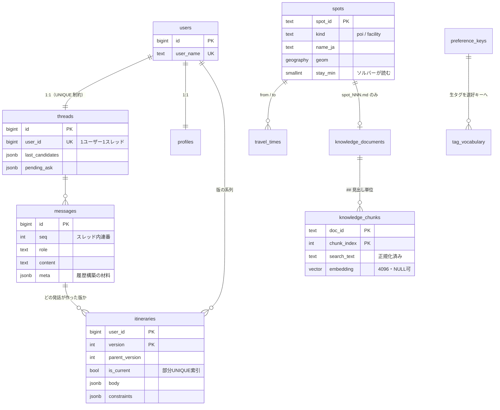
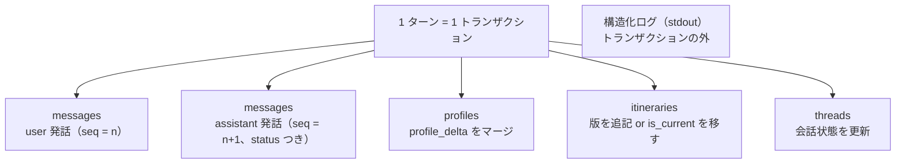

# データモデル設計

- 状態: **決定稿 (2026-08-01)** / 改訂 2026-08-01(Phase 2 設計を反映)/ **改訂 2026-08-04([ADR-0019](../adr/0019-react-main-agent-subagents.md) ReAct 構成を反映: `threads` に `history_summary`・`summarized_until_message_id` を追加、`pending_ask` を「表示中の質問(HITL)」の復元用に再定義、§6 の履歴構築を LLM 要約方式に変更 = migration 0004)**
- 前提: [ADR-0002](../adr/0002-single-postgres.md)(PostgreSQL 1 台に統合)/ [20_architecture.md §9](../20_architecture.md) / [agent_react_architecture.md §12](agent_react_architecture.md)(状態の設計)/ [recommendation_planning.md §3.1・§4.0](recommendation_planning.md)
- 決定事項の議論経緯: [90_backlog.md §A0-3・§A0-4](../90_backlog.md)
- **改訂の内容(Phase 2)**: `static.access_points` / `static.spot_approach` を新設(§2.6)、`travel_times` を door-to-door と定義(§3)、`app.routes` をレッグ単位に変更・`pack_jobs` / `pack_assets` に列を追加(§4.7)、`weather_fit` / `visit_difficulty` の CHECK を実データに合わせて拡張(§1.4.1)。根拠は [ADR-0013](../adr/0013-leg-route-door-to-door.md) / [ADR-0015](../adr/0015-pack-asset-composition.md)
- **改訂の内容(Phase 3)**: `app.lora_downlinks` を新設、`users.lora_device_id` と `pack_jobs.epoch` を追加(§4.7)。根拠は [ADR-0016](../adr/0016-lora-terminal-driven-batch.md)、設計は [realtime_lora.md](realtime_lora.md)

---

## 0. この文書が決めること

対話・推薦・旅程・パック生成が必要とする**永続データの形**を確定させる。Phase 1 の実装([20_architecture.md §14](../20_architecture.md))はこの文書を前提に着手できる。

**この文書で決めないもの**: API のリクエスト/レスポンス形([`40_api/chat_sse.md`](../40_api/chat_sse.md))、知識検索の方式([`narration_qa.md`](narration_qa.md)。**テーブル定義は §2.5 に置く**)、経路探索の呼び出し方(`geo.md`)、パック成果物のファイル配置(`packs_pipeline.md`)。

### 0.1 全体像

PostgreSQL 16 ×1 台(`postgis/postgis`)。スキーマは 2 つ。



| スキーマ | テーブル | 性質 |
| --- | --- | --- |
| **`static`** | `spots` / `access_points` / **`spot_approach`** / `travel_times` / `preference_keys` / `tag_vocabulary` / **`knowledge_documents` / `knowledge_chunks`** | **シードで投入し、実行中は読むだけ**。知識ベースは pgvector([ADR-0012](../adr/0012-knowledge-retrieval-pgvector.md))。`spot_approach` / `travel_times` は**シードではなく OSRM から生成する**(§2.6・§3) |
| **`app`** | `users` / `threads` / `messages` / `profiles` / `itineraries` / `routes` / `pack_jobs` / `pack_assets` / `spot_realtime` | 実行中に書き換わる |

**計測テーブルは持たない。**`turn_metrics` / `unmodeled_log` は 2026-08-01 に廃止した(NFR-7 削除。[§7.6](#76-計測テーブルを持たない))。

---

## 1. `static.spots` — POI と施設を 1 テーブルに統合する

### 1.1 決定と根拠

**旧構成は `spots`(POI)と `facilities`(宿・道の駅)の 2 テーブルだった。これを 1 テーブルに統合し、`kind` 列で区別する。**

実データを確認した結果(2026-08-01):

| 確認したこと | 結果 |
| --- | --- |
| 件数 | POI **30** 件 + 施設 **13** 件 = **43** 件 |
| `spot_id` の空間 | **同じ連番を共有**(`spot_004` は施設、`spot_005` は POI)。**衝突はゼロ** |
| フィールド | `spot_id` / `category` / `official_name` / `aliases` / `coordinates` / `description` / `social_proof` / `tags` / `address` / `osm_ids` / `md_slug` — **完全に一致** |

**同じ形のものが同じ id 空間に置かれている以上、2 テーブルに分ける理由がない。**分けたままにすると「`spot_012` を引くのにどちらを見るか」の分岐がコード中に散り、旧実装の SQL コピペ二重実装([22_current_issues.md §5-6](../22_current_issues.md))を再生産する。

統合で得られるもの:

- **LLM が出す `spot_id`・スポット名の照合先が 1 つになる**(クローズドワールド設計が単純になる)
- **ソルバーの候補集合と起点の集合が同じテーブルから引ける。**宿は起点にも訪問先にもなりうる(温泉宿に立ち寄る)ので、**テーブルで分けると表現できない**
- `search_knowledge` の参照先、`travel_times` の外部キー、パック生成の対象がすべて同じ集合になる

### 1.2 スキーマ

```sql
CREATE TABLE static.spots (
  spot_id        text PRIMARY KEY,                    -- 'spot_001'
  kind           text NOT NULL
                 CHECK (kind IN ('poi', 'facility')),
  category       text NOT NULL,                       -- 'tourist_spot' | 'accommodation' | ...

  -- ── 表示・検索（ランタイムは ja のみ。§7.3）────────────────────
  official_name  jsonb NOT NULL,                      -- {"ja":..,"en":..,"zh":..}
  name_ja        text GENERATED ALWAYS AS (official_name->>'ja') STORED NOT NULL,
  aliases_ja     text[]  NOT NULL DEFAULT '{}',       -- 名寄せ・照応解決に使う
  aliases_i18n   jsonb,
  description    jsonb,                               -- {"ja":..,..}
  social_proof   jsonb,                               -- 1〜2 文の紹介
  address        jsonb,
  tags_ja        text[] NOT NULL DEFAULT '{}',        -- 生タグ（§2）
  tags_i18n      jsonb,

  -- ── 位置 ───────────────────────────────────────────────────
  geom           geography(Point, 4326) NOT NULL,
  osm_place_id   bigint,
  osm_type       text,
  osm_id         bigint,

  -- ── データ拡充（ソルバー・推薦が読む値は列にする。§1.4）────────
  stay_min             smallint NOT NULL,             -- 標準滞在時間（分）
  weather_fit          text NOT NULL                  -- 雨天適性（高い順。§1.4.1）
                       CHECK (weather_fit IN ('indoor','rain_ok','rain_fair',
                                              'rain_poor','rain_unsafe')),
  visit_difficulty     text NOT NULL                  -- 徒歩負荷（軽い順。§1.4.1）
                       CHECK (visit_difficulty IN ('no_walk','short_walk',
                                                   'long_walk','hike')),
  open_hours           jsonb,                         -- null = 時間制約なし（§1.5）
  season_closed_months smallint[] NOT NULL DEFAULT '{}',
  enrichment_meta      jsonb NOT NULL DEFAULT '{}',   -- *_basis / *_source / confidence

  created_at     timestamptz NOT NULL DEFAULT now(),
  updated_at     timestamptz NOT NULL DEFAULT now()
);

CREATE INDEX ON static.spots USING GIST (geom);
CREATE INDEX ON static.spots USING GIN  (tags_ja);
CREATE INDEX ON static.spots (kind);
-- 知識 MD へのリンクは static.knowledge_documents.spot_id 側が持つ（§2.5・下記）
```

- **`name_ja` は生成列にする。**`official_name->>'ja'` から自動で導かれるので、多言語 JSONB と表示名がずれない。**ずれようがない形にするのが目的**である
- **`geography` を使う**(`geometry` ではなく)。このテーブルへの空間クエリはすべて「何 m 離れているか」であり、`geography` なら `ST_DWithin(a, b, 300)` がそのまま**メートル**を意味する。旧実装で起きた緯度経度の取り違え([22 §12-5](../22_current_issues.md))のような単位・座標順の事故が構造的に減る
- **enum 型ではなく `text` + `CHECK` を使う。**PostgreSQL の enum は値の削除ができず、変更容易性(NFR-1)を損なう。値の追加は CHECK の張り替えで済む
- **`md_slug` 列は作らない(2026-08-01 決定)。**旧 `POI.json` / `facilities.json` は `md_slug`(`spot_agariko_daio` など)を持つが、**実測すると 42 個中 41 個が存在しないファイル名を指していた**(2026-08-01 確認)。実際の知識 MD は **`knowledge/ja/faci_spot/spot_NNN.md` の形で 43 件すべてと 1:1 に対応**している。したがってリンクは **`knowledge_documents.spot_id`(外部キー)1 本**にし、`md_slug` は**シード時に捨てる**

### 1.3 `kind` と `category` の役割の違い

混同しやすいので明記する。

| | 値 | 誰が使うか |
| --- | --- | --- |
| **`kind`** | `poi` / `facility` | **ソルバー**。起点・終点に置けるのは `facility` が中心(ただし排他ではない) |
| `category` | `tourist_spot` / `accommodation` / … | 表示とフィルタ。将来増える |

**`kind` は「旅程上の役割」、`category` は「種類」**である。`kind` だけを CHECK で固定するのは、ソルバーの分岐がここに依存するため。

### 1.4 データ拡充をどう格納するか

Codex が生成した `backend/data/seeds/enrichment/enrichment.json`(43 件、`spot_id` 完全一致)を投入する。**値と根拠を分けて置く。**

| 種別 | 置き場所 | 理由 |
| --- | --- | --- |
| `stay_min` / `weather_fit` / `visit_difficulty` / `open_hours` / `season_closed_months` | **列** | **ソルバーと推薦が毎回読む。**NOT NULL と CHECK で型を守れる |
| `*_basis` / `*_source` / `confidence` | `enrichment_meta` JSONB | 出典メタ。**人が後から見直すときだけ読む** |

**`stay_min` を NOT NULL にするのは意図的である。**欠けているとソルバーが時間割を作れない。「あとで埋める」を許すと、**欠損に気づかないまま非現実的な旅程が出る**。シード CLI が欠損を検出して失敗する。

#### 1.4.1 `weather_fit` と `visit_difficulty` は順序尺度である(2026-08-01 改訂)

**当初の CHECK は実データと食い違っていた。**`enrichment.json` の 43 件を数えた結果(2026-08-01):

| 列 | 当初の CHECK | 実データ |
| --- | --- | --- |
| `weather_fit` | `rain_ok` / `rain_fair` / `rain_poor` | `rain_poor` 20 / **`indoor` 11** / **`rain_unsafe` 8** / `rain_ok` 4(**`rain_fair` は 0 件**) |
| `visit_difficulty` | `no_walk` / `short_walk` / `hike` | `no_walk` 18 / `short_walk` 17 / `hike` 7 / **`long_walk` 1** |

**このままではシードが CHECK で落ちる。**実データ側の語彙のほうが正しいので、**CHECK を実データに合わせる**(値を潰さない)。

| 列 | 順序(左が「良い / 軽い」) | 捨てられない理由 |
| --- | --- | --- |
| `weather_fit` | `indoor` → `rain_ok` → `rain_fair` → `rain_poor` → **`rain_unsafe`** | **`rain_unsafe` は安全 pre-filter の入力**である。`rain_poor`(楽しめない)と混ぜると、**雨の日に危険な地点を推薦してしまう**。`indoor` は雨の日の代替候補([packs_pipeline.md §2.2](packs_pipeline.md))を選ぶ値で、`rain_ok` より強い |
| `visit_difficulty` | `no_walk` → `short_walk` → `long_walk` → `hike` | `long_walk` は「登山ではないが 30 分前後歩く」。`hike` に寄せると体力のある人にしか出なくなり、`short_walk` に寄せると `avoid_walk` の人に出てしまう |

- **`rain_fair` は 0 件だが残す。**目視補正でユーザーが使う中間値であり、値域を狭めると後から広げる作業が増える
- **`mobility` との対応**(安全 pre-filter が使う。[recommendation_planning.md §6](recommendation_planning.md)):

| `profile.mobility` | 通す `visit_difficulty` |
| --- | --- |
| `avoid_walk` | `no_walk` |
| `short_walk_ok` | `no_walk` / `short_walk` / `long_walk` |
| `hike_ok` | すべて |

- **雨天時の pre-filter**: `rain_unsafe` を候補から除外する。`rain_poor` は除外せず**スコアを下げる**(行きたい人は行ける)

### 1.5 `open_hours` の形

```jsonc
// null = 時間の概念がない（屋外の滝・展望地など。enrichment の "no_concept"）
{
  "weekly": {                 // ISO 曜日番号（1=月 … 7=日）。キーが無い曜日は休業
    "1": [[540, 1020]],       // 09:00–17:00。その日 00:00 からの分（§7.2）
    "6": [[540, 1140]]
  },
  "note": "冬期休業。season_closed_months も参照"
}
```

- **時刻を「分」で持つのは §7.2 の全体方針に合わせるため。**ソルバーの内部表現と同じ単位にして、変換を 1 箇所も挟まない
- 季節休業は `season_closed_months` で別に持つ。**曜日の休みと季節の休みは別の概念**であり、混ぜると「12 月の月曜だけ休み」のような表現ができなくなる

---

## 2. タグ語彙を 2 層にする

### 2.1 問題 — 生タグは選好のキーとして使えない

実データを数えた結果(2026-08-01):

| | |
| --- | --- |
| 生タグの総語彙 | **80 語** |
| **1 地点にしか付いていないタグ** | **48 語(60%)** |

つまり生タグをそのまま `profile.interests` のキーにすると、**選好の 6 割は 1 地点しか動かせない**。`{"滝": 0.6}` は 8 地点に効くが `{"ゴーカート": 0.6}` は 1 地点に効くだけで、これは選好ではなく実質的に**そのターン限りの点数補正**(`score_adjustments`)と同じものである。さらに 80 語を guided decoding の enum に載せるとプロンプトが常時 300 トークン太る。

### 2.2 決定 — 選好キー(12 語)と生タグ(80 語)を対応表で結ぶ

```sql
CREATE TABLE static.preference_keys (
  key        text PRIMARY KEY,          -- profile.interests のキーはこの 12 語だけ
  label_ja   text NOT NULL,             -- チップ表示・プロンプトに出す日本語
  sort_order smallint NOT NULL
);

CREATE TABLE static.tag_vocabulary (
  tag            text PRIMARY KEY,      -- 生タグ 80 語
  preference_key text REFERENCES static.preference_keys(key)   -- NULL 可
);
```

| 層 | 語彙数 | 誰が使うか |
| --- | --- | --- |
| **選好キー** | **12** | `profile.interests` のキー。**guided decoding の enum はこれだけ**。プロファイルのチップ表示 |
| 生タグ | 80 | 候補生成のフィルタ、推薦理由の文面、知識検索 |

**`preference_key` が NULL のタグを許すのは、「選好にならないタグ」があるため**(下表)。NULL を許さないと、意味のない選好キーを作る羽目になる。

### 2.3 語彙の中身(決定稿)

**12 キー・80 タグ全件を割り当て済み。**未対応タグ 0、どのキーにも当たらない地点 0(検証済み 2026-08-01)。

| 選好キー | `label_ja` | 該当地点 | 生タグ |
| --- | --- | --- | --- |
| `nature` | 自然・景観 | **19** | 自然 / 景勝地 / 天然記念物 / 森 / 木 / 高山植物 / 湿原 / 癒やし / 神秘的 / 桜 / 梅花藻 |
| `mountain` | 登山・トレッキング | **17** | 登山 / ハイキング / 山小屋 / 避難小屋 / 鳥海山 / 祓川 / 県境 / アウトドア |
| `water` | 滝・湧水・湖 | **16** | 滝 / 湧水 / 川 / 湖 / 火口湖 / 伏流水 / 名水 / 水源 / 日本の滝百選 / 池 / 鳥海湖 / 水遊び / 鮭 |
| `lodging` | 宿泊 | 11 | 宿泊施設 / ホテル / キャンプ場 / コテージ / リゾート |
| `shrine_temple` | 神社仏閣・信仰 | 10 | 神社 / 寺 / 一之宮 / 仏教 / 仏像 / 大仏 / 神道 / 礼拝所 / パワースポット |
| `onsen` | 温泉 | 7 | 温泉 / 日帰り温泉 / 露天風呂 / 公衆浴場 |
| `park` | 公園・展望・散策 | 6 | 公園 / ピクニック / 展望 / 展望台 / 牧場 |
| `coast` | 海・海岸 | 5 | 海岸 / 海水浴 / 夕日 |
| `history` | 歴史・文化 | 5 | 史跡 / 歴史 / 文化 / 古民家 / 歴史的建造物 / 松尾芭蕉 / 博物館 / 資料館 |
| `food` | 食事・お土産 | 4 | レストラン / お土産 / ソフトクリーム |
| `rest_stop` | 休憩・立ち寄り | 3 | 道の駅 / 休憩所 / 観光案内所 / 複合施設 |
| `family` | 子ども・体験 | 2 | レジャー / 体験 / ゴーカート / 動物 / スポーツ施設 |
| **(NULL)** | — | — | 観光 / 無人 |

**最小のキーでも 2 地点に効く**(生タグでは 48 語が 1 地点だった)。

- `観光` は 43 件全部に当てはまるので選好にならない。`無人` は設備の属性であって好みではない
- **`mountain` と `nature` が重なるのは正しい。**「自然が好き」と「登山がしたい」は別の選好で、重なる地点があるのが自然である
- **キーの追加・変更はシードデータの変更だけで済む。**`preference_keys` を起動時に読んで guided decoding の enum を組み立てるので、コードの変更は要らない

### 2.4 `interests` の値の意味

```jsonc
{"water": 0.6, "shrine_temple": -0.3, "mountain": 0.8}
```

- 範囲 **−1.0 〜 1.0**。負値は忌避
- **キーは `preference_keys` に実在するものだけ**(guided decoding の enum で強制 + 書き込み時にコードが照合)
- スコアラは `spots.tags_ja` を `tag_vocabulary` 経由でキーに畳んでから内積を取る

---

## 2.5 知識ベース(`knowledge_documents` / `knowledge_chunks`)

[ADR-0012](../adr/0012-knowledge-retrieval-pgvector.md) の決定を受ける。設計は [narration_qa.md §11](narration_qa.md)。

```sql
CREATE EXTENSION IF NOT EXISTS vector;      -- pgvector（ADR-0012）

CREATE TABLE static.knowledge_documents (
  doc_id      text PRIMARY KEY,             -- 'faci_spot/spot_012'（パス由来・安定）
  category    text NOT NULL,                -- ディレクトリ名（faci_spot / nature / courses ...）
  title       text NOT NULL,                -- frontmatter の title
  spot_id     text REFERENCES static.spots(spot_id),  -- faci_spot のみ。他は NULL
  frontmatter jsonb NOT NULL DEFAULT '{}',  -- type / area / tags / last_updated
  body        text NOT NULL,                -- 全文（get_document が返す元）
  updated_at  timestamptz NOT NULL DEFAULT now()
);

CREATE TABLE static.knowledge_chunks (
  doc_id      text    NOT NULL REFERENCES static.knowledge_documents(doc_id) ON DELETE CASCADE,
  chunk_index integer NOT NULL,
  heading     text    NOT NULL DEFAULT '',
  body        text    NOT NULL,
  search_text text    NOT NULL,             -- title + heading + body（NFKC 正規化・casefold 済み）
  embedding   vector(4096),                 -- NULL 可（埋め込み失敗時も字句検索は効く）
  PRIMARY KEY (doc_id, chunk_index)
);

CREATE INDEX ON static.knowledge_documents (spot_id);
CREATE INDEX ON static.knowledge_documents (category);
```

- **`search_text` を正規化済みで持つ。**検索のたびに正規化しない。これが字句検索を決定的かつ高速にしている
- **`embedding` を NULL 許容にする。**埋め込みサーバは別マシンにあるので、落ちていても投入は通し、**字句検索だけで動く縮退経路**を残す(NFR-5)
- **`spot_id` に外部キーを張る。**存在しない `spot_id` を指す文書を DB が弾く。**リンクはこの列 1 本**で、旧 `md_slug` は使わない(§1.2)
- **近似最近傍索引(HNSW / IVFFlat)は張らない。**118 文書 → 400〜600 チャンクでは逐次スキャンで数 ms である。**後から張れるので先に作らない**([narration_qa.md §4.3](narration_qa.md))
- 投入は `python -m app.cli index-knowledge`(冪等。`search_text` のハッシュが変わったチャンクだけ再埋め込み)
- **ランタイム対象は `ja/` のみ。**`en/` `zh/` は索引しない

---

## 2.6 `static.access_points` / `static.spot_approach`(2026-08-01、Phase 2 で追加)

[ADR-0013](../adr/0013-leg-route-door-to-door.md) の決定を受ける。**設計は [geo.md §2](geo.md) が正。**

```sql
-- 駐車場・登山口。旧構成は GeoJSON 直読みで DDL が無かった
CREATE TABLE static.access_points (
  id       text PRIMARY KEY,                    -- OSM の @id ('way/374681084')
  name_ja  text,
  kind     text NOT NULL CHECK (kind IN ('parking','trailhead')),
  capacity smallint,
  access   text,                                -- OSM の access タグ（'private' は候補から外す）
  geom     geography(Point,4326) NOT NULL
);
CREATE INDEX ON static.access_points USING GIST (geom);

-- 「その地点に車でどこまで入れるか」を事前に解いたもの（43 行）
CREATE TABLE static.spot_approach (
  spot_id         text PRIMARY KEY REFERENCES static.spots(spot_id) ON DELETE CASCADE,
  direct_by_car   boolean NOT NULL,
  car_node        geography(Point,4326) NOT NULL,   -- 車が着く場所（地点そのもの or 駐車場）
  access_point_id text REFERENCES static.access_points(id),
  walk_sec        integer NOT NULL DEFAULT 0,
  walk_m          integer NOT NULL DEFAULT 0,
  snap_m          integer NOT NULL,
  computed_at     timestamptz NOT NULL DEFAULT now()
);
```

- **`spot_approach` はシードデータではない。**OSRM から生成する(`python -m app.cli build-geo`)。§7.5 の「DDL は Alembic、`static` のデータはシード CLI」に対する**第 3 の種類**であり、`travel_times` と同じ扱いになる
- **「車で行けるか」は地点の属性であって経路の問題ではない。**43 件を一度解いておけば実行時の分岐が消える([ADR-0013](../adr/0013-leg-route-door-to-door.md))
- 実データ: `access_points` は **33 件**(parking 32 / trailhead 1、うち `access=private` が 2 件)

---

## 3. `static.travel_times` — 移動時間行列

[recommendation_planning.md §4.3](recommendation_planning.md) で「OSRM `/table` で 43×43 を作りシード時に DB 保存」と決定済み。その形を確定させる。

```sql
CREATE TABLE static.travel_times (
  from_spot_id text NOT NULL REFERENCES static.spots(spot_id) ON DELETE CASCADE,
  to_spot_id   text NOT NULL REFERENCES static.spots(spot_id) ON DELETE CASCADE,
  mode         text NOT NULL CHECK (mode IN ('car', 'foot')),
  duration_sec integer NOT NULL,
  distance_m   integer NOT NULL,
  computed_at  timestamptz NOT NULL DEFAULT now(),
  PRIMARY KEY (from_spot_id, to_spot_id, mode)
);
```

- **行数は最大 43×43×2 = 3,698。**全件をメモリに載せてもよい規模だが、**DB に持つのはソルバーを毎回 OSRM に依存させないため**である。ソルバーは ILS で数千回の挿入評価を回す([ADR-0005](../adr/0005-itinerary-solver.md))ので、1 回ごとに HTTP を叩く形にはできない
- **★ 値は door-to-door である**(2026-08-01、[ADR-0013](../adr/0013-leg-route-door-to-door.md))。`car` の `duration_sec` は `spot_approach.walk_sec(from) + drive(car_node → car_node) + spot_approach.walk_sec(to)`。**駐車場までの時間ではない。**徒歩ぶんを別に持つと足し忘れる場所ができる
- **`foot` は近接ペアのみ**(全ペアの徒歩時間には意味がない)。行が無ければ「徒歩では到達しない」と解釈する。**閾値は 30 分 / 2.5 km**([geo.md §4.3](geo.md) で決定)
- **対称性を仮定しない。**一方通行と山道の勾配があるので `(a,b)` と `(b,a)` は別行
- **`car` に欠損があってはならない。**生成コマンドは欠損を検出したら行を書かずに失敗する([geo.md §4.4](geo.md))。実行時に引けない場合も推定値で埋めない
- 生成は `python -m app.cli build-travel-times`。**シードとは別コマンドにする**(OSRM の起動が要るため。手順は [50_operations/osrm.md](../50_operations/osrm.md))。**`spot_approach` の生成(`build-geo`)が先**

---

## 4. `app` スキーマ — 会話まわり

### 4.1 `users`

```sql
CREATE TABLE app.users (
  id             bigserial PRIMARY KEY,
  user_name      text UNIQUE NOT NULL,
  api_token      text UNIQUE NOT NULL,       -- 不透明トークン。失効しない（40_api/chat_sse.md §4）
  lora_device_id text UNIQUE,                -- ★ Phase 3。TTN のデバイス ID（端末を持つ人だけ）
  created_at     timestamptz NOT NULL DEFAULT now(),
  updated_at     timestamptz NOT NULL DEFAULT now()
);
```

簡易識別(FR-5.1)。

**`api_token` は [40_api/chat_sse.md §4](../40_api/chat_sse.md) の決定で追加した(2026-08-01)。**1 ユーザー 1 スレッドにした以上、`GET /api/v1/thread` が「誰なのか」を特定できないと成立しない。旧実装の `GET /users/{name}/session` は**他人の名前を入れれば他人の会話が読める**形だったので、パスからユーザー名を外し、Bearer トークンで識別する。

旧実装から**落としたもの**:

| 落とした列 | 理由 |
| --- | --- |
| `language` | 多言語はスコープ外([20_architecture.md §10](../20_architecture.md)) |
| `user_profile` (JSONB) | `profiles` に正規化(§4.4) |
| `current_itinerary` (JSONB) | `itineraries` に版として持つ(§4.5) |
| **実験条件(A/B arm)** | **持たない**(2026-08-01 決定)。リランク ON/OFF は設定 1 個で足りる |

### 4.2 `threads` — 1 ユーザー 1 スレッド

**`user_id` に UNIQUE を張ることで「1 ユーザー 1 スレッド」をスキーマで強制する。**規約ではなく制約にするのは、破れたときに静かに壊れる種類の前提だからである。

```sql
CREATE TABLE app.threads (
  id         bigserial PRIMARY KEY,
  user_id    bigint NOT NULL UNIQUE REFERENCES app.users(id) ON DELETE CASCADE,

  -- ── 会話状態（agent_react_architecture.md §12）─────────────────
  presented_spot_ids    text[] NOT NULL DEFAULT '{}',   -- 反復推薦の防止（ADR-0006）
  last_candidates       jsonb  NOT NULL DEFAULT '[]',   -- 名寄せ・照応の検証語彙（§4.3）
  asked_slots           text[] NOT NULL DEFAULT '{}',   -- ガードレール A1（同じスロットを 2 回聞かない）
  ask_streak            smallint NOT NULL DEFAULT 0,    -- ガードレール A2（連続 ask_user は 2 ターンまで）
  pending_ask           jsonb,                          -- 表示中の質問（HITL の回答待ち。リロード復元用 = ADR-0019）
  resolved_ambiguities  jsonb  NOT NULL DEFAULT '[]',   -- ガードレール A5（同じ曖昧さを 2 回聞かない）
  pending_constraints   jsonb  NOT NULL DEFAULT '[]',   -- 旅程がない間の一時制約（§4.5.4）

  -- ── 会話履歴の要約（agent_react_architecture.md §8。2026-08-04 追加）──
  history_summary       text   NOT NULL DEFAULT '',     -- 直近 2 ターンより古い部分の LLM 要約
  summarized_until_message_id bigint,                   -- 要約に畳み込み済みの最終 message id

  created_at timestamptz NOT NULL DEFAULT now(),
  updated_at timestamptz NOT NULL DEFAULT now()
);
```

**なぜ 1 本にするのか。**旅程とプロファイルは user 単位、会話履歴と `presented_spot_ids` は thread 単位である。複数スレッドを許すと**スコープがねじれ、新しいスレッドを開いた瞬間に同じ POI が再推薦される**(ADR-0006 の反復推薦防止が効かない)。1 本にすれば profile / 旅程 / 履歴 / 提示済みがすべて同じ寿命になる。FR-5.1(スレッドの復元)も FR-2.3(続きから再開)も 1 本で満たせる。

**なぜ状態を列に分けるのか**(JSONB 1 本にしない)。

- **旧実装の失敗は「何が状態なのかコードを読まないと分からない」ことだった。**列ならスキーマに書ける
- これらは**すべてコードが強制するガードレール(A1/A2/A5)や復帰処理の入力**である。スキーマに現れるべきものであり、隠すと「どこかで更新し忘れる」型のバグを検出できない
- 各列の**中身**は配列や構造なので JSONB / 配列型を使う。**列に分けることと、値が構造を持つことは別の話**である

### 4.3 各状態の中身

```jsonc
// last_candidates — 直前に提示した候補（順序つき）
[ {"rank": 1, "spot_id": "spot_012", "name_ja": "鶴間池"},
  {"rank": 2, "spot_id": "spot_007", "name_ja": "元滝伏流水"} ]

// pending_ask — 表示中の質問（HITL・ADR-0019）
// ターンの処理は回答をプロセス内で待っている。この行は「リロードしてもフォームが復元できる」ためだけにある
// 回答受領・タイムアウト・ターン終了で必ず NULL。ターンが死んでいたら GET /thread が掃除して null を返す
{ "kind": "clarify",                      // "preference" | "clarify"
  "surface": "2番目のやつ",                // kind = "clarify" のとき
  "slot": null,                           // kind = "preference" のときは Slot が入る
  "reason": "候補が鶴間池と元滝の 2 つある",
  "options": [ {"label": "鶴間池",     "value": "spot_012"},
               {"label": "元滝伏流水", "value": "spot_007"} ],
  "asked_at": "2026-08-04T10:12:00+09:00" }   // タイムアウト（10 分）の起点

// resolved_ambiguities — 同じ曖昧さを 2 回聞かない（G7）
[ {"surface": "2番目のやつ", "resolved_to": "spot_012"} ]
```

**`last_candidates` は会話履歴とは別物である。**[agent_react_architecture.md §12](agent_react_architecture.md) のとおり、役割が違うので両方持つ。

| | 誰が読むか | 何のためか |
| --- | --- | --- |
| **会話履歴**(`messages` から組み立てる) | **LLM** | 指示語・文脈の解決 |
| **`last_candidates`** | **コード** | LLM が出した `spot_id` が実在する参照先かを**検証する** |

LLM が `spot_099` と書いたときに弾くのは履歴の仕事ではない。**片方を消すともう片方の役割が穴になる。**

**`pending_ask` はターンをまたがない。**回答待ちの実体はターンの処理(プロセス内)であり、この行は表示の復元用でしかない([agent_react_architecture.md §7](agent_react_architecture.md))。回答受領・タイムアウト・ターン終了で必ず NULL に戻し、プロセス再起動でターンが死んでいたら `GET /thread` が掃除する。エージェントの軌跡やサブエージェントの内部状態は**一切保存しない**(すべてターン内のメモリで完結する)。

### 4.4 `messages` — 本文と、履歴構築の材料

```sql
CREATE TABLE app.messages (
  id         bigserial PRIMARY KEY,
  thread_id  bigint NOT NULL REFERENCES app.threads(id) ON DELETE CASCADE,
  seq        integer NOT NULL,                    -- スレッド内連番
  role       text NOT NULL CHECK (role IN ('user', 'assistant')),
  content    text NOT NULL,                       -- 空文字可
  status     text NOT NULL DEFAULT 'complete'
             CHECK (status IN ('complete', 'partial', 'failed')),
  meta       jsonb NOT NULL DEFAULT '{}',         -- ★ 履歴構築と再描画の材料
  created_at timestamptz NOT NULL DEFAULT now(),
  UNIQUE (thread_id, seq)
);

CREATE INDEX ON app.messages (thread_id, seq DESC);
```

**`seq` を持つ理由**: 1 ターンのユーザー発話とアシスタント発話は**同一トランザクションで書かれ、`created_at` が同値になりうる**。時刻で並べると順序が不定になる。履歴の並び順は会話の意味そのものなので、明示的な連番で決める。

**`status` を持つ理由**: `respond` が途中で落ちてもアシスタント行は作る([agent_react_architecture.md §13](agent_react_architecture.md))。**「ユーザーが見たものは保存されている」を不変条件にする**ため、ストリーム済みの断片を `partial` として残す。

#### `meta` の中身(assistant)

```jsonc
{
  "mode": "recommend",                    // recommend | itinerary | qa | clarify | ask_user | chitchat | error
  "presented": [                          // 提示した候補（順序つき）→ イベント要約と序数照応に使う
    {"rank": 1, "spot_id": "spot_012", "name_ja": "鶴間池"},
    {"rank": 2, "spot_id": "spot_007", "name_ja": "元滝伏流水"}
  ],
  "tools": ["recommend"],                 // 実行した Tool
  "itinerary_version": 3,                 // このターンで作られた版（無ければ null）
  "degraded": []                          // 縮退の種類（§9 の表）。UI の再描画で使う
}
```

**これは計測ログではない。**§6 の会話履歴の圧縮層を組み立てる材料であり、画面を再読み込みしたときにカードと地図を復元するためにも要る。NFR-7 の削除では消えない。

**user 行の `meta` は通常 `{}` だが、`ask_user` への回答行だけは質問とのペアを持つ**(2026-08-04、[ADR-0019](../adr/0019-react-main-agent-subagents.md) HITL): `{"answer_to": {"kind": "clarify", "reason": "...", "surface"|"slot": "..."}, "answered_by": "chip"|"free_text"}`。履歴(§6)の生層で「何を聞かれて何と答えたか」が読めるのはこのためである。

### 4.5 `itineraries` — 版と undo と制約

#### 4.5.1 スキーマ

```sql
CREATE TABLE app.itineraries (
  user_id        bigint  NOT NULL REFERENCES app.users(id) ON DELETE CASCADE,
  version        integer NOT NULL,
  parent_version integer,                             -- 分岐の親。v1 は NULL
  is_current     boolean NOT NULL DEFAULT false,
  body           jsonb   NOT NULL,                    -- 日・項目・時刻（§4.5.2）
  constraints    jsonb   NOT NULL DEFAULT '[]',       -- 版ごとにコピー（§4.5.3）
  origin         text    NOT NULL
                 CHECK (origin IN ('plan', 'edit', 'revert')),
  created_by_message_id bigint REFERENCES app.messages(id) ON DELETE SET NULL,
  created_at     timestamptz NOT NULL DEFAULT now(),
  PRIMARY KEY (user_id, version)
);

-- 「現在の版はユーザーごとにちょうど 1 つ」を DB が保証する
CREATE UNIQUE INDEX itineraries_one_current
  ON app.itineraries (user_id) WHERE is_current;
```

**部分 UNIQUE 索引を使うのが要点である。**`users` 側にポインタ列を置くと `users ⇄ itineraries` の循環外部キーになり、DEFERRABLE 制約が要る。`is_current` + 部分 UNIQUE なら**循環がなく、しかも「現在の版はちょうど 1 つ」が構造的に保証される**。

**行は不変。**一度書いた `body` と `constraints` は更新しない。変わるのは `is_current` だけである。

#### 4.5.2 `body` の形

[recommendation_planning.md §4.0](recommendation_planning.md) の「時間割付き」決定に対応する。

```jsonc
{
  "days": [{
    "date": "2026-08-10",
    "start_min": 540,                     // 09:00（その日 00:00 からの分。§7.2）
    "end_min": 1020,                      // 17:00
    "origin":      {"kind": "spot", "spot_id": "spot_004"},   // 宿・道の駅など
    "destination": {"kind": "spot", "spot_id": "spot_004"},
    "items": [{
      "seq": 1,
      "spot_id": "spot_001",
      "arrive_min": 580,                  // 09:40
      "stay_min": 45,
      "depart_min": 625,
      "leg_from_prev": {"mode": "car", "min": 40, "route_id": null},
      "locked": false,                    // ユーザーが固定した項目はソルバーが動かさない
      "note": null
    }]
  }],
  "concessions": [                        // 守れなかった制約。型は agent_react_architecture.md §14 の Concession
    {"constraint_id": "c_014", "pred": "lunch_break", "args": {"from": 720, "to": 780, "min": 60},
     "violation": 45,                     // ペナルティレジストリが返した違反量
     "message_ja": "昼休憩を12時台に置けませんでした（移動が入るため13時台になっています）"}
  ],
  "assumptions": [                        // 未確認の前提（日付・起点等）の日本語短文。2026-08-04 追加
    "日付は明日（8/10）と仮定"            // concessions と同じく版スナップショットの一部。undo で一緒に戻る
  ]
}
```

**JSONB 一本にして正規化しない。**理由:

- **使い方が「全体を読んで、全体を書く」しかない。**ソルバーは日と項目をまとめて組み替えるので、行単位で更新する場面が存在しない
- **版ごとに不変スナップショットを持つ設計と噛み合う。**正規化すると 1 版ごとに項目行を全部コピーすることになり、書き込み増幅にしかならない
- 規模が小さい(1 旅程 = 数日 × 数件)。**JSONB を分解して問い合わせる必要がない**

**`concessions` を旅程の中に持つのは意図的である。**「何を諦めたか」は旅程の一部であり、版を戻したら諦めた内容も戻るべきだからである。

#### 4.5.3 `constraints` — 版ごとにコピーし、id を維持する

[agent_react_architecture.md §5](agent_react_architecture.md) の決定(制約は旅程 version ごとにコピー・undo で一緒に戻る)を受ける。

```jsonc
[{
  "id": "c_014",                          // 旅程内で採番（'c_' + 連番）
  "pred": "not_consecutive",
  "args": {"target": "神社"},
  "weight": 0.6,
  "source_message_id": 87,
  "source_text": "神社ばっかり続くのはちょっと",
  "created_at_version": 3
}]
```

**id を版コピー時に維持することが不可欠である。**維持しないとメインエージェントが出す制約の取り消し(`edit_itinerary.constraints` の remove 操作が `"c_014"` を指す)が指す先を失い、**ユーザーが自分で制約を外せなくなる**。制約は永続化する以上、溜まって互いに矛盾するので、取り消せることが設計の一部になっている。

これが成り立つには 3 つが揃っている必要がある(どれか 1 つ欠けると、外せない制約が旅程に張り付く):

1. メインエージェントのコンテキストに**現在有効な制約を id つきで載せる**([agent_react_architecture.md §5](agent_react_architecture.md))
2. メインエージェントが `edit_itinerary.constraints` の remove 操作で取り消しを表現できる
3. `respond` が毎ターン「今回考慮した条件」を列挙する

**`source_text` を持つのは 3 のためである。**「神社が続かないように」という条件を日本語で列挙できないと、ユーザーは何が効いているのか分からない。

**保存しないもの**: `score_adjustments`(と Tool 呼び出しの `notes` に載る選択ヒント)は**そのターン限り**で、どこにも書かない。「静かな所がいい」はその場の注文であり、恒久的な選好なら `profile.interests` 側に写るべきである。両方に永続化すると二重に効く。

#### 4.5.4 旅程がまだ無い間の制約

推薦は旅程を必要としない(レコメンド SA に旅程の事前条件はない。[agent_react_architecture.md §4](agent_react_architecture.md))ので、**旅程が生成される前に制約が出てくる**ことがある。

- `threads.pending_constraints` に同じ形で溜める
- **`plan_itinerary` が初めて呼ばれたとき**、v1 の `constraints` に移し、`pending_constraints` を空にする
- 移送時に id を採番し直す(旅程内採番のため)。移送は 1 回だけなので参照の付け替え問題は起きない

#### 4.5.5 版の意味論 — 追記のみ + 現在位置

**undo は「旅程の版を 1 つ戻す」操作である。**ChatGPT の「メッセージを編集して送り直す」ではない。ソルバーは決定的でないので、同じ発話を打ち直しても元の旅程には戻らない。だから版を戻す操作が要る。

```
v1 ─ v2 ─ v3                    is_current = v3
      │
      └─ v4                     undo で v2 へ戻り、そこから編集すると v4 を追記
                                （parent_version = 2、is_current = v4）
                                v3 は残るが到達不能
```

| 操作 | 何が起きるか |
| --- | --- |
| `plan_itinerary`(初回) | v1 を追記。`origin='plan'`、`parent_version=NULL` |
| `edit_itinerary` | 現在の版を親として新しい版を追記。`origin='edit'` |
| **undo** | **行を書かない。**`is_current` を親の版へ移すだけ |
| **redo** | 同じく `is_current` を子の版へ移すだけ |
| undo 後の編集 | 現在の版を親として追記。**先の版は消さない**(到達不能になるだけ) |

- **`version` は単調増加し、履歴は消えない。**追記のみなので「戻ったつもりが記録も消えていた」が起きない
- **undo はソルバーを回さない。**回すと別解が出て undo にならない
- **redo は副産物として得られる。**FR に redo はないが、この構造では `is_current` を進めるだけなので実質タダである
- **保持上限は設けない**(全保持)。1 版が数 KB、1 ユーザーが数十版の規模でしかない

**undo の入口は 2 つ**([agent_react_architecture.md §5](agent_react_architecture.md))。どちらも同じ「`is_current` を移す」処理に落ちる。

| 入口 | 経路 | LLM |
| --- | --- | --- |
| 差分カードの [元に戻す] ボタン | 専用 REST(`40_api/chat_sse.md`) | **通さない** |
| 自然言語「さっきのに戻して」 | メインエージェント → `edit_itinerary` の `revert` op | メインの周回のみ |

`revert` op が作る行は無い(`is_current` を移すだけ)。`origin='revert'` を使うのは、**`revert` の結果としてさらに編集が入った版**を後から見分けるためである。

### 4.6 `profiles`

```sql
CREATE TABLE app.profiles (
  user_id        bigint PRIMARY KEY REFERENCES app.users(id) ON DELETE CASCADE,
  interests      jsonb  NOT NULL DEFAULT '{}',   -- {"water": 0.6, ...} キーは preference_keys のみ
  party          text CHECK (party    IN ('family_kids','couple','solo','senior','group')),
  mobility       text CHECK (mobility IN ('avoid_walk','short_walk_ok','hike_ok')),
  pace           text CHECK (pace     IN ('packed','relaxed')),
  avoid          text[] NOT NULL DEFAULT '{}',
  liked_spots    text[] NOT NULL DEFAULT '{}',
  rejected_spots jsonb  NOT NULL DEFAULT '[]',   -- [{"spot_id":..,"reason":".."}]
  notes          text,                           -- LLM が維持する 1〜2 文
  updated_at     timestamptz NOT NULL DEFAULT now()
);
```

**当初案(1 行 JSONB)から変更した。**固定スロット(`party` / `mobility` / `pace`)は**列にして CHECK を張る。**理由は §4.2 で会話状態を列に分けたのと同じで、**enum で強制している値を JSONB に隠すと、guided decoding の enum と DB の許容値がずれても気づけない**からである。動的なキーを持つ `interests` と `rejected_spots` だけ JSONB に残す。

- **`NULL` は「まだ聞いていない」を意味する**(「該当なし」ではない)。ガードレール A7(推薦要求に質問だけを返さない。[agent_react_architecture.md §10](agent_react_architecture.md))の判定がこの NULL を見る
- **`profile_events`(履歴テーブル)は作らない。**NFR-7 の削除で「いつ何が入ったか」を残す理由がなくなった

### 4.7 その他のテーブル(**routes / pack_\* は 2026-08-01、Phase 2 で確定**)

```sql
-- ★ レッグ単位（1 起点 → 1 終点）。ADR-0013。設計は geo.md §3.2
CREATE TABLE app.routes (
  id           uuid PRIMARY KEY DEFAULT gen_random_uuid(),
  params_hash  text UNIQUE NOT NULL,        -- 正規化した params の SHA-256（冪等キー）
  params       jsonb NOT NULL,              -- {from, to, osrm_build}
  mode_summary text NOT NULL CHECK (mode_summary IN ('car','foot','car+foot')),
  distance_m   integer NOT NULL,
  duration_sec integer NOT NULL,
  segments     jsonb NOT NULL,              -- [{mode, distance_m, duration_sec, from_idx, to_idx}]
  geojson      jsonb NOT NULL,              -- FeatureCollection（セグメントごとに 1 Feature）
  created_at   timestamptz NOT NULL DEFAULT now()
);

CREATE TABLE app.pack_jobs (
  id                uuid PRIMARY KEY DEFAULT gen_random_uuid(),
  pack_id           uuid NOT NULL,
  user_id           bigint NOT NULL REFERENCES app.users(id) ON DELETE CASCADE,
  itinerary_version integer NOT NULL,
  epoch             smallint NOT NULL,             -- ★ Phase 3。LoRa の pack_epoch（0..255 巡回）
  state      text NOT NULL CHECK (state IN ('queued','running','ready','partial','failed')),
  params      jsonb NOT NULL,                    -- (user_id, itinerary_version, options)
  params_hash text UNIQUE NOT NULL,              -- ★ 冪等キー。route_id は含めない
  progress    jsonb NOT NULL DEFAULT '{}',       -- {done, total, failed}
  created_at  timestamptz NOT NULL DEFAULT now(),
  updated_at  timestamptz NOT NULL DEFAULT now()
);

CREATE TABLE app.pack_assets (
  pack_id         uuid NOT NULL,
  spot_id         text NOT NULL REFERENCES static.spots(spot_id),
  variant         text NOT NULL                  -- ★ ADR-0015
                  CHECK (variant IN ('base','weather_cloudy','weather_rain',
                                     'congestion_mid','congestion_high')),
  role            text NOT NULL CHECK (role IN ('visit','pass_by')),   -- ★ 生成対象を決める
  narration_state text NOT NULL CHECK (narration_state IN ('pending','ok','failed')),
  audio_state     text NOT NULL CHECK (audio_state IN ('pending','ok','failed','skipped')),
  text_body       text,
  duration_s      real,
  bytes           integer,
  error           text,
  PRIMARY KEY (pack_id, spot_id, variant)
);

CREATE TABLE app.spot_realtime (
  spot_id    text PRIMARY KEY REFERENCES static.spots(spot_id) ON DELETE CASCADE,
  weather    smallint,                           -- NULL = unknown（捏造しない）
  congestion smallint,
  source     text NOT NULL CHECK (source IN ('sensor','simulated')),
  updated_at timestamptz NOT NULL DEFAULT now()
);

-- ★ Phase 3。TTN フェアユース（下り 10 通/日）をプロセスをまたいで守る。ADR-0016
CREATE TABLE app.lora_downlinks (
  device_id text NOT NULL,
  sent_date date NOT NULL,                       -- UTC
  count     integer NOT NULL DEFAULT 0,
  last_sent timestamptz,
  PRIMARY KEY (device_id, sent_date)
);

-- ★ Phase 3（2026-08-02、実装中に追加）。シミュレータの進行状態を 1 行 JSONB で持つ
--    realtime_lora.md §6 は「CLI と管理 API が同じ処理を呼ぶ」と決めたが、
--    シナリオと進行位置をどこに置くかを書いていなかった。プロセス内に持つと
--    再起動で消え、CLI と API で状態が割れるので DB に置く
CREATE TABLE app.realtime_simulator_state (
  id    smallint PRIMARY KEY DEFAULT 1 CHECK (id = 1),   -- 単一行
  state jsonb NOT NULL DEFAULT '{}'   -- name / events / next_index / speed / running / virtual_time
);
```

- **`routes` は 1 レッグ = 1 行**([ADR-0013](../adr/0013-leg-route-door-to-door.md))。旧案の `legs` / `waypoints_info` 列は**廃止**した(レッグ単位に経由地の概念がない)。`params.osrm_build` を鍵に含めるので、**地図データを作り直すと経路キャッシュが自然に無効化される**
- **`pack_jobs` の冪等キーから `route_id` を外した**([packs_pipeline.md §3.2](packs_pipeline.md))。旅程の version が経路を決めるので、鍵に入れると二重に効く
- **`pack_assets.role` が生成対象を決める**: `visit` は base + overlay 4 種、`pass_by` は base のみ。旧構成で 7 箇所に散っていた暗黙ルール([22 §5-5](../22_current_issues.md))を列にした
- `pack_assets` の主キーが `(pack_id, spot_id, variant)` なのは、**アセット単位の部分成功**を第一級で扱うため([ADR-0003](../adr/0003-pack-generation-jobs.md))。`audio_state='skipped'` は「原稿が無いので音声を作らなかった」で、`failed` と区別する
- **`spot_realtime` の値は NULL 可にする。**旧実装は読み出し時に乱数で捏造して保存していた([22 §6-2](../22_current_issues.md))。**値が無いことを `unknown` として表現できる形にする**のが FR-4.5 の要求である。`weather` / `congestion` のコードと variant の対応は [packs_pipeline.md §7.2](packs_pipeline.md) の `playback_rules`、LoRa 上では `0xF` が unknown を表す([realtime_lora.md §2.3](realtime_lora.md))
- **`lora_downlinks` をプロセス内カウンタにしない。**再起動でリセットされると 1 日 10 通の上限が意味を失う([ADR-0016](../adr/0016-lora-terminal-driven-batch.md))

---

## 5. 1 ターンで何が書かれるか

[agent_react_architecture.md §13](agent_react_architecture.md) の「persist は必ず走る」をデータ側から見た図。**1 ターン = 1 トランザクション**([22 §4-2](../22_current_issues.md) の解消)。



| 状況 | 書かれるもの |
| --- | --- |
| 通常 | 上記すべて |
| `update_profile` / メインの周回が致命失敗 | **user 発話 + そこまでに成功した手の結果**(Tool が動いていなければ user 発話のみ) |
| Tool が途中で失敗 | **成功した手の結果は書く**(「そこまでの結果は捨てない」をデータ側でも守る) |
| `respond` がタイムアウト | assistant 行を `status='partial'` または `'failed'` で書く。**旅程は保存されている** |
| ターン内に `ask_user` があった | 上記すべて + **回答の user 行**(質問とペアであることを `meta` に記す。[ADR-0019](../adr/0019-react-main-agent-subagents.md) HITL) |

**不変条件: ユーザーが `state` イベントで見たものは、必ず DB に保存されている。**

---

## 6. 会話履歴をどう組み立てるか

[agent_react_architecture.md §8](agent_react_architecture.md) の「**LLM 要約 + 直近 2 ターン生**」をこのスキーマの上でどう作るかを示す(**2026-08-04 改訂**。旧「3 層・要約 LLM なし」を置き換えた)。

```
会話履歴 =
  ① threads.history_summary                       … summarized_until_message_id までの LLM 要約
  ② 機械要約の列（あれば）                          … ①より後〜直近 2 ターンより前の未畳み込みターン
  ③ 候補提示リストの機械要約（直近 3 リストまで）    … 序数照応の担保（下記）
  ④ 直近 2 ターンの生テキスト                      … user も assistant も content そのまま
```

**要約の更新**は `persist` 内・`done` 送出後に行う: 生層(④)から押し出されたターンを既存要約に畳み込む LLM 1 回 + `history_summary` / `summarized_until_message_id` の小さな UPDATE(**本体トランザクションとは別**。失敗しても対話は止めない = NFR-5)。失敗すると `summarized_until_message_id` が進まないだけで、そのターンは②の機械要約として履歴に残り続ける。

```python
# 機械要約（②③・要約失敗時のフォールバック）を meta から組み立てる（LLM を使わない）
def summarize(meta):
    if meta["mode"] == "recommend":
        names = " / ".join(p["name_ja"] for p in meta["presented"])
        return f"[推薦{len(meta['presented'])}件: {names}]"
    if meta["mode"] == "itinerary":
        return f"[旅程 v{meta['itinerary_version']} を更新]"
    if meta["mode"] == "qa":
        return f"[QA回答: {meta['presented'][0]['name_ja']}]"
    ...
```

**③を LLM 要約と別に残す理由 — 序数照応。**`[推薦3件: 鶴間池 / 元滝伏流水 / 奈曽の白滝]` の**順序つきリスト**は、LLM 要約に畳み込むと順序や取りこぼしのドリフトが静かに起きる。「あのとき 2 番目に出てたやつ」を解くための行なので、`meta.presented` から**機械的に**組み立てた行を要約とは独立に履歴へ挟む(`last_candidates` は直近 1 回分しか持たないため、過去への遡りは履歴側の仕事である)。

予算は履歴全体で約 1,700 トークン([agent_react_architecture.md §3.1](agent_react_architecture.md))。超えたら②③の古い方から落とす(①は上限 ~600 で生成、④は削らない)。

**古いターンを要約に畳んで安全なのは、確定した内容がすでに `profiles` と `itineraries.constraints` に書き出されているからである。**裏返すと、要約が「決まった事実」を落とすと情報が消える — だから要約への指示は**決まった事実(選んだ POI・確定した日程・約束・有効な条件)を落とさないことを最優先**にする([agent_react_architecture.md §8](agent_react_architecture.md))。

---

## 7. 横断的な決定

### 7.1 `spot_id` の参照整合性 — 外部キーが張れない場所がある

`itineraries.body` や `threads.last_candidates` の中の `spot_id` は **JSONB の中なので外部キーを張れない。**

| 場所 | 守り方 |
| --- | --- |
| `travel_times` / `pack_assets` / `spot_realtime` | **外部キー**(列なので張れる) |
| `itineraries.body` / `threads.*` / `messages.meta` / `profiles.liked_spots` | **書き込み時にコードが `spots` と照合する。**これが [agent_react_architecture.md §10 C1](agent_react_architecture.md) のクローズドワールド設計そのもの |
| シードデータ | `python -m app.cli validate-seeds` が全参照を検査 |

**「外部キーが張れないから緩くする」ではなく、「張れないと分かっているから明示的に照合する」**という立場を取る。LLM が `spot_id` を生成する以上、どのみち照合は必要である。

### 7.2 時刻とタイムゾーン

| 対象 | 型 | 理由 |
| --- | --- | --- |
| 監査時刻(`created_at` など) | **`timestamptz`** 一択 | naive datetime を混ぜない |
| **旅程内の時刻** | **その日 00:00 からの分(整数)** | **下記** |
| 旅程の日付 | `"YYYY-MM-DD"` 文字列(JSONB 内) | |

**旅程の時刻を `"09:40"` 文字列にしない。**日没後の帰着や日跨ぎ(24 時超え)が表現できず、`arrive_min = 1500`(翌 01:00)のような値を持てない。さらにソルバーは分単位の整数で計算するので、**文字列にすると変換を挟むぶんだけ間違える場所が増える。**

アプリのタイムゾーンは **JST 固定**。多地域対応は要求にない。

### 7.3 多言語データ — 残すが使わない

多言語はスコープ外([20_architecture.md §10](../20_architecture.md))だが、**既存データの `en` / `zh` は捨てない。**

- `official_name` / `description` / `aliases_i18n` / `tags_i18n` は JSONB のまま保持
- **ランタイムが読むのは `name_ja`(生成列)・`aliases_ja`・`tags_ja` だけ**
- 知識 MD も同様(`ja/` のみが検証・生成の対象。`en/` `zh/` はファイルとして残す)

**列を潰してデータを捨てる案は採らない。**再収集のコストが高く、残しておく害がない。

### 7.4 リセットと削除

```
python -m app.cli reset-user <user_name>     # 会話・旅程・プロファイルを消す。users 行は残す
python -m app.cli delete-user <user_name>    # users 行ごと消す（CASCADE で全部消える）
```

- **論理削除(`deleted_at`)は導入しない。**復元の要求がなく、全クエリに条件が増えるだけである
- `ON DELETE CASCADE` を `users` を頂点に張っているので、ユーザーを消せば会話・旅程・プロファイルが消える
- `static` スキーマは影響を受けない

### 7.5 Alembic とシードの分担

| | 誰が管理するか |
| --- | --- |
| **DDL(テーブル・索引・制約)** | **Alembic**。`static` も含めて全部 |
| **`static` のデータ** | **シード CLI**(`python -m app.cli seed`)。`backend/data/seeds/` から冪等 upsert |
| `app` のデータ | 実行時にアプリが書く |

- **`static` のデータを Alembic のマイグレーションに埋め込まない。**43 件の POI は「スキーマの変更」ではなく「データの更新」であり、混ぜると POI の説明文を直すたびにマイグレーションが増える
- シードは**冪等な upsert**。`TRUNCATE` してから入れ直す形にはしない(`travel_times` の外部キーが落ちるため)
- 旧構成の init スクリプト 3 本と `Dockerfile.init` は `app.cli` に統合する

### 7.6 計測テーブルを持たない

**2026-08-01、NFR-7(計測可能性)を要求から削除した。**廃止したもの:

| 廃止 | 代わりに |
| --- | --- |
| `turn_metrics` テーブル | **構造化ログ(JSON, stdout)にターン 1 行**([20_architecture.md §12](../20_architecture.md)) |
| `unmodeled_log` テーブル | `unmodeled` はそのターンの `respond` が言及するだけ。保存しない |
| `profile_events` テーブル | 作らない |
| `export-metrics` CLI | 作らない |

**残るもの**と、それが計測ではない理由:

- **`itineraries` の版** — undo のための機能([§4.5.5](#455-版の意味論--追記のみ--現在位置))
- **`messages.meta`** — 履歴構築と再描画のため([§6](#6-会話履歴をどう組み立てるか))
- **`pack_jobs.progress`** — 進捗取得のため(NFR-4)
- **縮退の記録** — ログに出す。NFR-5(縮退は必ず明示する)が引き続き要求する

---

## 8. 決定の記録(2026-08-01)

| # | 決定 | 根拠 |
| --- | --- | --- |
| 1 | **`spots` と `facilities` を統合**し `kind` で区別 | フィールド完全一致・`spot_id` 空間共有・衝突ゼロ(実データ確認済み) |
| 2 | **タグ語彙を 2 層**(選好キー 12 / 生タグ 80) | 生タグの **60% が 1 地点のみ**。80 語 → 12 キーで最小 2 地点、未対応タグ 0 |
| 3 | **1 ユーザー 1 スレッド**(UNIQUE で強制) | 状態のスコープが揃う。ねじれると静かに壊れる |
| 4 | **1 ユーザー 1 旅程**(`(user_id, version)` が主キー) | 「どの旅程を編集中か」の曖昧さを作らない |
| 5 | **版は追記のみ + `is_current`**(部分 UNIQUE 索引) | 履歴が消えない。循環外部キーを避けつつ「現在は 1 つ」を DB が保証。redo が副産物 |
| 6 | `itineraries.body` は **JSONB 一本** | 全体を読んで全体を書く使い方しかない。版スナップショットと噛み合う |
| 7 | **制約は版ごとにコピーし id を維持** | `constraints_remove` が壊れると**ユーザーが制約を外せなくなる** |
| 8 | 会話状態 8 個と profile の固定スロットは **列に分ける** | 「何が状態か」をスキーマに書く。enum の強制値を JSONB に隠さない |
| 9 | 旅程内の時刻は **分(整数)** | 日跨ぎが表現でき、ソルバーの内部表現と一致する |
| 10 | `geography(Point,4326)` を使う | 距離が常にメートル。座標順の事故が減る |
| 11 | enum 型ではなく **`text` + `CHECK`** | 値の削除ができる。変更容易性(NFR-1) |
| 12 | **計測テーブルを持たない** | NFR-7 削除 |
| 13 | **実験条件(A/B arm)を持たない** | 比較実験をしない。リランク ON/OFF は設定 1 個 |
| 14 | 多言語 JSONB は**残すが使わない** | 再収集コストが高く、残す害がない |
| 15 | DDL は Alembic、`static` データはシード CLI | POI の文言修正でマイグレーションを増やさない |
| 16 | **知識ベースを `static` に置き、`embedding vector(4096)` を NULL 許容にする**(2026-08-01 追加) | [ADR-0012](../adr/0012-knowledge-retrieval-pgvector.md)。埋め込みサーバ断でも字句検索で縮退できる |
| 17 | **近似最近傍索引を先に張らない** | 400〜600 チャンクでは逐次スキャンで数 ms。後から張れる |
| **18** | **`static.access_points` / `static.spot_approach` を新設**(Phase 2) | [ADR-0013](../adr/0013-leg-route-door-to-door.md)。「車でどこまで入れるか」は地点の属性であって経路の問題ではない |
| **19** | **`travel_times` は door-to-door**(両端の徒歩を含む) | 同上。徒歩ぶんを別に持つと足し忘れる |
| **20** | **`app.routes` はレッグ単位・`params_hash` で冪等・`osrm_build` を鍵に含める** | 同上。版が増えても同じレッグを再利用でき、地図更新で自動的に無効化される |
| **21** | **`pack_assets` に `role`、variant は `base` + overlay 4 種** | [ADR-0015](../adr/0015-pack-asset-composition.md)。排他では「雨で混雑」が表現できない |
| **22** | **`pack_jobs` の冪等キーから `route_id` を外す**(`user_id` / `itinerary_version` を列にする) | 旅程 version が経路を決めるので二重に効く |
| **23** | **`weather_fit` / `visit_difficulty` の CHECK を実データに合わせて広げる**(§1.4.1) | 当初の 3 値では `enrichment.json` の 43 件がシードで落ちる。**`rain_unsafe` は安全 pre-filter の入力**なので `rain_poor` と混ぜられない |
| **24** | **`app.lora_downlinks` を新設し、`users.lora_device_id` / `pack_jobs.epoch` を追加**(Phase 3) | [ADR-0016](../adr/0016-lora-terminal-driven-batch.md)。フェアユースの上限はプロセスをまたいで守る必要がある |

## 9. 採らなかった案

| 案 | 不採用の理由 |
| --- | --- |
| `spots` / `facilities` を分けたまま | 同じ形のものが同じ id 空間にある。分岐がコード中に散る |
| 生タグ 80 語を `interests` のキーに | 60% が 1 地点しか動かせず、選好として機能しない。プロンプトも 300 トークン太る |
| 埋め込みでタグをクラスタリング | 埋め込みサーバを廃止済み([ADR-0002](../adr/0002-single-postgres.md))。43 地点に対して過剰 |
| `itineraries` を正規化(`days` / `items` テーブル) | 版ごとに子行を全コピーする書き込み増幅にしかならない。行単位で更新する場面がない |
| `users.current_itinerary_version` にポインタ列 | `users ⇄ itineraries` の循環外部キーになる。部分 UNIQUE 索引のほうが単純で保証も強い |
| undo で「戻った先より後ろの版を削除」 | 履歴が消える。到達不能にするだけでよい |
| 会話状態を JSONB 1 本(`thread_state`) | 「何が状態かコードを読まないと分からない」という旧実装の失敗の再生産 |
| `profiles` を 1 行 JSONB | enum で強制している値が DB 側で検査されなくなる |
| 論理削除(`deleted_at`) | 復元の要求がない。全クエリに条件が増えるだけ |
| `profile_events` で選好の変遷を残す | NFR-7 削除により残す理由が消えた |

---

## 10. 実装時に決めること(設計判断ではない)

| # | 項目 | 備考 |
| --- | --- | --- |
| 1 | 会話履歴の予算 4,000 トークンと生層 3 ターンの具体値 | 実際のトークン数を見て調整。**設計の形は変えない** |
| 2 | `messages` の取得件数(`LIMIT 40`)の妥当な値 | 圧縮層の平均長を見てから |
| 3 | ~~`foot` の `travel_times` を作る近接ペアの閾値~~ | **✅ 決定(2026-08-01)**: 30 分 / 2.5 km([geo.md §4.3](geo.md)) |
| 4 | `interests` の重みの更新式(`profile_delta` のマージ規則) | 単純な上書きか指数移動平均か。[recommendation_planning.md §3.1](recommendation_planning.md) の範囲 |
| 5 | `pack_jobs.params` / `routes.params` の正規化方法 | JSONB のキー順序と既定値の埋め込み([packs_pipeline.md §15](packs_pipeline.md) / [geo.md §11](geo.md)) |
