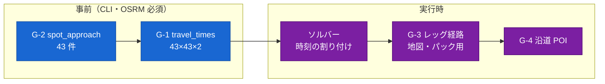

# ジオ設計 — 経路・接近・移動時間・沿道 POI

- 状態: **決定稿 (2026-08-01)**
- 前提: [20_architecture.md §6](../20_architecture.md) / [ADR-0013](../adr/0013-leg-route-door-to-door.md)(レッグ単位・door-to-door)/ [ADR-0014](../adr/0014-osrm-area-extract.md)(OSRM をエリアに限定)/ [data_model.md §3](data_model.md)(`travel_times`)/ [recommendation_planning.md §4.3](recommendation_planning.md)(ソルバーが要求する行列)
- 関連: [50_operations/osrm.md](../50_operations/osrm.md)(データの作り方)/ [packs_pipeline.md](packs_pipeline.md)(沿道 POI の消費者)

---

## 0. この文書が決めること

**「A から B へどう行くか」をシステムのどこで、どの形で持つか**を確定させる。Phase 2 の実装([20_architecture.md §14](../20_architecture.md))はこの文書を前提に着手できる。

**この文書で決めないもの**: OSRM データの取得・前処理([50_operations/osrm.md](../50_operations/osrm.md))、旅程の組み立て方([recommendation_planning.md](recommendation_planning.md))、パック成果物([packs_pipeline.md](packs_pipeline.md))、地図タイル(Phase 4 `offline_field_mode.md`)。

### 0.1 geo が引き受ける 4 つの仕事

| # | 仕事 | 誰が呼ぶか | いつ | LLM |
| --- | --- | --- | --- | --- |
| **G-1** | **移動時間行列**(43×43×2)の生成 | 管理 CLI | データ更新時に一度 | なし |
| **G-2** | **接近情報**(車はどこまで入れるか・そこから徒歩何分か)の生成 | 管理 CLI | データ更新時に一度 | なし |
| **G-3** | **レッグ経路**(実際に走る道の線) | `plan_itinerary` / `edit_itinerary` の後段、`POST /api/v1/routes` | 旅程が確定するたび | なし |
| **G-4** | **沿道 POI** | パック生成ジョブ | パック生成のたび | なし |

**geo は LLM を一度も呼ばない。**呼ぶ必要のある判断がここには無い。

### 0.2 この設計の骨格 — 時間と線を分離する



**旅程の時間計算は G-1(DB)だけを使い、G-3(OSRM への問い合わせ)を使わない。**したがって:

- ソルバーが ILS で数千回の挿入評価を回しても HTTP は 1 回も飛ばない([ADR-0005](../adr/0005-itinerary-solver.md))
- **OSRM が落ちていても旅程は作れる。**失われるのは地図に描く線だけである(§6 の縮退表)
- 逆に言えば、**行列が欠けていたら旅程は作れない。**だから G-1 は欠損を許さず、コマンドが失敗する(§4.4)

---

## 1. 中心となる決定 — 「レッグ」を door-to-door の 1 本にする

### 1.1 問題 — 鳥海山エリアは車で玄関まで行けない

対象 43 地点には、**車道から離れた滝・湿原・登山道の先**がある。旧実装はこれを次のように扱っていた。

| 旧実装 | 実態 |
| --- | --- |
| `car_to_trailhead` / `return_to_origin` をリクエストで受ける | **参照されない。**Gateway は常に `True` を注入していた([22 §6-4](../22_current_issues.md)) |
| 車ルートを引き、終点が目的地から 50 m 以上離れていたら「車では到達失敗」と判定 | 判定自体は妥当。ただし `logger` 未 import で **NameError** が外側の except に飲まれ、別経路で成立していた([22 §6-1](../22_current_issues.md)) |
| 失敗したら最寄り access_point を経由して car + foot に分割 | **DB 障害時は「目的地の東 0.01 度」を返す**([22 §6-3](../22_current_issues.md)) |
| 移動時間 | **徒歩ぶんが旅程の時間に入らない。**駐車場に着いた時刻で「到着」としていた |

最後の行が最も重い。**徒歩 10 分の滝を 10 分短く見積もった旅程が出る。**時間割付き旅程([recommendation_planning.md §4.0](recommendation_planning.md))を採った以上、これは仕様の破れである。

### 1.2 決定

1. **`car_to_trailhead` / `return_to_origin` はスキーマから削除する**
   - `return_to_origin` は `ItineraryDay.destination` が明示的に持つ([data_model.md §4.5.2](data_model.md))。フラグで表現するものではない
   - `car_to_trailhead` は**フラグではなくデータから決まる挙動**にする(§2)
2. **1 レッグ = 起点から終点までの door-to-door の移動 1 本。**内部に mode の違う **1〜2 本のセグメント**を持つ
3. **移動時間も door-to-door。**`travel_times` の値は「玄関を出てから玄関に着くまで」である(§4)

```
レッグ（宿 spot_004 → 元滝 spot_007）
├─ segment 1  car   宿 → 元滝駐車場        18 分
└─ segment 2  foot  元滝駐車場 → 元滝       10 分
                                   ────────────
                    travel_times(car) = 28 分
```

**「車で行けるかどうか」は分岐ではなく、地点の属性になる。**コードから条件分岐が 1 つ消える。

### 1.3 混同しやすい 2 つの `mode`

| 出てくる場所 | 意味 |
| --- | --- |
| `ItineraryItem.leg_from_prev.mode`([§18.2](agent_planning_phase.md)) | **移動時間行列のどちらの行を使ったか**(`car` / `foot`) |
| `routes.mode_summary`(§3.2) | **経路に実際に含まれるセグメントの構成**(`car` / `foot` / `car+foot`) |

上の例は `leg_from_prev.mode = "car"` かつ `mode_summary = "car+foot"` である。**両者は別物**で、一致させようとしてはいけない。表示は後者を使う(「車で 28 分(駐車場から徒歩 10 分)」)。

---

## 2. G-2 `static.spot_approach` — 「どうやって着くか」を先に解いておく

### 2.1 なぜ地点ごとに一度でよいのか

**車をどこに置き、そこから何分歩くかは、その地点だけで決まる。**どこから来たかに依存しない。だから 43 件を一度計算して DB に置けば、実行時の分岐がゼロになる。

### 2.2 スキーマ

```sql
-- access_points は旧構成では GeoJSON 直読みで、DDL がどこにもなかった（Phase 2 で定義する）
CREATE TABLE static.access_points (
  id       text PRIMARY KEY,                    -- OSM の @id ('way/374681084')
  name_ja  text,                                -- 実データでは 4/33 件しか名前がない
  kind     text NOT NULL CHECK (kind IN ('parking','trailhead')),
  capacity smallint,
  access   text,                                -- OSM の access タグ（'private' は候補から外す）
  geom     geography(Point,4326) NOT NULL
);
CREATE INDEX ON static.access_points USING GIST (geom);

CREATE TABLE static.spot_approach (
  spot_id         text PRIMARY KEY REFERENCES static.spots(spot_id) ON DELETE CASCADE,
  direct_by_car   boolean NOT NULL,             -- 車で地点まで直接行けるか
  car_node        geography(Point,4326) NOT NULL,  -- 車が着く場所（地点そのもの or 駐車場）
  access_point_id text REFERENCES static.access_points(id),   -- direct_by_car なら NULL
  walk_sec        integer NOT NULL DEFAULT 0,   -- car_node から地点までの徒歩時間
  walk_m          integer NOT NULL DEFAULT 0,
  snap_m          integer NOT NULL,             -- car_node の車道スナップ距離（品質の指標）
  computed_at     timestamptz NOT NULL DEFAULT now()
);
```

**実データの確認(2026-08-01)**: `access_points.geojson` は **33 件**。うち 32 件が `amenity=parking`、1 件が `highway=trailhead`(大平登山口)。名前があるのは 4 件(元滝駐車場・金峯神社 駐車場・ニノ滝駐車場・大台野そばP)、`access=private` が 2 件。**`private` の 2 件は候補から除外する。**

### 2.3 アルゴリズム(`python -m app.cli build-geo`)

```
各 spot について:
  1. OSRM /nearest/v1/car/{lon},{lat} でスナップ距離を測る
     ≤ 50 m なら direct_by_car = true。car_node = 地点そのもの、walk = 0 で確定
  2. さもなくば access_points（private を除く）から直線距離の近い順に 5 件を候補にし、
     各候補 → 地点の徒歩ルートを OSRM に問う。到達できたもののうち所要が最小のものを採る
  3. どの候補からも徒歩で到達できない → コマンドを失敗させる（データを直す）
```

- **閾値 50 m は旧実装の `CAR_ARRIVAL_TOLERANCE_METERS` を踏襲する。**判定の考え方は正しく、壊れていたのは実装(NameError)のほうだった
- **`/route` ではなく `/nearest` を使う。**「車道からどれだけ離れているか」を直接返すサービスがあるのに、ルートを引いて終点を比べるのは遠回りである。43 回の軽い呼び出しで済む
- **フォールバックを持たない。**「東へ 0.01 度」([22 §6-3](../22_current_issues.md))のような値は、**間違った旅程を静かに作る**。データの穴はデータで直す(P6)
- 出力は `direct_by_car` の内訳を必ず標準出力に出す(「43 件中 直接 31 / 駐車場経由 12、最長徒歩 14 分」)

---

## 3. 実行時の経路(G-3)— `app.routes`

### 3.1 決定: 単位は「レッグ」であり「1 日」でも「旅程全体」でもない

| 案 | 評価 |
| --- | --- |
| **A. 1 レッグ = 1 route【決定】** | **版が変わっても同じレッグは再利用できる**(冪等キーで自然にキャッシュになる)。`ItineraryItem.leg_from_prev.route_id` にそのまま入る。1 レッグの失敗が他に波及しない |
| B. 1 日 = 1 route | `route_id` が日に 1 つになり、`leg_from_prev` から指せない。1 か所直すと日全体を引き直す |
| C. 旅程全体 = 1 route | 旧実装の形。**フロントが経路を保持して詰め直す構造**([22 §1-4](../22_current_issues.md))の温床。版ごとに全部作り直す |

**A を採る決め手は再利用である。**旅程は編集のたびに再ソルブされ、版が増える。「宿 → 元滝」の経路は版が変わっても同じで、`params` が同じなら既存行を返せる。**ソルバーが 10 版作っても OSRM 呼び出しは新しいレッグのぶんだけ**になる。

### 3.2 スキーマ

```sql
-- data_model.md §4.7 の app.routes を Phase 2 の設計で確定させる
CREATE TABLE app.routes (
  id           uuid PRIMARY KEY DEFAULT gen_random_uuid(),
  params_hash  text UNIQUE NOT NULL,        -- 正規化した params の SHA-256（冪等キー）
  params       jsonb NOT NULL,              -- {from, to, osrm_build}
  mode_summary text NOT NULL CHECK (mode_summary IN ('car','foot','car+foot')),
  distance_m   integer NOT NULL,
  duration_sec integer NOT NULL,
  segments     jsonb NOT NULL,              -- [{mode, distance_m, duration_sec, from_idx, to_idx}]
  geojson      jsonb NOT NULL,              -- FeatureCollection（セグメントごとに 1 Feature）
  created_at   timestamptz NOT NULL DEFAULT now()
);
```

- **`waypoints_info` 列は廃止する。**レッグ単位になったので経由地の概念が無い(旧構造の名残)
- **`params.osrm_build` を冪等キーに含める。**OSRM のデータを作り直したら経路も作り直される。値は `backend/data/map/BUILD` に書かれたビルド識別子([50_operations/osrm.md §2](../50_operations/osrm.md))。**古い道で引いた線がキャッシュに居座る**事故を、キーの設計で防ぐ
- `segments[].from_idx/to_idx` は連結後の座標列でのインデックス。フロントは 1 本の線を mode ごとに塗り分けられる

### 3.3 API

```http
POST /api/v1/routes
{"from": {"spot_id": "spot_004"}, "to": {"spot_id": "spot_007"}}
```

```jsonc
// 200 OK（既存があれば同じものを返す。冪等: chat_sse.md §5.4）
{"route_id": "0192...", "mode_summary": "car+foot",
 "distance_m": 12480, "duration_sec": 1680,
 "segments": [{"mode":"car","distance_m":11900,"duration_sec":1080,"from_idx":0,"to_idx":412},
              {"mode":"foot","distance_m":580,"duration_sec":600,"from_idx":412,"to_idx":465}],
 "geojson": {...}}
```

```http
GET /api/v1/routes/{route_id}      → 同じ形
```

- `from` / `to` は `{"spot_id": ...}` または `{"lat":..,"lon":..}`。**座標を許すのは計画フェーズの地図 UI(現在地からの経路)のため**で、**旅程のレッグは常に spot → spot** である
- 座標指定のときは `spot_approach` を使えないので、**その端は常に直接の車ルート**として扱う(歩きの継ぎ足しをしない)

### 3.4 いつ誰が呼ぶか

```
plan_itinerary / edit_itinerary
  └ ソルバー → state:itinerary(provisional) を先に送出   ← 地図の前に旅程カードが出る
     └ geo: 全レッグの経路を並列取得（§6）
        └ state:itinerary(final, route_id 入り)
```

[recommendation_planning.md §5](recommendation_planning.md) の「OSRM で leg 経路 → `state: itinerary(final)`」がこれである。**provisional の時点で時刻はすべて確定している**(行列由来)ので、ここで取るのは線だけであり、失敗しても旅程は変わらない。

---

## 4. G-1 移動時間行列

### 4.1 何を計算するか

| mode | 起点・終点 | 意味 |
| --- | --- | --- |
| `car` | **`spot_approach.car_node`** | `walk_sec(i)` + drive(node_i → node_j) + `walk_sec(j)` = **door-to-door** |
| `foot` | **地点そのもの** | 徒歩だけで移動する場合 |

`car` の式に両端の徒歩が入るのが要点である。**駐車場に車を置いた地点を出るときは、まず車まで歩いて戻る。**

### 4.2 手順(`python -m app.cli build-travel-times`)

1. `car`: 43 個の `car_node` を並べて OSRM `/table` を **1 回**。`durations` と `distances` を両方取る
2. `foot`: 43 個の地点を並べて OSRM `/table` を **1 回**
3. `car` は全 1,806 行(43×43 − 対角 43)を書く。`foot` は**所要 30 分以内かつ距離 2.5 km 以内の行だけ**書く
4. 欠損(OSRM が `null` を返したペア)が `car` に 1 つでもあれば、**行を書かずに異常終了し、ペアを列挙する**

- **43 ≤ `--max-table-size`(既定 100)なので 1 リクエストで足りる**。地点が 100 を超えたら分割ではなく `--max-table-size` を上げる([50_operations/osrm.md §3](../50_operations/osrm.md))
- **対称性を仮定しない**([data_model.md §3](data_model.md))。一方通行と勾配がある
- `--force` を付けない限り、既存行があれば何もしない(**シードとソルバーの前提が黙って変わらないようにする**)

**実測(2026-08-01、切り出し済みデータに対して実行)**

| | `car` | `foot` |
| --- | --- | --- |
| 1 リクエストの所要 | **35 ms** | **38 ms** |
| 行列 | 43×43 | 43×43 |
| **欠損(`null`)** | **0 / 1,806** | **0 / 1,806** |
| 所要時間の範囲 | 0〜117 分 | 2〜880 分 |

**car に欠損がゼロであることが確認できたので、§4.4 の「欠損があれば失敗させる」は正常系を妨げない。**foot の最大が 880 分(14.7 時間)であることが、閾値で切る理由(§4.3)を裏づけている。

### 4.3 `foot` の閾値を 30 分 / 2.5 km にする理由

[data_model.md §10](data_model.md) が実装時の判断として残していた値をここで決める。

- 全ペア(1,806 行)の徒歩時間には意味がない。**実測の最大は 880 分(14.7 時間)**であり、ソルバーが選ぶことのない選択肢が行列の大半を占める
- 30 分は「同じ駐車場から歩いて回れる」範囲を確実に含む。実データで最も密な塊(元滝 / 奈曽の白滝 / 金峯神社)がここに入る
- **実測: 閾値を満たすペアは 46 行**(2026-08-01)。1,806 行 → 46 行に落ちる
- **行が無いことが「徒歩では行けない」を意味する**という規約([data_model.md §3](data_model.md))は変えない

### 4.4 欠損を許さない

| 事象 | 挙動 |
| --- | --- |
| `car` 行列に `null` がある | **コマンドが失敗する。**ペアを列挙して終了 |
| 実行時に `car` 行が引けない | ソルバーはそのペアを**到達不能**として扱い、`degraded` をログに出す。**推定値で埋めない** |
| `foot` 行が無い | 「徒歩では行けない」の意味。正常 |

**直線距離 × 係数で埋める案は採らない。**旅程の時刻はユーザーに提示され、パックに焼かれ、現地で使われる。**推定値と実測値が混ざった行列は、どこが推定なのか後から分からない。**

---

## 5. G-4 沿道 POI

### 5.1 決定: PostGIS に全部やらせる

旧実装はヒットした POI ごとに polyline の全点との距離を Python で総当たりしていた([22 §D-9](../22_current_issues.md))。実データの polyline は数千点あり、`leg_index: 4191` のような値が manifest に残っている。

**アプリが渡すジオメトリは 2 つある。**混ぜると壊れるので明記する。

| 引数 | 形 | 何に使うか |
| --- | --- | --- |
| `:mode_geom` | **その mode のセグメントだけを集めた MultiLineString** | **距離の判定**(バッファが mode ごとに違うため) |
| `:route_line` | **全行程を移動順に連結した 1 本の LineString** | **位置(`route_position`)の算出** |

```sql
WITH m AS (SELECT ST_GeomFromGeoJSON(:mode_geom)  AS g),   -- MultiLineString（mode 別）
     l AS (SELECT ST_GeomFromGeoJSON(:route_line) AS g)    -- LineString（全行程・移動順）
SELECT s.spot_id,
       s.name_ja,
       ST_Distance(s.geom, (SELECT g FROM m)::geography)          AS distance_m,
       ST_LineLocatePoint((SELECT g FROM l), s.geom::geometry)    AS route_position
  FROM static.spots s
 WHERE ST_DWithin(s.geom, (SELECT g FROM m)::geography, :buffer_m)
   AND NOT (s.spot_id = ANY(:exclude_spot_ids))
 ORDER BY route_position;
```

- **`ST_LineLocatePoint` は LineString しか受け取らない。**MultiLineString を渡すと失敗するので、**位置の算出は必ず連結済みの 1 本**に対して行う。これが 2 つのジオメトリを分ける理由である
- **`nearest_idx`(polyline の点番号)を `route_position`(0.0〜1.0 の実数)に置き換える。**点の密度に依存せず、経路を再生成しても意味が変わらない
- `ST_DWithin(geography)` の閾値はメートル。[data_model.md §8](data_model.md) 決定 10(`geography` を使う)がここで効く
- 呼び出しは **mode ごとに 1 回**。結果を `spot_id` でマージする(同じ地点が両方に出たら**近い方の `distance_m`** を採り、`route_position` は同じ値になる)

### 5.2 バッファ

| mode | 値 | 理由 |
| --- | --- | --- |
| `car` | **300 m** | 旧実装踏襲。時速 40 km なら 300 m は約 27 秒の再生猶予に相当する |
| `foot` | **50 m** | 旧実装は 10 m。**歩いていて 10 m しか見ないということはない。**寄り道できる距離として 50 m にする |

どちらも `Settings` に持つ(現行はフロントの再生判定が 350 m / 15 m を直書きしていて食い違っていた: [22 §12-7](../22_current_issues.md))。**閾値は 1 か所に置き、フロントは manifest 経由で受け取る**([packs_pipeline.md §8](packs_pipeline.md))。

### 5.3 geo は件数の上限を掛けない

**除外するのは旅程の訪問地点だけ**で、件数の絞り込みはしない。上限はパック生成側が掛け、**落とした件数をログに出す**([packs_pipeline.md §5](packs_pipeline.md))。

理由: 絞り込みの基準(プロファイル適合など)を geo に持たせると `geo → recommendation` の依存が生まれ、[20_architecture.md §3](../20_architecture.md) の依存ルール(`packs → geo`、`geo` は誰も知らない)が壊れる。

---

## 6. 並列化・タイムアウト・縮退

### 6.1 並列化

[agent_planning_phase.md §24.2](agent_planning_phase.md) の「Tool の内側の I/O 並列化は採る」に対応する。

- 1 旅程は数〜十数レッグ。`asyncio.gather` + **Semaphore(既定 8)**
- 1 レッグは OSRM 呼び出し 1〜2 回(car のみ / car + foot)
- **`asyncio.gather(..., return_exceptions=True)` で 1 本の失敗を全体に波及させない**

### 6.2 タイムアウト

| 層 | 値(初期値) |
| --- | --- |
| OSRM 1 呼び出し | 5 秒・リトライ 2 回(指数バックオフ 0.5 / 1.0 秒) |
| レッグ経路の取得全体 | **20 秒で打ち切り。**残りは `route_id: null` |
| `/table`(CLI) | 60 秒・リトライ 1 回 |

**[chat_sse.md §5.2](../40_api/chat_sse.md) の「外側 ≥ 内側」に従う。**ターン全体のタイムアウトは `Settings` の導出で 20 秒より長いことが保証される。

### 6.3 縮退(NFR-5)

| 事象 | 挙動 | ユーザーに見えるもの |
| --- | --- | --- |
| OSRM 断・レッグ 1 本が取れない | `route_id: null`。**旅程はそのまま返る**(時刻は行列由来) | `error{code:"route_unavailable", degraded:true}` + 地図にその区間の線が出ない |
| OSRM 断・全レッグ | 同上(全部 null) | 同上。旅程カードは完全に出る |
| **パック生成中の OSRM 断** | **ジョブを `failed` にする** | 「経路が取得できませんでした」。**偽の線をパックに焼かない** |
| DB 断 | `ToolError{code:"upstream_timeout", recoverable:false}`([§18.2](agent_planning_phase.md)) | ターンの残りの手を中止 |
| キャンセル(停止ボタン) | **完走させる**([chat_sse.md §1.6](../40_api/chat_sse.md) の「Tool は完了させる」) | — |

**対話とパックで縮退の向きが逆なのは意図的である。**対話では線が無くても会話は続く。パックは**オフラインで使う唯一の資材**なので、欠けたまま「できました」と言ってはいけない。

### 6.4 `/healthz` の geo 部分

```jsonc
{"osrm_car": {"ok": true, "build": "20260801T0300Z"},
 "osrm_foot": {"ok": true, "build": "20260801T0300Z"},
 "geo_data": {"spot_approach": 43, "travel_times_car": 1806, "travel_times_foot": 118}}
```

- **固定 2 点で実際に `/route` を叩く。**`/` が 200 を返すことは何の保証でもない([22 §6-11](../22_current_issues.md))
- **行数を返すのが要点。**`0` なら「OSRM は生きているがシードが済んでいない」と一目で分かる

---

## 7. 旧実装から捨てるもの

| 捨てるもの | 根拠 |
| --- | --- |
| `svc-routing` / `svc-alongpoi` の 2 プロセス | [ADR-0001](../adr/0001-modular-monolith.md) |
| `car_to_trailhead` / `return_to_origin` フラグ | §1.2。受けて無視していた([22 §6-4](../22_current_issues.md)) |
| `nearest_access_point` の「東へ 0.01 度」フォールバック | §2.3([22 §6-3](../22_current_issues.md)) |
| `osrm_client.py` の `logger` 未定義(NameError) | 移植ではなく作り直し([22 §6-1](../22_current_issues.md)) |
| `_normalize_legs` の緯度経度取り違え | 表記ゆれの実行時吸収ごと廃止([22 §12-5](../22_current_issues.md)) |
| alongpoi のバッファ方式一式(本番未使用の死コードとそのテスト) | [22 §7](../22_current_issues.md) |
| `spot_repo` の SQL コピペ二重実装 | 単一リポジトリクラスへ([22 §5-6](../22_current_issues.md)) |
| `nearest_idx` / `leg_index`(polyline 点番号) | §5.1 の `route_position` に置換 |
| `md_slug` | [data_model.md §1.2](data_model.md) |

---

## 8. モジュール構成

```
app/domains/geo/
├── osrm.py          # OSRM クライアント（route / table / nearest）。async httpx・リトライ
├── approach.py      # G-2 spot_approach の構築
├── matrix.py        # G-1 travel_times の構築
├── routes.py        # G-3 レッグ経路の取得と永続化（冪等）
├── along.py         # G-4 沿道 POI（PostGIS 1 クエリ）
└── repo.py          # spots / access_points / travel_times / routes の読み書き
```

**依存**: `geo → core` のみ。`geo` は `conversation` / `recommendation` / `itinerary` / `packs` を知らない([20_architecture.md §3](../20_architecture.md))。

**CLI**(`app.cli`):

```
python -m app.cli check-osrm            # 疎通・profile・BUILD 識別子
python -m app.cli build-geo             # spot_approach（OSRM 必須）
python -m app.cli build-travel-times    # travel_times（OSRM 必須。--force で作り直し）
```

---

## 9. 決定の記録(2026-08-01)

| # | 決定 | 根拠 |
| --- | --- | --- |
| 1 | **1 レッグ = door-to-door の 1 本**(内部に 1〜2 セグメント) | [ADR-0013](../adr/0013-leg-route-door-to-door.md)。徒歩ぶんが旅程の時刻に入らない破れを構造で塞ぐ |
| 2 | **`car_to_trailhead` / `return_to_origin` を削除** | 前者はデータから決まる挙動、後者は `destination` が持つ。**受けて無視するフラグを残さない** |
| 3 | **`static.spot_approach` を作り、接近を事前に解く** | 「どう着くか」は地点だけで決まる。実行時の分岐がゼロになる |
| 4 | **`static.access_points` の DDL を定義**(`private` 2 件は候補外) | 旧構成は GeoJSON 直読みで DDL が無かった |
| 5 | **到達判定は OSRM `/nearest`・閾値 50 m** | ルートを引いて終点を比べる遠回りをやめる。判定の考え方は旧実装を踏襲 |
| 6 | **フォールバック座標を持たない**(「東へ 0.01 度」の廃止) | 間違った旅程を静かに作る。データの穴はデータで直す |
| 7 | **`travel_times` は door-to-door**(両端の徒歩を含む) | ソルバーが必要とするのは玄関から玄関まで |
| 8 | **`foot` 行列は 30 分 / 2.5 km 以内のみ** | 全ペアの徒歩時間は探索空間を汚すだけ |
| 9 | **`car` 行列の欠損でコマンドを失敗させる** | 推定値で埋めると、どこが推定か後から分からない |
| 10 | **route はレッグ単位・`params_hash` で冪等** | 版が増えても同じレッグを再利用できる |
| 11 | **`params` に `osrm_build` を含める** | 地図データを作り直したら経路キャッシュが自動で無効になる |
| 12 | **`waypoints_info` 列を廃止** | レッグ単位に経由地の概念がない |
| 13 | **沿道 POI は PostGIS 1 クエリ・`route_position`(0〜1)** | 全点総当たり([22 §D-9](../22_current_issues.md))の廃止。点の密度に依存しない |
| 14 | **foot バッファを 10 m → 50 m** | 歩いていて 10 m しか見ないということはない |
| 15 | **件数の上限は geo で掛けない** | `geo → recommendation` の依存を作らない |
| 16 | **対話では経路断で縮退、パックでは失敗させる** | オフラインで使う唯一の資材を欠けたまま「できた」と言わない |
| 17 | **`/healthz` はデータ件数まで返す** | 「OSRM は生きているがシードが済んでいない」を区別する |

## 10. 採らなかった案

| 案 | 不採用の理由 |
| --- | --- |
| route を 1 日単位・旅程全体単位で持つ | `leg_from_prev.route_id` から指せない。版ごとに全部引き直しになる |
| 移動時間を実行時に OSRM から取る | ILS が数千回評価する。1 回ごとに HTTP は成立しない |
| 車の到達判定を「ルートを引いて終点を比べる」で続ける | `/nearest` が同じことを 1 呼び出しで返す |
| OSRM 断のとき直線距離 × 係数で経路を作る | 地図に描かれ、パックに焼かれ、現地で使われる線に推定を混ぜない |
| `travel_times` を駐車場までの時間にする(徒歩は別途) | ソルバーが 2 つの値を足す設計になり、足し忘れが起きる。**足した値を 1 つ持つ** |
| `spot_approach` を `spots` の列にする | OSRM が要る派生データと、シード由来のデータを同じテーブルに混ぜない |
| 沿道 POI をプロファイルで絞る | `geo → recommendation` の依存が生まれる。絞るならパック側 |
| polyline の点番号(`nearest_idx`)を残す | 経路を引き直すと意味が変わる。`route_position` に情報が完全に含まれる |
| 全国の OSRM データを持ち続ける | [ADR-0014](../adr/0014-osrm-area-extract.md)。32 GB で NFR-2 が成立しない |

## 11. 実装時に決めること(設計判断ではない)

| # | 項目 |
| --- | --- |
| 1 | Semaphore の並列度(初期値 8)とタイムアウトの具体値(§6.2) |
| 2 | `access_points` の候補件数 K(初期値 5) |
| 3 | 沿道バッファの最終値(car 300 m / foot 50 m を初期値とする) |
| 4 | `foot` 行列の閾値(30 分 / 2.5 km を初期値とする) |
| 5 | `params` の正規化方法(座標の丸め桁数。`spot_id` 指定なら問題にならない) |
| 6 | `geojson` の座標精度(小数 6 桁 ≒ 0.1 m で足りる。パックのサイズに効く) |
