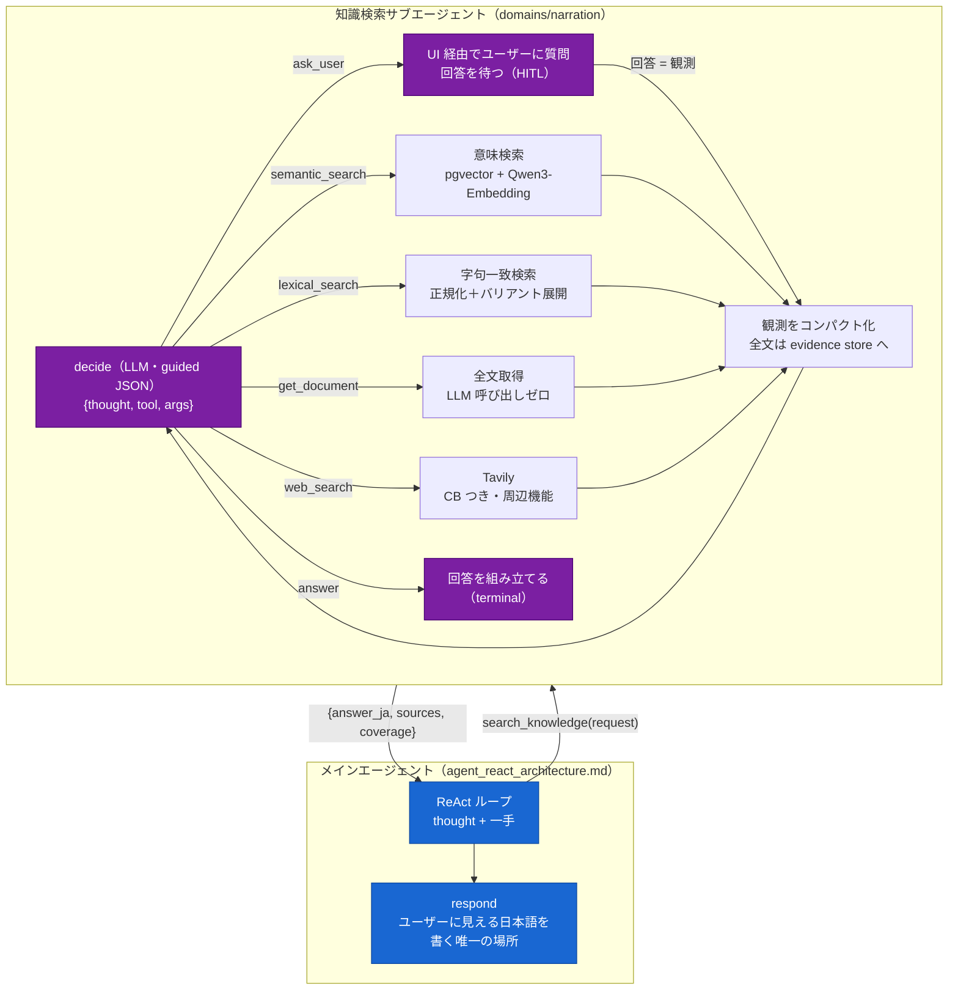

# 知識検索サブエージェント / ナレッジベース設計

- 状態: **決定稿 (2026-08-01)** / **改訂 2026-08-04([ADR-0019](../adr/0019-react-main-agent-subagents.md): 内側 Tool に `ask_user` を追加、呼び出し元が ReAct メインエージェントに変わった。検索・停止条件・縮退の中身は不変)**
- 前提: [ADR-0011](../adr/0011-knowledge-search-subagent.md)(Agent as a Tool として切り出す)/ [ADR-0012](../adr/0012-knowledge-retrieval-pgvector.md)(pgvector + Qwen3-Embedding-8B)/ [agent_react_architecture.md](agent_react_architecture.md)(メインエージェント)/ [data_model.md](data_model.md)
- 参考にした先行実装: **[TakaJun02/sarutahiko](https://github.com/TakaJun02/sarutahiko)**(同じ開発元の別プロジェクト。`docs/AGENT_REACT.md` / `docs/KNOWLEDGE.md` / `backend/app/rag/`。**コードを直接読んで確認した**、2026-08-01)

---

## 0. この文書が決めること

**「鶴間池ってどんな所?」「クマは出ますか」に、根拠を持って答える仕組み**を確定させる。

メインエージェントから見ると Tool は 1 つ(`search_knowledge`)だが、その内側は**自分のコンテキストと 5 つの Tool を持って反復する独立したエージェント**である(2026-08-04: `ask_user` を追加)。

**この文書で決めないもの**: ナレッジ MD の内容そのもの(既存 118 本を使う)、パック生成時のナレーション文面(`packs_pipeline.md`)、音声合成(`20_architecture.md §8`)。

### 0.1 なぜサブエージェントなのか(要約)

| | |
| --- | --- |
| **1 回引いて終わりにできない** | `##` で割ると `## 概要` が **115 ファイル**、`## アクセス` が **58 ファイル**に現れる(実測)。ほぼ同型のチャンクが競合するので、**引き直し・全文取得の反復が要る** |
| **反復の中間状態がメインに置けない** | メインは 16,384 の中で初周 4,500 + 手ごとに数百トークンを使う([agent_react_architecture.md §9](agent_react_architecture.md))。観測履歴・全文・Web 本文が積み上がる余地がない |
| **検索の専門性が混ざる** | メインが「推薦か旅程編集か」と「どの検索戦略か」を同じプロンプトで判断することになる |

詳細は [ADR-0011](../adr/0011-knowledge-search-subagent.md)。

---

## 1. 全体像



**メインから見た契約はこれだけである。**

```python
search_knowledge(request: str) -> {
    "answer_ja": str,          # Agentic RAG エージェントとしての回答
    "sources": [ {...} ],      # 出典（ナレッジ由来 / Web 由来を区別する）
    "coverage": "full" | "partial" | "none",
}
```

**`answer_ja` は `respond` のための素材であり、そのまま画面に流さない。**ユーザーに見える日本語を書くのは `respond` だけ([agent_react_architecture.md §3.4](agent_react_architecture.md))。サブエージェントを**第二の話者にしない**。

---

## 2. サブエージェントの Tool

| Tool | 引数 | 動作 | 戻り(観測) | terminal |
| --- | --- | --- | --- | --- |
| **`semantic_search`** | `{queries: string[] 1..3}` | pgvector のコサイン類似(§4) | ヒットのタイトル + **ヒット位置中心の断片** + `doc_id` + `chunk i/N` + `truncated` | — |
| **`lexical_search`** | `{keywords: string[] 1..6}` | 決定的な字句一致(§5)。ヒットゼロならバリアント展開して再試行 | 同上 + 使ったキーワード(展開後を含む) | — |
| **`get_document`** | `{doc_ids: string[] 1..2}` | 全チャンクを `chunk_index` 順に取得し evidence へ。**LLM 呼び出しゼロ** | 先頭 ~1,500 トークン + 「全 N チャンク取得済み(回答時に全文参照)」 | — |
| **`web_search`** | `{queries: string[] 1..3}` | Tavily(§6)。**ドメイン制限なし** | タイトル・URL・抜粋。CB 開放時は「利用不可」観測 | — |
| **`ask_user`** | `{kind, slot?/surface?, reason, options: 2..4}` | **UI 経由でユーザーに質問し、回答を待つ**(HITL。2026-08-04 追加、[ADR-0019](../adr/0019-react-main-agent-subagents.md))。ターンは中断しない。ガードレール(A1〜A7)はメイン・SA 共通([agent_react_architecture.md §10](agent_react_architecture.md)) | **ユーザーの答え**(観測として返り、**同じ反復の中で**続行する) | — |
| **`answer`** | `{answer_ja, sources, coverage}` | 回答を返してメインへ戻る | —(terminal) | ✔ |

### 2.1 観測の設計 — ここが効く

**3 つを必ず観測に載せる。**

| 載せるもの | なぜ |
| --- | --- |
| **`doc_id`** | **これが無いと `get_document` を発行できない。**「続きが読みたい」と思っても呼べない |
| **`chunk i/N`** | 文書のどこを見ているかが分かる |
| **`truncated: true/false`** | 「続きがある」ことを明示する。プロンプトに「`truncated=true` なら `get_document` で全文が取れる」と書く |

**断片はヒット位置中心 ±200 字にする(先頭固定にしない)。**先頭 400 字を機械的に返すと、**肝心の箇所の手前で切れて「途切れている」と誤認し、同義語で検索し直す空転**が起きる。`lexical_search` は最初のキーワード一致位置、`semantic_search` はクエリ語が字句として出現すればその位置、無ければ先頭。

**重複除外にも `doc_id` を添える。**「除外分は取得済みで回答時に参照される(再取得不要)」と明記しないと、**見えない続きを探し続ける**。

> これらは sarutahiko が本番の再帰上限到達事故から得た修正(`AGENT_REACT.md` FR-37/FR-38)である。**同じ地雷を踏み直さない。**

---

## 3. 停止条件 — 回数ではなく予算で縛る

**「最大 N 周」の固定回数は設けない**(2026-08-01、ユーザー指示)。

**理由: 質問の難しさは事前に分からない。**「クマは出ますか」は 1 手で終わる。「初心者向けで雨でも楽しめて温泉が近い所」は複数方向を探る。**回数で縛ると、難しい質問だけが体系的に失敗する。**予算で縛れば、簡単な質問は 1 手で終わり、難しい質問だけが多く回る。

| 種別 | 内容 |
| --- | --- |
| **主予算** | **サブエージェント自身のコンテキスト使用量** |
| soft 閾値(実効窓の 70%) | `decide` に「まとめに入れ」を注入。**Web の本文取得を抑制** |
| hard 閾値(実効窓の 85%) | Tool メニューを **`answer` のみに縮退** = 事実上の強制終了 |
| **不変条件** | **Tool 実行 0 回の `answer` は無効。**「まず調べること」として差し戻す |
| 安全弁 ① | **同一 `(tool, args)` の再発行は実行しない。**「試行済み」観測を返す |
| 安全弁 ② | **再帰上限。**到達したら集めた証拠で `answer` に縮退し、**ターンは落とさない** |

**安全弁はチューニングノブではなく事故対策である。**「効かないから緩める」ものではない。

**観測が予算を実際に消費することが重要**である。観測が小さすぎると、hard 閾値より先に再帰上限に当たってしまう。1 周あたり数百トークンを見込む。

### 3.1 メインエージェントの予算との関係

**サブエージェントはメインのコンテキストを共有しない。**これが切り出す理由そのものである。

```
メイン（16,384）           サブ（16,384・別コンテキスト）
├ 固定命令・Tool 定義       ├ 固定命令・Tool メニュー
├ profile / 旅程 / 制約     ├ request ＋ 添付文脈
├ 会話履歴                  ├ 行動ログ
├ このターンの軌跡          ├ 観測一覧          ← ここが伸びる
└ search_knowledge の結果   └ evidence store
   ＝ answer_ja のみ（〜600）
```

**メインに戻るのは `answer_ja` と `sources` だけ**(数百トークン)。観測履歴も全文もメインには渡らない。

---

## 4. 意味検索(`semantic_search`)

### 4.1 チャンクと埋め込み

| | |
| --- | --- |
| **分割** | **`##` 見出し単位。**超えたら最大 ~500 トークン・オーバーラップ 50 で再分割 |
| **埋め込み対象** | **`title + heading + 本文`** |
| モデル | `Qwen/Qwen3-Embedding-8B`(`.env` の `Embedding_server`)。**4096 次元** |
| 格納 | `static.knowledge_chunks.embedding vector(4096)`([data_model.md](data_model.md)) |
| 距離 | コサイン |

**`title + heading` を必ず含めるのが要点である。**実測(2026-08-01):

| 見出し | 出現ファイル数 |
| --- | --- |
| `## 概要` | **115** |
| `## アクセス` | **58** |
| `## 見どころ・特徴` | 41 |
| `## 基本情報` | 41 |

「あがりこ大王」の `## アクセス` チャンクは、本文中に**「あがりこ大王」を 1 度も含まない**(`**車**: 日本海東北自動車道「象潟IC」から約15分。` だけ)。**58 個のほぼ同型なチャンクが競合する。**`title + heading` を前置すれば「あがりこ大王 / アクセス / 車: 象潟IC から約 15 分」となり、識別できる。

> **ナレッジ MD の全面書き直しは要らない。**sarutahiko は同じ問題で本文の書き直し(`KNOWLEDGE.md` §2.1)を必要としたが、**こちらのデータは状態が良い** —— `title` が常にスポット名・テーマ名で、見出しが質問語彙(アクセス・見どころ・基本情報)に標準化されている。前置だけで自己完結する。

### 4.2 Qwen3 のクエリ側 instruct プレフィックス【必須】

**クエリにだけ付ける。文書側には付けない。**

```
Instruct: Given a web search query, retrieve relevant passages that answer the query
Query: {クエリ本文}
```

**これは Qwen3-Embedding 固有の仕様で、付け忘れると精度が落ちる。**非対称であることが要点で、両方に付けても片方も付けなくても本来の性能が出ない。

### 4.3 索引と規模

118 文書 → チャンクは 400〜600 程度の見込み。**この規模では近似最近傍索引(HNSW / IVFFlat)は要らない**ので、まず**索引なしの逐次スキャン**で作る(数 ms)。件数が増えて遅くなったら HNSW を張る —— **後から張れるので、先に作らない。**

---

## 5. 字句一致検索(`lexical_search`)

**埋め込みは意味の近さを測る道具であって、「`spot_012`」「象潟IC」が本当に含まれるかを保証しない。**固有名詞・数値・施設名の完全一致にはこちらが確実である。

### 5.1 正規化とスコア

1. **NFKC 正規化 + casefold** を検索対象・キーワードの両方に適用(全角半角・大文字小文字・カタカナの揺れを吸収)
2. 検索対象は **`title + heading + 本文`**(意味検索と同じ単位)
3. スコアは **①一致したキーワードの種類数 → ②タイトル/見出しに当たったか → ③総ヒット数** の順に効く

**「種類数」を最優先にする**のは、複数の条件語がそろって出現するチャンクのほうが、1 語が大量に出現するチャンクより関連が高いためである。

### 5.2 バリアント展開 — ヒットゼロのときだけ

**1 回目でヒットがあれば展開しない**(余計な候補で薄めない)。ゼロのときだけ、キーワードを緩めて再試行する。

| 展開 | 例 |
| --- | --- |
| **接尾辞を剥がす** | `鶴間池周辺` → `鶴間池` / `鳥海山登山道` → `鳥海山` |
| **最長カタカナ列を切り出す** | `ニホンカモシカの生息` → `ニホンカモシカ` |
| **最長漢字列を切り出す** | `元滝伏流水の駐車場` → `元滝伏流水` |

**剥がす接尾辞は鳥海山ドメインに合わせて定義する**(`周辺` / `付近` / `登山道` / `コース` / `について` / `の行き方` など)。sarutahiko は大学ドメインなので `研究室` / `先生` / `教授` を剥がしていた —— **語彙はドメイン固有であり、そのまま流用しない。**

**展開したことを観測に明記する。**何で当たったのか分からないと、次の手が選べない。

---

## 6. Web 検索(`web_search`) — Tavily

`.env` の **`tavily_APIkey`**(2026-08-01 追加)。

| 決めたこと | 理由 |
| --- | --- |
| **ドメイン制限を設けない** | 公式に寄せたいときはモデルがクエリ文字列で表現できる。固定ゲートは柔軟性を削るだけ |
| **サーキットブレーカーを持つ** | 連続失敗で開放し、「Web 検索は現在利用不可」の観測を返して**知識ベースだけで続行**する(NFR-5) |
| soft 閾値超過後は**本文取得を抑制** | Web の raw_content は予算を最も食う |
| **出典でナレッジ由来と Web 由来を区別する** | 信頼度が違う。`respond` が「Web の情報では」と書き分けられる |
| **観光フェーズでは使わない** | オフライン動作(FR-4.2)に外部 API は入れられない |

### 6.1 【重要】Web の結果は `spot_id` の供給源にしない

**Web はクローズドワールドの外側にある。**[ADR-0006](../adr/0006-recommendation-hybrid.md) の実在性保証(全出力 `spot_id` を DB と照合)は、**Web 由来の施設名には効かない。**

- サブエージェントの `answer_ja` は **`respond` の文章材料**であって、**旅程や推薦に入る `spot_id` の出所ではない**
- Web で見つけた店・施設を旅程に入れてはいけない。**旅程に入るのは `static.spots` の 43 件だけ**である
- `respond` のプロンプトに「Web 由来の情報は説明にのみ使い、旅程・推薦の対象として提案しない」を明記する

**これが破れると、存在しない、あるいはルート上にない場所が旅程に混入する。**設計全体で最も守るべき境界の 1 つである。

---

## 7. `decide` の出力と、メインとの受け渡し

### 7.1 `decide` の出力(guided JSON)

```jsonc
{ "thought": "鶴間池の基本情報はあるが、駐車場の記述が切れている", // 短い日本語 1〜2 文
  "tool": "get_document",
  "args": {"doc_ids": ["faci_spot/spot_012"]} }
```

`thought` は **SSE の実況(§9)** に使う。**メインエージェントの周回と同じく guided decoding で構造を強制する**([agent_react_architecture.md §3.2](agent_react_architecture.md) と同じ理由)。`tool` の enum には `ask_user` も含まれる(§2)。soft 閾値(§3)を超えたら `ask_user` は選ばせない(まとめに入る局面で新たに聞かない)。

### 7.2 メインへの戻り値

```jsonc
{ "answer_ja": "鶴間池は鳥海山北麓のブナ林に囲まれた小さな池で、……駐車場は展望台側に約10台分あります。",
  "sources": [
    {"kind": "knowledge", "doc_id": "faci_spot/spot_012", "title": "鶴間池", "spot_id": "spot_012"},
    {"kind": "web", "url": "https://...", "title": "..."}
  ],
  "coverage": "full" }
```

| `coverage` | 意味 | `respond` の扱い |
| --- | --- | --- |
| `full` | 質問に答えられた | そのまま素材にする |
| `partial` | 一部しか分からなかった | **分かった範囲を答え、分からなかった部分を明示する**(FR-3.3) |
| `none` | 見つからなかった | **「分かりませんでした」と言う。**推測で埋めない |

**`coverage` を返させるのは、`respond` が「知らないことを知らないと言う」ためである。**これが無いと、`answer_ja` が空でも `respond` が何か書いてしまう。

---

## 8. スポット固有の質問は検索しない

知識 MD 118 本のうち **60 本が `faci_spot`(スポット 1 件 1 本)** である。**どの POI の話かはメインエージェントが `spot_name` で指定し、アダプタのコードが名寄せで `spot_id` に解決する**([agent_react_architecture.md §3.3](agent_react_architecture.md): メインは id を書かない)ので、検索する必要がない。

```
メインが search_knowledge(request, spot_name="元滝伏流水") を呼ぶ
  → アダプタが名寄せ辞書 + DB で spot_id に解決（できなければ ToolError で差し戻し）
  → サブエージェントのプロンプトに「対象スポットの文書 ID: faci_spot/spot_012」を先に入れておく
  → 1 手目から get_document を選べる（検索を経由しない）
```

**これは Tool を減らす話ではなく、プロンプトに事前情報を入れる話である。**サブエージェントは自由に判断できるまま、無駄な 1 周が減る。

| 質問の種類 | 想定される 1 手目 |
| --- | --- |
| 「鶴間池ってどんな所?」 | `get_document`(スポットが解決済み) |
| 「クマは出ますか」 | `semantic_search` |
| 「象潟IC から近いのは」 | `lexical_search`(固有名詞) |
| 「今日やってますか」 | `web_search`(知識 MD にない最新情報) |

---

## 9. 実況(SSE)とレイテンシ

**待たせている間に何をしているかを見せる。**`decide` の `thought` を素材に、SSE の `state:step` イベントを出す(2026-08-04 改訂: 旧 `searching` は `step` に統合された。[chat_sse.md §1.2](../40_api/chat_sse.md))。

```
event: state {"kind":"step","tool":"search_knowledge","status":"progress","label_ja":"鶴間池の資料を読んでいます"}
event: state {"kind":"step","tool":"search_knowledge","status":"progress","label_ja":"駐車場の記述を探しています"}
event: token {"text":"鶴間池は鳥海山北麓の……"}
```

- **`thought` はサニタイズしてから出す。**不適なら定型文にフォールバックする(LLM 生成物をそのまま画面に出さない)
- **系列は可変である。**フロントは回数に依存してはいけない

契約は [40_api/chat_sse.md](../40_api/chat_sse.md) に反映する。

---

## 10. 縮退(NFR-5)

| 事象 | 挙動 | ユーザーに見えるか |
| --- | --- | --- |
| **埋め込みサーバが落ちている** | **`semantic_search` だけが失敗。**`lexical_search` / `get_document` は DB だけで動く。エラー観測を返し、サブエージェントは字句検索で続行 | 品質低下のみ。ログに `degraded` |
| **Tavily が落ちている / CB 開放** | `web_search` が「利用不可」観測を返す。知識ベースだけで続行 | 同上 |
| **DB が落ちている** | 全 Tool が失敗 → `coverage: "none"` で返る | 「今は詳しい説明ができません」 |
| **再帰上限に到達** | 集めた証拠で `answer` に縮退 | 通常の回答(`coverage` が下がる) |
| **サブエージェント全体がタイムアウト** | メインは `ToolError{code:"upstream_timeout"}` を受け、**そのターンの他の手は続行**する | 「知識の検索に失敗しました」 |

**ベクトルは DB に永続化されているので、埋め込みサーバが要るのは(a)シード時の 118 本の登録 (b)質問文の埋め込み の 2 箇所だけである。**(a) は落ちていても既存ベクトルで動く。

---

## 11. データとインデックス

### 11.1 テーブル

[data_model.md §2.5](data_model.md) に定義する。

```sql
CREATE TABLE static.knowledge_documents (
  doc_id     text PRIMARY KEY,             -- 'faci_spot/spot_012'（ja/ からの相対パス、拡張子なし）
  category   text NOT NULL,                -- ディレクトリ名（faci_spot / nature / courses ...）
  title      text NOT NULL,                -- frontmatter の title
  spot_id    text REFERENCES static.spots(spot_id),   -- ファイル名が spot_NNN のときだけ入る
  frontmatter jsonb NOT NULL,              -- type / area / tags / last_updated
  body       text NOT NULL,                -- 全文（get_document が返す元）
  updated_at timestamptz NOT NULL DEFAULT now()
);

CREATE TABLE static.knowledge_chunks (
  doc_id      text NOT NULL REFERENCES static.knowledge_documents(doc_id) ON DELETE CASCADE,
  chunk_index integer NOT NULL,
  heading     text NOT NULL DEFAULT '',
  body        text NOT NULL,
  search_text text NOT NULL,               -- title + heading + body（NFKC 正規化・casefold 済み）
  embedding   vector(4096),                -- NULL 可（埋め込み失敗時も字句検索は効く）
  PRIMARY KEY (doc_id, chunk_index)
);
```

- **`search_text` を正規化済みで持つ。**検索のたびに正規化しない(字句検索が決定的で速い理由)
- **`embedding` を NULL 許容にする。**埋め込みサーバが落ちていても投入だけは通り、**字句検索は効く**

**`spot_id` の埋め方(実測に基づく。2026-08-01 確認)**

```
knowledge/ja/faci_spot/spot_012.md   → doc_id='faci_spot/spot_012', spot_id='spot_012'   ← 43 件（全 spot と 1:1）
knowledge/ja/faci_spot/facility_hut_omuro.md
                                      → doc_id='faci_spot/facility_hut_omuro', spot_id=NULL  ← 17 件（山小屋・登山口）
knowledge/ja/nature/animals.md       → doc_id='nature/animals', spot_id=NULL              ← テーマ横断 58 件
```

- **ファイル名が `spot_NNN` のときだけ `spot_id` を入れる。**それ以外は NULL。判定はこれだけで足りる
- **旧 `md_slug` は使わない。**実測すると 42 個中 41 個が存在しないファイル名を指していた([data_model.md §1.2](data_model.md))
- `spot_id = NULL` の 17 件(`facility_trailhead_*` など)は**孤児ではなく、スポットに紐づかない有用な知識**である。索引の対象に含める。`validate-knowledge` はこれを**エラーではなく件数として報告する**

### 11.2 インデックス構築

```
python -m app.cli index-knowledge          # 118 本 → 文書・チャンク・埋め込み（冪等）
python -m app.cli validate-knowledge       # 孤児 MD と、参照先のない spot_id を検出
```

- **DDL は Alembic、データはこの CLI**([data_model.md §7.5](data_model.md) の方針どおり)
- 埋め込みは**本文が変わったチャンクだけ**再計算する(`search_text` のハッシュで判定)
- ランタイム対象は **`ja/` のみ**。`en/` `zh/` はデータとして残すが索引しない([20_architecture.md §7](../20_architecture.md))

---

## 12. 決定の記録(2026-08-01)

| # | 決定 | 根拠 |
| --- | --- | --- |
| 1 | **知識検索をサブエージェント(Agent as a Tool)にする** | [ADR-0011](../adr/0011-knowledge-search-subagent.md)。ADR-0009 の「覆す条件」3 つすべてに該当 |
| 2 | **返すのは検索結果ではなく回答**(`answer_ja` + `sources` + `coverage`) | ユーザー指示。`coverage` があることで `respond` が「知らない」と言える |
| 3 | **第二の話者にしない。**`answer_ja` は `respond` の素材 | ユーザーに見える日本語を書くのは `respond` だけ(§8 の原則) |
| 4 | **回数上限を置かず、コンテキスト予算で縛る** | ユーザー指示。回数で縛ると難しい質問だけが体系的に失敗する |
| 5 | **Tool 実行 0 回の `answer` は無効** | 調べずに答える経路を構造的に塞ぐ |
| 6 | 安全弁は**同一アクション反復ガード**と**再帰上限**のみ | 事故対策であってチューニングノブではない |
| 7 | **pgvector + Qwen3-Embedding-8B(4096 次元)** | [ADR-0012](../adr/0012-knowledge-retrieval-pgvector.md)。ADR-0002 が用意した発動条件 |
| 8 | **チャンクは `##` 単位、埋め込み対象は `title + heading + 本文`** | `## 概要` が 115 ファイル・`## アクセス` が 58 ファイルに現れる(実測)。前置しないと識別できない |
| 9 | **Qwen3 のクエリ側 instruct プレフィックスを必ず付ける**(文書側には付けない) | Qwen3-Embedding 固有仕様。付け忘れると精度が落ちる |
| 10 | **観測に `doc_id` / `chunk i/N` / `truncated` を必ず載せる** | `doc_id` が無いと `get_document` を発行できない |
| 11 | **断片はヒット位置中心 ±200 字**(先頭固定にしない) | 先頭固定は「手前で切れて途切れと誤認 → 同義語で再検索」の空転を生む(sarutahiko の実事故) |
| 12 | **バリアント展開はヒットゼロのときだけ**、接尾辞は鳥海山ドメインで定義 | 余計な候補で薄めない。sarutahiko の大学語彙は流用しない |
| 13 | **Web 検索は `spot_id` の供給源にしない** | クローズドワールドの外。破れると存在しない場所が旅程に入る |
| 14 | **近似最近傍索引を先に張らない** | 400〜600 チャンクでは逐次スキャンで数 ms。後から張れる |
| 15 | **スポットが解決済みなら文書 ID をプロンプトに前置** | 60 本の `faci_spot` は検索不要。無駄な 1 周が減る |
| 16 | **埋め込み失敗時も投入は通す**(`embedding` NULL 許容) | 字句検索だけでも動く縮退経路を残す |

## 13. 採らなかった案

| 案 | 不採用の理由 |
| --- | --- |
| `answer_qa` を単純な Tool のまま(1 回引いて抜粋を返す) | 見出しの重複(115 / 58)により 1 回では当たらない。引き直しができない |
| 検索 4 Tool をメインの plan に並べる | 中間状態がメインの 16K に乗らない。`get_document` は結果を見ないと選べない |
| **回数上限つきの有界ループ** | ユーザー指示で不採用。難しい質問だけが失敗する |
| サブエージェントの回答をそのままユーザーに出す | 話者が 2 人になる。トーン・文脈・旅程との整合を `respond` が持てなくなる |
| 全文検索(`pg_bigm` / `pgroonga`) | 日本語トークナイザのために結局拡張が要る。**字句検索は拡張なしで実装できる** |
| ナレッジ MD を全面書き直して自己完結させる | `title + heading` の前置で足りる(こちらのデータは title が常にスポット名・テーマ名) |
| Web 検索にドメイン制限をかける | 固定ゲートは柔軟性を削る。寄せたければクエリ文字列で表現できる |
| サブエージェントにメインの状態を書かせる | 共有状態への書き込みは MAST の失敗モードそのもの。読み取りのみに限る |

## 14. 実装時に決めること(設計判断ではない)

| # | 項目 |
| --- | --- |
| 1 | soft / hard 閾値の具体値(実効窓の 70% / 85% を初期値とする) |
| 2 | 観測 1 件のトークン上限(小さすぎると再帰上限が hard 閾値より先に来る) |
| 3 | バリアント展開の接尾辞リスト(鳥海山ドメインで洗い出す) |
| 4 | Tavily のサーキットブレーカーの閾値と回復時間 |
| 5 | `semantic_search` の返却件数と類似度の下限 |
| 6 | 再帰上限の値(事故対策としての上限。到達は異常と扱う) |
