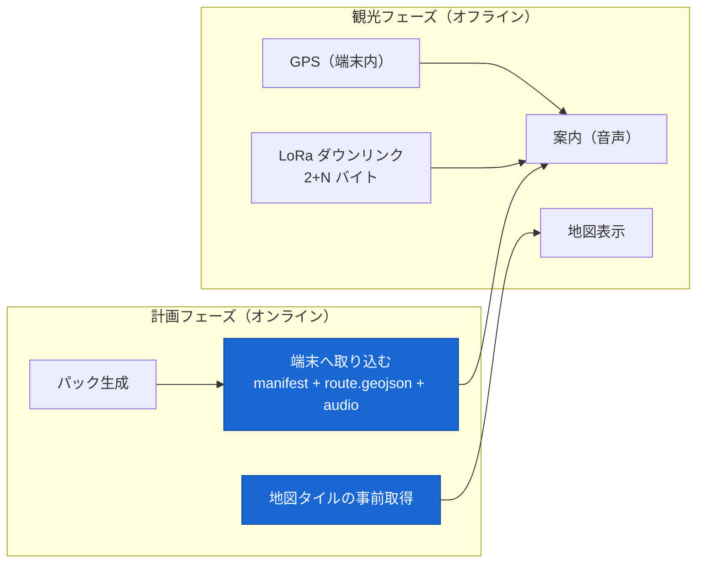

# 観光フェーズ — オフライン動作

- 状態: **決定稿 (2026-08-01)**
- 前提: [packs_pipeline.md](packs_pipeline.md)(パックの中身)/ [realtime_lora.md](realtime_lora.md)(状況コードの配送)/ **[ADR-0017](../adr/0017-frontend-incremental-change.md)(フロントは差分改修に限る)** / [ADR-0015](../adr/0015-pack-asset-composition.md)(base + overlay)
- 関連: [frontend_nav.md](frontend_nav.md)(どのファイルを触るか)

---

## 0. この文書が決めること

**インターネットの無い現地で、端末だけで案内が成立する動作**を確定させる(FR-4.1 / 4.2 / 4.3)。

**この文書で決めないもの**: パックの生成([packs_pipeline.md](packs_pipeline.md))、LoRa のペイロード([realtime_lora.md](realtime_lora.md))、フロントの変更範囲([frontend_nav.md](frontend_nav.md))。

### 0.1 観光フェーズに持ち込めるもの



**入力は 3 つだけ**: 端末内のパック / GPS / LoRa の数十バイト。**LLM は動かない**([agent_planning_phase.md §12](agent_planning_phase.md))。

---

## 1. 全体の流れ

```
1. 取り込み   計画フェーズ中に manifest / route.geojson / 音声 / タイルを端末に保存する（§2）
2. 開始       観光モードに入る。以後 HTTP を呼ばない（§5）
3. 測位       GPS で現在地を追う（既存の usePosition）
4. 判定       manifest.spots の trigger_radius_m 内に入ったら「到達」（§3）
5. 再生       base → 該当 overlay の順に鳴らす（§4）
6. 更新       90 分ごと / 手動で LoRa に問い合わせ、状況コードを取り直す（§6）
```

---

## 2. 取り込み(FR-4.1)

**計画フェーズ中に、通信のあるうちに全部落とす。**

| 資材 | 保存先 | 備考 |
| --- | --- | --- |
| `manifest.json` | **localStorage**(数十 KB) | 起動時に即読む。テキストもここに入っている |
| `route.geojson` | **Cache Storage**(`packs-{pack_id}`) | 数百 KB |
| `audio/*.mp3` | **Cache Storage**(同上) | 3〜8 MB。**現行 `sw.js` は `packs-` プレフィックスと Range 対応をすでに持っている** |
| 地図タイル | **Cache Storage**(`tiles-v1`) | `manifest.tiles` の bbox × zoom(§7) |

- **進捗を出す。**「音声 42 / 58」「タイル 310 / 1,200」。数分かかる操作なので黙って待たせない
- **完了を検証する。**`manifest.spots[].assets[].file` が全部キャッシュにあるかを数え、**足りなければ足りないと表示する**(`missing` に載っているものは除く)
- **取り込み済みのパックを覚えておく**(`pack_id` と `pack_epoch`)。次に開いたときは再取得しない
- **失敗しても部分的に使える。**音声が 3 本欠けていても他は鳴る

---

## 3. 到達判定

**閾値は manifest から受け取る**([packs_pipeline.md §7.2](packs_pipeline.md))。フロントに定数を持たない([22 §12-7](../22_current_issues.md) の解消)。

| `role` | `trigger_radius_m` | 意味 |
| --- | --- | --- |
| `visit` | **150 m** | 目的地に着いた |
| `pass_by` | **300 m**(car 区間沿い)/ **50 m**(foot 区間沿い) | 通り過ぎる |

- 判定は既存の `geoutils.js`(距離計算)と `usePosition.js`(測位)をそのまま使う
- **一度鳴らしたスポットは同じ滞在中に鳴らし直さない。**離脱(半径の 2 倍を出る)で再武装する
- **`pass_by` は速度が乗っているので、`route_position` の順に先読みする。**次に来る `pass_by` を 1 件だけ準備しておく([packs_pipeline.md §7.2](packs_pipeline.md) の `route_position` がこのためにある)

---

## 4. 再生(FR-4.2 / 4.3)

**`playback_rules` に従って、base → overlay の順に積む。**

```
到達 → 積むもの:
  1. base                                      必ず
  2. playback_rules.weather[code_w]            該当があれば
  3. playback_rules.congestion[code_c]         該当があれば
```

- **既存の `audioManager.enqueueAudio()` に 2〜3 件積むだけ**で足りる。再生キューの実装は触らない([ADR-0017](../adr/0017-frontend-incremental-change.md))
- **コードが `0` または `0xF`(不明)なら overlay を鳴らさない**(base のみ)
- **雨かつ混雑なら 2 本続けて鳴る。**これが [ADR-0015](../adr/0015-pack-asset-composition.md) の合成である
- **音声が無い(`missing`)アセットは、manifest のテキストを字幕として出す。**無言にしない
- 再生中に次のスポットに到達したら**キューに積む**(割り込まない)

---

## 5. オフラインであることを設計に入れる

| 決めたこと | 理由 |
| --- | --- |
| **観光モードでは HTTP を一切呼ばない** | FR-4.5。「実験のときだけ HTTP で取る」抜け道を作らない([realtime_lora.md §7](realtime_lora.md)) |
| **モードは明示的に切り替える**(自動判定にしない) | `navigator.onLine` は当てにならない。**画面に「観光モード」と出し、ユーザーが入る** |
| **観光モード中は `stores/rt.js` の HTTP ポーリングを止める** | 同上 |
| **失敗したネットワーク呼び出しを画面に出さない**(そもそも呼ばない) | 圏外のエラートーストが鳴り続ける状態を作らない |

---

## 6. リアルタイム情報の更新

```
[更新] ボタン or 90 分タイマー
  → uplink [0x01, pack_epoch, cur_idx]（3 バイト）
  → 受信待ち（数秒〜数十秒。届かないこともある)
  → downlink [0x01, pack_epoch, code_0 …]
     ├ pack_epoch 一致   → 全スポットのコードを更新。次の再生から反映
     └ pack_epoch 不一致 → 捨てる。「パックが古い」と表示
```

- **前回の受信時刻を画面に出す。**「12:40 時点」。古い情報を最新のように見せない
- **LoRa 未接続でも案内は成立する。**`base` だけが鳴る(§8)
- **端末側でも 1 日 8 回に自制する**(サーバー側の上限は 10 通。[realtime_lora.md §3](realtime_lora.md))

---

## 7. 地図タイル

**パックには含めない**([packs_pipeline.md §7.3](packs_pipeline.md))。取り込み時に別途プリフェッチする。

| 決めたこと | 内容 |
| --- | --- |
| 範囲 | **`manifest.tiles`**(bbox + `min_zoom` / `max_zoom`)。計算はサーバーが済ませてある |
| 保存 | 既存の `sw.js` の `tiles-v1` キャッシュ |
| **修正点** | **`sw.js` の `TILE_HOSTS` が実際のタイル URL と一致していない**([22 §13-5](../22_current_issues.md))。`lib/tiles.js` の URL に合わせる。**それ以外は作り直さない**([ADR-0017](../adr/0017-frontend-incremental-change.md)) |
| 容量 | z10〜16 の該当範囲で**数千枚・数十 MB** を見込む。**クォータ超過は「そこで止めて件数を表示する」**(既存の再試行ロジックがある) |
| 未取得のタイル | 既存の**透明 1×1 PNG** を返す(地図が壊れない) |

---

## 8. 縮退(NFR-5)

| 事象 | 挙動 | 画面 |
| --- | --- | --- |
| LoRa 未接続 / Join 失敗 | **`base` だけ鳴る** | 「リアルタイム情報なし」 |
| ダウンリンクが来ない | **前回のコードを使い続ける** | 「12:40 時点」 |
| `pack_epoch` 不一致 | コードを捨てる | 「パックが古い(要再取得)」 |
| 音声が欠けている(`missing`) | **テキストを字幕で出す** | 該当スポットに注記 |
| タイルが未取得 | 透明タイル | 地図は動く |
| GPS が取れない | 自動再生が止まる | **手動でスポットを選んで再生できる**(既存 UI) |
| パック未取得で観光モードに入った | 入らせない | 「先に取り込んでください」 |

**「案内が止まる」のはパックが無いときだけ。**それ以外はすべて縮退して動く。

---

## 9. 検証(受け入れ条件)

| # | 条件 | 方法 |
| --- | --- | --- |
| 1 | **機内モードで通しで動く** | 実機。取り込み → 観光モード → 移動 → 再生 |
| 2 | 取り込んだ資材が**全部キャッシュにある** | 取り込み完了時の自己検証(§2) |
| 3 | **雨かつ混雑で overlay が 2 本鳴る** | シミュレータで `weather=2, congestion=2` を投入([realtime_lora.md §6](realtime_lora.md)) |
| 4 | **コード不明(`0xF`)で base だけ鳴る** | 同上(値を入れない) |
| 5 | **HTTP を 1 回も呼んでいない** | DevTools の Network を観光モード中に確認 |
| 6 | `pack_epoch` を変えたパックのコードが**適用されない** | サーバー側で再生成して確認 |
| 7 | タイルがキャッシュから出る | オフラインで地図をスクロール |

**3〜6 は室内で再現できる。**実機の現地テストが要るのは 1 と 7 だけである。

---

## 10. 決定の記録(2026-08-01)

| # | 決定 | 根拠 |
| --- | --- | --- |
| 1 | **観光モードは明示的に切り替える**(自動判定にしない) | `navigator.onLine` は当てにならない |
| 2 | **観光モードでは HTTP を一切呼ばない** | FR-4.5。実験時の抜け道を作らない |
| 3 | **manifest は localStorage、資材は Cache Storage** | manifest は起動時に即読む。資材は Range 対応が要る(既存 `sw.js`) |
| 4 | **取り込みの完了を自己検証する** | 「入ったつもりで入っていない」が現地で分かるのは最悪 |
| 5 | **閾値(`trigger_radius_m`)は manifest から受け取る** | サーバーとフロントで別々の定数を持たない |
| 6 | **`pass_by` は `route_position` 順に 1 件先読み** | 走行中は到達判定が間に合わない |
| 7 | **overlay は既存の再生キューに積むだけ** | [ADR-0017](../adr/0017-frontend-incremental-change.md)。`audioManager` を書き換えない |
| 8 | **音声が無ければテキストを字幕で出す** | 部分成功のパックでも使える(FR-3.3) |
| 9 | **タイルはパックに含めず、範囲だけ manifest から受け取る** | 寿命と配布経路が違う([packs_pipeline.md §7.3](packs_pipeline.md)) |
| 10 | **SW は URL 判定だけ直す** | [ADR-0017](../adr/0017-frontend-incremental-change.md)。空回りの原因は 1 点 |
| 11 | **前回受信時刻を必ず表示する** | 古い情報を最新のように見せない |
| 12 | **室内で検証できる項目と実機が要る項目を分ける** | 実機テストの回数を減らす |

## 11. 採らなかった案

| 案 | 不採用の理由 |
| --- | --- |
| オフライン時に LLM を端末で動かす | 端末で 31B は動かない。**パックはそのための事前生成である** |
| 観光フェーズでも HTTP をフォールバックに使う | FR-4.5 が明示的に禁じている |
| `navigator.onLine` でモードを自動切替 | 圏外でも `true` を返すことがあり、当てにならない |
| 音声を端末で TTS する | 端末の音声品質・言語・処理時間が読めない。事前生成のほうが確実 |
| タイルをパックに焼く | 旅程を直すたびに数十 MB の再配布になる |
| IndexedDB に音声を入れる | Cache Storage のほうが Range に対応しやすく、既存 `sw.js` が対応済み |
| 到達判定を地図の描画に紐づける | 画面を見ていないときに鳴らないと意味がない(音声主体: [00_project.md](../00_project.md)) |

## 12. 実装時に決めること(設計判断ではない)

| # | 項目 |
| --- | --- |
| 1 | タイルの zoom 範囲の最終値(`manifest.tiles` の生成側で決める。10〜16 を初期値とする) |
| 2 | 離脱判定の倍率(半径の 2 倍を初期値とする) |
| 3 | 先読みする `pass_by` の件数(1 件を初期値とする) |
| 4 | 観光モードの入口 UI(既存の `/nav` 画面のどこに置くか) |
| 5 | 取り込み進捗の見せ方 |
