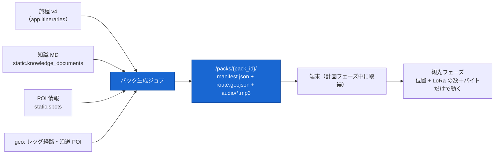
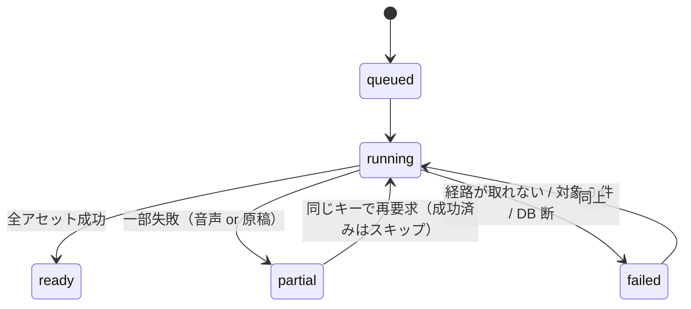
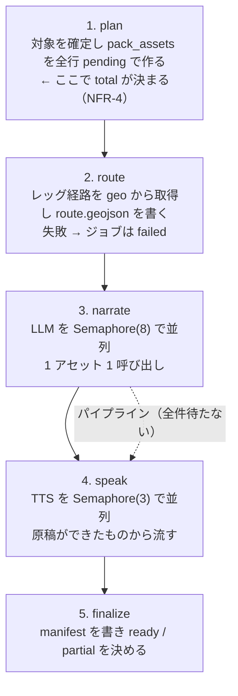

# ガイダンスパック生成 — ジョブ・ナレーション・音声・成果物

- 状態: **決定稿 (2026-08-01)**
- 前提: [20_architecture.md §5・§7・§8](../20_architecture.md) / [ADR-0003](../adr/0003-pack-generation-jobs.md)(パック生成をジョブに)/ [ADR-0015](../adr/0015-pack-asset-composition.md)(アセットは base + overlay の合成)/ [geo.md](geo.md)(経路と沿道 POI)/ [data_model.md §4.7](data_model.md)
- 関連: [narration_qa.md](narration_qa.md)(**別物**。あちらは対話の知識検索、こちらはパック用のナレーション生成)/ Phase 3 `realtime_lora.md`(状況コードの配送)/ Phase 4 `offline_field_mode.md`(端末側)

---

## 0. この文書が決めること

**観光フェーズ(オフライン)で使う資材を、どう作り、どう配り、どう保つか**を確定させる。

パックは FR-4 の中心にある。**現地の端末に届く通信は LoRaWAN の数十バイトだけ**(NFR-9)なので、案内の中身は出発前にすべて端末の中に無ければならない。

**この文書で決めないもの**: 経路の作り方([geo.md](geo.md))、LoRa ダウンリンクのペイロード符号化(Phase 3 `realtime_lora.md`)、端末側の再生ロジックと地図タイルの事前取得(Phase 4 `offline_field_mode.md`)、対話中の知識検索([narration_qa.md](narration_qa.md))。

### 0.1 入力と出力



**パックは旅程の 1 つの version に紐づく。**旅程が変われば別のパックになる(§3.2)。

---

## 1. アセットの決定 — base + overlay の合成【ADR-0015】

### 1.1 旧構成と、その限界

旧実装は `(spot_id, situation)` のキーで**排他的な 5 種**を持っていた(`default` / `weather_1` / `weather_2` / `congestion_1` / `congestion_2`)。端末はそのうち 1 つを選んで再生する。

| 限界 | 中身 |
| --- | --- |
| **「雨で、しかも混雑」が表現できない** | 排他なのでどちらかが必ず消える。優先順位を決めるしかない |
| **本編が状況ごとに作り直される** | 同じスポットの説明が 5 回生成され、状況によって内容がブレる |
| **暗黙のルールがコードに散る** | 「沿道 POI は `default` のみ」という規約が 3 サービス + フロントの計 **7 箇所**に散在([22 §5-5](../22_current_issues.md)) |

**実測(既存パック `fd379dc9…`、2026-08-01 確認)**: 本編 `spot_005.en.mp3` は **436 KB / 54.5 秒**、状況別 `spot_005_weather_1.en.mp3` は **43 KB / 約 5 秒**。旧実装のプロンプトも状況別は「1〜2 文程度」と指示していた。**すでに事実上「本編 + 短い注記」になっていた。**

### 1.2 決定

**アセットを 2 層に分ける。再生は base → 該当 overlay の順。**

| 層 | variant | 長さ | 内容 |
| --- | --- | --- | --- |
| **base** | `base` | visit 200〜300 字(45〜60 秒)<br>pass_by 80〜160 字(**20〜40 秒**) | スポットの案内本体。**状況に依存しない** |
| **overlay** | `weather_cloudy` / `weather_rain` | 40〜100 字(8〜15 秒) | 天気に応じた注記 |
| **overlay** | `congestion_mid` / `congestion_high` | 40〜100 字(8〜15 秒) | 混雑に応じた注記 |

- **天気と混雑は独立した軸**である。雨かつ混雑なら overlay を 2 本続けて鳴らせる
- **variant の語彙は `api/schemas` の enum 1 箇所**で定義する(型で持つ)
- **`pass_by` の base を 20〜40 秒にするのは物理的な理由による。**時速 40 km で走行中、沿道バッファ 300 m([geo.md §5.2](geo.md))の通過に要する時間は約 27 秒しかない。**長い原稿は最後まで鳴らない**

### 1.3 どのアセットを作るか — `role` で決まる

| `role` | 誰が該当するか | 作るアセット |
| --- | --- | --- |
| **`visit`** | 旅程の訪問地点・各日の起点/終点 | base + overlay 4 種 = **5 本** |
| **`pass_by`** | 沿道 POI | **base のみ 1 本** |

**これが 7 箇所に散っていた暗黙ルールの、型による表現である。**`pack_assets` に `role` 列を持ち、生成対象は `role` から機械的に決まる。

### 1.4 なぜ直積(3×3 = 9)にしないか

天気 3 値 × 混雑 3 値の直積は、状況ごとに完結した原稿を作れる代わりに、**1 スポットあたり 9 本**になる。訪問 10 地点で 90 本。生成時間もディスクも 2 倍近くになり、**その差は「雨で混雑」という 1 通りのためだけ**に払われる。合成なら 5 本で同じ状況を表現できる。

---

## 2. 雨天代替行程は事前計算しない【決定】

[recommendation_planning.md §4.2](recommendation_planning.md) が「後続フェーズの検討事項」として残していた論点に、ここで答える。

### 2.1 決定: 作らない

| 理由 | 中身 |
| --- | --- |
| **FR にない** | FR-4.3 が要求するのは「**案内内容**がリアルタイム情報に応じて変化する」ことであって、**行程の差し替え**ではない |
| **組合せが爆発する** | 代替行程には別の POI が入る。その POI 群にも base + overlay 4 種が要る。訪問地点が実質倍増し、生成時間が 2 倍になる |
| **端末 UI に強く依存する** | 「今からプラン B に切り替えますか」をオフラインでどう見せるかは Phase 4(`offline_field_mode.md`)の設計そのもの。**今決めると必ず手戻りする** |

### 2.2 代わりに入れるもの — 雨 overlay に代替候補を 1 件だけ含める

行程を差し替える代わりに、**雨の overlay が「近くの雨に強い場所」を 1 件だけ挙げる。**

```
選び方（コードが決定的に選ぶ。LLM に探させない）
  同じパックに含まれる spot のうち
    weather_fit = 'rain_ok' かつ
    その地点から travel_times(car) で 20 分以内
  を距離の近い順に 1 件。無ければ言及しない
```

- **案内文の中の情報**であって、行程の変更ではない。端末に新しい UI が要らない
- `weather_fit` は enrichment 済み([data_model.md §1.4](data_model.md))なので、**追加のデータ収集がゼロ**
- 例:「雨の日は足元が滑りやすくなっています。無理をせず、車で 15 分ほどの道の駅象潟に切り替える手もあります。」

---

## 3. ジョブモデル

### 3.1 状態機械



- **`partial` は成功である。**成果物は配れる。欠けたものは manifest の `missing` に載る(§7.2)
- **`failed` は成果物を配らない。**経路が取れないパックはオフラインで役に立たない([geo.md §6.3](geo.md))

### 3.2 冪等キーと再実行

**冪等キー = `(user_id, itinerary_version, options)`。**

- **`route_id` は鍵に含めない**([data_model.md §4.7](data_model.md) の当初コメントから変更)。**旅程の version が経路を決める**ので、鍵に入れると同じものが二重に効く
- 同一キーの `POST /api/v1/packs` は **既存の `job_id` / `pack_id` を 202 で返す**(新しいジョブを作らない)。旧実装は再試行のたびに `uuid4()` で新パックを積み上げていた([22 §2-7](../22_current_issues.md))
- `failed` / `partial` のキーに再要求が来たら、**同じ `pack_id` で再開する。**`pack_assets` の `narration_state` / `audio_state` を見て、成功済みはスキップする

**`options`(既定値つき。正規化してから鍵にする)**

```jsonc
{"include_along_poi": true, "along_poi_limit": 20}
```

### 3.3 テーブル

> **DDL は [data_model.md §4.7](data_model.md) が正。**本節は Phase 2 で何を足したかを示す。

| テーブル | 足した列 |
| --- | --- |
| `app.pack_jobs` | `user_id` / `itinerary_version` / **`params_hash`(UNIQUE = 冪等キー)** |
| `app.pack_assets` | **`role`**(`visit` / `pass_by`)/ `duration_s` / `bytes` |

- `pack_assets.variant` の語彙は **`base` / `weather_cloudy` / `weather_rain` / `congestion_mid` / `congestion_high`**
- `narration_state` は `pending` / `ok` / `failed`、`audio_state` は `pending` / `ok` / `failed` / **`skipped`**
  - **`skipped` は「原稿が無いので音声を作らなかった」**を表す。`failed` と区別する(再実行の判断が変わる)

### 3.4 ワーカー

- `app` プロセス内の asyncio タスク(lifespan で起動)。**Celery / Redis は再導入しない**([ADR-0003](../adr/0003-pack-generation-jobs.md))
- `queued` を 2 秒間隔でポーリング。**同時に走らせるジョブは 1 本**(研究規模。NFR-8)
- **クラッシュ復帰**: 起動時に `state='running'` かつ `updated_at` が 10 分以上古い行を `queued` に戻す。ワーカーが 1 つなのでリース機構は要らない
- 再開時、`pack_assets` の成功済み行はそのまま使う。**やり直しは失敗した行だけ**

---

## 4. 生成の流れ



### 4.1 段 1 — 対象の確定

```
訪問地点   = 旅程の全日の items ∪ 各日の origin / destination     → role='visit'
沿道 POI   = geo.along（旅程の全レッグ）− 訪問地点               → role='pass_by'
             件数が along_poi_limit を超えたら distance_m の昇順で切り、
             ★ 落とした件数と spot_id を構造化ログに出す（黙って切らない）
```

- **同じ `spot_id` が複数日に出ても 1 件**(主キーが `(pack_id, spot_id, variant)`)
- `total` = `visit 件数 × 5 + pass_by 件数 × 1`。**この時点で確定する**ので、進捗の分母が途中で動かない

### 4.2 段 2 — 経路

- 旅程の全レッグについて [geo.md §3](geo.md) の `routes` を引く(既存があれば再利用)
- 全レッグぶんの `geojson` を 1 つの FeatureCollection に連結して `route.geojson` に書く。**各 Feature の `properties` に `leg_id`(`"d1-l3"` = 1 日目の 3 番目のレッグ)と `mode` を入れる**
  - **manifest 側は `leg_id` で参照する**(配列の添字ではない)。**端末が Feature の順序に依存しない**ようにするためで、車 + 徒歩のレッグが 2 Feature になることが理由である
- **1 本でも取れなければジョブを `failed` にする**([geo.md §6.3](geo.md))

### 4.3 段 3・4 — 生成と合成をパイプラインで回す

**原稿が全部できるのを待たない。**1 件できたらすぐ TTS に流す。並列度は別々の Semaphore で制御する。

| 段 | 並列度 | 理由 |
| --- | --- | --- |
| narrate | **8** | vLLM の継続バッチングに委ねる。ホストの GPU は共有なので上げすぎない |
| speak | **3** | gTTS は非公式 API でレート制限がある(§6) |

---

## 5. ナレーション生成

> **[narration_qa.md](narration_qa.md) の知識検索サブエージェントとは別物である。**同じ `domains/narration` に住むが、呼ぶ人も LLM の回数も違う([20_architecture.md §7](../20_architecture.md) の表)。

### 5.1 決定: 知識検索サブエージェントを使わない

**`knowledge_documents` を `spot_id` で直接引く。**

| 理由 | 中身 |
| --- | --- |
| **引けることが保証されている** | `faci_spot/spot_NNN.md` が 43 件すべてと 1:1 で対応する([narration_qa.md §11.1](narration_qa.md))。**検索する必要がない** |
| **決定的である** | 同じ旅程から同じ素材が出る。パックは再生成が起きる資材なので、内容が毎回変わると差分が読めない |
| **予算に載らない** | 1 パックは 25〜80 アセット。反復検索するサブエージェントを 80 回動かすのは、バッチ処理の設計として成立しない |

**テーマ横断 MD(`nature/` `safety-and-preparation/` など 58 本)は使わない。**代わりに、安全・季節の事実は**構造化データからコードが組み立てて渡す**(§5.2)。LLM に探させるより確実で、プロンプトが短い。

### 5.2 プロンプトの入力(コードが組み立てる)

**テンプレートは 1 本。**状況・role・季節はパラメータである([20_architecture.md §7](../20_architecture.md) の要求。旧実装は「言語 × 状況」で 6 テンプレートを全文コピーしていた: [22 §F-11](../22_current_issues.md))。

| 素材 | 出所 | 備考 |
| --- | --- | --- |
| スポット名・`social_proof`・`tags_ja` | `static.spots` | |
| 知識本文 | `knowledge_documents.body`(`spot_id` 直引き) | 全文。1 本 2〜4 KB |
| **訪問文脈** | `role`(`visit` = その場にいる / `pass_by` = 通過中) | 旧実装の `playback` を踏襲。**現在形で書かせるための指示** |
| **安全・季節の事実** | `visit_difficulty` / `season_closed_months` / `weather_fit` / `open_hours` | enrichment 済み([data_model.md §1.4](data_model.md)) |
| 状況 | variant(overlay のときだけ) | |
| **代替候補** | 雨 overlay のときだけ 1 件(§2.2) | |
| 旅程上の位置 | 「1 日目の 3 番目」「次は◯◯へ向かいます」 | **パックにしかできない案内**。旅程を持っているから書ける |

- **状況別プロンプトにも知識コンテキストを渡す。**旧実装は状況別のとき知識を無視していた([22 §F-12](../22_current_issues.md))
- `<think>` タグ等のモデル依存後処理は `core/llm.py` に一元化する([20_architecture.md §7](../20_architecture.md))

### 5.3 生成結果の検証 — TTS に流す前に落とす

| 検査 | 判定 |
| --- | --- |
| 空・空白のみ | 不合格 |
| 拒否応答(「申し訳」「できません」で始まり 40 字未満) | 不合格 |
| 長さ逸脱(base visit 120〜420 字 / base pass_by 60〜240 字 / overlay 20〜140 字) | 不合格 |
| 禁止表現(「この資料によると」「文脈から」「以下に示します」) | 不合格 |
| Markdown 記法・箇条書き記号の混入 | **除去して合格**(音声に読ませない) |

- 不合格は **1 回だけ再生成**する。2 回目も不合格なら `narration_state='failed'`、音声は作らず(`audio_state='skipped'`)、**manifest の `missing` に載せる**
- **固有名詞のクローズドワールド検査は掛けない。**実在性の保証([ADR-0006](../adr/0006-recommendation-hybrid.md))は**推薦と旅程に入る `spot_id`** に対する要求であり、案内文の地の文に掛けると誤検知だらけになる。パックの案内文は旅程を変更しない

### 5.4 パーソナライズしない

**プロファイル(`party` / `pace` など)をナレーションに反映しない。**FR にない一方で、同じ旅程から違う原稿が出る変数が 1 つ増え、再現とデバッグが難しくなる。**将来入れるならテンプレートのパラメータ 1 個で足りる**ので、この決定は道を塞いでいない。

---

## 6. 音声合成(voice)

### 6.1 ポートと実装

```python
class TTSPort(Protocol):
    async def synthesize(self, text: str, lang: str) -> Audio: ...
    # Audio = {bytes: bytes, mime: str, duration_s: float}
```

- 既定実装は **gTTS**(現行踏襲)。XTTS 等の GPU 系に差し替えてもこの境界の内側で完結する([20_architecture.md §8](../20_architecture.md))
- **ffmpeg 依存を落とす。**gTTS は mp3 を直接返すので変換が要らない。長さは **`mutagen` で mp3 のヘッダから読む**(旧実装は ffprobe かビットレート近似だった)
- XTTS 残骸(`torch_patch.py`・参照 wav 3 本 1.08 MB・`COQUI_*` 設定)は削除する([22 §7](../22_current_issues.md) / [22 §15-2](../22_current_issues.md))

### 6.2 失敗の閉じ込め

gTTS は**非公式の外部 API**であり、レート制限で落ちることが実測されている。

| 旧実装 | 新設計 |
| --- | --- |
| 逐次実行・1 件失敗で**パック全体が HTTP 500**、書き込み済み MP3 は孤児として残存 | **失敗は 1 アセットに閉じる。**`audio_state='failed'` を書いて次へ進む |
| 同一 spot の失敗クールダウンが後続 situation に連鎖(最大 99 秒/件) | **クールダウンの連鎖を廃止。**リトライは 3 回・指数バックオフ(1 / 2 / 4 秒)まで |
| 孤児ファイルの GC なし | 失敗したアセットのファイルは書かない(**書き込みは成功後に 1 回**) |

- **原稿は残る。**音声が作れなくても manifest にテキストが載るので、端末は字幕として出せる(FR-3.3 の精神)
- 連続失敗が 10 件を超えたら**そのジョブの TTS を打ち切り**、残りを `failed` にして `partial` で終える(レート制限に殴り続けない)

---

## 7. 成果物

### 7.1 レイアウト

```
/packs/{pack_id}/
├── manifest.json                     # 索引 + 本文テキスト + 再生規則（数十 KB）
├── route.geojson                     # 全日の経路（セグメントごとに mode）
└── audio/{spot_id}.{variant}.ja.mp3
```

| 決めたこと | 理由 |
| --- | --- |
| **テキストは manifest に入れ、`.txt` を書かない** | [20_architecture.md §5](../20_architecture.md) の `Asset.text` 欠落([22 §5-2](../22_current_issues.md))の解消。ファイル数が半分になる |
| **経路は別ファイルにする** | 20 §5 は「manifest から route の重複を外し `route_id` 参照に」としていたが、**観光フェーズでは `route_id` を引けない。**manifest を小さく保ちつつオフラインで完結させる形がこれである |
| **ファイル名に `.ja` を残す** | 多言語はスコープ外だが、**言語追加を不可能にするハードコードは避ける**([00_project.md](../00_project.md)) |
| **成果物は不変** | `Cache-Control: public, max-age=31536000, immutable` で配信する。再生成は別 `pack_id` |
| 配信は `app` の `StaticFiles` | リポジトリ外 nginx への暗黙依存をなくす([20_architecture.md §2](../20_architecture.md)) |

### 7.2 manifest

```jsonc
{
  "pack_version": 1,                       // manifest 自身のスキーマ版
  "pack_id": "0192...", "itinerary_version": 4,
  "generated_at": "2026-08-01T09:00:00+09:00", "lang": "ja",
  "state": "partial",

  "playback_rules": {                      // ★ variant の選び方を「データ」にする
    "weather":    {"1": "weather_cloudy", "2": "weather_rain"},
    "congestion": {"1": "congestion_mid",  "2": "congestion_high"},
    "order": ["base", "weather", "congestion"]
  },
  "tiles": {"bbox": [139.90, 39.00, 140.20, 39.30], "min_zoom": 10, "max_zoom": 16},

  "days": [{"date": "2026-08-10",
            "items": [{"seq": 1, "spot_id": "spot_007", "arrive_min": 580, "stay_min": 45,
                       "leg_from_prev": {"mode": "car", "min": 28, "leg_id": "d1-l3"}}]}],

  "spots": [{"spot_id": "spot_007", "role": "visit", "name_ja": "元滝伏流水",
             "lat": 39.13, "lon": 140.05, "trigger_radius_m": 150,
             "approach": {"walk_sec": 600, "walk_m": 580},        // geo.spot_approach 由来
             "assets": {
               "base":         {"file": "audio/spot_007.base.ja.mp3", "duration_s": 52.1,
                                "bytes": 416000, "text": "元滝伏流水は…"},
               "weather_rain": {"file": "audio/spot_007.weather_rain.ja.mp3", "duration_s": 11.4,
                                "bytes": 91000,  "text": "雨の日は…"}
             }}],

  "along": [{"spot_id": "spot_010", "role": "pass_by", "route_position": 0.42,
             "distance_m": 233, "trigger_radius_m": 300,
             "assets": {"base": {...}}}],

  "missing": [{"spot_id": "spot_031", "variant": "congestion_high", "reason": "tts_failed"}],
  "total_bytes": 4821000
}
```

**要点 3 つ**

1. **`playback_rules` を manifest に置く。**「天気コード 2 なら `weather_rain` を鳴らす」という対応をフロントのコードに書くと、variant を 1 つ足すたびに複数ファイルを直すことになる([22 §5-5](../22_current_issues.md) の再生産)。**規則はデータとして配る**
2. **`missing` を必ず書く。**部分成功を端末が知る唯一の手段である(P6: 失敗を見えるところに出す)
3. **`tiles` を書く。**タイル自体はパックに含めない(§7.3)が、Phase 4 の事前取得が「どこを落とせばよいか」を計算しなくて済む

`trigger_radius_m` の初期値: `visit` = **150 m**、`pass_by` = **300 m**(car セグメント沿い)/ **50 m**(foot セグメント沿い)。[geo.md §5.2](geo.md) のバッファと同じ値を配り、**サーバーとフロントで別々の定数を持たない**([22 §12-7](../22_current_issues.md) の解消)。

### 7.3 地図タイルはパックに含めない

| | |
| --- | --- |
| **理由** | タイルは「地図の下地」で、**寿命も配布経路も更新頻度もパックと違う**。パックに焼くと旅程を直すたびに数十 MB を再配布することになる |
| **代わりに** | manifest の `tiles`(bbox + zoom 範囲)を書く。事前取得は Phase 4 で Service Worker のプリキャッシュとして設計する(現行の死んでいる SW: [22 §13-5](../22_current_issues.md) は作り直し) |

---

## 8. API

| Method | Path | 内容 |
| --- | --- | --- |
| `POST` | `/api/v1/packs` | **202** `{job_id, pack_id, state, total}`。冪等(§3.2) |
| `GET` | `/api/v1/jobs/{job_id}` | `{state, progress:{done,total,failed}, pack_id, failures:[…]}` |
| `GET` | `/api/v1/packs/{pack_id}` | `{state, itinerary_version, manifest_url, total_bytes, missing:[…]}` |
| `GET` | `/packs/{pack_id}/…` | 成果物の静的配信(不変・長期キャッシュ) |

```http
POST /api/v1/packs
Authorization: Bearer <token>
{"itinerary_version": 4}
```

- **`itinerary_version` を明示させる。**「現在の版」を暗黙に使うと、生成中にユーザーが旅程を編集したときにどの版のパックなのか分からなくなる
- 認証は Bearer([chat_sse.md §4](../40_api/chat_sse.md))。**パックはユーザーに属する。**`pack_jobs.user_id` と突き合わせ、他人のパックのメタ情報は返さない
- **ポーリング間隔は 2 秒。**SSE にはしない —— 分単位のジョブに常時接続を張る理由がなく、切断時の再開設計([chat_sse.md §1.5](../40_api/chat_sse.md))が別途要るだけになる

### 8.1 進捗 UI(フロント)

- **生成中もアプリは使える**(NFR-4)。パネルは非モーダル
- 表示するもの: 状態バッジ / `done` / `total` / 失敗件数 / 経過時間
- **`partial` を「完了」と表示しない。**「一部の案内を作れませんでした(N 件)」と出し、`missing` の中身を開けるようにする(FR-3.3)
- 完了後に「端末に取り込む」ボタン(事前取得の起動)を出す。取り込み処理そのものは Phase 4

---

## 9. 保持と削除

| 決めたこと | 理由 |
| --- | --- |
| **自動では消さない** | 端末が持っている可能性がある。サーバー側から静かに消えると、再取得できないパックが端末に残る |
| **`python -m app.cli gc-packs --keep 3 [--dry-run]`** | ユーザーごとに新しい方から 3 パックを残して削除。**手動 CLI のみ**(起動時 GC はしない) |
| **孤児ディレクトリも同じコマンドが報告する** | DB に行の無いパックディレクトリ。旧実装が積み上げたもの([22 §2-7](../22_current_issues.md))の掃除口 |
| **保存先は named volume `packs_data`** | compose からホスト固有パス(`/var/www/packs`)を排除([22 §8-4](../22_current_issues.md)) |

---

## 10. 規模とレイテンシ

| | 見積り |
| --- | --- |
| 訪問地点 | 1〜2 日 × 4〜6 = **5〜12** |
| 沿道 POI | **0〜20**(上限) |
| アセット総数 | `visit × 5 + pass_by × 1` = **25〜80 本** |
| ナレーション | 1 本 5〜10 秒 × 8 並列 → **1〜2 分** |
| 音声合成 | 1 本 1〜3 秒 × 3 並列 → **0.5〜1 分** |
| **合計** | **2〜4 分** |
| ディスク | **3〜8 MB / パック** |

**これが同期 HTTP に載らない根拠である**(NFR-4)。旧実装はこれを 1 本のリクエストで行い、Gateway 側のタイムアウトを 3000 秒(50 分)にハードコードしていた([22 §2-1](../22_current_issues.md))。

---

## 11. 縮退(NFR-5)

| 事象 | ジョブ | 成果物 | ユーザーに見えるもの |
| --- | --- | --- | --- |
| 原稿が 1 件作れない | `partial` | その variant を除いて配る | 「一部の案内を作れませんでした」+ `missing` |
| 音声が 1 件作れない | `partial` | **テキストは残る** | 同上。端末は字幕で出せる |
| vLLM が落ちている | `failed` | 配らない | 「案内文の生成に失敗しました」。再要求で再開 |
| gTTS が連続 10 件失敗 | `partial` | 原稿だけのパック | 同上 |
| **OSRM が落ちている** | **`failed`** | 配らない | 「経路が取得できませんでした」 |
| DB が落ちている | ジョブが進まない | — | `/healthz` に出る |
| 生成中にプロセスが落ちた | 再起動時に `queued` へ戻る | — | 進捗が動き出す |

**「原稿・音声は欠けても配る、経路は欠けたら配らない」**が判断の軸である。前者は案内の一部が無いだけだが、後者は**現地で地図が使えない**ことを意味する。

---

## 12. モジュール構成

```
app/domains/packs/
├── planner.py     # 段 1: 対象の確定・pack_assets の作成
├── runner.py      # 段 2〜5 のオーケストレーション（パイプライン・Semaphore）
├── manifest.py    # manifest.json / route.geojson の組み立て
└── storage.py     # /packs 配下への書き込み・GC

app/domains/narration/
├── search/        # 対話用の知識検索サブエージェント（narration_qa.md）
└── pack_text.py   # ★ パック用ナレーション生成（本文書 §5）。テンプレート 1 本 + 検証

app/domains/voice/
├── port.py        # TTSPort
└── gtts_impl.py   # gTTS 実装（リトライ・失敗の閉じ込め）

app/jobs/
└── worker.py      # ポーリングループ・並列度・クラッシュ復帰
```

**依存**: `packs → geo / narration / voice / itinerary(読み取り)`([20_architecture.md §3](../20_architecture.md))。**`packs → recommendation` は作らない**([geo.md §5.3](geo.md) と同じ理由)。

---

## 13. 決定の記録(2026-08-01)

| # | 決定 | 根拠 |
| --- | --- | --- |
| 1 | **アセットを base + overlay の合成にする** | [ADR-0015](../adr/0015-pack-asset-composition.md)。排他では「雨で混雑」が表現できない。実測でも既に本編 54 秒 + 注記 5 秒だった |
| 2 | **生成対象は `role`(visit / pass_by)で決まる** | 7 箇所に散った暗黙ルール([22 §5-5](../22_current_issues.md))を型と列にする |
| 3 | **`pass_by` の base は 20〜40 秒** | 時速 40 km で 300 m バッファの通過は約 27 秒。長い原稿は鳴り切らない |
| 4 | **雨天代替行程を事前計算しない** | FR-4.3 は案内内容の変化であって行程の差し替えではない。組合せ爆発。端末 UI 依存 |
| 5 | **代わりに雨 overlay が代替候補を 1 件挙げる** | コードが決定的に選ぶ。追加データも新 UI も要らない |
| 6 | **冪等キーから `route_id` を外し `(user_id, itinerary_version, options)` にする** | 旅程 version が経路を決めるので二重に効く |
| 7 | **`partial` / `failed` の再要求は同じ `pack_id` で再開** | 成功済みアセットを捨てない。孤児の積み上げ([22 §2-7](../22_current_issues.md))の解消 |
| 8 | **パック用ナレーションは知識検索サブエージェントを使わない** | `spot_id` で直接引ける。決定的。80 件のバッチに反復検索は載らない |
| 9 | **テンプレートは 1 本、状況はパラメータ** | 旧 6 テンプレート全文コピー([22 §F-11](../22_current_issues.md))の解消。状況別にも知識を渡す([22 §F-12](../22_current_issues.md)) |
| 10 | **生成結果を TTS 前に検証し、失敗は 1 回だけ再生成** | 空文字・拒否応答を音声にしない |
| 11 | **案内文に固有名詞のクローズドワールド検査を掛けない** | 実在性の要求は推薦・旅程の `spot_id` に対するもの。地の文に掛けると誤検知だらけ |
| 12 | **パーソナライズしない** | FR にない。再現性が下がる。将来はパラメータ 1 個で入る |
| 13 | **TTS は失敗を 1 アセットに閉じる。ffmpeg 依存を落とす** | 旧: 1 件失敗でパック全体 500 + 孤児ファイル([22 §2-6](../22_current_issues.md)) |
| 14 | **音声が無くてもテキストは manifest に残す** | 端末が字幕で出せる(FR-3.3) |
| 15 | **成果物は manifest + route.geojson + audio/**。`.txt` は書かない | `Asset.text` 欠落の解消。オフラインで完結しつつ manifest を小さく保つ |
| 16 | **`playback_rules` と `trigger_radius_m` を manifest に載せる** | 選択規則をフロントのコードに書かない。閾値を 2 か所に持たない |
| 17 | **`missing` を必ず書く** | 部分成功を端末が知る唯一の手段 |
| 18 | **タイルはパックに含めず、`tiles`(bbox + zoom)だけ書く** | 寿命と配布経路が違う。Phase 4 の計算を省く |
| 19 | **成果物は不変・長期キャッシュ。再生成は別 `pack_id`** | 端末側のキャッシュ設計が単純になる |
| 20 | **進捗はポーリング(2 秒)。SSE にしない** | 分単位のジョブに常時接続は要らない |
| 21 | **GC は手動 CLI(`--keep 3`)。自動で消さない** | 端末が持っているかもしれない |
| 22 | **原稿・音声は欠けても配る、経路は欠けたら配らない** | 後者は現地で地図が使えないことを意味する |

## 14. 採らなかった案

| 案 | 不採用の理由 |
| --- | --- |
| 状況 variant を排他のまま 5 種で持つ | 「雨で混雑」が表現できない。本編が状況ごとにブレる |
| 天気 × 混雑の直積(9 種) | アセットが 2 倍近くになり、その差は 1 通りのためだけ |
| 雨天代替行程を事前計算して同梱 | §2.1。FR にない・組合せ爆発・端末 UI 依存 |
| パック用ナレーションでも知識検索サブエージェントを使う | 反復回数が読めない処理を 80 件のバッチに入れない。`spot_id` で直接引ける |
| ナレーションをプロファイルでパーソナライズ | 変数が増え再現性が落ちる。FR にない |
| 音声を WAV / ffmpeg 変換つきで持つ | gTTS が mp3 を直接返す。依存を 1 つ減らせる |
| テキストを `.txt` として別ファイルに書く | ファイル数が倍。manifest に入れれば 1 回の取得で済む |
| 経路を manifest に埋め込む | 400 KB のうち 122 KB が route だった([22 §B-11](../22_current_issues.md))。別ファイルにする |
| 経路を `route_id` 参照だけにする | **観光フェーズで引けない。**オフラインが成立しない |
| 進捗を SSE で流す | 分単位のジョブ。切断・再開の設計を別途持つことになる |
| ジョブ基盤に Celery / Redis を再導入 | [ADR-0003](../adr/0003-pack-generation-jobs.md)。研究規模にオーバーキル |
| 古いパックを自動削除 | 端末が持っている可能性がある |
| 地図タイルをパックに焼く | 旅程を直すたびに数十 MB の再配布になる |

## 15. 実装時に決めること(設計判断ではない)

| # | 項目 |
| --- | --- |
| 1 | 並列度(narrate 8 / speak 3)とリトライ回数の最終値 |
| 2 | 原稿の長さの上下限(§5.3 の値を初期値とする。実際の音声長を聞いて調整) |
| 3 | `trigger_radius_m` の最終値(実機で歩いて/走って決める) |
| 4 | `along_poi_limit` の既定値(20 を初期値とする) |
| 5 | 禁止表現リスト(生成物を見ながら足す) |
| 6 | `gc-packs --keep` の既定値 |
| 7 | `params` の正規化順序(`options` の既定値埋め込みを含む) |
| 8 | 連続 TTS 失敗の打ち切り閾値(10 件を初期値とする) |
