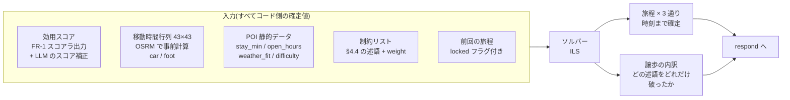
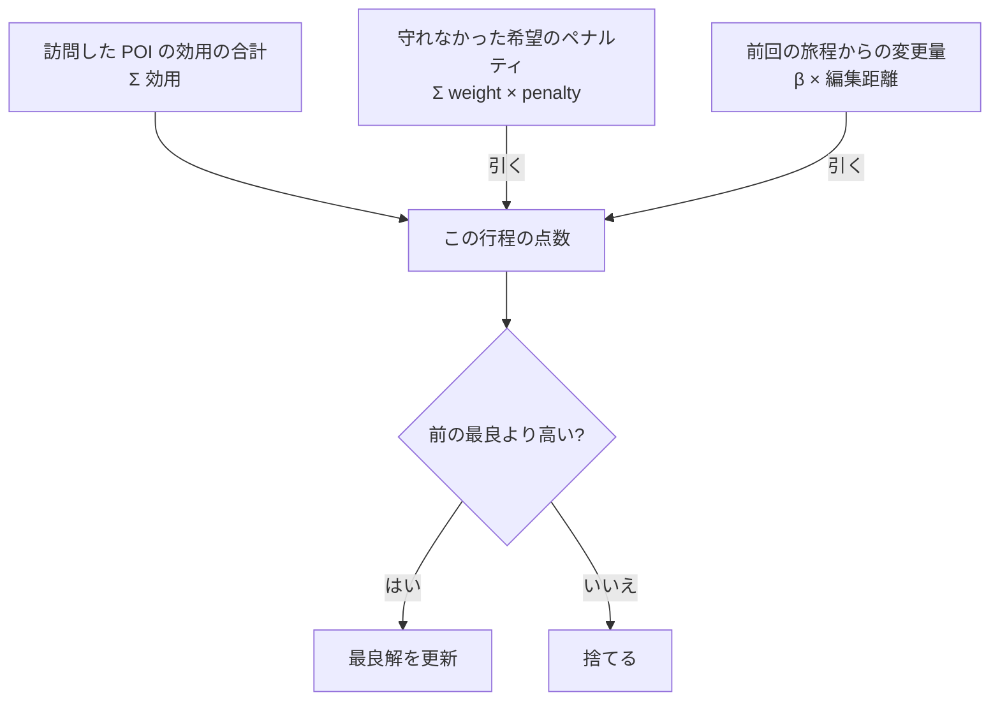
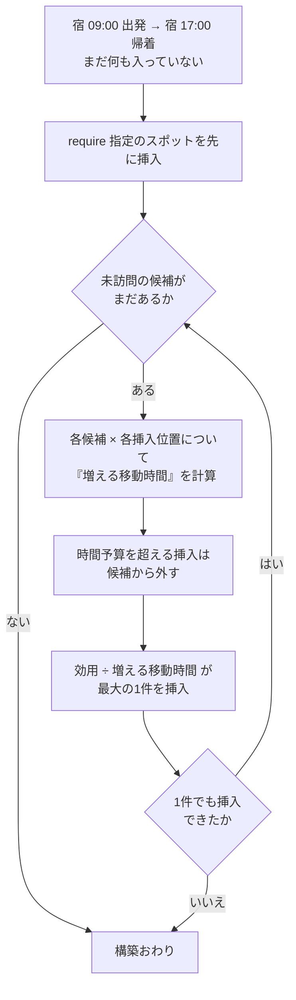
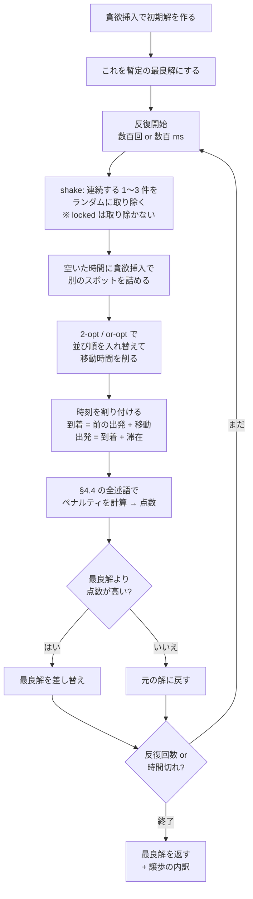
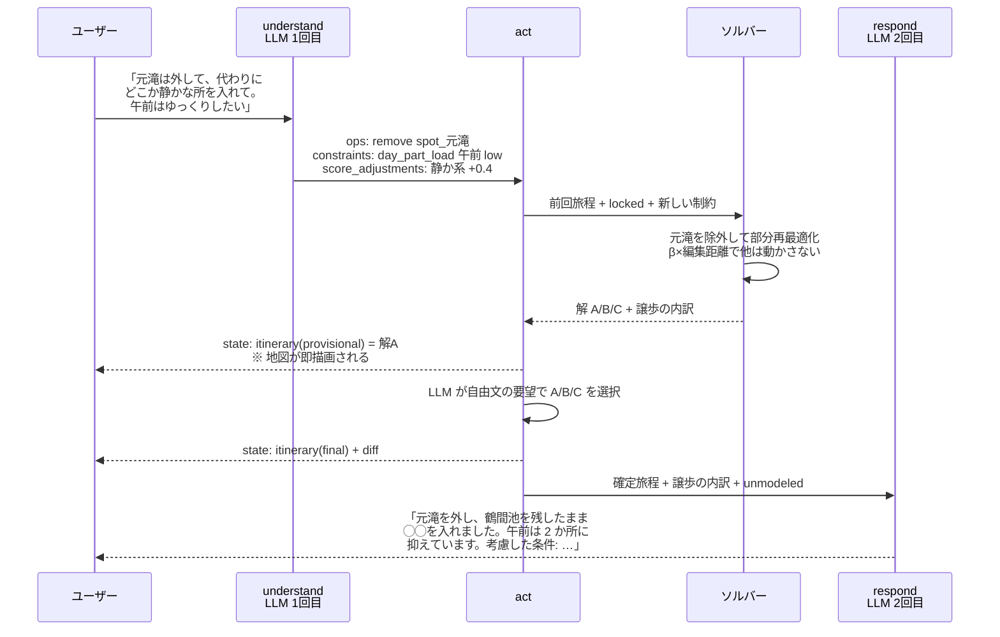

# FR-1 POI 推薦 / FR-2 旅程プランニング — 方式の決定と設計

- 状態: **決定稿(2026-07-30 ユーザー判断により §8 の全論点が決着)** — 実装は ADR-0005 / 0006 / 0007 とあわせて本文書を根拠にする
- 日付: 2026-07-30(調査・比較)/ 2026-07-30(決定)
- 前提文書: [00_project.md](../00_project.md) / [10_requirements.md](../10_requirements.md)(FR-1/FR-2) / [20_architecture.md](../20_architecture.md) §4(対話ターン設計)
- 関連 ADR: [ADR-0005 旅程プランニング](../adr/0005-itinerary-solver.md) / [ADR-0006 POI 推薦](../adr/0006-recommendation-hybrid.md) / [ADR-0007 選好の引き出し](../adr/0007-preference-elicitation.md)
- 位置づけ: [/CLAUDE.md](../../CLAUDE.md)「手段の決め方」に基づく調査・比較 → 決定。**現行(旧)実装の方式(ペルソナ分類 sklearn+FAISS)は既定としない**(ユーザー指示 2026-07-30: 参考にせず作り直し)

> **この文書の読み方**
> **§0 に決定事項がまとまっている。実装するときはここと §3〜§6 を読めばよい。**
> §1 は方式選定を縛る手元環境の事実、§2 は 2026-07-30 に実施した Web 調査の結果(学術・実サービス)= 決定の根拠。§3(FR-1)・§4(FR-2)が方式の比較と決定内容、§5〜§7 が組み込み・データ・評価。§8 は決定の記録(旧「議論したい論点」)。
> **ソルバーの仕組みを理解したい場合は §4.5 の図解から読む。**
> 主要な引用は原典を直接確認したものに「**一次資料で確認済み**」と付記した。確認できなかったものは §9.10 に列挙している。

---

## 0. 決定事項サマリ(2026-07-30)

| # | 論点 | 決定 | 詳細 |
| --- | --- | --- | --- |
| 1 | 旅程の粒度 | **時間割付き**(訪問順+滞在時間+移動手段+到着/出発時刻)。**したがってソルバーを採用する** | §4.0 |
| 2 | FR-2 の方式 | **案 C**(LLM=理解と説明、ソルバー=構成)。**ただしスキーマ外の要望を落とさない仕組みを設計に組み込む**(4 経路 + 無言破棄禁止の不変条件) | §4.2 / **§4.4** |
| 3 | FR-1 の既定構成 | **案 C**(コードが候補 8〜12 件を作る → LLM が最終 3〜5 件を選び理由を書く)。案 B(コードのみ)は比較用に flag で残す | §3.2 / §3.3 |
| 4 | ソルバーの実装 | **自作 ILS**(依存ゼロ・数百行・完全に透明)。仕組みは §4.5 に図解 | §4.3 / **§4.5** |
| 5 | リランクの実装形 | **形-2**(暫定カード先出し → LLM リランク → 確定) | §3.4 |
| 6 | 質問戦略 | 初回聞き取りは**選択式チップ**。追加質問は **ReAct 型の `ask_user` ツール**として act に置く(尋問化を防ぐ 5 つのガードレール付き) | **§3.1** |
| 7 | データ拡充 | **実施する(必須)**。#1 で時間割付きを選んだ時点で `stay_min` / `open_hours` は必須値になる。作業は Codex に委譲し、ユーザーが目視修正 | §6 |
| 8 | 対象範囲 | **鳥海山エリア限定**(全国展開しない。全国の自然公園 POI 収集は現実的でない)。研究発表には使わない(発表済み) | §0.1 |
| 9 | 説明の忠実性 | 研究主題にはしない。**ただしクローズドワールドと根拠素材の注入は品質のために維持する** | §3.3 |

### 0.1 「研究発表に使わない」ことの設計上の含意

ユーザー確認(2026-07-30): **本システムは研究発表には用いない**(発表は既に完了しており、以降は個人の作り込み)。**対象エリアは鳥海山エリアに固定**する。これにより §2 の調査結果は「品質を上げるための根拠」としてのみ効き、以下が不要になる:

- **論文の実験になる形での評価設計は不要** → §7 を大幅に簡素化(人手評価・ResQue・LLM-as-a-judge のメタ評価・ユーザースタディを削除)
- **ablation のための方式併存は不要** → **案 A(純 LLM プランニング)を flag で残す必要がなくなり、実装量が減る**(§4.2 から削除)
- **新規性の主張は不要** → 旧 §8-8 / §8-9 の論点を削除

逆に、エリア固定によって**強まる**前提もある:

- POI は 43 件で固定 → OSRM の `--max-table-size` 既定値 100 を恒久的に下回る。移動時間行列は起動時に一度作れば足りる
- タグ語彙が固定 → guided decoding の enum で語彙を強制する設計が破綻しない
- **43 件の人手データ整備が「一度やれば終わる」作業になる**(全国規模では不可能だった) → 論点 7 を「実施する」と決められる直接の理由

## 1. 設計の前提(手元環境の事実)

方式選定を左右するローカルな事実を先に固定する(2026-07-30 実測)。

| 項目 | 事実 | 含意 |
| --- | --- | --- |
| カタログ規模 | spots **30 件** + facilities **13 件** = 43 件 | **全件が LLM の 1 コンテキストに収まる規模**。「大規模カタログからの検索」問題ではなく「小集合からの選別と根拠付け」問題 |
| POI フィールド | name/aliases(ja/en/zh)・coords・category・description(1〜2文)・social_proof・tags(ja: 自然16, 滝8, 景勝地8, 公園5, 神社5, 湧水4, 史跡4, パワースポット4, 登山3, 海岸3, ハイキング3 ほか)・address・osm_ids・md_slug | タグ語彙は粗いが存在する。**営業時間・滞在時間目安・料金・雨天適性は未整備** → 時間割付きプランニングにはデータ拡充が必要(§6) |
| 知識ベース | 日本語 MD 約 60 本(コース 17 本は frontmatter に trailhead/difficulty/time_required を構造化済み。ほかアクセス・スポット解説・歴史・自然・安全) | 推薦理由・案内の根拠に使える。コース所要時間は登山系プランの素材になる |
| 生成 LLM | vLLM 上の `google/gemma-4-31B-it-qat-w4a16-ct` 1 台のみ。**max_model_len 16,384**。OpenAI 互換、structured output(guided decoding)利用可 | 外部 API 不可。16K 上限のため「履歴+プロファイル+カタログ+リアルタイム」の全部載せはプロンプト設計が必要。JSON 抽出は guided decoding で強制できる |
| 埋め込み | 専用サーバ廃止方針([ADR-0002](../adr/0002-single-postgres.md))。必要なら pgvector+小型モデルを再導入可 | 43 件にベクトル検索は原則不要。自由語→タグ語彙の対応付けは LLM(understand)で足りる |
| 経路 | セルフホスト OSRM(car/foot) | **43×43 の移動時間行列を事前計算できる**(起動時 or シード時)。プランニングの算術は LLM にやらせずコードで持てる |
| リアルタイム | 天気・混雑コード(ダミー、サーバー側シミュレータ、spot×時系列シナリオ) | 推薦・計画への反映は決定的なルールで書け、実験シナリオとして再現できる |
| 対話設計 | [20 §4](../20_architecture.md): `understand`(JSON 1回) → `act` → `respond`(ストリーミング 1回)。**基本 1 ターン 2 LLM 呼び出し** | FR-1/FR-2 の方式は act に載る。方式が LLM 呼び出しを足す場合はレイテンシ(NFR-3)とセットで判断 |
| 規模・目的 | 開発者 1 名・同時利用〜数十・研究プロトタイプ。変更容易性(NFR-1)・計測可能性(NFR-7)最優先 | 学習ベース推薦に必要なインタラクションデータは**構造的に集まらない**(コールドスタートが常態) |

## 2. 調査サマリ(最先端システム・論文)

(2026-07-30 Web 調査。詳細な出典は §9 参考文献)

### 2.1 POI 推薦・対話型推薦(学術)

**(a) 本件の設定「cold-start × 言語で表明された選好 × 小カタログ」には、ゼロショット LLM が実証的に強い**

- Sanner, Balog, Radlinski, Wedin, Dixon, *"Large Language Models are Competitive Near Cold-start Recommenders for Language- and Item-based Preferences"* (RecSys 2023, DOI:10.1145/3604915.3608845)。**一次資料で確認済み**(2026-07-30)。アブストラクトの原文:
  > "we find that LLMs provide competitive recommendation performance for *pure language-based preferences* (no item preferences) in the near cold-start case in comparison to item-based CF methods, despite having no supervised training for this specific task (zero-shot) or only a few labels (few-shot). This is particularly promising as language-based preference representations are more explainable and scrutable than item-based or vector-based representations."
  - 本件の利用者は事実上全員 cold-start で、得られるのは対話中の言語的選好のみ = **論文の設定そのもの**。「学習ベース推薦を採らない」判断の直接的な学術的根拠になる
  - 後段の **"more explainable and scrutable"** は、§3.1 で提案する「プロファイルをユーザーに見せて編集させる」設計の根拠でもある。言語ベースのプロファイルを採ること自体が、説明可能性と検査可能性(scrutability)を同時に得る選択になる
- He et al. (CIKM 2023) は、無学習の LLM がファインチューニング済み専用 CRS モデルを上回ることを示し、プロービングにより**性能の源泉が協調フィルタリング的知識ではなくコンテンツ・文脈知識**であることを突き止めた。本件は POI ごとに日本語解説 MD を持つ = コンテンツ知識が豊富であり、この分析と設計が整合する
- 同論文は同時に **「反復推薦(同じアイテムを繰り返し勧める)」と人気バイアス**を問題として挙げている → 提示済み POI を状態として持ち回す実装が必要(InteRecAgent の candidate bus パターン)

**(b) ゼロショット listwise ランキングは成立するが、既知の failure mode がある**

- LLMRank (ECIR 2024, arXiv:2305.08845): 推薦を「候補列挙+条件付き listwise ランキング」として定式化し、ゼロショットで従来型推薦モデルに匹敵し得る。ただし **(1) 履歴の時系列順序を知覚できない (2) 人気度バイアス (3) プロンプト内の候補位置バイアス** を明示。候補順序を変えた複数回実行の集約(ブートストラップ)で緩和できるが、これはレイテンシと引き換え
- 位置バイアスは 2025-2026 でも継続的に研究対象(arXiv:2508.02020 で系統的な高感度を確認、RISE で緩和; arXiv:2604.27599 は 1 パスの位置不変 listwise リランキング)。**本件では「提示順の固定 or ランダム化 + 感度の実験計測」を第一選択**とし、反復実行はオフライン検証に限る
- LLM-Move (arXiv:2404.01855): **LLM は地理座標・距離を正確に扱えない**と明示。→ 距離・所要時間の計算は PostGIS/OSRM で行い、「車で約 15 分」のような**自然文に変換してから**プロンプトへ入れる。生の緯度経度を推論させない

**(c) カタログのプロンプト化はタクソノミーで構造化すると効く**

- TaxRec (COLING 2025): アイテムカタログを事前に一度タクソノミーで分類・構造化し、その構造化表現をプロンプトに載せる 2 段階法で、素朴なゼロショットプロンプトより有意に改善。**トークン効率と特徴の制御性が上がる**
- → 本件の 43 件に「カテゴリ/屋内外/体力レベル/滞在時間/季節・天候適性」のタグ体系を一度設計し、1 POI 1〜2 行のダイジェストにすれば、**全カタログを低トークンで 1 プロンプトに収められる**(§6 のデータ拡充はこの論文が裏付ける)

**(d) プロファイル管理は「構造化スキーマ + 非同期更新」が定石**

- PURE (SIGIR 2025 Workshop, arXiv:2502.14541): Review Extractor / Profile Updater / Recommender の 3 分業でテキストからプロファイルを維持・逐次更新しゼロショット推薦。トークン制約下でもプロファイルを管理できる。**FR-1.1 に最も近い設計図**だが、素直に実装すると 1 ターン 3 LLM 呼び出しになる
- Mem0 (arXiv:2504.19413, 2025): 対話から抽出したメモリを注入する方式は、全文脈保持方式に対し **p95 レイテンシ 91% 減・トークンコスト 90% 超削減**、LLM-judge スコアは OpenAI のメモリ機能比 26% 相対改善。「毎ターン全履歴を積むより抽出済みメモリを注入する方が速く安く同等以上」という**本件のレイテンシ設計(NFR-3)の定量的根拠**
- MemGPT/Letta (arXiv:2310.08560): 常時コンテキスト内の小さな core memory + 外部 archival storage の二層。**「小さな構造化 core を常時注入 + 全量は DB」という本件のプロファイル設計と同型**
- MemoCRS (arXiv:2407.04960): 個人メモリ + **全ユーザー共有の一般メモリ(ドメイン知識・推論ガイドライン)** の二層。共有側は「鳥海山ドメインの推薦ヒューリスティクス(荒天時は屋内 POI 優先 等)」として静的プロンプトに置ける
- ChatGPT Memory(製品): 保存メモリをユーザーが閲覧・削除・無効化できる。研究プロトタイプでも**プロファイルを可視化・編集可能にする**ことは、実験の透明性・スクラタビリティの面で踏襲価値が高い

**(e) 推薦理由は「もっともらしさ」と「忠実性」が別物 — 構成的に担保する**

- LLM の自己説明は plausible でも faithful とは限らない(arXiv:2401.07927, arXiv:2402.04614)。一方 iEvaLM (EMNLP 2023) は「ChatGPT の説明は説得力がある」と報告 → **説得力の高い不忠実な説明が過信を招く**のが本件の主要リスク(arXiv:2502.08554)
- LLM による推薦説明を直接扱う研究はまだ 6 件しか特定されていない(Frontiers in Big Data 2024 のレビュー、232 件をスクリーニング)= **確立手法がなく、自前の忠実性担保設計が必要であり、同時に研究的新規性を主張しやすい領域**
- 対策の定石は 3 つ: (i) 説明に使ってよい事実を POI 解説 MD + 注入した天気/混雑値 + プロファイル一致フィールドに限定する grounding(観光ドメインでの RAG によるハルシネーション低減は Electronics 14(22):4448, 2025 が報告) (ii) **理由の骨格(一致プロファイル属性 × 文脈フラグ)をアプリ側で決定し、LLM には言語化のみさせる = 構成的忠実性** (iii) 生成説明が POI 文書に含意されるかの LLM 判定によるオフライン検証(arXiv:2406.03248 が方法論を提示)

**(f) 文脈(天気・混雑)の入れ方には古典的な整理がある**

- Adomavicius & Tuzhilin (AI Magazine 2011): **contextual pre-filtering / post-filtering / contextual modeling** の 3 方式。本件はこの語彙で設計を記述でき、複合が推奨される
- Trattner et al. (RecTour 2016 / IT&T 2018): チェックインデータで**天気特徴の追加が POI 推薦精度を改善**することを実証。FR-1.3 の実証的正当化として引用できる(山岳観光の本件では影響はさらに大きいはず)
- SIGIR 2026 (arXiv:2510.24430): 時刻・季節・地域イベントといった地理時間文脈を LLM が解釈できる形で与えると予測価値がある。**「7 月末・夏山シーズン・日曜午後」のように言語で注入する**軽量設計を支持

**(g) 質問戦略(いつ・何を聞くか)**

- COPE (SIGIR 2026, arXiv:2607.06765): 最適な選好引き出しは**段階依存**で、**序盤は属性ベースの質問、選好が固まるにつれアイテムベースの提示が優位**という一貫した傾向。学習部分は再現不要で、この知見だけをプロンプトポリシーとして**追加 LLM 呼び出しゼロ**で移植できる
- 一方、160 名のユーザー研究(arXiv:2404.19093)は「個人的文脈や具体例の提供が鍵、プロンプト技巧の差は知覚品質を有意に改善しない」と報告し、CRS の UX 系統的レビュー(arXiv:2508.02096)は **LLM 型 CRS の冗長性が UX 課題**と指摘 → 毎ターン質問を重ねる能動戦略は UX を損なう。**受動抽出を既定とし、確信度が低いときだけ 1 問添える**

**(h) 本件が採ってはいけない筋(調査による否定)**

| 避けるもの | 根拠 |
| --- | --- |
| ファインチューニング(TALLRec / LLM4POI / Refine-POI) | GPU は共有 vLLM が常時占有し学習不能([ibera の GPU 事情])、嗜好ラベルデータ皆無、そもそもゼロショットで足りる証拠がある(上記 a/b)。LLM4POI は A100 での教師あり学習前提 |
| 多段 agentic 構成(InteRecAgent / RecMind / AgentMove) | 1 ターン複数 LLM 呼び出しが NFR-3 に直接反する。効果は大規模カタログ・多ツール環境のもので 43 POI では利得なし |
| next-POI(チェックイン系列予測)の問題設定と Acc@1 型評価の流用 | データ(LBSN ログ)も目的(次の 1 地点当て)も本件と不一致。LLM4POI の Acc@1=0.34 (NYC) 等は**別問題の数値**。POI 推薦研究の評価の落とし穴は ACM TORS 2026 (arXiv:2507.13725) が指摘 |
| pgvector によるベクトル候補生成を中核に置く | 全カタログがプロンプトに入るため候補生成が不要。導入するなら「POI 解説 MD が長すぎる場合の文書チャンク検索」に限定した任意コンポーネント |
| 接地なしの自由生成による推薦理由 | 上記 (e) |

### 2.2 旅程プランニング(学術)

**(a) 純 LLM エージェントによる旅程計画は、実証的に壊れている**

- **TravelPlanner** (Xie, Zhang, Chen, Zhu, Lou, Tian, Xiao, Su; **ICML 2024 Spotlight**, arXiv:2402.01622)。**一次資料で確認済み**(2026-07-30):
  - 構成: "1,225 meticulously curated planning intents" と、約 400 万件のデータレコードにアクセスする各種ツール
  - 結果: **"even GPT-4 only achieves a success rate of 0.6%"**
  - 失敗の内訳: **"Language agents struggle to stay on task, use the right tools to collect information, or keep track of multiple constraints."**
  - 結論: **"the current language agents are not yet capable of handling such complex planning tasks"**
- これは本件にとって決定的な警告である。GPT-4 で 0.6% のタスクを、**ローカルの量子化 31B に素で任せる設計は成立しない**。特に "keep track of multiple constraints"(複数制約の追跡)は、時間予算・営業時間・移動時間・体力を同時に満たす本件の旅程生成そのものである
- 国内でも同じ壁が確認されている: JSAI2025 の東北大の研究が、制約管理エージェント + 複数ラウンド修正という**検証→修復ループを実装してなお「旅費制約を満たした旅行計画生成には繋がらなかった」**と報告(§2.3(d))

**(b) 情報を全部与えても通らない — 本件が参照すべきは sole-planning の数値**

TravelPlanner には 2 モードがある。**一次資料で確認済み**(HTML v4 の結果表):

- *two-stage*: 自分でツールを叩いて情報収集してから立案 → GPT-4-Turbo **0.6%**
- *sole-planning*: **"we utilize human-annotated plans to pre-determine the destination cities, and provide detailed and necessary information directly to agents… This eliminates the need for tool calling"** → **Direct GPT-4-Turbo 4.4%**、Gemini Pro 2.1%、GPT-3.5-Turbo 0.6%、Mixtral-8x7B 0.7%。CoT/ReAct/Reflexion(GPT-3.5)はいずれも 0.4〜0.7%

**本件は 43 POI 全件をプロンプトに入れられるので、構造的に sole-planning 設定である。**つまり参照すべき数値は 0.6% ではなく **4.4%** ——「情報収集が壊れているから低い」のではなく、**必要な情報を全部渡しても 4.4% しか通らない**。しかも Reflexion(自己反省)を足しても改善していない。

**(c) 決定的: 本件のモデルクラスの実測値は 0.6%**

Planner-R1 (Zhu, Jiang, Sang, Tang, Song, He, Jain, Wang, Geramifard; LinkedIn, arXiv:2509.25779) の Table 1。**一次資料で確認済み**:

| モデル | TravelPlanner Final Pass Rate |
| --- | --- |
| **素の Qwen3-32B(RL 学習なし)** | **0.6%** |
| 素の Qwen3-8B | 0.0% |
| GPT-o3 (high) | 11.3% |
| GPT-5 (high) | 21.2% |
| Planner-R1-8B(agentic RL 後) | 39.9% ± 4.3% |
| Planner-R1-32B(カリキュラム学習後) | 47.0% ± 6.9%(3,000 ステップ延長で 56.9%) |

**素の Qwen3-32B の 0.6% が、本件の `gemma-4-31B` に最も近い実測値**である。40% 台に届いているのは**すべて RL 学習済み**であり、追加学習をしない本件には適用できない。同時に、**GPT-5 (high) ですら 21.2%** という事実は、「より強いモデルを待てば解決する」筋でもないことを示す。

**(d) LLM + ソルバーは桁違いに強く、しかもチャットに載る速度で動く**

- **FormalVerify** (Hao, Chen, Zhang, Fan; NAACL 2025 Long, arXiv:2404.11891)。**一次資料で確認済み**: 多制約プランニングを充足可能性問題として形式化し、**健全かつ完全な SAT/SMT ソルバー**に解かせる。原文 — "the best LLM OpenAI o1-preview can only find viable travel plans with a **10%** success rate" に対し、本手法は **93.9%**
  - 実行不能クエリの扱いが白眉: **"when user input queries are infeasible, our framework can identify the unsatisfiable core, provide failure reasons, and offers personalized modification suggestions"**、その結果 **"modify and solve for an average of 81.6% and 91.7% unsatisfiable queries from two datasets"**
- **TTG "To the Globe"** (Ju, Jiang, Cohen, Foss, Mitts, Zharmagambetov, Amos, Li, Kao, Fazel-Zarandi, Tian; **EMNLP 2024 System Demonstrations**)。**一次資料で確認済み**。自然言語要求を fine-tune 済み LLM で記号形式に翻訳し、**MILP ソルバー**が最適旅程を計算:
  - **"The overall system takes ~5 seconds to reply to the user request with guaranteed itineraries."** ← **チャット UI に載る唯一の実測レイテンシ**
  - 品質: **"~91% exact match in a backtranslation metric"**、最適比 **"0.979 compared to the optimal cost of the ground truth user request"**、**"consistently high Net Promoter Scores (NPS) of 35-40%"**
  - 注意: この 91% は **fine-tune 済み**の翻訳器の値。本件は fine-tune しないので、**この水準は期待できない**
- **ChinaTravel** (arXiv:2412.13682) のニューロシンボリック・エージェントは純ニューラル(ReAct)比で 10 倍前後(Easy 0% → 64.0%、Human クエリ 0.65% → 40.9%)
- 対照的に、**検証・修復ループ系は高コスト**: LLM-Modulo の旅行ケーススタディ(arXiv:2405.20625)は **最大 10 反復**で GPT-4-Turbo 4.4% → 20.6%。FormalVerify も TriFlow の独立計測で **1 タスク平均 245.7 秒**。**本件の「1 ターン 2〜3 呼び出し」予算とは正面衝突する**

**(e) ソルバー案の弱点も同じ強さの証拠がある(正直に記録する)**

- **TREK** (Qi, Zhang, Ng, Xu, Chen, Li, King; arXiv:2607.26977, KDD 2027)。**一次資料で確認済み**: 800 タスク(**533 feasible / 267 provably infeasible**)、**LLM 判定を一切使わない決定的評価器**。最良の GPT-5.6 でも feasible タスクの **46.2% しか task-perfect にならない**。そして原文 — **"satisfying travelers' unstated needs emerges as the universal bottleneck, unsolved even at the frontier."**
  - → **ソルバーは「モデル化した制約」しか守らない。**「子連れだから午前はゆっくり」「雨なら屋内中心に」のような**スキーマにない要望は黙って捨てられる**。しかも捨てたことに気づけない。これは純 LLM 案より悪い失敗モードでありうる(LLM ならたまたま拾う)
  - なお「暗黙ニーズの失敗率 53.7%」という数値がサブエージェント報告にあったが、**抄録では確認できなかった**(46.2% の裏返しから導出された可能性がある)。§9.8 に未検証として記録する
- 「開放的な発話からの制約抽出」自体が難所である証拠: arXiv:2605.03308 は、TravelPlanner(閉じた設定)では制約抽出 F1 ≈ 0.98 なのに、**ChinaTravel(開放的・中国語)では F1 0.61〜0.71・EM が全モデル 0.00** と報告。**日本語の自由発話はこちら側**と覚悟すべき

**(f) 古典 OR: 本件の規模は「解けるかどうか」が論点にならない**

本件の問題は **Team Orienteering Problem with Time Windows (TOPTW)** そのものである(各地点にスコア・滞在時間・時間窓があり、所要時間上限つきの経路を決めた本数だけ作り、獲得スコア合計を最大化する)。

- Vansteenwegen, Souffriau, Vanden Berghe, Van Oudheusden, *Computers & OR* 36(12):3281–3290, 2009 の ILS。**一次資料(著者版 PDF)で確認済み**。抄録原文: **"a simple, fast and effective iterated local search meta-heuristic to solve the TOPTW. An insert step is combined with a shake step to escape local optima… performs very well on a large set of instances with up to 288 locations. The obtained results have an average gap with the optimal solution of only 1.8% for instances with only a single route and 2.1% for instances with three to twenty routes."**
- **288 地点で最適解とのギャップ 1.8〜2.1%。本件は 43 地点・1〜2 経路**なので、計算量はまったく問題にならない(ミリ秒〜数百ミリ秒)。**「ソルバーが重くてチャットに載らない」という懸念は本件には当たらない**——重いのは LLM 側である
- 同グループは **The City Trip Planner**(*Expert Systems with Applications*, 2011)としてフランドル 5 都市で実運用しており、**営業時間を考慮した任意日数の旅程をオンザフライで提案**する実績がある
- サーベイ: Gunawan, Lau, Vansteenwegen (EJOR 2016)、Gavalas, Konstantopoulos, Mastakas, Pantziou (*Journal of Heuristics* 2014, TTDP 特化)、Vansteenwegen & Gunawan (Springer 2019)
- 実装面では **OR-Tools routing の `AddDisjunction([index], penalty)` が「訪問しない選択」を表現する標準モデル化**で、ペナルティを POI ごとに変えれば効用スコアそのものになる。時間窓は `AddDimension` + `CumulVar().SetRange()`、複数日は vehicle 数 = 日数、車/徒歩は車両ごとに arc cost evaluator を分ける

### 2.3 実サービス・日本語圏の動向

**(a) 産業界の到達点: 「LLM を候補選定と順序決定から外す」**

学術の「ゼロショット LLM ランキングは有効」と一見矛盾するが、実サービスでは逆方向の判断が 2 件、公開情報として確認できる。

- **Tripadvisor**(自社エンジニアリングブログ。**一次資料で確認済み** 2026-07-30): 当初 "we leveraged ChatGPT to identify recommendations" だったものを "We developed our own recommender model that directly analyzes our millions of English-language traveler reviews" に置換。結果は原文で **"reducing our latency from ~40 seconds to about ~6.5 seconds on average"**、**"30% increase in the perceived quality of our recommendations"**、**"doubled the rate at which travelers save the resulting recommendations"**、**"improved surveyed customer satisfaction by 10%"**
  - UX も **"moved away from the standard format of a day-by-day itinerary and reorganized the recommendations into uniquely formed categories"**(利用者が発見と柔軟なカスタマイズを優先すると分かったため)= 「即・完成旅程」から「**カテゴリ別に推薦をブラウズ → ユーザーが選ぶ → 後から日程に組む**」の二段階へ転換
- **NAVITIME Travel AI**(自社 tech note。国内で本件に最も近い。**一次資料で確認済み** 2026-07-30): 生成 AI には「**ユーザーのハテナを聞き取り明確にし、それを『NAVITIME Travel』に伝える役割と、『NAVITIME Travel』が出した結果をユーザーにわかりやすく伝える役割の主に 2 つを任せ**」た、と明記。ハルシネーションについては「**このアプローチは…生成 AI 活用の一つの課題であるハルシネーション…のリスクを下げることにも繋がり**」と述べている
  - 実際の検索・経路探索・データ処理は自社システムが担当する。チャット発話がそのまま旅程操作になる例として「ナウマンゾウ博物館をスケジュールに追加して」(スケジュール追加)、「この近くにあるホテルを調べて」(周辺検索)、「次何すればいい?」(次アクション提案)が挙げられている

**この 2 件を本件にどう効かせるかは慎重に読む必要がある**: Tripadvisor が LLM を外して勝てたのは、代わりに置いた**膨大なレビュー由来の強力なレコメンダ**があったからで、本件の代替物は粗いタグ上の手書きスコア関数にすぎない(§2.1(a) の cold-start の証拠はむしろ LLM 側に有利)。したがって移植すべきは「LLM を推薦から外せ」ではなく、**(i) 候補集合は必ず DB 側が作る (ii) 順序・時間の決定は決定的エンジンが持つ (iii) LLM は聞き取り・選択・説明に限定 (iv) レイテンシは品質指標である**、の 4 点である。

**(b) グラウンディングの実務(実在しない場所を出さないために)**

- **Google「Grounding with Google Maps」**(Gemini API): 場所情報は Places 検索ツール経由でのみ取得させ、**応答に引用(citation)を必須で付与**する API 契約。ユースケース筆頭が「対話型トリッププランナー」
- **回答ソースを閉域データに限定**する実装が国内でも定着: JR 西日本(FAQ データのみから生成、2025-05〜2026-02 実証)、tripla(施設 FAQ/予約 DB)、NEWT(自社掲載ツアー情報をもとに生成。※ ハルシネーション対策としての明示的記述はなく、自社 DB 結合からの推察)
- **構造化出力の強制**: NEWT(令和トラベル)は Vercel AI SDK + Gemini 2.5 Flash で **Zod スキーマにより JSON 構造へ誘導し、クライアント側は `experimental_useObject` で型安全にストリーミング受信**(**一次資料で確認済み** 2026-07-30)。**本件の vLLM guided decoding + SSE と同型**であり、§3.4 形-3 の実在する先例にあたる
- **評価とリリース基準の実務**(同記事、確認済み): 社内 **25 名 × 4 軸(スケジュール完全性・滞在先関連性・独自性・有用性) × 5 段階 + 自由記述**、リリース基準は平均 0.80。実際の推移は **初回 0.74 → 2 回目 0.80 で達成**。コストは「想定 UU × 利用率 × 平均トークン数」で事前試算し、初期はアプリ限定にスコープを絞ってトラフィックを制御 → **§7 層 3 の設計をこの粒度で真似できる**
- **反面教師**: 「検証済みデータに接地」を標榜する Mindtrip でも、第三者比較テストで**実在しない/閉業したホテルを 2 件提示**、価格 2〜3 割過大という報告がある。「概ね接地」では本件の要件(存在しない場所ゼロ)を満たせない → **LLM の出力スキーマ上 POI は `spot_id` でしか表現させず、表示名・座標は必ず DB から引く**クローズドワールド設計にする

**(c) 「チャット万能」への反証と、日本の公的実証**

- **JR 東日本「JR EAST Travel Concierge」**(**一次資料で確認済み** 2026-07-30): 第 1 弾(2024-07〜)の**ユーザ検証を受け**、第 2 弾(2025-08-04〜2026-01-15)でデザインを大幅改善。プレスリリース原文で「**チャット形式から選択式へと変更しました。直感的な操作で、より迅速かつ柔軟に要望を反映できる仕組み**」と明記。あわせて「スキマ時間旅行プラン生成機能」(滞在可能時間・エリア・アクティビティからミニ旅行プランを自動生成)を新設
- **奈良県×日立「ならいこ」**(2024-12): 年齢・興味キーワード・日付・移動手段を**選択式**で入力 → AI がスポット/イベントを提案し、**訪問順と移動時間まで自動作成**。本件と課題設定が同型の公的事例
- → FR-3.2(自然言語で完結)は維持しつつ、**初回の聞き取りはクイックリプライのチップを既定にし、自由文はいつでも受け付ける**構成が、実証データに整合する(§2.1(g) の「冗長性が UX 課題」とも一致)
- 箱根 DMO×TripX(観光庁 観光DX推進モデル実証)、大阪観光局の 20 言語案内、観光庁の生成 AI 活用手引書(2025-05、リスク対応込み)など、地域観光 DX の文脈が整備されつつある

**(d) 日本語圏の学術動向(本件の関連研究として)**

- **観光情報学会 第21回全国大会**(2025-06, 京都橘大学): 「**対話入力可能なパーソナル観光旅程推薦システム**」(東京大・北海道大)= **本件と同型の研究が既にある**。ほか「LLM を用いたオーバーツーリズム緩和のための代替観光地提案システム」(北海道情報大)、観光レビューの暗黙的感情推定(北見工大)など
- **JSAI2025「旅費制約を考慮したマルチエージェントによる旅行計画生成システムの有効性検証」**(吉田倖・野末慎之介・赤間怜奈・鈴木潤(東北大/理研)、阿部香央莉(マシンラーニング・ソリューションズ))。**一次資料で確認済み** 2026-07-30 — **§4 の方式選択に直接効く国内エビデンスであり、しかも否定的結果である点が重要**:
  - 前提: 抄録に「**既存の単一モデルやマルチエージェントシステムは旅費制約を満たす旅行計画を生成できない**」と明記(旅費制約は「旅行計画の評価において最も重要視される要素の一つ」)
  - 提案: 旅費管理エージェントを中心に据え、修正依頼により「食事・宿・アトラクションの修正を複数ラウンド行う」反復修正
  - **結果: 抄録に「旅費制約を満たした旅行計画生成には繋がらなかったが」とある = 検証→修復ループを真面目に実装しても制約充足には至らなかった**
  - → **「LLM に生成させ、違反を検出して直させる」(§4.1 案 B)は、本件より恵まれた条件(おそらく商用 API 級のモデル)でも失敗している**。ローカル 31B で成功を期待する理由はない。§4.2 でソルバー方式(案 C)を推す最も強い根拠のひとつ
- **秋田・山形(鳥海山エリア)を対象とした LLM 観光案内の実証は、公開情報の範囲では確認できなかった** → 本件の新規性主張に使える

**(e) UX パターン(実プロダクトから移植する価値があるもの)**

| パターン | 実例 | 本件への適用 |
| --- | --- | --- |
| デュアルペイン(チャット ⇄ 地図・旅程の常時同期) | Mindtrip, NAVITIME, Trip.com TripGenie | チャットで言及した POI を地図ピンでハイライトし旅程ペインに反映。[20 §4](../20_architecture.md) の SSE `state` イベントがこれを支える |
| 発話 → 旅程操作のブリッジ | NAVITIME「〇〇をスケジュールに追加して」 | §4.2 の `itinerary_ops` 抽出そのもの。実証済みパターン |
| ブラウズ → 選択 → AI が日程化の二段階 | Tripadvisor(保存率 2 倍) | 完成旅程の一発生成を既定にせず、まず候補カード 5〜8 件 → 選択 → 「並べて」で周遊計画化 |
| 聞き取りはチップ優先 | JR 東日本(チャット→選択式へ転換), ならいこ | 同行者・体力・興味・雨天許容をクイックリプライで。自由文も常時可 |
| POI カードの情報構成 | Mindtrip(写真/概要+**天気**+実用注記+次に聞ける質問+保存数) | 写真・1 行説明・所要時間・**現在の天気/混雑バッジ**・推薦理由 1 行・[地図で見る][旅程に追加] |
| 周遊順・移動時間の自動担保 | NAVITIME(巡回経路探索), Wanderlog(route optimizer), ならいこ | 順序は経路計算で決め、日毎の合計所要時間を常時表示。LLM は「なぜこの順か」の説明のみ |
| リアルタイム文脈の先回り提案 | Expedia Romie(天気監視+代替案), Mindtrip(雨の日代替) | 「明日は雨予報 → 屋外 POI に注意バッジ + 『屋内中心に組み替えますか?』」 |
| 選好の可視化と編集 | Kayak(選好保存), Mindtrip(子連れ文脈の保持) | 把握済みプロファイルを編集可能なチップ列で常時表示(§2.1(d) の ChatGPT Memory とも一致) |
| 引用 = カードリンク | Gemini Maps grounding の citation | 応答中の POI 名は必ず DB カードへのリンク。リンクなしの地名は「システム外情報」と視覚的に区別 |
| **旅程差分の提示と undo** | **主機能として打ち出す実プロダクトは確認できず** | AI による変更は「+2 件 / −1 件 / 順序変更」の差分サマリ + [元に戻す] を必ず添える。**研究の差別化点になりうる** |
| 構造化ストリーミング | NEWT(`streamObject`) | vLLM guided decoding + SSE でカードを逐次描画し、ローカル 31B でも体感を守る |

## 3. FR-1 POI 推薦 — 方式の比較と決定

### 3.0 問題の分解

FR-1 は 1 個のアルゴリズムではなく、独立に方式を選べる 4 つの部分問題に分解できる。

1. **プロファイル獲得**(FR-1.1): 対話から何をどう抽出し、どう永続化するか
2. **候補生成+ランキング**(FR-1.2 前半): 43 件から今この文脈で出す k 件をどう選ぶか
3. **理由生成**(FR-1.2 後半): 根拠のある説明をどう作るか(ハルシネーション禁止)
4. **リアルタイム反映**(FR-1.3): 天気・混雑をどう効かせるか

### 3.1 プロファイルの設計(全案共通の土台)

- **構造化プロファイル**(JSONB, `profiles` テーブル)+ 短い自由記述メモの併用を提案:

```jsonc
{
  "interests": {"自然": 0.8, "滝": 0.6, "神社": -0.3},   // データのタグ語彙に正規化した重み(-1..1)
  "party": "family_kids | couple | solo | senior | group",
  "mobility": "avoid_walk | short_walk_ok | hike_ok",     // 歩行許容(コース difficulty と対応)
  "pace": "packed | relaxed",
  "avoid": ["混雑", "長時間歩行"],
  "liked_spots": ["spot_012"], "rejected_spots": [{"id": "spot_003", "reason": "行った"}],
  "notes": "写真が好き。午後は温泉に入りたい。"           // LLM が維持する 1〜2 文の自由記述
}
```

この形は PURE(抽出/更新/推薦の分業)・MemGPT(小さな core memory + 外部ストレージ)・Mem0(抽出済みメモリの注入)・MemoCRS(個人メモリ + 共有ドメイン知識)の共通項の最小実装にあたる(§2.1(d))。**「毎ターン全履歴を積むより抽出済みメモリを注入する方が速く安く同等以上」**という Mem0 の定量結果(p95 レイテンシ 91% 減・トークン 90% 超削減)が、この設計の NFR-3 上の根拠になる。

- 更新は `understand`(JSON 1 回)が毎ターン差分(`profile_delta`)を返し、コードがマージして永続化(20 §4 のとおり)。**interests のキーはデータ実在のタグ語彙に正規化**させ、自由語の増殖を防ぐ(guided decoding の enum で強制)
  - PURE のように抽出を独立呼び出しにすると 1 ターン 3 回になるため、**understand に相乗り**させる。もし understand が重くなりすぎたら「応答を返した後に非同期で抽出・更新」へ逃がせる(体感レイテンシを増やさずに済む)
- **ドメイン共有メモリ**: 「荒天時は屋内 POI を優先」「夏山シーズンは早出を勧める」といった鳥海山ドメインの推薦ヒューリスティクスは、個人プロファイルとは別に**静的プロンプト**として持つ(MemoCRS の二層構成)
- **プロファイルの可視化と編集**: 把握済みプロファイルをチャット上部に編集可能なチップ列として常時表示する(ChatGPT Memory / Kayak / Mindtrip、§2.3(e))。研究上も、実験の透明性・スクラタビリティ・被験者への説明の面で価値が高い
- **能動的質問(preference elicitation)【決定: 選択式チップ + `ask_user` ツール】**

  根拠は 2 つ:
  - COPE (SIGIR 2026) の「最適な引き出しは段階依存で、**序盤は属性ベースの質問、選好が固まればアイテム提示が優位**」という知見
  - LLM 型 CRS の**冗長性が UX 課題**という系統的レビューの指摘(§2.1(g))と、JR 東日本が実証を経て自由チャットから選択式へ転換した事実(§2.3(c))

  **決定内容(2026-07-30、論点 6)**

  1. **初回の聞き取りは選択式**(クイックリプライのチップ)。party / mobility / interests の主要スロットを 2〜3 タップで埋める
  2. **追加質問は ReAct 型の `ask_user` ツール**として実装する。`act` が持つツール集合に並べ、**専用の分岐やオンボーディング専用パスを作らない**(初回聞き取りも `slot: "onboarding"` の `ask_user` 呼び出しとして表現する)

  ```jsonc
  // understand の出力に含まれる next_action(guided decoding の enum で述語を固定)
  { "tool": "ask_user",
    "slot": "mobility",                                  // 埋めたいプロファイルスロット
    "reason": "登山口を勧めるか判断できない",
    "options": ["あまり歩きたくない", "30分程度なら歩ける", "登山もしたい"] }
  ```

  `act` は推薦・旅程を実行せず `state: ask_user` を送出し、UI がチップを描画する。`respond` が質問文を日本語で生成する(**LLM 呼び出しは 2 回のままで増えない** — act のツール実行が「質問を組み立てる」に置き換わるだけ)。

  **ガードレール(尋問化の防止。ここが設計の本体)** — LLM に任せると際限なく質問するため、回数と条件はコードで強制する:

  | # | 規則 | 実装 |
  | --- | --- | --- |
  | G1 | **1 ターン 1 問まで** | act が 2 個目以降の `ask_user` を破棄 |
  | G2 | **同じスロットを 2 回聞かない** | `asked_slots` をスレッド状態に持ち、既出スロットの `ask_user` を破棄 |
  | G3 | **`ask_user` 単独で終われるのは連続 2 ターンまで** | 3 ターン目は強制的に「仮定明示 + 推薦」へ切り替え(`ask_user` を無効化) |
  | G4 | **推薦要求に対して `ask_user` 単独を返さない** | 主要スロットが**全部**空の初回だけ例外。それ以外は「**仮定を明示した推薦 + 確認質問 1 つ**」を同時に返す(COPE の段階依存性に沿う) |
  | G5 | **選択肢は 2〜4 個 + 自由入力を常に残す** | チップは提案であって強制ではない。FR-3.2(自然言語で完結できる)との両立 |

  G3 と G4 の違い: G4 は「質問だけで手ぶらに帰さない」、G3 は「質問が続く場合の打ち切り」。両方あって初めて「聞かなすぎ」と「聞きすぎ」の両側が閉じる。

### 3.2 候補生成+ランキングの選択肢

| 案 | 方式 | 長所 | 短所 |
| --- | --- | --- | --- |
| **A. 純 LLM** | 43 件全カード+プロファイル+リアルタイムをプロンプトに入れ、LLM が選定・順位付け・理由まで一括生成 | 実装最小。意味理解をフル活用。プロンプト変更だけで挙動を変えられる。**43 件なら物理的に収まる**(TaxRec 式ダイジェストで 1.5〜2K トークン) | 位置バイアス・人気バイアス(LLMRank)がそのまま出る。**ハード制約(体力・安全)の充足を保証できない**。理由の捏造を構造的に防げない。非決定性で実験再現が弱い |
| **B. 決定的スコアリングのみ** | コードで `score = Σ(interests×tags) + 文脈ブースト(天気適性・混雑・距離・季節) − ペナルティ(拒否済み・提示済み)` を計算し top-k。LLM は respond での文章化のみ | **LLM 追加呼び出し 0**。決定的・高速・計測容易(スコア内訳がそのまま説明素材)。実験再現性が最高 | **タグの粗さがそのまま上限**。「静かな場所」「子どもが飽きない」等の未タグ概念に弱い。§2.1(a) が示す「言語選好の意味理解」という LLM の強みを捨てる。Tripadvisor が LLM を外して勝てたのは代わりに強力なレコメンダがあったからで、**本件の代替物は粗いタグ上の手書き式にすぎない**(§2.3(a)) |
| **C. ハイブリッド(DB が候補集合 → LLM が選択・理由)** | コードでハード条件フィルタ+スコアリングにより候補 8〜12 件に絞り、各候補に「根拠素材」(一致タグ・所要時間の自然文・天気適合・混雑状況)を注釈。LLM が最終 3〜5 件の選定・順序・理由を**候補内 `spot_id` 限定**で生成 | 学術(検索→LLM リランク)と産業(NAVITIME: 候補は自社エンジン、LLM は聞き取りと説明)の**双方が支持する形**。理由が候補注釈に接地しハルシネーションを構造的に抑止。ハード制約はコード側で保証。コンテキストは候補分のみ | LLM 呼び出しが 1 回増えうる(§3.4 で回避策を検討)。スコアラと LLM の二段構えで、どちらの寄与かの切り分けに計測設計が要る |
| **D. 学習ベース(協調フィルタリング・ペルソナ分類・埋め込み近傍)** | ユーザー行動データや事前学習済み分類器で推薦 | (一般には)大規模で強い | **本件では成立しない**: アイテム 43・ユーザー数十でデータが構造的に不足。§2.1(a) の cold-start 研究がゼロショットで足りることを示している。旧実装のペルソナ分類+FAISS はこの筋であり採用しない |

### 3.3 決定: **C を既定とし、B(リランク OFF)を flag で残す**

**決定(2026-07-30、論点 3)。** 初版ドラフトでは「B を既定、C は実験オプション」としていたが、調査を経て**逆にした**。理由は 3 つ。

1. 本件の設定(cold-start × 言語で表明された選好 × 小カタログ)は、**ゼロショット LLM 推薦が協調フィルタに匹敵すると実証された設定そのもの**(Sanner et al. RecSys 2023)。ここで LLM を使わないのは、証拠のある強みを捨てることになる
2. 本件のタグ語彙(自然16・滝8・景勝地8…)は粗く、B 単独の上限が低い。一方 POI 解説 MD というコンテンツ知識は豊富で、**コンテンツ知識こそがゼロショット LLM 推薦の性能源泉**(He et al. CIKM 2023)
3. 産業の「LLM を外せ」(Tripadvisor)は、**強力な代替レコメンダを持つ組織の判断**であって、本件には移植できない。移植すべきはその手前の「候補集合は DB が作る/順序は決定的エンジンが持つ/レイテンシは品質指標」という構造(§2.3(a))であり、それは C が満たす

なお **B(リランク OFF)は flag として残す**。研究の ablation のためではなく、**LLM 側が壊れた/遅いときに推薦機能を生かしたまま縮退させる経路**として実務的な価値があるため(NFR-1)。

**確定した設計原則(全案共通・議論の余地なし)**

- **クローズドワールド**: LLM の出力スキーマ上、POI は `spot_id` でしか表現させない。表示名・座標・写真・説明は必ず DB から引く。LLM が生成した地名文字列を UI に出さない(§2.3(b))。生成された `spot_id` は DB 照合し、不一致なら破棄して再生成する(**実在性 100% は自動テストで機械的に保証**)
- **地理計算を LLM にさせない**: 距離・所要時間は PostGIS/OSRM で計算し、「車で約 15 分」の自然文に変換してから注入する(LLM-Move の教訓、§2.1(b))
- **提示済み POI を状態として持つ**: 反復推薦(同じ POI を勧め続ける)は LLM 推薦の既知の failure mode(§2.1(a))。`presented_spot_ids` をスレッド状態に持ち、スコアでペナルティを課す
- **位置バイアスを測る**: 候補を LLM に渡す順序は「スコア降順」で固定しつつ、**評価時にランダム化して順序感度を計測する**(§2.1(b))。感度が大きければ 1 パス位置不変手法を検討
- **説明の忠実性は「素材の接地」までで止める**(決定 2026-07-30、論点 9): 「理由の骨格をコードが決め、LLM は言語化のみ」という**構成的忠実性の作り込みは行わない**(研究主題にしないため)。維持するのは**クローズドワールドと根拠素材(一致タグ・所要時間の自然文・天気適合・混雑状況)の注入**まで。これは研究のためではなく、**嘘の理由が出るのを防ぐ品質要件**だから残す。含意判定による自動検証(§2.1(e))も導入しない

**リアルタイム反映(FR-1.3)は pre-filter と contextual modeling の複合**(Adomavicius & Tuzhilin の語彙、§2.1(f))

| 文脈の強さ | 方式 | 実装 |
| --- | --- | --- |
| 安全に関わる強い文脈(荒天時の登山口・悪路) | **contextual pre-filtering** | ハードフィルタで候補から除外 or 大幅降格。理由をログに残す |
| 中程度(小雨・混雑中・時刻・季節) | スコアへの加減点 + **contextual modeling** | スコアブーストと、「本日 元滝: 雨 / 混雑: 高」の構造化事実としてプロンプトへ注入。**数値の生成は LLM にさせず解釈だけさせる**(§2.3(b)) |
| 弱い文脈(営業時間の端など) | **post-filtering** | 確定後の安全網チェック |

3 経路とも `turn_metrics` に記録し、リアルタイム反映 ON/OFF の比較実験ができるようにする。

### 3.4 レイテンシ設計 — LLM 呼び出しを増やさずに C を実装できるか

C の唯一の弱点は呼び出し回数。3 つの実装形があり、**決定は形-2**(2026-07-30、論点 5。計測と縮退が最も素直)。

| 形 | 構成 | 1ターンの LLM 呼び出し | 評価 |
| --- | --- | --- | --- |
| 形-1: respond に畳み込む | act は候補を出すだけ。respond の 1 回で「選択+理由+本文」を生成 | **2 回** | 最速だが、カード表示がストリーム本文のパース依存になり壊れやすい |
| **形-2: 独立リランク + 暫定カード先出し【決定】** | act: 決定的候補を確定 → **即 `state: candidates(provisional)` を送出しカードを描画** → LLM リランク(短い JSON) → `state: candidates(final)` → respond がストリーミング | 3 回(リランクは短出力) | **カードは即座に出る**ので体感レイテンシは形-1 とほぼ変わらない。リランクが独立しているので ON/OFF の切り替え(縮退経路)と計測が素直。**UI 上、暫定→確定でカードが並び替わる見せ方は実装時に決める**(§8.2-1) |
| 形-3: 構造化ストリーミング | respond を guided decoding で `{selected: [{spot_id, reason}], message: "..."}` として生成し、`selected` が流れた時点でカードを描画 | **2 回** | NEWT の `streamObject` と同型(§2.3(b))で理論上は最良。ただし guided decoding 下の日本語散文の品質劣化と、途中失敗時のハンドリングが未知数。**形-2 で計測してから移行を検討する** |

いずれの形でも **UI カードは `state` イベント由来**とし、ストリーム本文のパースで状態を作らない。

## 4. FR-2 旅程プランニング — 方式の比較と決定

### 4.0 決定: 旅程の粒度は「時間割付き」

10_requirements の注記どおり「旅程に何を含めるか」自体が設計判断。**時間割付き(訪問順+滞在時間+移動手段+到着/出発時刻)に決定**(2026-07-30、論点 1)。**この決定によりソルバー採用が確定する**(下記「逆向きの重要な含意」)。

- 根拠: (i) FR-2.2 の経路提示・FR-4 のパック事前生成は結局 leg 単位の経路を要求する (ii) 営業時間・日没・行程超過などの実行可能性はスケジュールがないと検証できない (iii) 「訪問順のみ」は後から時間を足すと編集操作・スキーマが二重化する
- **調査からの追加根拠**: TripCraft (ACL 2025) は既存ベンチマークの「空間的不整合」を批判し、**POI ごとの滞在時間と POI 間の移動を明示的に含む旅程**を生成対象にしている。TripTide・TREK も同様の立場で、**訪問順のみでは評価も実行もできない**という前提に立つ
- **逆向きの重要な含意**: 「訪問順のみ」に留めるなら、**ソルバーを入れる意味も薄い**(43 地点の巡回順程度なら LLM でもだいたい合う)。**ソルバー導入の投資対効果は「時間割まで作る」場合に最大化する。**この 2 つの判断は連動しており、別々には決められない。**2026-07-30 に「時間割付き」を選んだため、ソルバー採用もここで確定した**
- データモデル案(`itineraries` JSONB+正規化はデータ設計時に決定):

```jsonc
{
  "days": [{
    "date": "2026-08-10", "start": "09:00", "end": "17:00",
    "origin": {"kind": "facility", "id": "spot_004"},          // 宿・道の駅等を起点/終点に
    "items": [{
      "seq": 1, "spot_id": "spot_001",
      "arrive": "09:40", "stay_min": 45, "depart": "10:25",
      "leg_from_prev": {"mode": "car|foot", "min": 40, "route_id": null},
      "locked": false, "note": null
    }]
  }],
  "constraints": {"must_visit": [], "pace": "relaxed", "lunch": true, "budget_min": null},
  "version": 7
}
```

### 4.1 生成方式の選択肢

これは古典 OR の **Tourist Trip Design Problem(TTDP / Orienteering Problem 系)**そのものである: 「効用(プロファイル適合スコア)の合計を最大化するよう、時間予算・移動時間・滞在時間・(あれば)時間窓の制約下で訪問部分集合と順序を選ぶ」。n=43 は厳密解すら射程の小規模。

| 案 | 方式 | 長所 | 短所 |
| --- | --- | --- | --- |
| **A. 純 LLM 生成** | 候補 POI と移動時間の抜粋をプロンプトに入れ、LLM がスケジュールまで書く | 実装最小。1 呼び出しで済む。制約の言語的ニュアンス(「午後はゆっくり」)を直接扱え、**スキーマ外の要望も取りこぼさない**(案 C の弱点の裏返し) | **本件のモデルクラスの実測値が 0.6%**(素の Qwen3-32B)。情報を全部渡す sole-planning でも GPT-4-Turbo が 4.4%、GPT-5 (high) でも 21.2%(§2.2(b)(c))。壊れる場所が本件の要求と一致している(**時間算術**: 到着時刻 = 前 POI 出発 + 移動時間、営業時間内か)。43×43 の移動時間行列をプロンプトに入れても LLM は正しく足し算しない |
| **B. LLM 生成+コード検証+リトライ** | A の出力をコードで検証(時間超過・重複・存在しない ID)し、違反をフィードバックして再生成 | A よりは堅い。実装も比較的小さい | **JSAI2025 の東北大の研究が、まさにこの構成(制約管理エージェント+複数ラウンド修正)を実装して「制約充足には繋がらなかった」と報告している**(§2.3(d))。31B の再生成ループは収束が不安定でレイテンシも読めない(1 リトライ=数秒)。**実在 ID・重複といった「単純な違反」の検出には有効だが、時間・予算のような算術的制約の充足を任せる根拠がない** |
| **C. LLM は理解と説明、最適化はソルバー** | `understand` が制約・希望を JSON 抽出 → **コードのソルバー**(FR-1 スコアラの効用値+OSRM 行列+滞在時間で、貪欲挿入+局所改善 or OR-Tools)が時間割を構成 → respond が結果を根拠つきで説明 | 同型の分業で FormalVerify 93.9%、ChinaTravel で純ニューラル比 10 倍、TTG は最適比 0.979 を**約 5 秒**で(§2.2(d))。実行可能性を**構造的に保証**。LLM 呼び出しが固定され計測が安定。編集・再計画も「再ソルブ」で一貫。43 地点は OR 的に些末(§2.2(f)) | **スキーマにない要望が黙って消える**(TREK: 暗黙ニーズは最先端でも未解決のボトルネック、§2.2(e))。**抽出が全誤差のボトルネックになる**(日本語の自由発話は ChinaTravel 側 = F1 0.61〜0.71)。表現力がスキーマに縛られる。ソルバー分の実装が要る |

### 4.2 決定: **C を主方式に、B の「検証のみ」を安全網とする(A は採用しない)**

**決定(2026-07-30、論点 2)。** 案 C を主方式とする。**当初案にあった「A(純 LLM)を ablation 用の flag として残す」は撤回**する — 研究発表に使わないと決まった(§0.1)ため比較実験の需要がなく、実装を残す理由がない。**スキーマ外の要望への対処は §4.4 で本設計に組み込む**(論点 2 のユーザー要望「スキーマにない要望も組み込めるような設計を考えたい」への回答)。

**なぜ C か。** ニューロシンボリック分業は旅行プランニング研究の現在の到達点で、数字の開きが大きい(純 LLM は本件のモデルクラスで 0.6%、情報を全部渡しても 4.4% / ソルバー併用 93.9%)。本件は POI 43 件で OSRM 行列を自前で持てるため、この分業が最も安く確実に効く。TRIP-PAL が「移動時間を乱数でシミュレートした」と自認する弱点を、**本件は最初から持っていない**。

**なぜ B(リトライ)を主方式にしないか。** LLM-Modulo は**最大 10 反復**で 4.4% → 20.6% 止まり、FormalVerify は 1 タスク平均 245.7 秒。**1 ターン 2〜3 呼び出しという本件の予算では 1 回しかリトライできず、20.6% すら再現できない。**加えて JSAI2025 の東北大の研究がこの構成を実装して制約充足に至らなかったと報告している(§2.3(d))。ただし**「リトライを捨てて検証だけ採る」ならほぼコストゼロで安全網になる**ので、後段バリデータとして残す。

**設計の要点**

- **編集は操作(ops)として抽出**: `understand` が `itinerary_ops: [{op: add|remove|move|replace|lock|set_stay|set_time, target, ...}]` を返し(名寄せ辞書で spot_id 解決)、ソルバーは `locked` を固定して部分再最適化する
  - **解の安定性は目的関数に入れる**: `効用スコア − β × (前回旅程との編集距離)`。これは古典的な **Minimal Perturbation Problem / Dynamic CSP** の定式化。LLM に任せると壊れる証拠が 3 本ある —— Flex-TravelPlanner(**新しく来た低優先度の選好を、既存の高優先度制約より優先してしまう**)、TripTide(**Qwen2.5-7B は responsiveness 97〜100% だが semantic drift が大きい = 変えすぎる**)、arXiv:2605.03308(自己修正の over-sensitivity と erroneous persistence)。**目的関数の 1 項で決定的に解ける問題を、LLM の暗黙記憶に任せない**
- **実行不能は「起こさない」**: FormalVerify は unsat core で矛盾を説明するが、それには**追加の LLM 呼び出しが要る**(矛盾の説明しか返らず代替案は返らないため)。本件は**すべての希望をソフト制約 + ペナルティで書き、hard 制約は物理的整合(時間・移動)だけにする**。こうすれば常に解が返り、**「どの希望をどれだけ譲ったか」が目的関数の内訳として構造化データで得られる**ので、respond の 1 回でそのまま日本語化できる(「元滝は営業時間の都合で入りませんでした。代わりに…」)。無言で削らない(FR-3.3 の精神)
- **天気による再計画**: 影響を受ける POI のスコアを 0 にして最小変更ペナルティつきで再ソルブするだけで済み、**LLM 呼び出しは通知文の 1 回のみ**。発展として、パック生成時に**雨天代替行程を事前計算して同梱**する案(オフライン時の plan-B。FR-4 との接続。本文書では採否を決めず、後続フェーズの検討事項とする)
- **スキーマ外の要望を落とさない**: C 最大の弱点であり、ユーザーが明示的に設計を求めた点(論点 2)。**§4.4 で独立した節として設計する**

### 4.3 ソルバーの中身(規模感)

- 事前計算: OSRM の `/table` サービスで 43×43 の car/foot 行列を作り、シード時に DB 保存(foot は近接ペアのみで可)
  - **実現性は確認済み**(2026-07-30): `osrm-routed` の `--max-table-size` 既定値は **100 地点**であり、43 地点の行列は追加設定なしで 1 リクエストで取得できる。現行 compose は MLD アルゴリズムで起動しており `/table` を利用可能。POI が 100 を超えたらこのフラグを引き上げる
- 定式化: **TOPTW**。vehicle 数 = 日数、arc cost evaluator を車/徒歩で分ける、`AddDisjunction([index], penalty)` で「訪問しない選択」を表現(ペナルティ = POI 効用スコア)、`AddDimension` + `CumulVar().SetRange()` で営業時間
- 効用 = FR-1 スコアラ出力(プロファイル・天気・混雑込み)+ LLM のスコア補正(§4.2)。目的 = `Σ効用 − β × 編集距離`
- 実装は **自作 ILS に決定**(2026-07-30、論点 4)。**must_visit を種に貪欲挿入**(挿入コスト = 追加移動時間) → or-opt/2-opt で改善 → 時刻割付。数百行・依存ゼロ・完全に透明。**Vansteenwegen らの ILS が 288 地点で最適解とのギャップ 1.8〜2.1%** を出している方式そのもの(§2.2(f))。動作は **§4.5 に図解**

#### 4.3.1 OR-Tools Routing との比較(2026-07-31 追記)

両者は**別レイヤーのもの**である。OR-Tools Routing は探索エンジンで、ILS は探索アルゴリズム。OR-Tools の既定メタヒューリスティクス(Guided Local Search)自体が ILS の親戚にあたる。したがって違いは**アルゴリズムの優劣ではなく、目的関数をどう書けるか**にある。

**OR-Tools Routing が目的関数に使える部品は 3 つだけ**: (i) **arc cost evaluator**(`(from, to)` の 2 点だけを見るコスト) (ii) **Dimension**(経路に沿って累積する量。`CumulVar().SetRange()` で時間窓) (iii) **Disjunction penalty**(「訪問しない」選択の罰 = orienteering の表現)。この制約は恣意的ではなく**速度の源泉**である — 目的関数が弧ごとに分解できるからこそ移動の差分評価が成立し、C++ の 2-opt / or-opt / relocate / cross-exchange が高速に回る。

**§4.4 の述語を当てはめると、大半は載る**(ここは正直に記録する):

| 述語 | OR-Tools での表現 |
| --- | --- |
| `weight` / `require` / `exclude` | disjunction penalty の調整 ✔ |
| `time_window` | Dimension + `CumulVar().SetRange()` ✔ ど真ん中の用途 |
| `not_consecutive` | arc cost に加算 ✔(隣接ペアなので実は arc-local) |
| `count_at_most` | タグ付きノードで +1 する Dimension + capacity ✔ 不自然だが可能 |
| `max_leg_min` | arc 制約 ✔ |
| `lunch_break` | 時間窓つきダミーノード ✔ 定番の手 |
| `before(a, b)` | `AddPickupAndDelivery` の precedence △ 意味的には流用 |
| `same_day` / `different_day` | `VehicleVar` の等値制約 △ |
| `first` / `last` | 素直な表現がない ✘ |
| **`day_part_load`** | **✘ 表現できない**(下記) |
| **β × 編集距離** | △ 部分的に可能(前回使った弧を安く / 前回訪問ノードの penalty を上げる) |

**決め手は 3 点**

1. **`day_part_load` が原理的に載らない。**「午前の POI 数が上限を超えたら減点」は、**どのノードが午前に入るかが時間 Dimension の値に依存する**。Dimension の増分を Dimension の値で条件分岐させることは Routing Library の設計上できない
2. **ペナルティレジストリはどのみち自分で書く。**「どの希望をどれだけ譲ったか」を日本語で返す要求(§4.2)がある以上、返ってきた解に対して全述語を自分で再評価することになる。**OR-Tools が肩代わりするのは探索であって評価ではない。**評価コードを書くなら、それを目的関数として使う ILS を書くのは追加数十行にすぎない
3. **解を 3 通り返す(§4.4 経路 3)のが素直にできない。**OR-Tools は 1 解を返す設計で、別解はコストを変えて再ソルブすることになる。自作 ILS なら探索中に見つけた上位の相異なる解を保持するだけで済む

**OR-Tools が明確に勝っている点(= 捨てたもの)**: 探索の質(GLS の蓄積と C++ の差分評価)、**時間窓・待ち時間・slack の正しい扱い**(手で書くと最も間違えやすい部分)、自分のバグが減ること。**43 地点では探索の質の差は出ない**(§2.2(f))ので、実質的に捨てたのは 2 番目のリスクである。手当てとして、層 1 の自動テストで全解のハード制約を検査し、**43 地点なら厳密解が計算できるので実装時に突き合わせる**(§7)。

**CP-SAT を採らない理由**: OR-Tools のもう一方(CP-SAT)なら `day_part_load` を含めて全部書ける。ただし TOPTW を時刻離散化してモデル化すると 43 地点でも変数が増え、ソフト制約だらけの重み付き和は不得手で、**3 解を 100ms 級で返す用途に向かない**。モデリングの手間も ILS を書く手間を上回る。
- **43 地点なら数十〜数百 ms**。**ボトルネックは 31B の推論であってソルバーではない**(TTG でも計算時間の大半が LLM 側)。これは「解を 3 通り作って選ぶ」(§4.4)が現実的である根拠でもある

### 4.4 スキーマ外の要望をどう組み込むか(論点 2 の回答)

**問題の定義。** ソルバーは**モデル化した制約しか守らない**。TREK は「旅行者の言語化されない要望を満たすことが普遍的なボトルネックで、最先端でも未解決」と述べている(§2.2(e))。「子どもが飽きないように似た場所を続けないで」「午前はゆっくりしたい」「最後は夕日が見える所で締めたい」— これらが固定スキーマの項目になければ**黙って捨てられ、しかも捨てたことに誰も気づけない**。純 LLM 方式より悪い失敗モードになりうる。

**設計の考え方。** 「あらゆる要望を表現できるスキーマ」は作れない。作れるのは **(a) 表現力を「フィールドの列挙」から「述語の集合」に上げること**と、**(b) それでも表現できないものが無言で消えない保証**の 2 つ。以下、後者を**不変条件**として先に置く。

> **不変条件(自動テストで検査する)**
> `understand` が抽出した要望は、**必ず**次の 4 経路のいずれかに分類される。**分類されない経路は存在しない。**
> `抽出された要望の数 == 経路1 + 経路2 + 経路3 + 経路4 の合計`
>
> これを守るために、抽出スキーマは要望ごとに `handling` を**必須**にする(guided decoding の enum)。LLM に「これは表現できません」と申告させることが、この設計の要点。

#### 経路 1: 制約 DSL の述語に写す(構造的・時間的な要望)

固定フィールドではなく、**述語の閉じた集合 × 引数の開語彙**にする。ChinaTravel の DSL と同じ考え方(§2.2(d))。述語は有限なので検証できるが、引数(タグ名・spot_id・時刻・個数)は自由なので表現力が高い。

| 分類 | 述語 | 自然言語の例 | ペナルティの実装 |
| --- | --- | --- | --- |
| 選好 | `weight(target, w)` | 「滝が好き」 | 効用に `w` を加算(target = タグ or spot_id) |
| 必須/除外 | `require(target)` / `exclude(target)` | 「元滝には絶対行きたい」 | 未訪問なら大ペナルティ / 訪問で大ペナルティ |
| 個数 | `count_at_most(target, n)` / `count_at_least(target, n)` | 「神社は 1 つで十分」 | 超過・不足の件数 × 重み |
| 順序 | `first(target)` / `last(target)` / `before(a, b)` | 「最後は温泉で締めたい」 | 位置違反 1 件ごとに定数 |
| 多様性 | `not_consecutive(target)` | 「似た場所を続けないで」 | 連続する同タグのペア数 |
| 日割り | `same_day(a, b)` / `different_day(a, b)` | 「登山と海は別の日に」 | 違反ペアごとに定数 |
| 時間窓 | `time_window(target, from, to)` | 「夕日スポットは 17 時以降」 | 窓外の分数 |
| 滞在 | `stay_at_least(target, min)` | 「元滝はゆっくり見たい」 | 不足分数 |
| 密度 | `day_part_load(day, part, level)` | 「午前はゆっくり」 | 該当時間帯の POI 数が上限を超えた分 |
| 移動 | `max_leg_min(n)` / `mode_pref(mode)` | 「1 回の移動は 30 分以内で」 | 超過分数 / 非該当 leg 数 |
| 食事 | `lunch_break(from, to, min)` | 「昼は 12 時台に 1 時間」 | 枠が取れていなければ定数 |

```jsonc
// understand の出力(抜粋)。述語名は enum で固定、引数は実在の語彙・spot_id に照合する
"constraints": [
  {"pred": "not_consecutive", "args": {"target": "神社"},
   "weight": 0.6, "source": "似た感じの所が続くと子どもが飽きる", "handling": "dsl"},
  {"pred": "last", "args": {"target": "温泉"},
   "weight": 1.0, "source": "最後は温泉がいい", "handling": "dsl"}
]
```

- コード側に `PENALTIES[pred](itinerary, args) -> (violation, 日本語メッセージ)` のレジストリを 1 つ持つ。**述語を 1 個増やす作業 = 関数 1 個とメッセージ 1 行を足すだけ**(NFR-1)
- **述語が未知、または引数が実在しない場合は経路 4 に落とす**(黙って無視しない。fail-safe)
- 目的関数: `Σ_訪問 効用(spot) − Σ_c weight_c × penalty_c(旅程) − β × 編集距離(前回旅程)`
- **hard 制約は物理的整合だけ**(時刻の整合・日の開始終了・閉鎖中は不可・重複訪問なし・spot_id 実在)。それ以外は全部ソフト → **常に解が返り、「どの希望をどれだけ譲ったか」が構造化データで得られる**(§4.2)

#### 経路 2: POI ごとのスコア補正に写す(「どのスポットか」の要望)

述語に写らないが POI の good/bad に還元できる要望(「静かな所がいい」「映える写真が撮れる所」)は、**understand と同じ呼び出しで LLM に POI ごとのスコア補正を出させる**。Google Research と ITINERA が採る「LLM が重要度スコア、ソルバーが順序」の分業。

```jsonc
"score_adjustments": [
  {"spot_id": "spot_017", "delta": 0.4, "why": "静かで人が少ない", "handling": "weight"}
]
```

- 補正は**候補集合の中だけ**に効かせ、絶対値に上限(±0.5)を設ける。LLM の一存で必須スポットが消えたり無関係なものが最上位に来たりしないようにする

#### 経路 3: 複数の解を作って LLM に選ばせる(全体の「感じ」)

**述語にもスコアにも還元できない要望** — 「なんとなくのんびりした感じで」「詰め込みすぎない範囲で欲張って」— は、**解を 1 つに絞る段階では扱えない**。そこで **ソルバーが K=3 通りの解を返し、LLM が自由文の要望を見て選ぶ**。

1. **解 A**: 目的関数最良
2. **解 B**: 別の POI 集合(A と訪問集合の重なりを下げるペナルティを足して再ソルブ)
3. **解 C**: ゆったり版(POI を 1 つ減らし、浮いた時間を滞在時間に配る)

- **コストがほぼゼロ**なのがこの案の成立根拠: ソルバー 1 回が数十〜数百 ms なので 3 回でも誤差(§4.3)
- レイテンシは §3.4 形-2 と同じ手を使う: **解 A を `state: itinerary(provisional)` として即送出して地図を描き**、LLM の選択後に `state: itinerary(final)` で差し替える
- LLM 呼び出しは推薦リランクと同じ枠(短い guided JSON)なので、**1 ターン最大 3 回の予算内に収まる**

#### 経路 4: 反映できなかったと明示する(エスケープハッチ)

どの経路にも写らなかった要望は `unmodeled` に入れる。**ここが「黙って消える」を防ぐ最後の砦**であり、この経路があること自体が設計の中核。

```jsonc
"unmodeled": [
  {"text": "屋台が出てたら寄りたい", "handling": "unmodeled"}
]
```

1. **`respond` は `unmodeled` を必ず言及する**(プロンプトで必須化)。「屋台については行程に組み込めていません。8 月の週末なら道の駅で出ていることがあります」のように、**行程に反映できないことを伝えたうえで、知識ベースで答えられるなら文章で答える**
2. **respond は「今回考慮した条件」を必ず列挙する**(TTG の backtranslation を UX に転用)。経路 1〜3 に写ったものも含めて可視化するので、**取りこぼしと誤解釈の両方をユーザー側で検知できる**
3. **`unmodeled` はログに蓄積する**。同じ種類の要望が繰り返し落ちていたら、それが**述語を 1 個追加すべきというシグナル**になる(経路 1 のレジストリに足す)。DSL を実データで育てる仕組み

**要点。** この 4 経路で「スキーマ外の要望が無言で消える」は起きなくなる。**満たせるとは限らないが、落としたことは必ずユーザーに見える。**TREK の指摘するボトルネックを、正しさの問題から UX の問題に移す設計である(見えれば言い直せる)。

### 4.5 ソルバーの仕組み(図解)
https://claude.ai/code/artifact/8b71efe0-2773-449b-9041-0a146eb0592b

> ソルバーという語で SAT/MILP のような汎用エンジンを想像する必要はない。**やることは「行程の候補を何度も作り直して、一番点数の高いものを採る」だけ**。部品は 3 つ(点数の付け方 / 最初の 1 個の作り方 / 崩して作り直す方法)で、いずれも数十行で書ける。

#### (1) ソルバーは何を受け取り、何を返すか



**入力に LLM の自由文が一切入らない**のが肝。時間の足し算に使う値は全部コードが持っている数値である。

#### (2) 点数の付け方(目的関数)



3 項目しかない。**「行けた分だけ得点、希望を破ると減点、前回から変えすぎると減点」**である。第 3 項が編集の安定性を担保する部分で、これがないと「1 つ足して」に対して全部組み替えた行程が返ってくる(§4.2 の Flex-TravelPlanner / TripTide の失敗そのもの)。

#### (3) 最初の 1 個を作る(貪欲挿入)

空の 1 日に、スポットを 1 つずつ「差し込めるか試して、一番お得なものを差し込む」を繰り返す。



「効用 ÷ 増える移動時間」が判断基準。**遠いが強く好きな所**と**近いがそこそこの所**を同じ尺度で比べられる。

#### (4) 崩して作り直す(ILS = Iterated Local Search)

貪欲に作った 1 個は最良ではない。そこで**わざと壊してから作り直す**ことを数百回繰り返す。



- **時刻の割付は最後に決定的に計算するだけ**。`到着 = 前の出発 + 移動時間`、`出発 = 到着 + 滞在時間` の 2 行。**LLM が壊す「時間の足し算」が、ここでは単なる加算になる**(これが案 C を採る理由の核心)
- **`locked` は shake の対象外**。ユーザーが「ここは動かさないで」と言ったスポットは構造的に固定される
- この形が **288 地点で最適解とのギャップ 1.8〜2.1%** を出している方式(Vansteenwegen ら、§2.2(f))。**43 地点は桁が 1 つ小さい**

#### (5) 出来上がるもの(時間割の例)

```mermaid
gantt
  title 出力例 — 1日目(車、宿を起終点)
  dateFormat HH:mm
  axisFormat %H:%M
  section 移動
  宿→鶴間池        :09:00, 40m
  鶴間池→元滝       :09:40, 25m
  元滝→道の駅       :10:50, 20m
  道の駅→獅子ヶ鼻    :12:10, 30m
  獅子ヶ鼻→宿       :14:10, 45m
  section 滞在
  鶴間池 展望       :09:40, 25m
  元滝伏流水        :10:05, 45m
  昼食 道の駅       :11:10, 60m
  獅子ヶ鼻湿原 散策  :12:40, 90m
```



`stay_min` と `open_hours` がなければこの図は描けない。**これが §6 のデータ拡充が「あると良い」ではなく必須になる理由**(論点 7)。

#### (6) 編集されたときは何が起きるか



「再計画」も「天気による組み替え」も**同じ経路を通る**(スコアを 0 にして再ソルブするだけ)。分岐を増やさずに済むのが、ソルバー方式のもう一つの利点である。

## 5. 対話パイプラインへの組み込み(20 §4 との整合)

```
understand (LLM #1, guided JSON)
  └ intent / next_action / profile_delta / itinerary_ops / rec_request を一括抽出
     + constraints(§4.4 述語) / score_adjustments / unmodeled  ← 各要望に handling 必須
     ※ interests・述語名・ops の target はデータ実在の語彙・spot_id に enum で強制

act (LLM 0〜1 回。ツールを 1 つ選んで実行する = ReAct 型)
  ├ ask_user: G1〜G5 のガードレール適用(§3.1) → state: ask_user(options)
  │            ※ 推薦・旅程は実行しない。LLM 呼び出しは増えない
  ├ 推薦: ハードフィルタ(安全・体力・季節・荒天) → スコアラ(選好×タグ + 文脈 − 提示済み)
  │        → ★ state: candidates(provisional) を即送出 = カードが先に描画される
  │        → [flag] LLM リランク(短い guided JSON、候補内 spot_id 限定)
  │        → state: candidates(final)
  └ 旅程: ops 適用(locked 固定) → ソルバー(TOPTW。効用 − Σペナルティ − β×編集距離)
           → ★ state: itinerary(provisional) = 解A を即送出 = 地図が先に描画される
           → 解 A/B/C + 譲歩の内訳 → [自由文の要望があれば] LLM が選択(§4.4 経路 3)
           → OSRM で leg 経路 → state: itinerary(final, diff 付き)
           ※ 差分サマリと undo 用に前 version を保持

respond (LLM #2, SSE トークンストリーミング)
  └ 確定した candidates / 旅程 + 根拠素材 + 譲歩の内訳 + unmodeled を受けて日本語で提示
     制約: 与えられた spot_id と事実のみを引用する(クローズドワールド)
     必須 1: 「今回考慮した条件」を列挙する(抽出結果の可視化)
     必須 2: unmodeled を必ず言及する(反映できなかったことを隠さない。§4.4 経路 4)

persist
  └ プロファイル・旅程(version+1)・メッセージ・turn_metrics・unmodeled ログを 1 トランザクション
```

- **1 ターンの LLM 呼び出しは 2〜3 回**。`ask_user` は 2 回、リランク/解の選択が入ると 3 回。**カードと地図は provisional 送出で即描画される**ため体感レイテンシへの影響は小さい(§3.4 形-2)
- 推薦・旅程の UI(カード・地図・差分・質問チップ)はすべて `state` イベント由来。**ストリーム本文のパースで状態を作らない**
- 出力検証: LLM が返した `spot_id` は DB 照合し、不一致は破棄して再生成(ユーザーには見せない)。未知の述語・実在しない引数は §4.4 経路 4 に落とす。層 1 の自動テストで実在性 100% と要望の分類網羅性を機械的に保証する(§7)

## 6. データ拡充【決定: 実施する(必須)】

**決定(2026-07-30、論点 7)。** 実施する。「やると良い」ではなく**必須**である — 論点 1 で時間割付きを選んだ時点で `stay_min` と `open_hours` がなければ時刻を割り付けられない(§4.5 (5) の図が描けない)。対象が鳥海山エリアの 43 件に固定された(§0.1)ので、**一度やれば終わる作業**になった。

**作業分担**: 半自動生成(OSM の `opening_hours` タグ、コース MD の frontmatter、タグからの初期値推定)は **Codex に委譲**し、生成結果をユーザーが目視修正する(/CLAUDE.md「役割分担」)。

時間割付きプランニングと文脈反映に、seeds へ**手作業で足せる規模**の列を追加する(43 件、半日〜1 日作業)。

これは TaxRec (COLING 2025) の知見に直接対応する: **カタログを事前に一度タクソノミーで構造化し、その構造化表現をプロンプトに載せると、素朴なゼロショットプロンプトより有意に改善し、同時にトークン効率と特徴の制御性が上がる**(§2.1(c))。つまりこの作業は「プランニングのための下ごしらえ」であると同時に、**推薦品質そのものを上げる投資**である。

| 追加フィールド | 用途 | 備考 |
| --- | --- | --- |
| `stay_min`(滞在時間目安) | 時刻割付の必須値 | まず全件粗い目安で開始し、実験しながら補正 |
| `weather_fit`(雨天可/不可/屋内) | FR-1.3/再計画/pre-filter | タグから半自動で初期値を作れる |
| `open_hours` / `season`(冬季閉鎖) | 時間窓(ソフト制約) | OSM の opening_hours タグから取れる施設は取り込み。ない所は null 運用。**鳥海ブルーラインの冬季閉鎖のような季節制約は本エリアでは必須** |
| `visit_difficulty`(徒歩負荷) | mobility との突き合わせ・安全 pre-filter | コース MD の frontmatter(difficulty / time_required)を流用できる |

これらを 1 POI 1〜2 行の**構造化ダイジェスト**にまとめたものが、推薦プロンプトに載る単位になる。

## 7. 計測とテストの設計(NFR-7)

> **2026-07-30 の決定により大幅に簡素化した。** 研究発表に使わない(§0.1)ため、**論文の実験としての評価設計は削除**した(人手評価のリリース閾値・10〜20 名のユーザースタディ・ResQue 系の構成概念・LLM-as-a-judge のメタ評価・ablation のための方式併存)。残すのは**開発中に壊れを検知でき、チューニングの判断材料になるもの**だけである。

**層 0: システム計測(常時)** — `turn_metrics` に LLM 呼び出し回数・各呼び出しの所要時間/トークン数・**TTFT**・ノード別レイテンシ(LLM / ソルバー / DB / OSRM)・縮退の有無。加えて**旅程スナップショット**(version ごと)と **`unmodeled` ログ**(§4.4 経路 4。述語を追加すべきシグナルになる)。目的は品質評価ではなく**遅い場所を特定してチューニングすること**(NFR-3)。

**層 1: 自動テスト(CI で回す・機械的に保証するもの)** — ここが評価の主軸になる。

| 検査 | 合格ライン | なぜ機械的に保証できるか |
| --- | --- | --- |
| **実在性** | 全出力 `spot_id` の DB 照合で不一致ゼロ | クローズドワールド設計(§3.3)。NEWT の実務と同型(§2.3(b)) |
| **ハード制約** | 時間予算・営業時間・移動時間の整合・重複訪問なしを 100% | ソルバーが構造的に保証する(下記の注意) |
| **要望の分類網羅性** | `抽出数 == dsl + weight + selection + unmodeled` | §4.4 の不変条件。**黙って消える経路がないことをテストで担保する** |
| **述語の健全性** | 未知の述語・実在しない引数が `unmodeled` に落ちること | §4.4 経路 1 の fail-safe |
| **ソルバーの再現性** | 固定シード + 同一入力 → 同一解 | ILS の乱数をシード固定にする。回帰テストの前提 |
| **編集の安定性** | 「1 件追加」で他の項目が動く数が閾値以下 | 目的関数の `β × 編集距離`(§4.5 (2))が効いているかの検査 |
| **実行不能入力** | 例外ではなく「譲歩の内訳つきの解」が返ること | ソフト制約設計(§4.2)。TREK が実行不能クエリを混ぜる方針を流用 |

> **注意 — ソルバー方式では従来の主要指標が無意味化する。**
> 案 C では hard 制約はソルバーが構造的に保証するので、**TravelPlanner 流の Hard Constraint Pass Rate は定義上 100% になり、指標として機能しない**。**誤差はすべて抽出段に集約される。**したがって開発中に見るべきものは「行程が正しいか」ではなく「**言ったことが正しく述語に写ったか**」である。専用のベンチマークは作らないが、`unmodeled` ログと respond の「今回考慮した条件」がそのまま**日常的に取りこぼしを目視できる仕組み**になっている(§4.4)。
> **最適性ギャップ**は 43 地点なら厳密解が計算できるので、**実装時に一度測って ILS のパラメータ(反復回数・shake の強さ)を決めるためだけ**に使う。常時計測はしない。

**層 2: シナリオ回帰(壊れの検知)**
- 鳥海山ペルソナ数種(家族連れ・登山者・雨天日の日帰り・高齢者)× 固定シナリオを台本として持ち、変更のたびに流して**落ちた/例外が出た/レイテンシが跳ねた**を見る
- 目的は成功率の比較ではなく**リグレッション検知**。したがって台本は少数(5〜10 本)で固定し、増やさない
- 縮退経路も台本に含める: LLM リランク OFF(§3.3)、`ask_user` の G3 打ち切り(§3.1)

**層 3(旧・人手評価)は廃止し、ドッグフーディングの観点リストに置き換える** — 自分で使って直すときに見る 5 点: 実在性 / 制約充足 / 選好適合 / 説明の妥当性 / 日本語の自然さ。数値化も閾値も設けない。

## 8. 決定の記録と、残っている実装時の判断

### 8.1 決定の記録(2026-07-30)

9 論点はすべて決着した。決定内容は **§0 のサマリ表**にまとめ、根拠は各節に統合した。ADR は 3 本に分けて起こす:

| ADR | 対象 | 対応する論点 |
| --- | --- | --- |
| [ADR-0005](../adr/0005-itinerary-solver.md) | 旅程プランニングは LLM とソルバーの分業とし、時間割まで持つ。制約は DSL 述語 + 4 経路 | 1, 2, 4 |
| [ADR-0006](../adr/0006-recommendation-hybrid.md) | POI 推薦は DB 候補生成 + LLM リランク。形-2 | 3, 5, 9 |
| [ADR-0007](../adr/0007-preference-elicitation.md) | 選好の引き出しは選択式 + `ask_user` ツール + 5 つのガードレール | 6 |

論点 7(データ拡充)は §6、論点 8(対象範囲と研究発表)は §0.1 に反映済みで、ADR は起こさない(アーキテクチャ上の分岐ではないため)。

### 8.2 実装時に決める(設計判断ではなく調整項目)

決定を妨げないので先に実装を始められるが、実装者が触る値・見せ方として残っている:

1. **暫定 → 確定の見せ方**(§3.4 / §4.4 経路 3): 推薦カードと地図が provisional → final で差し替わるときの UI。スケルトン表示にするか、暫定を薄く出して確定で濃くするか。**実機を見て決める**(design-language の判断)
2. **ペナルティの重み初期値**(§4.4): 述語ごとの `weight` 既定値と、編集距離の係数 `β`。**シナリオ台本を流しながら合わせる**
3. **ILS のパラメータ**(§4.5): 反復回数・shake で外す件数・時間打ち切り。43 地点の厳密解と比べて一度決める(§7)
4. **述語の初期セット**(§4.4 経路 1): 表に挙げた 11 種類のうち、どこから実装するか。`weight` / `require` / `exclude` / `last` / `not_consecutive` / `time_window` / `lunch_break` があれば実用になる見込み。残りは `unmodeled` ログを見て足す
5. **`stay_min` の初期値**(§6): 粗い目安から始め、実際に行程を作りながら補正する

## 9. 参考文献

2026-07-30 に Web で検証したもの。各項目末尾の記号は本文の参照箇所。

### 9.1 LLM 推薦・対話型推薦

| 文献 | URL |
| --- | --- |
| Sanner et al., "LLMs are Competitive Near Cold-start Recommenders for Language- and Item-based Preferences," RecSys 2023 **(本件の路線の最重要根拠)** | https://ssanner.github.io/papers/recsys23_llmrec.pdf |
| He et al., "Large Language Models are Zero-Shot Conversational Recommenders," CIKM 2023 | https://arxiv.org/abs/2308.10053 |
| Hou et al., "LLMs are Zero-Shot Rankers for Recommender Systems" (LLMRank), ECIR 2024 | https://arxiv.org/abs/2305.08845 |
| Liang et al., "Taxonomy-Guided Zero-Shot Recommendations with LLMs" (TaxRec), COLING 2025 | https://aclanthology.org/2025.coling-main.102/ |
| Gao et al., "Chat-REC," 2023 | https://arxiv.org/abs/2303.14524 |
| Huang et al., "Recommender AI Agent" (InteRecAgent), ACM TOIS 2025 | https://arxiv.org/abs/2308.16505 |
| Friedman et al. (Google), "Leveraging LLMs in Conversational Recommender Systems" (RecLLM), 2023 | https://arxiv.org/abs/2305.07961 |
| Bao et al., "TALLRec," RecSys 2023(本件では不採用の根拠として) | https://dl.acm.org/doi/10.1145/3604915.3608857 |
| Peng et al., "A Survey on LLM-powered Agents for Recommender Systems," EMNLP 2025 Findings | https://aclanthology.org/2025.findings-emnlp.620/ |
| "Autonomous Information Seeking: A Roadmap for Agentic Recommender Systems," 2026 | https://arxiv.org/abs/2607.04433 |
| "Evaluating Position Bias in LLM Recommendations" (RISE), 2025 | https://arxiv.org/abs/2508.02020 |
| "One Pass, Any Order: Position-Invariant Listwise Reranking," 2026 | https://arxiv.org/abs/2604.27599 |

### 9.2 POI / next-POI(**問題設定が異なる点に注意**、§2.1(h))

| 文献 | URL |
| --- | --- |
| Li et al., "LLM4POI," SIGIR 2024 | https://arxiv.org/abs/2404.17591 |
| Feng et al., "Where to Move Next" (LLM-Move), 2024 **(LLM の地理推論の弱さ)** | https://arxiv.org/abs/2404.01855 |
| Feng et al., "AgentMove," NAACL 2025 | https://arxiv.org/abs/2408.13986 |
| NextLocLLM, 2024 | https://arxiv.org/abs/2410.09129 |
| RALLM-POI, 2025 / Refine-POI, 2025 | https://arxiv.org/abs/2509.17066 / https://arxiv.org/abs/2506.21599 |
| Bellogín, Dietz, Ricci, Sánchez, "POI Recommendation: Pitfalls and Viable Solutions," ACM TORS 2026 **(評価設計の根拠)** | https://arxiv.org/abs/2507.13725 |

### 9.3 選好引き出し・プロファイル・メモリ

| 文献 | URL |
| --- | --- |
| Wang et al., "iEvaLM," EMNLP 2023 **(シミュレータ評価)** | https://arxiv.org/abs/2305.13112 |
| "When and How to Ask" (COPE), SIGIR 2026 **(質問戦略)** | https://arxiv.org/abs/2607.06765 |
| Google, "Asking Clarifying Questions for Preference Elicitation With LLMs," 2025 | https://arxiv.org/abs/2510.12015 |
| Bang & Song, "LLM-based User Profile Management for Recommender System" (PURE), SIGIR 2025 WS | https://arxiv.org/abs/2502.14541 |
| Chhikara et al., "Mem0," 2025 **(レイテンシ設計の定量根拠)** | https://arxiv.org/abs/2504.19413 |
| Packer et al., "MemGPT," 2023 | https://arxiv.org/abs/2310.08560 |
| "MemoCRS," 2024(個人メモリ + 共有ドメイン知識の二層) | https://arxiv.org/abs/2407.04960 |
| "LLMs as Conversational Movie Recommenders: A User Study," 2024 | https://arxiv.org/abs/2404.19093 |
| "Evaluating User Experience in CRS: A Systematic Review," 2025 | https://arxiv.org/abs/2508.02096 |
| OpenAI, ChatGPT Memory(製品) | https://openai.com/index/memory-and-new-controls-for-chatgpt/ |

### 9.4 説明の忠実性・文脈対応推薦

| 文献 | URL |
| --- | --- |
| "On explaining recommendations with LLMs: a review," Frontiers in Big Data 2024 **(研究が 6 件しかない領域)** | https://www.frontiersin.org/journals/big-data/articles/10.3389/fdata.2024.1505284/full |
| "Are self-explanations from LLMs faithful?" 2024 / "Faithfulness vs. Plausibility," 2024 | https://arxiv.org/abs/2401.07927 / https://arxiv.org/abs/2402.04614 |
| "LLMs as Evaluators for Recommendation Explanations," 2024 | https://arxiv.org/abs/2406.03248 |
| "Fostering Appropriate Reliance on LLMs," 2025 | https://arxiv.org/abs/2502.08554 |
| Adomavicius & Tuzhilin, "Context-Aware Recommender Systems," AI Magazine 2011 **(pre/post-filter, contextual modeling)** | https://dl.acm.org/doi/10.1609/aimag.v32i3.2364 |
| Trattner et al., "Understanding the Impact of Weather for POI Recommendations," RecTour 2016 **(FR-1.3 の根拠)** | https://ceur-ws.org/Vol-1685/paper3.pdf |
| Braunhofer/Trattner et al., IT&T 2018 | https://link.springer.com/article/10.1007/s40558-017-0100-9 |
| "From Time and Place to Preference: LLM-Driven Geo-Temporal Context," SIGIR 2026 | https://arxiv.org/abs/2510.24430 |
| "Context-Aware Tourism Recommendations Using RAG LLMs and Semantic Re-Ranking," Electronics 14(22):4448, 2025 | https://doi.org/10.3390/electronics14224448 |

### 9.5 評価手法

| 文献 | URL |
| --- | --- |
| "A Survey on LLM-as-a-Judge," 2024 / "Justice or Prejudice?"(判定バイアスの定量化) | https://arxiv.org/abs/2411.15594 / https://arxiv.org/abs/2410.02736 |
| Zheng et al., MT-Bench / Chatbot Arena, 2023 | https://arxiv.org/abs/2306.05685 |
| CalibraEval, 2024 | https://arxiv.org/abs/2410.15393 |
| RecUserSim, 2025 | https://arxiv.org/abs/2507.22897 |
| LETToT(観光ドメインのラベルなし評価), 2025 | https://arxiv.org/abs/2508.11280 |

### 9.6 旅程プランニング — ベンチマークと診断

| 文献 | URL |
| --- | --- |
| Xie, Zhang, Chen, Zhu, Lou, Tian, Xiao, Su, "TravelPlanner," **ICML 2024 Spotlight** **(純 LLM の限界の一次証拠)** | https://arxiv.org/abs/2402.01622 |
| Shao et al., "ChinaTravel"(開放的クエリ・DSL 検証・ニューロシンボリック) | https://arxiv.org/abs/2412.13682 |
| Chaudhuri et al., "TripCraft," ACL 2025 Long(時空間細粒度・滞在時間と移動を明示) | https://aclanthology.org/2025.acl-long.834/ |
| Oh, Kim, Oh, "Flex-TravelPlanner"(**逐次投入される制約と優先度の逆転**) | https://arxiv.org/abs/2506.04649 |
| Karmakar et al., "TripTide"(混乱下の適応的再計画。編集距離指標) | https://arxiv.org/html/2510.21329 |
| Qi et al., "TREK," KDD 2027 **(決定的評価器・暗黙ニーズが未解決のボトルネック)** | https://arxiv.org/abs/2607.26977 |
| Huang et al., "iTIMO," SIGIR 2026(旅程修正専用。minimal edit stability) | https://arxiv.org/pdf/2601.10609 |
| Zhang, Deng, Lian, Wu, Chua, "Ask-before-Plan," EMNLP 2024 Findings(聞き返しの判定) | https://arxiv.org/abs/2406.12639 |
| Xie et al., "Revealing the Barriers of Language Agents in Planning," NAACL 2025 | https://aclanthology.org/2025.naacl-long.93/ |
| Zhang et al., "Revisiting the Travel Planning Capabilities of LLMs"(制約抽出の分離評価・自己修正の失敗様式) | https://arxiv.org/html/2605.03308v1 |

### 9.7 旅程プランニング — ニューロシンボリック / ソルバー / 古典 OR

| 文献 | URL |
| --- | --- |
| Hao, Chen, Zhang, Fan, "LLMs Can Solve Real-World Planning Rigorously with Formal Verification Tools," **NAACL 2025** **(93.9%・unsat core)** | https://aclanthology.org/2025.naacl-long.176/ |
| Ju et al., "To the Globe (TTG)," **EMNLP 2024 Demo** **(~5 秒・最適比 0.979・backtranslation ~91%)** | https://aclanthology.org/2024.emnlp-demo.25/ |
| Tang et al., "ItiNera," EMNLP 2024 Industry(空間クラスタリング + 階層 TSP。Overlaps / Average Margin 指標) | https://aclanthology.org/2024.emnlp-industry.104/ |
| de la Rosa et al., "TRIP-PAL"(LLM + 古典プランナ。移動時間を乱数で代用した点が本件との差) | https://arxiv.org/abs/2406.10196 |
| Kambhampati et al., "LLMs Can't Plan, But Can Help Planning in LLM-Modulo Frameworks," ICML 2024 | https://proceedings.mlr.press/v235/kambhampati24a.html |
| Gundawar et al., "Robust Planning with LLM-Modulo Framework: Case Study in Travel Planning"(**最大 10 反復で 4.4%→20.6%**) | https://arxiv.org/html/2405.20625v1 |
| Zhu et al. (LinkedIn), "Planner-R1" **(素の Qwen3-32B = 0.6%。本件のモデルクラスの実測値)** | https://arxiv.org/html/2509.25779 |
| Shao, Wu, Chen, Wang, "Personal Travel Solver," ACL 2025 Long | https://aclanthology.org/2025.acl-long.1339/ |
| Yuan et al., "LLMAP," EMNLP 2025 Findings(LLM-as-Parser + グラフ探索。制約 3 点が本件と一致) | https://aclanthology.org/2025.findings-emnlp.416/ |
| Zhai & Awasthi, "Optimizing LLM-based trip planning," Google Research Blog 2025-06 **(LLM がスコア、ソルバーが順序)** | https://research.google/blog/optimizing-llm-based-trip-planning/ |
| Vansteenwegen, Souffriau, Vanden Berghe, Van Oudheusden, "Iterated local search for the TOPTW," *Computers & OR* 36(12), 2009 **(288 地点でギャップ 1.8〜2.1%)** | https://doi.org/10.1016/j.cor.2009.03.008 |
| 同著者ら, "The City Trip Planner: An expert system for tourists," *ESWA*, 2011(実運用) | https://www.sciencedirect.com/science/article/abs/pii/S0957417410013230 |
| Gunawan, Lau, Vansteenwegen, "Orienteering Problem: A survey," *EJOR* 255(2), 2016 | https://doi.org/10.1016/j.ejor.2016.04.059 |
| Gavalas, Konstantopoulos, Mastakas, Pantziou, "A survey on algorithmic approaches for solving tourist trip design problems," *J. Heuristics* 20, 2014 | https://doi.org/10.1007/s10732-014-9242-5 |
| Google OR-Tools, Penalties and Dropping Visits(`AddDisjunction`) | https://developers.google.com/optimization/routing/penalties |
| Zivan, Grubshtein, Meisels, "Hybrid search for minimal perturbation in Dynamic CSPs," *Constraints*, 2011(解の安定性) | https://link.springer.com/article/10.1007/s10601-011-9108-5 |
| Geng et al., "JSONSchemaBench"(**構造化出力は精度を落とさない**。vLLM は評価対象外) | https://arxiv.org/html/2501.10868v1 |

### 9.8 実サービス(公開されている実装・UX の一次情報)

| 出典 | URL |
| --- | --- |
| **Tripadvisor エンジニアリングブログ**(推薦から LLM を外した経緯と数値) | https://medium.com/tripadvisor/cracking-the-code-to-the-ai-travel-planner-27d8d0f222c8 |
| **NAVITIME_Tech note**(LLM を聞き取り・説明役に限定する構造) | https://note.com/navitime_tech/n/n0dd6758753ea / https://note.com/navitime_tech/n/n671eaa02a27f |
| **NEWT/令和トラベル 開発記**(Zod スキーマ + streamObject、4 軸人手評価と閾値) | https://zenn.dev/reiwatravel/articles/f10ec566415088 |
| **Google, Grounding with Google Maps**(場所はツール経由 + citation 必須) | https://ai.google.dev/gemini-api/docs/maps-grounding |
| Booking.com AI Trip Planner | https://news.booking.com/bookingcom-launches-new-ai-trip-planner-to-enhance-travel-planning-experience/ |
| Expedia Romie(天気監視 → 代替案の先回り) | https://medium.com/expedia-group-tech/traveling-just-got-a-whole-lot-smarter-with-romie-dfb9b21c07c5 |
| Mindtrip(デュアルペイン UX / 第三者テストでの実在しないホテル報告) | https://aitravel.tools/mindtrip-review/ / https://practicalglobetrotters.substack.com/p/we-tested-4-ai-travel-services-to |
| Wanderlog(route optimizer・区間所要時間の常時表示) | https://wanderlog.com/ |
| JR 東日本 Travel Concierge 第 2 弾(チャット → 選択式への転換) | https://www.jreast.co.jp/press/2025/20250804_ho01.pdf |
| JR 西日本 生成 AI チャットボット実証(FAQ データに限定) | https://www.westjr.co.jp/press/article/2025/05/page_28151.html |
| 奈良県×日立「ならいこ」(選択式入力 + 訪問順・移動時間の自動作成) | https://prtimes.jp/main/html/rd/p/000000418.000067590.html |
| 観光庁「観光地・観光産業の生成 AI の適切な活用に向けて」(2025-05) | https://www.mlit.go.jp/kankocho/topics12_00010.html |
| LLM チャット UX パターン集 | https://www.parallelhq.com/blog/llm-chat-ux-patterns |

### 9.9 日本語圏の学術

| 文献 | URL |
| --- | --- |
| 観光情報学会 第21回全国大会(2025-06)— **「対話入力可能なパーソナル観光旅程推薦システム」(東京大・北海道大)ほか** | https://cai6.tachibana-u.ac.jp/sti-jpn/ |
| JSAI2025「旅費制約を考慮したマルチエージェントによる旅行計画生成システムの有効性検証」(東北大ほか)— **制約充足には検証 → 修正ループが必要** | https://www.jstage.jst.go.jp/article/pjsai/JSAI2025/0/JSAI2025_4G3GS601/_article/-char/ja/ |
| 観光情報学会 研究発表会講演論文集(J-STAGE) | https://www.jstage.jst.go.jp/browse/stisymposium/ |

### 9.10 調査で確認できなかった事項(「未検証」の明示)

**一次資料で確認済みのもの**(2026-07-30、Claude が原典を直接確認): Sanner et al. の抄録全文 / Tripadvisor の 4 指標の原文 / NAVITIME の役割分担とハルシネーション記述 / JR 東日本の「チャット形式から選択式へ」 / NEWT の Zod + 評価 4 軸 25 名 0.74→0.80 / JSAI2025 東北大の**否定的結果** / TravelPlanner の two-stage 0.6% と sole-planning 4.4% / Planner-R1 の素の Qwen3-32B 0.6% / FormalVerify の 93.9% と unsat core / TTG の ~5 秒・0.979・~91% / TREK の 800 件構成と 46.2% / Vansteenwegen ILS の 288 地点・1.8〜2.1% / OSRM の `--max-table-size` 既定 100。

**確認できなかったもの(引用時は注意)**:

- **TREK の「暗黙ニーズ失敗率 53.7%」**: 抄録では確認できず。原文は **"satisfying travelers' unstated needs emerges as the universal bottleneck, unsolved even at the frontier."** という定性的記述のみ。53.7% は 46.2% の裏返しから導出された可能性がある → **本文では定性的記述のみを使用した**
- **FormalVerify のモデル別内訳**(Claude 3 Opus 93.9% / GPT-4 90.2% / Mistral-Large 67.8%): 抄録には 93.9% と o1-preview 10% のみ。**モデル別の内訳は未確認**(「オープン系形式化器の劣化」という論点の根拠が弱いことに注意)
- **TTG の基盤モデル(Llama-3 70B)・ソルバー(SCIP)・計算時間の 81.3% が LLM**: 二次要約(alphaXiv)由来で一次文献未確認
- Vansteenwegen ILS の「計算時間を 1 秒に制限しても高品質」: 抄録では未確認(本文にある可能性)。**確認できたのは 288 地点・ギャップ 1.8〜2.1%**
- ITINERA / TRIP-PAL / Personal Travel Solver / LLMAP / iTIMO の具体的数値表
- LLM-Move / NextLocLLM / MemoCRS / PURE / TaxRec の具体的数値、Trattner らの改善幅、InteRecAgent の蒸留モデル(RecLlama)
- 「CP-SAT は n=51 都市で妥当時間内に最適性を証明できない」: 検索スニペット由来で一次文献未特定
- **vLLM の guided decoding が下流タスク精度に与える影響**: JSONSchemaBench の評価対象外。なお「構造化出力が精度を 10〜15% 劣化させる」という巷説は、同ベンチマークが**逆の結果**(制約デコーディングのほうが高性能)を示しており**支持されない**
- **日本語での制約抽出精度の定量的先行研究**: 見つからず。中国語(ChinaTravel)からの外挿に留まる
- OpenSymbolic のベンダーブログ(TravelPlanner 97.9% 自己申告): 査読なし・独立検証なし → **本文では採用しない**
- Mindtrip / Booking / Layla の内部実装(公式技術ブログが存在しない)、Expedia Romie の評価指標
- **旅程差分 + undo を主機能として打ち出す実プロダクト**(公開情報の範囲で見つからなかった)
- **秋田・山形県内(鳥海山エリア)の LLM 観光案内実証**(公開情報の範囲で見つからなかった)
- DEIM2025 の観光 × LLM 個別論文(全プログラム精査は未実施)
