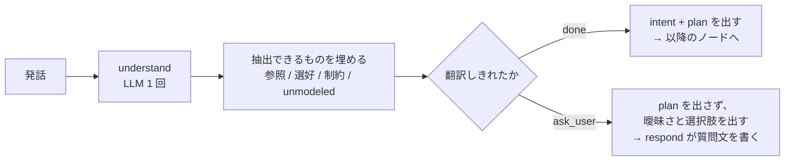
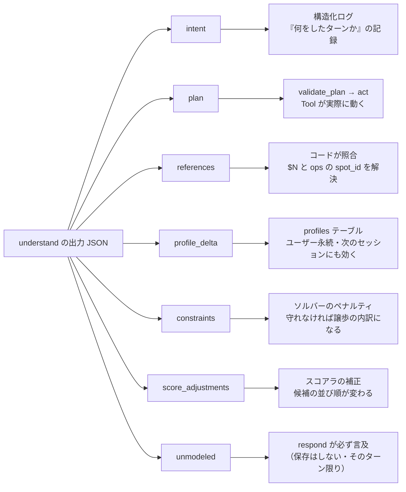
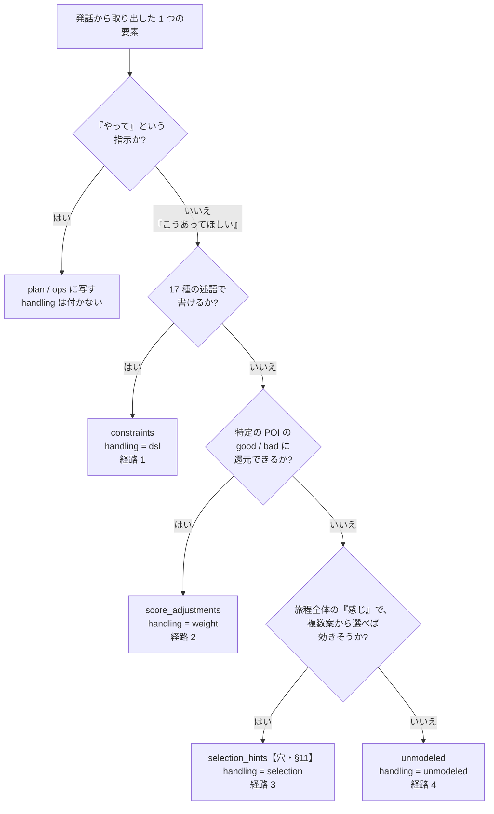
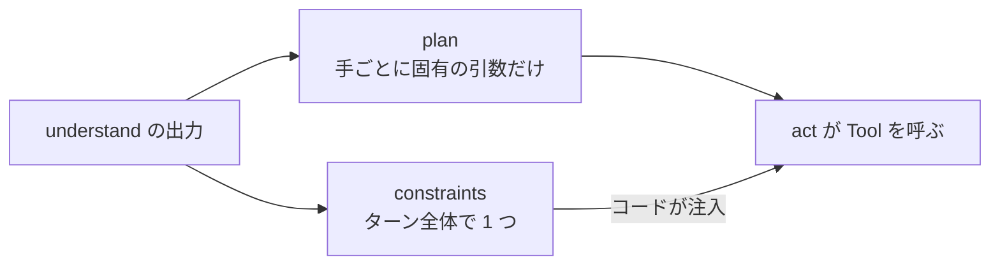
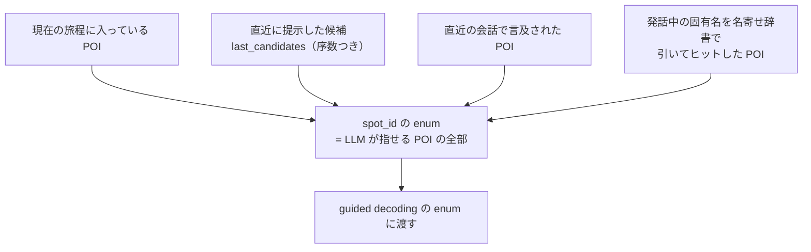

# `understand` ノード — 発話を JSON 1 個に翻訳する

- 状態: **決定稿 (2026-08-01)**
- 日付: 2026-07-31 / 改訂 2026-08-01
- 位置づけ: [agent_planning_phase.md](agent_planning_phase.md) の **N2 `understand`**(§3 の出力スキーマ / §16.2 のノード内部)の**詳細解説**。方式の決定は親文書が持ち、本文書は「何をしているのか」を分かるように書くことに徹する
- 書く過程で見つかった**スキーマの穴 3 件は §11 で決着済み**(親文書に反映済み)。**未決の論点は残っていない**

> 🖥 **図解ページ(claude.ai): https://claude.ai/code/artifact/6e1206ab-9219-47ee-89fd-6256096f8118**
> 本文書と同じ内容を、**発話 ⇄ JSON の対応を光らせて見られる形**にしたもの。発話の下線部をクリックすると、それが JSON のどこに写ったかが分かる(例 4 種)。**「7 つのフィールドがどこへ行くのか」を掴むにはこちらが速い。**
> 決定の正はこの Markdown 側にある。

> **例に出てくる `spot_id` は説明用の仮の値**である(`spot_012` = 鶴間池 など)。実際の id は seeds のデータに従う。

---

## 0. 一言でいうと

**`understand` は、日本語の発話 1 つを、コードが実行できる JSON 1 つに翻訳するノードである。**


要点は 4 つ。

1. **翻訳先の型は固定されている。**LLM は決められた JSON の欄を埋めることしかできない(guided decoding)。自由な文章を返す余地がない
2. **このノードは何も実行しない。**「何をするか」を書くだけで、推薦も旅程作成も検索もしない。実行するのは `act` ノードと Tool(§5)
3. **1 ターンに 1 回しか呼ばれない。**ここで取りこぼしたものは、そのターンでは二度と拾えない(だから §4 の分類が重要になる)
4. **ただし「分からない」と言える。**(2026-07-31 追加)翻訳できないときは、**翻訳結果の代わりに聞き返しを出せる**。下記。

### 0.1 このノードは 2 つの Tool を持つ有界エージェントである

**決定 2026-07-31([ADR-0010](../adr/0010-understand-bounded-agent.md))。**`understand` は `done` と `ask_user` の 2 つだけを持ち、どちらかを選ぶ。



**なぜこれが要るのか。**「2 番目のやつを外して」で候補が 2 つあるとき、従来は**「賭ける」か「破棄して謝る」**の 2 択しかなかった。賭けて外すと**気づかないまま違う POI が旅程から消える**(§2 の `references` の行)。**聞き返しは 3 つ目の選択肢**である。

**押さえるべき制約が 3 つある。**

- **LLM 呼び出しは増えない。**聞き返すターンも `understand` 1 回 + `respond` 1 回の計 2 回
- **ターン内でループしない。**次の情報(ユーザーの答え)はターンを終えないと得られないので、**判断は 1 ターンに 1 回・2 択だけ**
- **選択肢を 2〜4 個「具体的に」出せないなら聞き返せない**(ガードレール G6)。`spot_id` か既定の解釈 enum に解決できることをコードが検査する。**聞いても解けない曖昧さを構造的に弾くための条件**である

判断基準は「**間違いが静かに起きるか**」。照応の取り違えは聞き返す。日付の不明は聞かずに仮定して見せる(間違っても画面に出るので直せる)。詳細は [agent_planning_phase.md §5.1](agent_planning_phase.md)。

## 1. なぜ 1 回の呼び出しで 3 つのことをするのか

`understand` は**性質の違う 3 つの仕事**を 1 回でやっている。ここが「分かりにくい」の主因なので、まず分解する。

| # | 仕事 | 出力先のフィールド | 例 |
| --- | --- | --- | --- |
| 1 | **意図と手順を決める** | `intent` / `plan` | 「推薦してから旅程に足す」という 2 手を決める |
| 2 | **選好と制約を抽出する** | `profile_delta` / `constraints` / `score_adjustments` / `unmodeled` | 「子連れ」「昼は 12 時台に 1 時間」を取り出す |
| 3 | **照応を解決する** | `references` | 「2 番目のやつ」→ `spot_012` |

**なぜ分けないのか。**分ければ 1 ターンの LLM 呼び出しが 1 回増え、対話レイテンシ(NFR-3)に直接効く。[recommendation_planning.md](recommendation_planning.md) §3.1 が「PURE 型の 3 分業を素直に実装すると 1 ターン 3 呼び出しになるので `understand` に相乗りさせる」と既に判断している。

**分けるとしたらどうするか。**[agent_planning_phase.md §17](agent_planning_phase.md) の案 1(仕事 1・3 と仕事 2 を**並列**の 2 ノードに割る)。並列なので直列時間は増えない。抽出品質が実測で足りなければこれに移る、というのが現在の方針である。

## 2. 出力の全体像 — 7 つのフィールドは行き先が違う

**ここが最も誤解されやすい。**`understand` の出力は 1 つの JSON だが、**7 つのフィールドはそれぞれ別の相手に届き、別の効き方をする。**



| フィールド | 何を表すか | 誰が消費するか | 間違うと何が起きるか |
| --- | --- | --- | --- |
| `intent` | このターンの種別(`recommend`/`plan`/`edit`/`qa`/`profile_only`/`chitchat`/`unclear`) | **構造化ログのみ** | **実害は小さい。**分岐には使わない(分岐するのは `plan`) |
| `plan` | **実行する Tool の列**(最大 3 手) | `validate_plan` → `act` | 間違った Tool が動く / 動くべき Tool が動かない。**最も影響が大きい** |
| `profile_delta` | プロファイルの**差分** | `profiles` テーブル(永続) | 誤った選好が**次のセッションまで残る**。だから差分のみ・enum 強制 |
| `constraints` | 述語で書けた要望(§4 経路 1) | ソルバーのペナルティ | 制約が落ちると旅程が希望から外れる。無言では落とさない(§4) |
| `score_adjustments` | POI 単位のスコア補正(§4 経路 2) | スコアラ | 候補の並びが変わる。上限 ±0.5 で暴走を防ぐ |
| `unmodeled` | **反映できなかった要望**(§4 経路 4) | `respond`(必ず言及)+ ログ | ここが空だと「黙って捨てた」ことになる。**設計の最後の砦** |
| `references` | 照応の解決結果 | コード(照合してから使う) | 序数の取り違えは**静かに違う POI を旅程に入れる**。だから必ず DB 照合する |

**`intent` と `plan` の関係**がよく分からなくなる所だが、単純である — **分岐に使うのは `plan` だけ**で、`intent` は「このターンは何だったか」を後から集計するためのラベルにすぎない。`intent: "qa"` なのに `plan` が `recommend` でも、動くのは `recommend` である(そして食い違いは計測に残る)。

## 3. 理解の鍵 — 「やってほしいこと」と「どうあってほしいか」は別物

発話から取り出すものには**性質の違う 2 種類**がある。これを混ぜると `understand` は理解できない。

| | **命令(やってほしいこと)** | **選好・制約(どうあってほしいか)** |
| --- | --- | --- |
| 例 | 「滝を 2 つ入れて」「元滝を外して」「鶴間池ってどんな所?」 | 「昼は 12 時台に 1 時間」「似た所が続くと子どもが飽きる」「静かな所がいい」 |
| 写る先 | **`plan`(Tool の列)と `ops`** | **`constraints` / `score_adjustments` / `unmodeled`** |
| 効き方 | **1 回実行されて終わる** | **旅程を作り直すたびに効き続ける** |
| `handling` | **付かない**(実行されるので分類の必要がない) | **必須**(4 経路のどれかに必ず入る) |

> **`handling` が必須なのは後者だけ**である。[recommendation_planning.md](recommendation_planning.md) §4.4 の不変条件「抽出数 == 経路 1+2+3+4」も、**選好・制約について**言っている。「滝を 2 つ入れて」は `plan` に写って実行されるので、この数え上げには入らない。
> (この線引きは親文書では明示されていなかった。本文書で明確にする。)

## 4. `handling` の 4 経路 — どこに振り分けるかの判断

選好・制約は、**必ず**次の 4 つのどれかに入る。「どれにも入らない」は許さない。これが「スキーマ外の要望が黙って消える」を防ぐ仕組みである([ADR-0005](../adr/0005-itinerary-solver.md))。



| 経路 | `handling` | 判定 | 例 |
| --- | --- | --- | --- |
| 1 | `dsl` | **17 種**の述語で書ける | 「最後は温泉で締めたい」→ `last(温泉)` |
| 2 | `weight` | 特定 POI の良し悪しに還元できる | 「静かな所がいい」→ `spot_017` に +0.4 |
| 3 | `selection` | 全体の雰囲気。解を 3 つ作れば選べる | 「もうちょっとのんびりした感じで」 |
| 4 | `unmodeled` | どれにも写らない | 「屋台が出てたら寄りたい」 |

**経路 4 は失敗ではない。**「反映できませんでした」と**言えている**ことがこの設計の成果である。`respond` は `unmodeled` を必ず言及するので、ユーザーは取りこぼしを検知して言い直せる。同種の要望が繰り返し `unmodeled` に落ちるのに気づいたら、**述語を 1 つ追加すべきというシグナル**である(2026-08-01: `unmodeled_log` テーブルは廃止したので、蓄積ではなくログで気づく)。

## 5. `understand` がやらないこと

境界をはっきりさせておく。以下はすべて**別のノードや Tool の仕事**である。

| やらないこと | 誰がやるか |
| --- | --- |
| 知識ベースを検索する | Tool `search_knowledge`(**サブエージェント**。[narration_qa.md](narration_qa.md)) |
| POI を選ぶ・並べる | Tool `recommend`(コードのスコアラ + リランク) |
| 時刻を割り付ける・移動時間を足す | Tool `plan_itinerary` / `edit_itinerary` の中のソルバー |
| 日本語の応答を書く | ノード `respond` |
| DB に書く | ノード `persist` |
| **`plan` が妥当か判断する** | ノード `validate_plan`(P1〜P8) |

最後の行が重要である。**`understand` は「無理な plan」も平気で出す**(4 手出す、存在しない Tool を書く、旅程がないのに `edit_itinerary` を呼ぶ)。それを落とすのは次のノードの仕事で、`understand` 側で完璧を期待しない設計になっている。

## 6. 例で見る

### 例 1 — 選好を述べただけ

**発話**: 「滝が好きなんだよね」

```jsonc
{
  "intent": "profile_only",
  "plan": [],                                   // Tool は 1 つも動かない
  "profile_delta": {"interests": {"water": 0.6}},   // キーは PreferenceKey（12 語）
  "constraints": [], "score_adjustments": [], "unmodeled": [], "references": []
}
```

- `profile_delta` が `profiles` にマージされ、**次のセッションでも効く**
- `plan` が空なので `act` は何もせず、`respond` が受け止めるだけ
- **これは P8(全手が破棄された)とは違う。**P8 は「出したが全部落ちた」異常系、こちらは「そもそも出す必要がない」正常系である

### 例 2 — 質問

**発話**: 「鶴間池ってどんな所?」

```jsonc
{
  "intent": "qa",
  "plan": [{"id": 1, "tool": "search_knowledge",
            "args": {"query": "鶴間池 概要 見どころ", "spot_id": "spot_012"}}],
  "profile_delta": null,
  "constraints": [], "score_adjustments": [], "unmodeled": [],
  "references": [{"surface": "鶴間池", "spot_id": "spot_012"}]
}
```

- **コードが `references` を DB と照合する。**照合できればそのまま、できなければこの手を破棄して「どれのことか分かりませんでした」を `respond` に渡す
- `search_knowledge` は**回答と出典を返す**が、**ユーザーに見せる文章を書くのは `respond`**(2026-08-01: サブエージェント化。[ADR-0011](../adr/0011-knowledge-search-subagent.md))

### 例 3 — 複合要求(この方式の本命)

**発話**: 「明日は滝を 2 つ入れて、宿の近くで昼を取れるようにして。似た感じの所が続くと子どもが飽きるから」

```jsonc
{
  "intent": "edit",
  "plan": [
    {"id": 1, "tool": "recommend",
     "args": {"filter": {"tags": ["滝"], "day": 2}, "k": 2}},
    {"id": 2, "tool": "edit_itinerary",
     "args": {"ops": [{"op": "add", "targets": "$1.spot_ids", "day": 2}]}}
  ],
  "profile_delta": {"party": "family_kids"},
  "constraints": [
    {"pred": "lunch_break",     "args": {"from": "11:30", "to": "13:30", "min": 60},
     "weight": 0.8, "source": "宿の近くで昼を取れるように", "handling": "dsl"},
    {"pred": "max_leg_min",     "args": {"n": 20},
     "weight": 0.6, "source": "宿の近くで",                 "handling": "dsl"},
    {"pred": "not_consecutive", "args": {"target": "滝"},
     "weight": 0.6, "source": "似た感じの所が続くと子どもが飽きる", "handling": "dsl"}
  ],
  "score_adjustments": [], "unmodeled": [], "references": []
}
```

このあと何が起きるか、順に:

1. `validate_plan` が P1〜P8 を検査し、**専門呼び出し(リランク)を手 1 に割り当てる**(手 2 から `$1` で参照されているため)
2. 手 1 `recommend` が候補を出す → `state: candidates(provisional)` → リランク → `final`
3. **コードが `$1.spot_ids` を解決**して手 2 の `targets` に埋める(LLM 呼び出しなし)
4. 手 2 `edit_itinerary` が実行される。**`constraints` の 3 件はコードが注入する**(§7)
5. ソルバーが解を 3 つ作り、専門呼び出しの枠は使い切っているので**解 A をそのまま採用**
6. `profile_delta.party` が `profiles` に永続化される
7. `respond` が結果を説明し、**「今回考慮した条件」として 3 件の制約を列挙する**

**1 つの発話が 7 つの経路に分かれて処理されている。**これが `understand` の出力を「1 個の JSON」として見ると分かりにくい理由である。

### 例 4 — 表現できない要望が混ざる

**発話**: 「屋台が出てたら寄りたいな。あと全体的にもうちょっとのんびりした感じで」

```jsonc
{
  "intent": "edit",
  "plan": [{"id": 1, "tool": "edit_itinerary", "args": {"ops": []}}],
  "profile_delta": {"pace": "relaxed"},
  "constraints": [],
  "score_adjustments": [],
  "selection_hints": [                          // ★ §11 の穴。現スキーマにこの欄がない
    {"text": "もうちょっとのんびりした感じで", "handling": "selection"}
  ],
  "unmodeled": [
    {"text": "屋台が出てたら寄りたい", "handling": "unmodeled"}
  ],
  "references": []
}
```

- 「のんびり」は `pace` にも写るが、**それだけでは足りない**(どのくらいゆるめるかは解を見ないと決まらない)。だから経路 3 にも入れて、解 A/B/C から選ばせる
- 「屋台」は**どの述語にも写らない**。経路 4 に落とし、`respond` が「屋台については行程に組み込めていません。8 月の週末なら道の駅で出ていることがあります」のように**触れる**
- **`ops` が空の `edit_itinerary`** は「内容は変えないが制約を効かせて組み直す」を意味する。妥当な使い方である

## 7. 制約は誰が Tool に渡すか

例 3 で「`constraints` はコードが注入する」と書いた点の補足。[agent_planning_phase.md §18.1](agent_planning_phase.md) の提案により、**制約は `plan` の引数の中ではなく、出力 JSON の直下(ターン全体の値)に置く。**



理由は 3 つ。**(1)** 同じ制約を複数の手が使うとき二重に書かせずに済む **(2)** どのみち旅程を書き換える手は 1 ターンに 1 つ(P6) **(3)** 将来 `understand` を 2 ノードに分割するとき(§1)、`plan` の構造を作り直さずに済む。

## 8. guided decoding は何を保証して、何を保証しないか

vLLM の構造化出力を使うので、**JSON の形は壊れない。**しかし**中身の正しさは別問題**である。ここを取り違えると検証を省いてしまう。

| | guided decoding | コードの後検証 |
| --- | --- | --- |
| JSON として妥当 | **保証する** | — |
| フィールドが揃っている | **保証する** | — |
| `tool` / `pred` が既知の enum | **保証する** | — |
| `spot_id` が語彙に含まれる | **保証する** | — |
| **`spot_id` が文脈的に正しい**(「2 番目のやつ」が本当にそれか) | **しない** | **DB と `last_candidates` に照合** |
| **述語の引数が実在する**(そのタグは存在するか) | **しない** | **語彙と照合、なければ経路 4 へ** |
| **`handling` の付け忘れがない** | **しない** | **不変条件の数え上げで検査** |
| **`plan` が実行可能**(手数・順序・事前条件) | **しない** | **`validate_plan` の P1〜P8** |

> **JSONSchemaBench (arXiv:2501.10868)** は、制約付きデコーディングが精度を落とさないことを報告している。ただし vLLM は評価対象に含まれていないため、**実装後に guided decoding の有無で抽出品質を一度測る**([agent_planning_phase.md §10](agent_planning_phase.md))。

## 9. プロンプトに何を載せるか

`max_model_len` が 16,384 なので、載せるものを決めておく(内訳は [agent_planning_phase.md §7](agent_planning_phase.md))。合計およそ 4,500 トークンで、**余裕はかなりある。**

特に説明が要るのが **`spot_id` の語彙**である。



- **43 件全部を載せない**理由は 2 つ。**(1)** プロンプトが短くなる **(2) 文脈上あり得ない POI を構造的に指せなくなる**(ハルシネーションが「起きにくい」ではなく「不可能」になる)
- ただしそれだけだと「元滝に行きたい」と**初めて名前で呼ばれた POI を指せない。**そこで **D の経路**を足す — コードが先に発話を名寄せ辞書(別名・表記ゆれ)で走査し、ヒットした POI を語彙に加える。**この経路は親文書 §3.2 では明示されていなかったので、本文書で具体化した**(§11-3)
- 序数(「2 番目のやつ」)は `last_candidates` を順序つきで載せることで解ける

## 10. 失敗したときどうなるか

| 失敗 | 扱い | ユーザーに見えるもの |
| --- | --- | --- |
| JSON が壊れている | **1 回だけ再試行** | (成功すれば)何も見えない |
| 再試行しても壊れている | **致命。**`persist` に飛ぶ | 「うまく理解できませんでした」+ 再入力の促し |
| タイムアウト | 致命 | 同上 |
| `spot_id` が照合できない | **その参照を使う手だけ破棄** | 「どれのことか分かりませんでした」 |
| 述語が未知・引数が実在しない | **経路 4(`unmodeled`)へ落とす** | 「〇〇は行程に反映できていません」 |
| `handling` の付け忘れ | 不変条件違反として検出し、`unmodeled` 扱い | 同上 |

**`understand` はグラフ上で唯一、巡回(再試行)を持つノードである**([agent_planning_phase.md §15.6](agent_planning_phase.md))。ただし上限は 1 回で、それ以上は回さない。

## 11. 見つかった穴と、その決着(2026-07-31)

解説を書く過程で、親文書のスキーマに**穴が 2 つ**と、**明示されていなかった機構が 1 つ**見つかった。**3 件とも決着し、親文書に反映済みである。**

| # | 見つかった問題 | 決定 | 反映先 |
| --- | --- | --- | --- |
| 1 | 経路 3(`handling: "selection"`)の行き先がなかった | **`selection_hints` を追加** | [agent_planning_phase.md §3.1](agent_planning_phase.md) |
| 2 | `constraints` の寿命が未定義だった | **旅程行に紐づけて永続化**(version ごとにコピー = undo で制約も戻る)。**あわせて `constraints_remove` を追加** — 取り消せないと制約が張り付くため | [同 §4.4](agent_planning_phase.md) / §3.1 / §7 |
| 3 | 発話中の固有名の語彙への入れ方が未記載だった | **名寄せ辞書で先に走査し、ヒットした POI を enum に加える** | 同 §3.2 |

### 11.1 あわせて入った、この文書に効く改訂

エージェントパターンの調査([agent_patterns_survey.md](agent_patterns_survey.md))を受けて、**`understand` 自体も改訂された。**本文書と親文書が食い違わないよう、要点を挙げる。

- **フィールドの並び順が変わった。**`references` → 抽出系 → `intent` → `plan` の順になり、**結論(`plan`)を書く前に照応と制約が確定する。**根拠は EMNLP 2024 の実測(JSON のキー順が生成順を強制する)。**本文書 §2 の図は改訂前の並びだが、フィールドと行き先の対応は変わっていない**
- **フィールドに説明文と境界例を付ける**方針が明文化された(スキーマを人間向けの契約のまま LLM に渡さない)
- **プロンプトに「現在有効な制約の一覧」が載る**(`constraints_remove` を出させるため)
- §9 の語彙構築図の **D 経路(名寄せ)が正式採用**された

### 11.2 決着前の記録(参考)

| # | 内容 | 提案 | 影響 |
| --- | --- | --- | --- |
| 1 | **経路 3(`handling: "selection"`)の行き先がスキーマにない。**`dsl`→`constraints`、`weight`→`score_adjustments`、`unmodeled`→`unmodeled` には欄があるが、`selection` だけ入れる場所がない。このままだと不変条件(抽出数 == 4 経路の合計)が数えられない | **`selection_hints: [{text, handling}]` を出力スキーマに追加する。**解の選択を行う専門呼び出しに、この配列を渡す | `understand` のスキーマ / 旅程 Tool の入力 |
| 2 | **`constraints` の寿命が決まっていない。**[agent_planning_phase.md §4.1](agent_planning_phase.md) の状態一覧に `constraints` がない。ターン限りだとすると、3 ターン目に言った「元滝には必ず行きたい」が 5 ターン目の再ソルブで**消える** | **旅程に紐づけて永続化する**(`itineraries` 行の `constraints`。[recommendation_planning.md](recommendation_planning.md) §4.0 のデータモデル案が既にその形)。ターンごとの抽出結果は**旅程の制約集合にマージ**する | **`data_model.md` に直結**。旅程 version との関係も決まる |
| 3 | **発話中の固有名をどう語彙に入れるか**が §3.2 に書かれていない(§9 の D 経路) | コードが名寄せ辞書で先に走査し、ヒットした POI を `spot_id` の enum に加える | `understand` のプロンプト構築 / 推薦ドメインの名寄せ辞書 |

(上表は 2026-07-31 の決着前に書かれたもの。**現在の決定は §11 冒頭の表**を見ること。)

## 参照

- [agent_planning_phase.md](agent_planning_phase.md) — 親文書。§3(出力スキーマ)/ §15(ノードと Tool)/ §16.2(ノード内部)/ §17(分割の是非)
- [recommendation_planning.md](recommendation_planning.md) — §4.4(4 経路と不変条件)/ §3.1(プロファイル設計)
- [ADR-0005](../adr/0005-itinerary-solver.md)(無言破棄の禁止)/ [ADR-0008](../adr/0008-plan-then-execute.md)(一括プラン方式)
