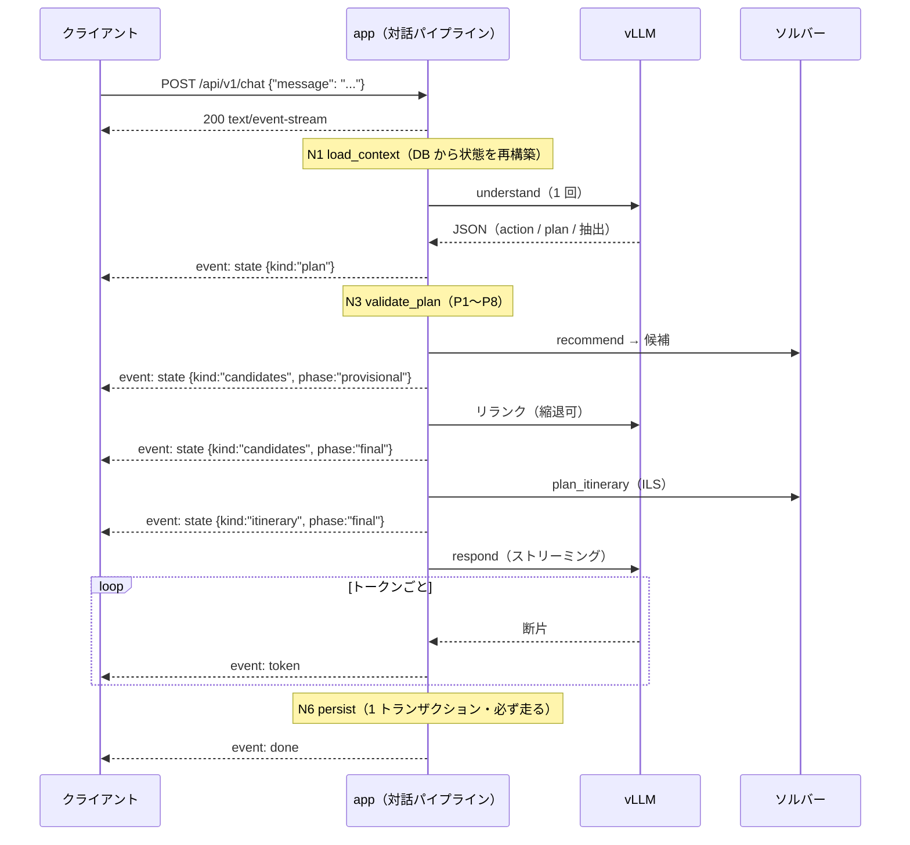
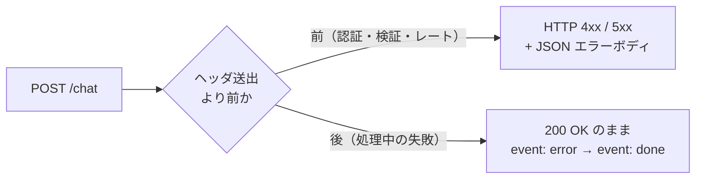

# API 契約 — チャット SSE と REST

- 状態: **決定稿 (2026-08-01)** / **改訂 2026-08-01(Phase 2 設計を反映: §3 のエンドポイント表と §5.4 の冪等キー)**
- 前提: [20_architecture.md §10](../20_architecture.md) / [agent_planning_phase.md §6](../30_design/agent_planning_phase.md)(SSE イベントの原案)/ [data_model.md](../30_design/data_model.md) / [ADR-0003](../adr/0003-pack-generation-jobs.md)(パック生成をジョブに)/ [ADR-0006](../adr/0006-recommendation-hybrid.md)(provisional → final の 2 段送出)

---

## 0. この文書が決めること

**フロントエンドとバックエンドの間の契約を確定させる。**中心は対話の SSE ストリームで、残りはそれを支える REST である。

**この文書で決めないもの**: 経路探索の内部(`geo.md`)、パック成果物の中身(`packs_pipeline.md`)、LoRa ダウンリンクのペイロード(`realtime_lora.md`)、Vue 側の状態管理(`frontend_nav.md`)。

### 0.1 全体の原則

| # | 原則 | 根拠 |
| --- | --- | --- |
| P1 | **`api/schemas/` が唯一の定義場所。**`JSONResponse` 直返しによる検証バイパスを禁止する | [22 §12-1](../22_current_issues.md) |
| P2 | **UI の状態はすべて `state` イベント由来。**ストリーム本文のパースで状態を作らない | [ADR-0006](../adr/0006-recommendation-hybrid.md) |
| P3 | **失敗を正常応答に偽装しない。**縮退も失敗も必ずイベントとして出す | FR-3.3 |
| P4 | CI で `openapi.json` をエクスポートし、`openapi-typescript` でフロントの型を生成する | [22 §12-11](../22_current_issues.md) |
| P5 | パスは `/api/v1/*` に統一、命名は snake_case | [20 §10](../20_architecture.md) |

---

## 1. `POST /api/v1/chat` — 対話ストリーム

### 1.1 決定: POST が直接 `text/event-stream` を返す

**`EventSource` は使わない。**理由は単純で、`EventSource` は **GET しか送れずリクエストボディを持てない**からである。ユーザーの発話は POST のボディに載る。

| 案 | 評価 |
| --- | --- |
| **A. POST が直接 `text/event-stream` を返す【決定】** | 1 往復で済む。**`AbortController` でキャンセルできる**(§1.6)。代償は SSE のパースを自前で書くこと(40 行程度) |
| B. POST でターンを作り、GET `/chat/{turn_id}/stream` を `EventSource` で開く | 2 往復になり、その間にターンの状態をサーバーが持つことになる。**状態は毎ターン DB から再構築する原則**([ADR-0004](../adr/0004-conversation-pipeline.md))と衝突する |
| C. WebSocket | **双方向通信が要らない。**サーバーからの一方向送出しかないのに、再接続・プロキシ・フレーミングの複雑さを買うことになる |

**案 A で失うのは `EventSource` の自動再接続だが、これは失って正しい。**§1.5 のとおり、このシステムでは自動再接続がむしろ有害である。

```http
POST /api/v1/chat
Authorization: Bearer <token>
Content-Type: application/json
Accept: text/event-stream

{"message": "2番目のやつを1日目に入れて"}
```

```http
200 OK
Content-Type: text/event-stream; charset=utf-8
Cache-Control: no-cache, no-transform
X-Accel-Buffering: no
Connection: keep-alive
```

- **`X-Accel-Buffering: no` と `no-transform` は必須。**リバースプロキシがレスポンスをバッファすると、トークンが最後にまとめて届いて**ストリーミングが意味を失う**(NFR-3)
- リクエストボディは `{"message": string}` **のみ**。`thread_id` を受け取らないのは、1 ユーザー 1 スレッドだから([data_model.md §4.2](../30_design/data_model.md))。クライアントがスレッドを取り違える経路そのものを無くす

### 1.2 イベントの種類

```
event: state   { ... }        # 0 回以上。UI の状態はすべてこれ由来
event: token   { ... }        # 0 回以上。応答本文の断片
event: error   { ... }        # 0 回以上。縮退または失敗
event: done    { ... }        # 必ず 1 回、最後に
```

**`done` は必ず送る。**エラーで終わる場合も `error` の後に `done` を送る。クライアントが「終わったのか、切れたのか」を判別できないと、スピナーが回り続ける。

#### `state` — UI の状態

| `kind` | いつ | ペイロード |
| --- | --- | --- |
| `plan` | `validate_plan` 直後 | `{"steps":[{"id":1,"tool":"recommend"}]}` |
| `candidates` | `recommend` 実行時。**2 回**(provisional → final) | `{"phase":"provisional"\|"final","items":[{"spot_id","name_ja","reason_materials":{...}}]}` |
| `itinerary` | 旅程が作られた/変わったとき。**2 回**(provisional → final) | `{"phase":..,"version":4,"itinerary":{...},"diff":{...},"concessions":[...]}` |
| `ask_user` | `act` の `ask_user`(選好の聞き取り) | `{"slot":"mobility","options":["あまり歩きたくない","30分程度なら","登山もしたい"]}` |
| **`clarify`** | **`understand` の聞き返し**([ADR-0010](../adr/0010-understand-bounded-agent.md)) | `{"surface":"2番目のやつ","options":[{"label":"鶴間池","value":"spot_012"}]}` |
| `profile` | `profile_delta` が反映されたとき | `{"profile":{...}}` |
| **`searching`** | **知識検索サブエージェントの反復中。0 回以上・可変**([ADR-0011](../adr/0011-knowledge-search-subagent.md)) | `{"text":"鶴間池の資料を読んでいます"}` |

> **`clarify` は [agent_planning_phase.md §6](../30_design/agent_planning_phase.md) の一覧に無かった。**ADR-0010 で `understand` に聞き返しを持たせた際、SSE 側への反映が漏れていた。**本文書で追加する。**`ask_user` と別 kind にするのは、UI の扱いが違うため — `ask_user` は選好のスロットを埋めるチップ、`clarify` は**曖昧だった表層形をその場で置き換えるチップ**である。

- **`phase: provisional` → `final` の 2 段送出**が [ADR-0006](../adr/0006-recommendation-hybrid.md) 形-2 の実体。**カードと地図は provisional の時点で描画する。**同じ `kind` が 2 回来ることをクライアントは前提にする
- `provisional` が来て `final` が来ないことがある(リランクが縮退したとき)。**その場合は `provisional` をそのまま確定として扱う。**判別は `error{code:"rerank_degraded"}` で行う

#### `token` — 応答本文

```jsonc
{"text": "元滝伏流水を1日目の"}
```

**本文をパースして状態を作ってはいけない**(P2)。`token` は表示のためだけにある。

#### `error` — 縮退と失敗

```jsonc
{"stage": "act", "code": "solver_timeout", "degraded": true,
 "message": "最適化を打ち切りました"}
```

| `degraded` | 意味 | UI |
| --- | --- | --- |
| `true` | **動いたが品質が落ちた。**結果は届く | 控えめな注記。処理は続く |
| `false` | **失敗した。**この後 `done` が来て終わる | エラー表示 |

`stage` は `understand` / `validate_plan` / `act` / `respond` / `persist`。`code` は `40_api/` の enum 1 箇所で定義する。

#### `done` — 終端

```jsonc
{"turn_id": "01J...", "message_id": 88, "degraded": false}
```

`message_id` を返すのは、**クライアントが再取得なしに自分の表示とサーバーの `messages` 行を対応づけられるようにする**ため。

### 1.3 典型的なターンの流れ



### 1.4 聞き返し(`clarify`)のターン

`understand` が `ask_user` を選んだターンは **`validate_plan` と `act` を飛ばす**([agent_planning_phase.md §15.6](../30_design/agent_planning_phase.md) の辺 E6)。

```
event: state   {"kind":"clarify","surface":"2番目のやつ",
                "options":[{"label":"鶴間池","value":"spot_012"},
                           {"label":"元滝伏流水","value":"spot_007"}]}
event: token   {"text":"「2番目」は鶴間池と元滝伏流水のどちらでしょうか。"}
event: done    {"turn_id":"...","message_id":89,"degraded":false}
```

**`plan` イベントも `candidates` イベントも出ない。**クライアントは `state` が `clarify` だけだったターンを「質問だけのターン」として描く。

**チップを選んだときは、通常の `POST /chat` として送る。**専用エンドポイントを作らない。

```jsonc
{"message": "鶴間池", "resolves": {"surface": "2番目のやつ", "value": "spot_012"}}
```

`resolves` は任意フィールドで、**チップ経由のときだけ付く**。サーバーは `threads.pending_clarification` と突き合わせて照合し、一致すれば曖昧さが解けた状態で `understand` を回す。**自由入力で答えても動く**(G5・FR-3.2)が、その場合は `resolves` が無いので `understand` が文脈から解く。

### 1.5 決定: 再接続による途中再開は実装しない

**SSE の `Last-Event-ID` による再開機構は作らない。**

理由は**再開が原理的に意味を持たないから**である。1 ターンは非冪等で DB に書き込む。途中から再開するには、実行中のターンの状態をサーバーがメモリに保持し続ける必要があり、これは「状態は毎ターン DB から再構築する」([ADR-0004](../adr/0004-conversation-pipeline.md))と正面から衝突する。旧実装の `MemorySaver` が起こした事故を繰り返す設計になる。

**接続が切れたらどうなるか:**

| | 挙動 |
| --- | --- |
| **サーバー** | **ターンは最後まで走り切る。**`persist` は必ず実行される([agent_planning_phase.md §16.6](../30_design/agent_planning_phase.md))ので、結果は DB に入る |
| **クライアント** | 再接続時に **`GET /api/v1/thread` でスレッドを取り直す** |
| **ユーザーから見ると** | 画面が更新され、答えが出ている |

**これが成立するのは 1 ユーザー 1 スレッドだからである。**「どのスレッドを取り直すか」に曖昧さがない([data_model.md §4.2](../30_design/data_model.md))。

**ハートビートは送る。**トークンが 15 秒以上出ない区間(ソルバーの実行中など)にプロキシが接続を切らないよう、SSE のコメント行を定期送出する。

```
: keep-alive
```

### 1.6 キャンセル(停止ボタン)

クライアントは `AbortController` でリクエストを中断する。サーバーは切断を検知して次のように振る舞う。

| 中断された時点 | サーバーの挙動 |
| --- | --- |
| `understand` / `respond` の**LLM ストリーミング中** | **打ち切る。**そこまでのトークンを `messages.status='partial'` として保存 |
| **Tool の実行中**(ソルバー・OSRM) | **完了させる。**途中で止めると部分的に矛盾した状態ができる |
| `persist` 中 | 止めない(トランザクション) |

**「切ったら全部捨てる」にしない理由**は、[agent_planning_phase.md §16.6](../30_design/agent_planning_phase.md) の不変条件 —— **ユーザーが `state` で見たものは必ず保存されている** —— を守るためである。旅程カードが画面に出た後で停止ボタンを押したら旅程が消えていた、という挙動は取らない。

### 1.7 エラーはどこに出るか

**ストリームが始まったら HTTP ステータスは変えられない。**したがってエラーの出口が 2 つある。



| 段階 | 例 | 出口 |
| --- | --- | --- |
| ストリーム開始**前** | 認証失敗 / `message` が空 / 同時ターンの重複 | **HTTP 401 / 422 / 409** + JSON |
| ストリーム開始**後** | LLM タイムアウト / ソルバー打ち切り / DB 失敗 | **HTTP 200 のまま** `event: error` + `event: done` |

**クライアントは「HTTP 200 でも失敗しうる」を前提に書く必要がある。**これは SSE の構造的な制約であって、設計上の妥協ではない。

**同時ターンの禁止(409)**: 1 ユーザー 1 スレッドなので、同じユーザーの 2 つ目の `POST /chat` が前のターンの実行中に来たら **409 Conflict** を返す。並行して走らせると、同じスレッド状態を 2 つのターンが書き換えて壊れる。

---

## 2. 旅程の操作 — undo / redo

### 2.1 なぜ専用 REST を作るのか

undo の入口は 2 つある([agent_planning_phase.md §4.2](../30_design/agent_planning_phase.md))。**どちらも同じ「`is_current` を移す」処理に落ちる**が、経路が違う。

| 入口 | 経路 | LLM |
| --- | --- | --- |
| **差分カードの [元に戻す] ボタン** | **本節の REST** | **通さない** |
| 自然言語「さっきのに戻して」 | `POST /chat` → `understand` → `edit_itinerary` の `revert` op | `understand` のみ |

**ボタンから LLM を通さないのは、undo が確実性を要する操作だからである。**「元に戻す」を押したのに意図の解釈が挟まる設計は取らない。

### 2.2 契約

```http
POST /api/v1/itinerary/undo
{"expected_current_version": 4}
```

```jsonc
// 200 OK — SSE の state:itinerary と同じスキーマで返す
{"kind": "itinerary", "phase": "final", "version": 3,
 "itinerary": {...}, "diff": {...}, "concessions": [...]}
```

- **`expected_current_version` による楽観ロックは必須。**二重クリックや、古い画面から押された undo を弾く。不一致なら **409 Conflict** と現在の版を返す
- **レスポンスを SSE の `state:itinerary` と同じスキーマにする。**UI の旅程描画コードを 1 本にするためで、「ボタン経由でも `state` 由来」という原則(P2)をこの形で守る
- `POST /api/v1/itinerary/redo` も同じ形。戻せる版が無ければ **409**
- **どちらもソルバーを回さない。**回すと別解が出て undo にならない

```http
GET /api/v1/itinerary        → 現在の版（同じスキーマ）
```

---

## 3. エンドポイント一覧

| Method | Path | 内容 | 詳細 |
| --- | --- | --- | --- |
| `POST` | `/api/v1/users` | 登録 | FR-5.1 |
| `POST` | `/api/v1/login` | 識別。**トークンを返す**(§4) | |
| `GET` | `/api/v1/me` | ユーザー + プロファイル | |
| `GET` | **`/api/v1/thread`** | **スレッドの復元。**メッセージ・現在の旅程・プロファイルを 1 回で返す | §3.1 |
| `POST` | **`/api/v1/chat`** | **SSE** | §1 |
| `GET` | `/api/v1/itinerary` | 現在の版 | §2 |
| `POST` | `/api/v1/itinerary/undo` / `redo` | 版を移す | §2 |
| `GET` | `/api/v1/spots` | POI・施設の一覧 | §3.2 |
| `POST` | `/api/v1/routes` | 経路探索 + 永続化。**単位は 1 レッグ**([ADR-0013](../adr/0013-leg-route-door-to-door.md)) | [geo.md §3.3](../30_design/geo.md) |
| `GET` | `/api/v1/routes/{route_id}` | | 同上 |
| `POST` | `/api/v1/packs` | **202** `{job_id, pack_id, state, total}` | [packs_pipeline.md §8](../30_design/packs_pipeline.md) |
| `GET` | `/api/v1/jobs/{job_id}` | `{state, progress, pack_id, failures}` | 同上 |
| `GET` | `/api/v1/packs/{pack_id}` | `{state, itinerary_version, manifest_url, total_bytes, missing}` | 同上 |
| `GET` | `/api/v1/realtime/spots/{spot_id}` | ETag 対応。**計画フェーズの表示専用** | §3.3 |
| `POST` | `/api/v1/realtime/spots/{spot_id}` | 1 点だけ手で設定(実験用) | [realtime_lora.md §6.2](../30_design/realtime_lora.md) |
| `POST` | `/api/v1/realtime/simulator/{action}` | `load` / `start` / `stop` | 同上 |
| `GET` | `/healthz` | 依存先(DB / vLLM / OSRM)の実チェック | |
| `GET` | `/packs/{pack_id}/...` | 成果物の静的配信 | |

**旧構成から変えたもの:**

| 旧 | 新 | 理由 |
| --- | --- | --- |
| `POST /api/route` | `POST /api/v1/routes` | パスの混在を解消([22 §12](../22_current_issues.md)) |
| `GET /users/{name}/session` | `GET /api/v1/thread` | パスにユーザー名を含めない(§4)。1 ユーザー 1 スレッドなので `{name}` が不要になった |
| `GET /health` | `GET /healthz` | 静的 ok をやめ、依存先を実チェック([22 §6-11](../22_current_issues.md)) |
| `POST /realtime/_mock/{spot_id}` | シミュレータ CLI / 管理 API | 「読み出し時に乱数で捏造」の廃止に伴い再設計(`realtime_lora.md`) |
| `POST /nav/plan` | 廃止 | `svc-nav` ごと削除([20 §14](../20_architecture.md) Phase 2) |

### 3.1 `GET /api/v1/thread` — 復元は 1 回で済ませる

```jsonc
{
  "messages": [ {"id": 87, "seq": 12, "role": "user", "content": "...",
                 "meta": {}, "created_at": "..."} ],
  "itinerary": {"kind":"itinerary","phase":"final","version":4,"itinerary":{...}},
  "profile": {...},
  "pending": {"kind": "clarify", "surface": "2番目のやつ", "options": [...]}
}
```

**リロードでも再接続でも、このエンドポイント 1 回で画面が完全に戻る。**§1.5 の「切れたら取り直す」がこれに依存している。

- `meta` をそのまま返すのは、**カードと地図を再描画するため**([data_model.md §4.4](../30_design/data_model.md))。`meta.presented` から推薦カードを、`meta.itinerary_version` から旅程を復元する
- `pending` は `threads.pending_clarification` が生きているときだけ入る。**リロードしても質問のチップが消えない**
- メッセージはページングしない(1 スレッドが数十件の規模)

### 3.2 `GET /api/v1/spots` — フロント側のデータコピーを廃止する

現行は `frontend/src/assets/POI.json` と `facilities.json` にデータのコピーを持っている([22 §15-1](../22_current_issues.md))。**これを廃止し、API から取る。**

```jsonc
[{"spot_id":"spot_001","kind":"poi","category":"tourist_spot",
  "name_ja":"あがりこ大王","tags_ja":["自然","木"],
  "lat":39.1593922,"lon":140.0244387,
  "social_proof":"伐採と豪雪が生んだ、奇形のブナの巨木です。"}]
```

43 件しかないので全件を 1 回で返す。**`ETag` を付けて、変わっていなければ 304 を返す。**

### 3.3 リアルタイム情報

```http
GET /api/v1/realtime/spots/{spot_id}
If-None-Match: "..."
```

```jsonc
{"spot_id":"spot_012","weather":2,"congestion":null,
 "source":"simulated","updated_at":"2026-08-01T09:00:00+09:00"}
```

- **`null` は「不明」を意味する。**値が無いときに捏造しない([data_model.md §4.7](../30_design/data_model.md)、[22 §6-2](../22_current_issues.md))
- **これは計画フェーズの表示用である。**観光フェーズへは LoRaWAN ダウンリンクで届く(FR-4.4/4.5)。**HTTP で代替しない**

---

## 4. 認証 — 研究用の最小形

FR-5.1 は「研究用の簡易なユーザー登録・識別」しか要求していない。ただし **1 ユーザー 1 スレッドにした以上、「誰なのか」をサーバーが特定できないと `GET /api/v1/thread` が成立しない。**

**決定: ログイン時に不透明なトークンを発行し、`Authorization: Bearer <token>` で送る。**

```http
POST /api/v1/login  {"user_name": "p01"}
→ 200 {"user_id": 3, "user_name": "p01", "token": "k7f2..."}
```

| 決めたこと | 理由 |
| --- | --- |
| **パスにユーザー名を含めない** | 現行の `GET /users/{name}/session` は**他人の名前を入れれば他人の会話が読める**。実験参加者のデータが混ざる事故を、URL の形の段階で防ぐ |
| **パスワードは持たない** | 要求にない。研究参加者の識別が目的 |
| **トークンは失効しない**(1 ユーザー 1 本) | 実験期間中に再ログインを強いる意味がない |

**[data_model.md §4.1](../30_design/data_model.md) に `api_token` 列を追加した(反映済み)。**同文書の執筆時に見落としていた列である。

```sql
api_token text UNIQUE NOT NULL        -- secrets.token_urlsafe で生成
```

---

## 5. 横断的な決定

### 5.1 スキーマ定義と型生成

```
api/schemas/*.py  ──[FastAPI]──▶ openapi.json ──[openapi-typescript]──▶ frontend/src/api/types.d.ts
```

- **`api/schemas/` が唯一の定義場所**(P1)。`JSONResponse` の直返しを禁止し、レスポンスは必ずスキーマを通す
- **`openapi.json` のエクスポートと型生成を CI で回す。**手書き JSDoc typedef との乖離([22 §12-11](../22_current_issues.md))を構造的に解消する
- **SSE のイベントペイロードもスキーマとして定義する。**OpenAPI は SSE のイベント型を表現できないので、`ChatEvent` を discriminated union として `schemas` に置き、**型生成の対象に含める**。生成される TS 型を使えばクライアントの `switch (ev.kind)` が網羅チェックされる

### 5.2 タイムアウト

**「外側 ≥ 内側」を `Settings` 内の導出で保証する。**現行の Gateway 180s < LLM 600s という矛盾([22 §2-2](../22_current_issues.md))を再発させない。

| 層 | 目安 |
| --- | --- |
| リバースプロキシ | 内側より長く。**SSE はバッファさせない**(§1.1) |
| `POST /chat` 全体 | LLM + ソルバーの合計より長く |
| LLM 1 回 | `understand` は短め、`respond` はストリーミングなので実質ハートビート依存 |
| ソルバー | 打ち切ったら貪欲解を返す(`error{degraded:true}`) |

**SSE は「無音のまま長時間開く」ことがある**ので、タイムアウトの設定だけでは足りない。§1.5 のハートビートと組で守る。

### 5.3 CORS と配信

- フロントは同一オリジンで配信する想定。CORS を開くのは開発時のみで、許可オリジンは `Settings` に持つ
- `marked` の出力には DOMPurify を通す([22 §13-4](../22_current_issues.md))。**`token` イベントの中身は LLM 生成物であり、信頼しない**

### 5.4 冪等性

| 対象 | 扱い |
| --- | --- |
| `POST /chat` | **冪等でない。**再送は新しいターンになる。二重送信は §1.7 の 409 で防ぐ |
| `POST /itinerary/undo` / `redo` | `expected_current_version` による楽観ロックで**二重実行を弾く**(§2.2) |
| `POST /packs` | **冪等。**同一 **`(user_id, itinerary_version, options)`** は既存ジョブを返す([ADR-0003](../adr/0003-pack-generation-jobs.md))。**2026-08-01 改訂: 鍵から `route_id` を外した**([packs_pipeline.md §3.2](../30_design/packs_pipeline.md)) |
| `POST /routes` | **冪等。**同一 `params`(**`osrm_build` を含む**)は既存 route を返す([geo.md §3.2](../30_design/geo.md)) |

---

## 6. 決定の記録(2026-08-01)

| # | 決定 | 根拠 |
| --- | --- | --- |
| 1 | **`POST /chat` が直接 `text/event-stream` を返す** | `EventSource` はボディを送れない。1 往復・`AbortController` でキャンセル可 |
| 2 | **再接続による途中再開を実装しない** | ターンは非冪等。再開にはサーバー側の実行状態保持が要り、ADR-0004 と衝突する |
| 3 | **切断されてもターンは走り切る**。クライアントは `GET /thread` で取り直す | `persist` が必ず走るので DB に結果は入る。**1 ユーザー 1 スレッドだから成立する** |
| 4 | **キャンセル時、LLM は打ち切るが Tool は完了させる** | 部分的に矛盾した状態を作らない。「見たものは保存されている」を守る |
| 5 | **ストリーム開始後の失敗は HTTP 200 のまま `error` + `done`** | SSE の構造的制約。クライアントは 200 でも失敗しうる前提で書く |
| 6 | **同時ターンは 409 で拒否** | 同じスレッド状態を 2 ターンが書き換えると壊れる |
| 7 | **`state` に `kind:"clarify"` を追加** | ADR-0010 の反映漏れ。`ask_user` とは UI の扱いが違う |
| 8 | **`done` を必ず送る**(エラー時も) | 「終わった」と「切れた」をクライアントが判別できるように |
| 9 | **undo/redo は専用 REST。LLM を通さない** | 確実性を要する操作に意図の解釈を挟まない |
| 10 | **undo は `expected_current_version` で楽観ロック** | 二重クリック・古い画面からの操作を弾く |
| 11 | **undo のレスポンスは `state:itinerary` と同じスキーマ** | UI の描画経路を 1 本にする(P2) |
| 12 | **`GET /thread` 1 回で画面が完全に戻る** | 決定 3 がこれに依存する |
| 13 | **Bearer トークン認証。パスにユーザー名を含めない** | 現行は他人の名前で他人の会話が読める。**参加者データの混入を URL の形で防ぐ** |
| 14 | **`SSE` のイベント型も `api/schemas/` に置き型生成する** | クライアントの分岐が網羅チェックされる |
| 15 | **`GET /spots` を作り、フロント側のデータコピーを廃止** | [22 §15-1](../22_current_issues.md) |

## 7. 採らなかった案

| 案 | 不採用の理由 |
| --- | --- |
| `EventSource`(POST でターン生成 → GET でストリーム) | 2 往復の間ターンの状態をサーバーが持つことになる。ADR-0004 と衝突 |
| WebSocket | 双方向が要らない。再接続・プロキシ・フレーミングの複雑さに見合わない |
| `Last-Event-ID` による途中再開 | ターンが非冪等。実行状態の保持は `MemorySaver` の事故の再来 |
| 切断時にターンを中止する | `persist` が走らず、`state` で見せた旅程が消える |
| キャンセル時に全部捨てる | 同上。「見たものは保存されている」が破れる |
| チップ選択に専用エンドポイント | 自由入力でも答えられる必要がある(G5・FR-3.2)。同じ `POST /chat` に寄せる |
| undo を `POST /chat` に一本化 | ボタン操作に LLM の解釈が挟まる。確実性が要る |
| SSE の代わりに定期ポーリング | 最初のトークンまでの時間が伸びる(NFR-3) |
| メッセージのページング | 1 スレッド数十件の規模で不要 |

## 8. 実装時に決めること(設計判断ではない)

| # | 項目 |
| --- | --- |
| 1 | ハートビートの間隔(15 秒を初期値とする) |
| 2 | `error.code` の enum の全項目(段階ごとに洗い出す) |
| 3 | 各層のタイムアウトの具体値(`Settings` の導出式は決まっている) |
| 4 | `GET /spots` の ETag の生成方法(`updated_at` の最大値で足りる) |
| 5 | トークンの生成方法(`secrets.token_urlsafe` を想定) |
