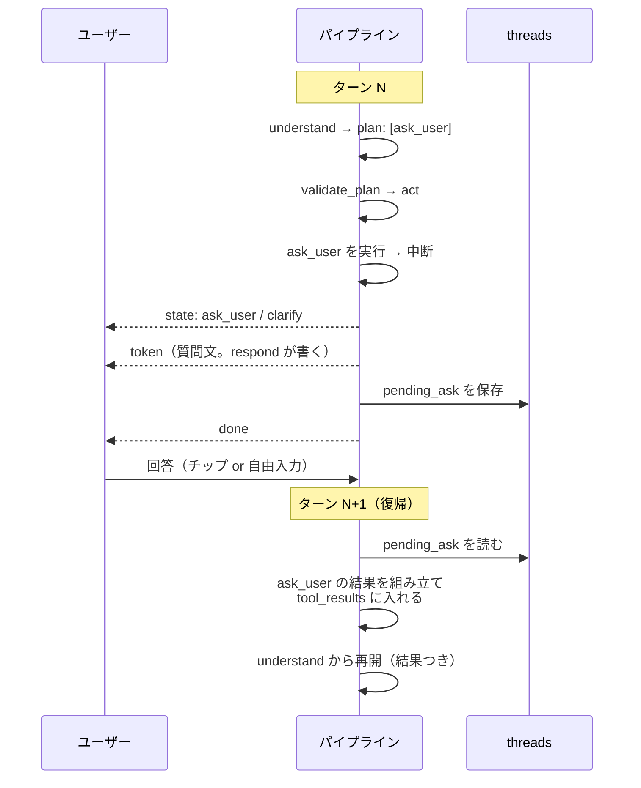

# ADR-0018: `ask_user` を「結果を返す 1 つの Tool」に統合し、ターンの中断・復帰で実現する

- 状態: **廃止 (superseded by [ADR-0019](0019-react-main-agent-subagents.md)、2026-08-04)**(旧: 承認 2026-08-03、ユーザー指示)。**中断・復帰という機構そのものが不要になった** — `ask_user` は Human-in-the-Loop の通常ツールとなり、回答は**同一ターン内で**呼び出し元エージェントの act に返る。本 ADR から引き継がれるのは「`ask_user` は結果を返す 1 つの Tool で、`kind`(`preference`/`clarify`)が 2 用途を担う」という核だけである
- 日付: 2026-08-03
- 関係: **[ADR-0010](0010-understand-bounded-agent.md) を置き換える (supersedes)** / [ADR-0007](0007-preference-elicitation.md)(選好の引き出し)の G1〜G5 は**そのまま生きる** / [ADR-0004](0004-conversation-pipeline.md)(状態は毎ターン DB から再構築)を**崩さない** / [ADR-0008](0008-plan-then-execute.md)(一括プラン方式)を**崩さない**

## 文脈(何が問題か)

現行設計には **`ask_user` が 2 系統ある。**

| | **T5 `ask_user` Tool**([ADR-0007](0007-preference-elicitation.md)) | **`understand` の `ask_user` action**([ADR-0010](0010-understand-bounded-agent.md)) |
| --- | --- | --- |
| 何を聞くか | 選好(「どなたと行かれますか」) | 発話の意味(「『2 番目』はどちらですか」) |
| どこにいるか | `plan` に載り `act` が実行 | `understand` ノード内の分岐 |
| 終わり方 | `should_end_turn` を立てて `respond` へ | `validate_plan`/`act` を飛ばして `respond` へ(辺 E6) |
| ガードレール | G1〜G5 | G6〜G9 |
| SSE | `state:ask_user` | `state:clarify` |

**どちらも「質問して、ターンが終わる」で行き止まりになっている。**Tool の顔をしていながら、**返り値がない**(§18.7 の契約が `out = —`)。質問への答えは**次のターンの新しい発話**として入ってきて、`pending_clarification` というヒントを添えて `understand` がゼロから走り直す。**質問を発した時点のコンテキストは捨てられる。**

これは 2 つの実害を生んでいる。

1. **Tool の意味が壊れている。**「呼ぶと結果が返り、その結果を使って続きを考える」という Tool の基本形から外れており、`understand` の分岐という**別の機構をもう 1 つ**持つ羽目になっている(ADR-0010)。ガードレールも SSE の kind も respond のモードも二重になった
2. **実際に行き止まりが起きている。**2026-08-03 の実機調査([23_ux_issues.md §1-2](../23_ux_issues.md))で、チップを押した結果が**「旅程の確定処理中にエラーが発生しました。もう一度『この条件で進める』と入力してください」**になり、しかもチップは押すと消えるので**案内された復旧手段が画面から無くなる**、という事象を確認した。質問を発したときの文脈が復帰していないことが原因の一部である

## 決定(何をすると決めたか)

**`ask_user` を「結果を返す 1 つの Tool」に統合する。Tool の結果はコンテキストに追加され、呼び出し元ノードからターンを再開する。**

### 1. `understand` の 2 択分岐を廃止し、`ask_user` を `plan` に載る Tool に一本化する

- `understand` の出力から **`action: "done" | "ask_user"` と `clarify` を削除する**
- 聞き返したいときは、**`plan` に `ask_user` を 1 手だけ載せる**(`plan: [{"id":1,"tool":"ask_user","args":{...}}]`)
- ADR-0010 が「Tool にできない」とした根拠は**「参照が解けないまま前段の手を組み立てさせることになる」**だったが、**そのときの plan は `[ask_user]` の 1 手だけでよい。**前段の手を書かせる必要はない。この点で ADR-0010 の前提は誤っていた
- `ask_user` の引数は 2 用途を 1 つの形で表す:

```jsonc
in = {
  kind: "preference" | "clarify",   // SSE の kind と UI の扱いを決める
  slot?: Slot,                      // kind=preference のとき
  surface?: string,                 // kind=clarify のとき（曖昧だった表層形）
  reason: string,
  options: [{label: string, value: string}]   // 2〜4 個
}
```

### 2. Tool が結果を返す

```jsonc
out = {answer: string, answered_by: "chip" | "free_text", slot?: Slot, surface?: string}
```

**この結果は次のターンの `TurnState.tool_results` に入り、`understand` のプロンプトに載る。**「聞いた → 答えが返った」が 1 つの Tool 呼び出しとして表現される。

### 3. ターンをまたぐのは「中断(suspend)」であって「終了」ではない

人間の答えは**ターンを終えないと得られない**([ADR-0008](0008-plan-then-execute.md) の観察は変わらない)。したがって Tool の実行は次の 2 相になる。



- **中断してもグラフは最後まで通る。**`respond` が質問文を書き、`persist` がコミットし、`done` が出る。「中断」とは**Tool の実行が答え待ちで止まる**ことであって、グラフを抜けることではない
- **保存するのは `pending_ask` だけ**(問い・選択肢・呼び出し元ノード)。**中断した plan や中間結果は保存しない。**[ADR-0004](0004-conversation-pipeline.md) の「状態は毎ターン DB から再構築する」を崩さないため

### 4. 復帰点は呼び出し元ノード = `understand`

**`ask_user` を呼べるノードは `understand`(の出した plan)と `act` だが、どちらの場合も復帰点は `understand` になる。**

- **P5(`ask_user` は plan の末尾にしか置けない)を維持する。**したがって `ask_user` の後に残っている手はない — `act` を途中から再開する必要が構造的に発生しない
- **答えを受けて次に何をするかを決めるのは `understand` である。**`act` は渡された手を実行するだけで、答えの意味を解釈しない
- 復帰したターンの `understand` は、**`tool_results` に答えが入った状態で 1 回走る。**LLM 呼び出し数は現行と同じ(`understand` 1 + `respond` 1)

### 5. 消えるもの・統合されるもの

| 対象 | 変更 |
| --- | --- |
| `understand` の `action` / `clarify` フィールド | **削除** |
| 辺 **E6**(`understand` → `respond`) | **削除。**plan が `[ask_user]` なので通常経路(`validate_plan` → `act`)を通る |
| ガードレール **G6〜G9** | **G1〜G5 に統合する**(§下記) |
| `respond` の「聞き返し」モード | **「質問」モードに統合。**4 モード → **3 モード** |
| スレッド状態 `pending_clarification` | **`pending_ask` に置き換え**(`kind` を持つので 1 つで足りる) |
| SSE の `kind:"ask_user"` / `kind:"clarify"` | **どちらも残す。**Tool の `kind` 引数がそのまま対応する(**フロントエンドの契約は変えない**) |

**統合後のガードレール**(コードで強制。すべて `validate_plan` / `act` の層で効く)

| # | 規則 | 適用 |
| --- | --- | --- |
| G1 | **1 ターン 1 問**(`ask_user` は plan に 1 手まで) | 両 kind |
| G2 | 同じスロットを 2 回聞かない(`asked_slots`) | `preference` |
| G3 | 連続する `ask_user` は 2 ターンまで(`ask_streak`) | 両 kind |
| G4 | **推薦要求に質問だけを返さない** | `preference` |
| G5 | **選択肢は 2〜4 個 + 自由入力も受ける** | 両 kind |
| G6 | **選択肢を「具体的に」解決できないなら聞かない**(`spot_id` は DB 照合、解釈は enum 照合) | 主に `clarify` |
| G7 | 同じ曖昧さを 2 回聞かない(`resolved_ambiguities`) | `clarify` |
| G9 | **妥当な plan を出せるなら聞かない**(「念のため確認」の禁止) | 両 kind |

> **旧 G8(連続する聞き返しは 1 ターンまで)は G3 に吸収した。**両 kind に同じ上限がかかるほうが、「聞きすぎ」の抑制として素直である。

## 理由(なぜ他案でなくこれか)

**1. Tool の意味が回復する。**「呼ぶ → 結果が返る → その結果で続きを考える」に戻る。返り値のない Tool と、それを補うためのノード内分岐という**二重の例外**が消える。

**2. 機構が 1 つになる。**ADR-0010 が作った G6〜G9・`clarify` フィールド・E6・respond の 4 モード目は、すべて「Tool にできなかったから」生まれた迂回だった。統合すれば**ガードレール 1 組・イベント 1 系統・respond 3 モード**に戻る。

**3. ADR-0010 の根拠が成立していなかった。**同 ADR は「参照が解けていないと妥当な plan を書けない」を最大の理由に挙げたが、**そのときの plan は `[ask_user]` の 1 手でよい。**前段の手を書かせる必要はどこにもなかった。

**4. ADR-0004 とも ADR-0008 とも衝突しない。**

| 懸念 | この設計では |
| --- | --- |
| 状態を毎ターン DB から再構築する(ADR-0004) | **保存するのは `pending_ask` だけ。**中断した plan も中間結果も保存しない。旧実装の `MemorySaver` 事故とは別物 |
| ターン内で LLM を何度も回さない(ADR-0008) | **ターン内にループは無い。**中断は必ずターン境界で起きる。呼び出し数は `understand` 1 + `respond` 1 のまま |
| レイテンシが読めない(NFR-3) | 変わらない。1 ターンの構造は同じ |

**5. 実害の解消につながる。**[23_ux_issues.md §1-2](../23_ux_issues.md) の行き止まりは、答えが**元の文脈に戻らない**ことが一因だった。`tool_results` として戻せば、`understand` は「何を聞いて、何と答えられたか」を見た状態で走れる。

**6. 採らなかった代替案**

| 案 | 不採用の理由 |
| --- | --- |
| **現状維持**(2 系統のまま) | Tool の返り値が無い状態が続き、迂回のための機構が 4 つ残る |
| **`understand` の聞き返しだけ直す** | `ask_user` の扱いが 2 通り残り、**指摘された不整合がそのまま残る** |
| **P5 を外し、`ask_user` を plan の途中に置けるようにする** | 中断した plan を DB に持ち越す必要が出る。**旅程が別経路(undo 等)で変わっていると、復帰した plan が古い前提で動く。**当面 P5 を維持し、必要になったら別 ADR で検討する |
| **中断せず、ターン内でユーザーの答えを待つ** | HTTP/SSE の 1 ターンの中で人間の入力は得られない。実現不能 |
| **専用エンドポイントで答えを受ける** | [chat_sse.md §1.4](../40_api/chat_sse.md) の決定(`POST /chat` に寄せる)を覆す理由がない。自由入力でも答えられる必要がある |

## 影響(この決定で生じる制約・やること)

**設計文書**

- [agent_planning_phase.md](../30_design/agent_planning_phase.md): §1.3(P5 の文言)/ §2(道具カタログの `ask_user` 行)/ **§3.4 を全面差し替え** / §15.3(グラフから E6 を削除)/ §15.5 / §15.6 / §15.7(`TurnState` に `tool_results`)/ §16.5(respond 3 モード)/ §18.7(Tool 契約に `out` が付く)/ §19.3
- [understand_node.md](../30_design/understand_node.md): §0.1 を差し替え
- [chat_sse.md](../40_api/chat_sse.md): §1.4(聞き返しターンの説明)/ `GET /thread` の `pending`
- [data_model.md](../30_design/data_model.md): `threads.pending_clarification` → **`pending_ask`**(`kind` を持つ)

**実装**

- `understand` の guided schema から `action` / `clarify` を外し、`plan` の Tool enum に `ask_user` を入れる
- `tool_results` を `TurnState` と `understand` のプロンプトに通す
- `pending_ask` の保存・読み出し・**1 ターンで失効**させる規則
- G6〜G9 を `validate_plan` / `act` 側へ移す
- `respond` の 4 モード目を削除
- **フロントエンドは変更不要**(SSE の kind と `resolves` の形を変えないため)

**残るリスク**

- **「聞きすぎ」は解消しない。**統合してもガードレールの強さは同じで、G1/G3/G9 が効くかは実際に使って判断するしかない(ADR-0010 の最後の項と同じ)
- **`pending_ask` の失効規則を誤ると、古い問いに答えたことになる。**1 ターンで失効させ、`GET /thread` の `pending` と一致させること([23_ux_issues.md §6-8](../23_ux_issues.md) で、サーバー側 `pending` が `null` なのにチップが残る事象を観測している)
