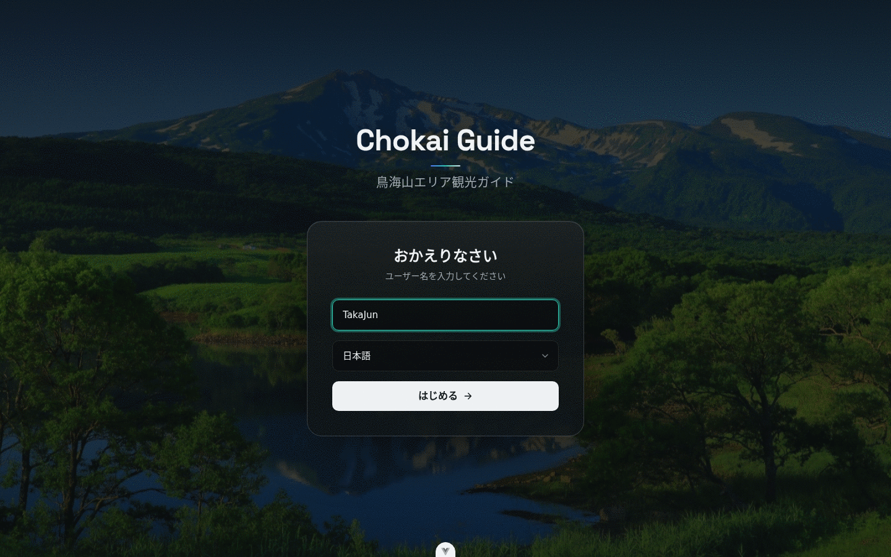
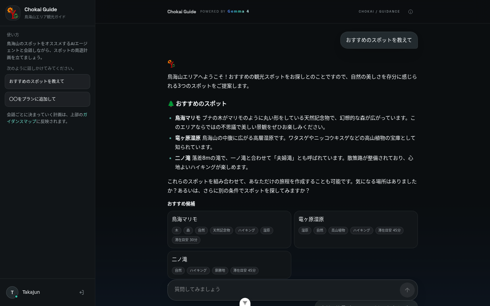
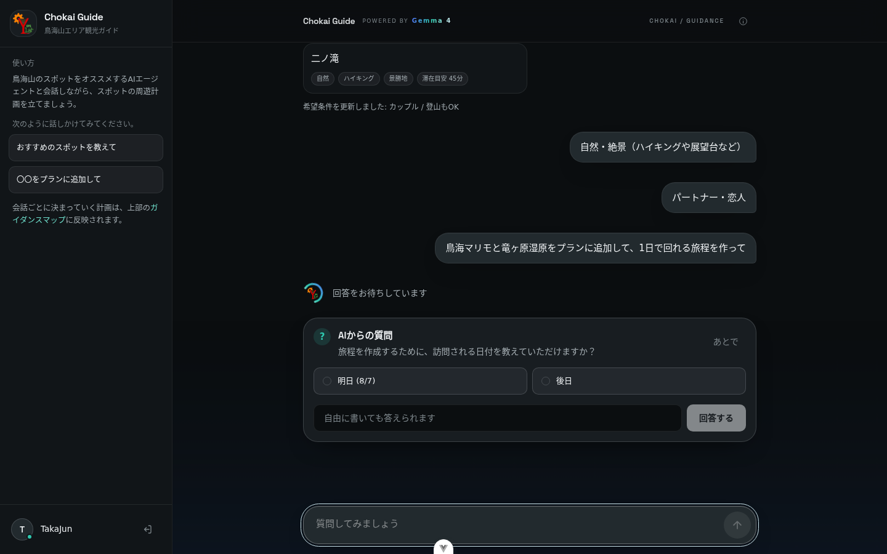
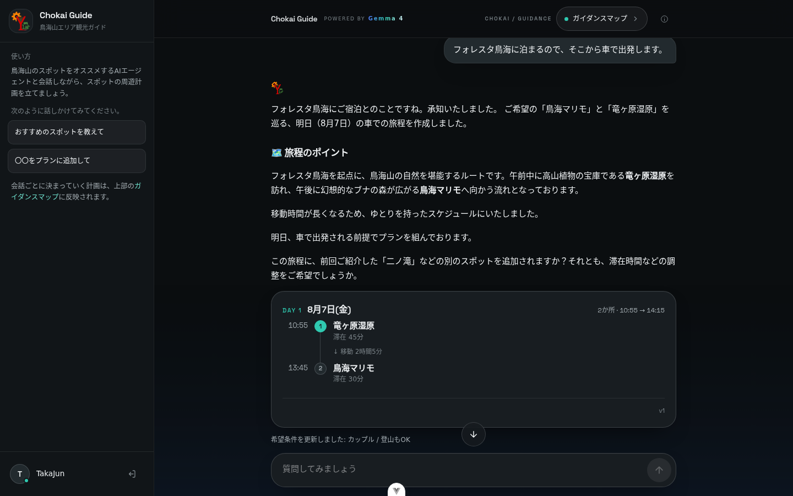
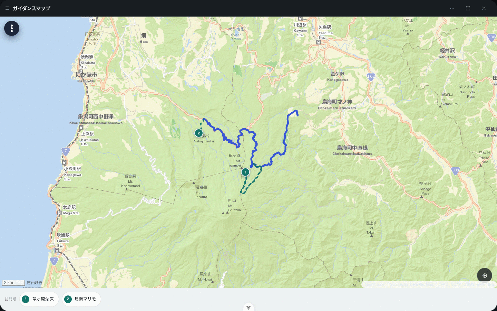
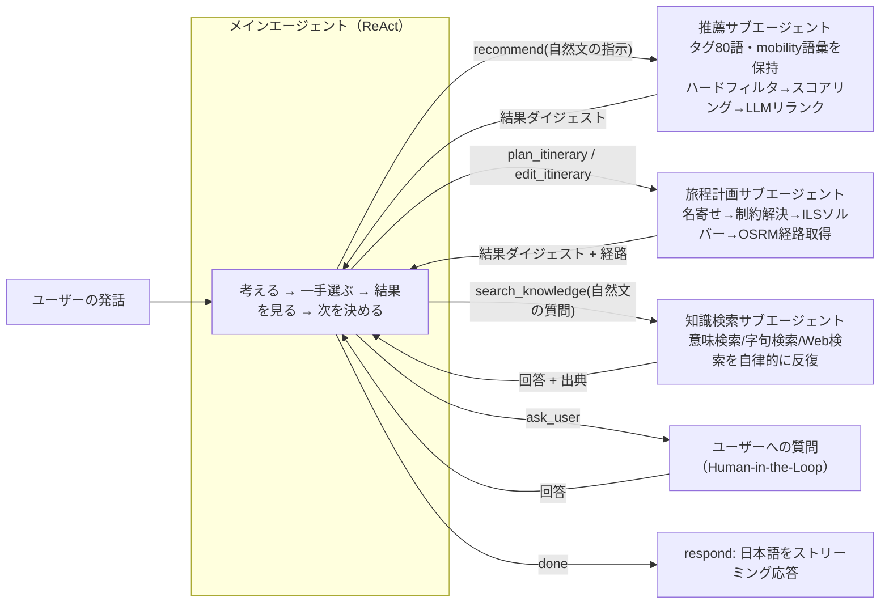
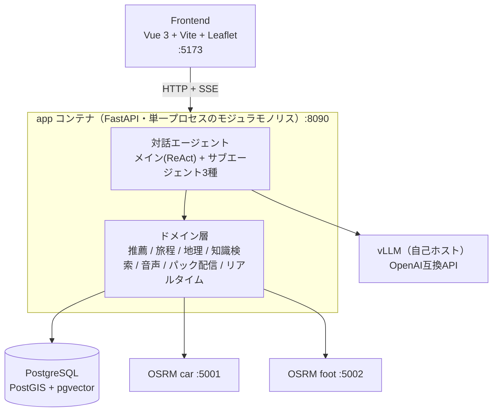

# Chokai Guide

### 鳥海山エリア観光ガイド ── 話すほど旅程が育つ、LLMエージェント観光アプリ


---

## これは何?

鳥海山エリアを対象にした、対話型の観光ガイダンスアプリです。「おすすめのスポットを教えて」と話しかけるだけで、AIエージェントが好み・同行者・移動手段を汲み取りながらスポットを提案し、そのまま1日の旅程(周遊計画)へ組み立ててくれます。個人開発のプロダクトとして、機能の数よりも「実際に使いたくなる」対話の質にこだわりました。

<p align="center">
  
</p>

会話が進むごとに、推薦もプランも画面の中で組み上がっていきます。

<p align="center">
  
</p>

旅程を作るのに必要な情報が対話から読み取れないときは、エージェントが自分から尋ねます。

<p align="center">
  
</p>

答えを返すと、滞在時間と実経路の移動時間まで織り込んだ 1 日の旅程カードが届きます。

<p align="center">
  
</p>

できあがった旅程はガイダンスマップでいつでも確かめられます。描かれるのは直線ではなく OSRM が計算した実経路 ── 車で走る区間は実線、登山道を歩く区間は破線で描き分ける、door-to-door のルートです。

<p align="center">
  
</p>

---

## こだわり:「メインエージェント × 専門サブエージェント」で LLM の賢さを使い切る

このアプリで最もこだわったのは、バックエンドの AI エージェント設計です。

対話 1 往復のたびに、1 つの LLM に「意図の理解」「POI タグ 80 語への翻訳」「経路計算」「旅程の制約解決」まで全部やらせると、コンテキストはすぐに埋まり、判断の精度も落ちていきます。動かしているのは自己ホストの 31B 級モデル 1 基だけなので、コンテキストをどう使うかがそのまま対話の賢さに直結します。

そこで、**役割ごとに分離したサブエージェントをメインの ReAct エージェントが「道具」として呼ぶ**構成にしました。



- **メインエージェントはドメイン知識を一切持たない。** POI タグの語彙も、スポットの内部 ID も、地理計算のやり方も知らない。持っているのは「次に何のツールを呼ぶか」を考える力だけ
- **専門知識と反復はサブエージェントの中に閉じ込める。** 推薦・旅程計画・知識検索はそれぞれ自分のツール・語彙・コンテキストを持ち、必要なだけ自律的に反復してから、メインには**要約されたダイジェストだけ**を返す。検索エージェントが「引く→足りない→引き直す」を何周しても、その中間状態はメインの窓を一切圧迫しない
- **スポットは常に名前でやり取りする。** 内部 ID の実在保証と名寄せは各サブエージェントのコードが担当し、メインエージェントの語彙の当て外しが対話全体を壊す構造をなくした
- **`ask_user` は特別扱いしない、ただの「結果を返すツール」。** 検索ツールが検索結果を持ち帰るのと同じように、ユーザーへの質問と回答も 1 回のツール呼び出しとして扱う。専用の中断・復帰機構を持たずに、対話の主導権をユーザーとエージェントの間で自然に往復させられる

各サブエージェントを「何でも屋」にせず領域を絞ったことで、メインの 1 周あたりのプロンプトを 4,500 トークン前後に抑えたまま、最大 8 手のループで「推薦 → 旅程作成 → 編集」のような複合的な要求まで一気通貫でこなせます。

この設計にたどり着くまでの過程 ── 最初は「サブエージェントは持たない」と決め、実測して初めて必要な箇所だけ切り出した経緯 ── は ADR として残しています: [なぜ最初はサブエージェントを持たなかったか](Docs/adr/0009-no-subagents.md) → [知識検索だけ切り出した理由](Docs/adr/0011-knowledge-search-subagent.md) → [ReAct メインエージェント + サブエージェント構成への転換](Docs/adr/0019-react-main-agent-subagents.md)。

---

## 機能

| 機能 | 内容 |
| --- | --- |
| POI レコメンド | 好み・同行者・移動手段をもとに鳥海山エリアのスポットを提案(決定的スコアリング + LLM リランクのハイブリッド) |
| 旅程プランニング | 複数スポットを 1 日の周遊計画へ自動編成。独自 ILS ソルバー + OSRM の実経路(door-to-door)で組み立てる |
| 対話形式 | チャット UI で推薦とプラン編集を行き来しながら、ガイダンスマップに反映していく |
| オフライン観光案内 | 現地は LoRaWAN のみの狭帯域環境。事前配布した資材と音声ガイド(TTS)でオフラインのリアルタイム案内を行う |

---

## アーキテクチャ



詳細は [`Docs/20_architecture.md`](Docs/20_architecture.md)、対話エージェントの全体設計は [`Docs/30_design/agent_react_architecture.md`](Docs/30_design/agent_react_architecture.md) を参照してください。

## Tech Stack

| 領域 | 技術 |
| --- | --- |
| **Backend** | Python 3.11, FastAPI, Uvicorn, SQLAlchemy(async) + asyncpg, Alembic, GeoAlchemy2, Pydantic v2, Typer |
| **Frontend** | Vue 3, Vite, Pinia(+ persistedstate), Vue Router, Tailwind CSS, Leaflet |
| **DB / 検索** | PostgreSQL, PostGIS, pgvector |
| **Routing** | OSRM(car / foot) |
| **LLM** | vLLM(OpenAI 互換 API・自己ホスト。既定は gemma-4-31B 系) |
| **音声・オフライン** | gTTS、IndexedDB(idb)、端末内経路探索(pathfinding) |
| **Infra** | Docker, Docker Compose |

---

## Setup

```bash
cp .env.example .env     # 秘密と環境固有値だけを埋める
docker compose up -d
```

DB の初期化(マイグレーション・シード・ジオ派生データ)は [`Docs/50_operations/database.md`](Docs/50_operations/database.md) §3 を参照してください。

### 設定の置き場所

設定は役割で 3 層に分かれています([`Docs/20_architecture.md`](Docs/20_architecture.md) §11)。**`.env` に全部を並べません。**

| 置き場所 | 何を書くか |
| --- | --- |
| `.env`(Git 追跡外) | **秘密**と**人によって値が変わるもの**だけ ── パスワード、API キー、IP を含む URL、モデル名 |
| `docker-compose.yml` の `environment:` | 接続先のトポロジ(`POSTGRES_HOST` / `OSRM_*_URL` / `PACKS_ROOT` など)とプロジェクトの定数 |
| `backend/app/core/config.py` の `Settings` | チューニング値の既定(`OSRM_*` / `GEO_*` / タイムアウト / 各種フラグ)。変えたい人だけ `.env` で上書きする |

最低限必要なのは `POSTGRES_PASSWORD` と、vLLM を既定(`http://127.0.0.1:8000/v1`)以外で動かしている場合の `INFERENCE_SERVER` / `INFERENCE_MODEL` です。埋め込み・Web 検索・LoRaWAN は未設定でも起動し、その機能だけが縮退します。

### Local Development

**コードはコンテナにマウントされます。** イメージが持つのは依存関係だけなので、`backend/` や `frontend/` を編集しても再ビルドは不要です(`app` は uvicorn の `--reload`、`frontend` は Vite の HMR が拾います)。

```bash
docker compose up -d          # 編集はそのまま反映される
docker compose build app      # 再ビルドが要るのは pyproject.toml を変えたときだけ
docker compose logs -f app
```

コンテナを使わずに動かす場合:

```bash
# Frontend
cd frontend && npm install && npm run dev

# Backend
cd backend && uvicorn app.main:app --host 0.0.0.0 --port 8090
```

### Services & Ports

| Service | Port | Description |
| --- | --- | --- |
| Frontend(Vite) | 5173 | Web UI |
| app(FastAPI) | 8090 | メイン API |
| db(PostgreSQL + PostGIS + pgvector) | 5432 | アプリ・地理・ベクトルデータ |
| OSRM car | 5001 | ルーティング |
| OSRM foot | 5002 | ルーティング |
| vLLM(ホスト側で起動) | 8000 | テキスト生成 |

### Data & Assets

- OSRM map data: `backend/data/map/`
- Knowledge data: `backend/data/knowledge/`
- Packs: compose の `packs_data` volume

---

## ドキュメント

このプロジェクトは **Docs 駆動開発**を採っています ── 機能の追加・変更はまず [`Docs/`](Docs/) 配下の文書で仕様・設計を確定し、レビューを経てから実装します。アーキテクチャ上の重要な意思決定は [`Docs/adr/`](Docs/adr/) に ADR として記録しています。文書体系全体は [`Docs/README.md`](Docs/README.md) を参照してください。
